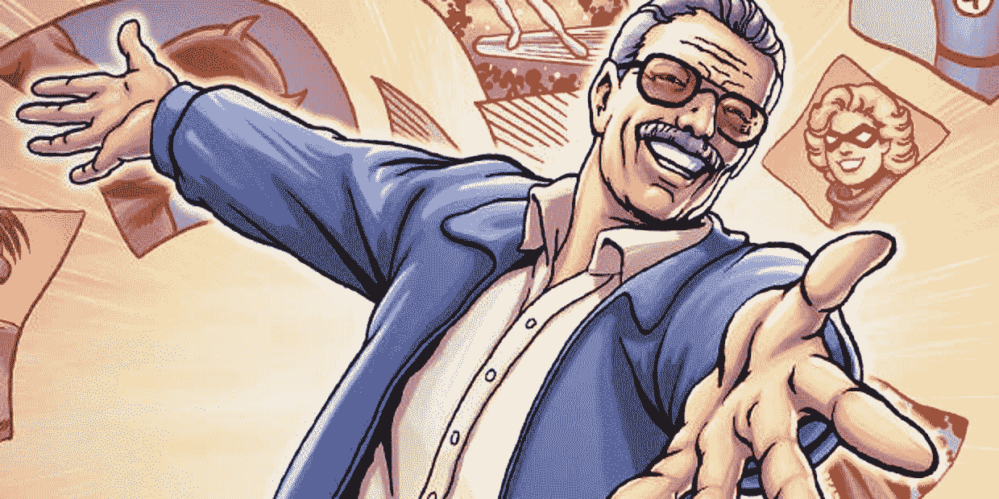
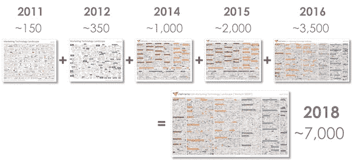
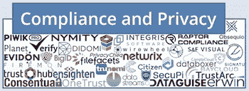
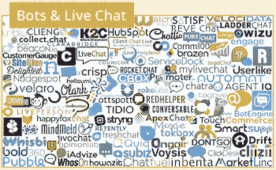
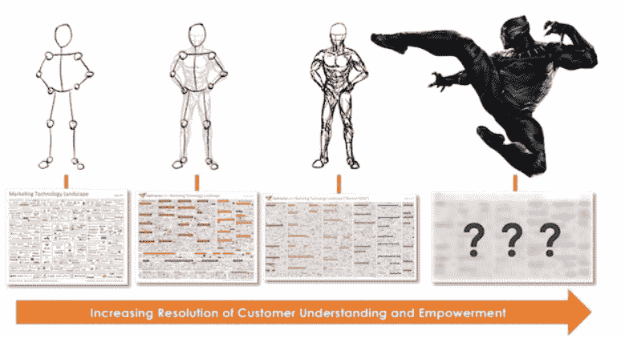
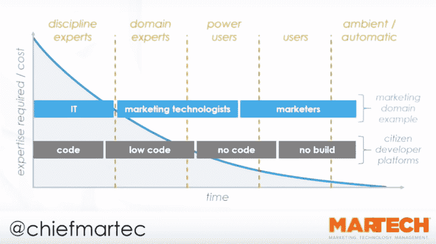
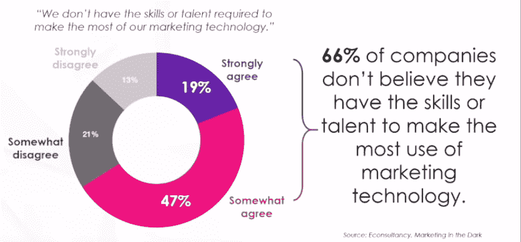
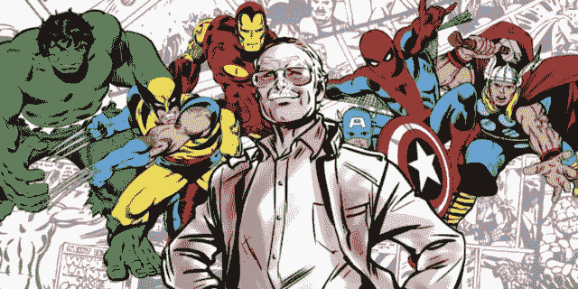

# MarTech 到底是什么？

> 原文：<https://medium.datadriveninvestor.com/what-the-heck-is-martech-d2bf37d2c835?source=collection_archive---------19----------------------->

## 顾客心目中的超级英雄斯坦·李

Martech 代表营销技术。从广义上来说，任何参与数字营销的人都与 T2 技术打交道。然而，martech 不仅仅如此。它位于营销、管理和技术的*交叉点*——直到最近，这些独立的领域已经意识到它们不能没有彼此而存在，但仍然过于独立，无法跨越它们进行创新。

但还是那句话，还不是 martech。这不仅仅是让营销人员能够提供有说服力的活动和出色的用户体验，让技术人员能够利用 UX/UI 和 growth 黑客工具来设计更好的产品，或者让经理们寻求新元素的跨领域组合，以实现协同效应并体现敏捷性。都是那些**人和流程。**

以下是《MarTech 宣言》中的话:

> 当界限变得模糊时，这是一个聚焦客户的机会。在某种程度上，影响客户体验的每个人都是营销人员、技术人员和经理。在 martech，他们是一个团结的部落，但不是同质的。

每个人都带来了不同的东西，这种多样性有很大的力量。

# **营销技术的前景**

自 2011 年以来，Skott Brinker 和他的团队跟踪所有营销技术供应商及其产品，并在每年的 Martech 大会上介绍的超级图表中展示它们。今年更新的超级图表包括来自**6242 家唯一供应商**的**6829 个营销技术解决方案**，这表明 [**比去年的前景**](https://chiefmartec.com/2018/04/marketing-technology-landscape-supergraphic-2018/)增长了 27%。但最令人激动的是，2018 年观察到的景观大小相当于 2011 年至 2016 年组装的景观大小加在一起:

[Marketing Technology Landscape Supergraphic (2018): Martech 5000 (actually 6,829)](https://chiefmartec.com/2018/04/marketing-technology-landscape-supergraphic-2018/)

根据这一数据，**营销技术的复杂性和范围在 7 年内增加了 45 倍**。风险资本和私募股权投资者的兴趣也在增长，仅去年就吸引了 140 亿美元。

# **新趋势**

今年超级图表中最大的类别是*销售自动化、实现&智能* —所谓“销售技术”(490 个解决方案)背后的工具和软件。这清楚地表明营销、销售和服务正在整合到一个新的数字领域。

更新后的超级图中出现的全新类别是*数据* 栏下的*合规和隐私*以及*机器人&实时聊天*。

它很好地展现了我们之前写过的今年的主要趋势( **AI** 没有被保证成为一个单独的部分，因为它已经嵌入了所有已经存在的趋势)。

要了解 [**聊天机器人**](https://medium.com/@portagency/martech-trends-2018-part-ii-ar-vr-voice-search-and-chatbots-5321477ab07f) 、 [**新数据法规**、即 GDPR、](https://medium.com/@portagency/martech-trends-2018-how-blockchain-and-ai-will-change-marketing-forever-fcbd44ef73e4?fbclid=IwAR26YZHU113TFhKq5vhoT9qVMC7MkkXRfZaY_-7Ox14tQCd-8KCij1KtFzw)等技术进步如何重塑营销，请阅读我们的[趋势概述](https://medium.com/@portagency/martech-trends-2018-part-ii-ar-vr-voice-search-and-chatbots-5321477ab07f)。

# **MarTech 繁荣背后的力量**

martech 生态系统中供应商数量的不断增长(去年只有 4.5%的解决方案退出市场)可以通过两个主要因素来解释:**更好的客户理解**和**零进入壁垒**。

[Visualized by Blue Green Brands](https://chiefmartec.com/2018/04/marketing-technology-landscape-supergraphic-2018/)

1.  *在需求方面*，考虑到可用的技术和专业知识，我们已经实现了**比以往任何时候都更好的目标受众数字表现**。这意味着*赋予我们的客户* (Brinker 甚至将他们与丰满的**超级英雄**相提并论)和*企业被迫(也愿意)调整以适应他们的每一项需求*，以满足不断提高的买家期望，并不断寻找更复杂的方式来做到这一点，以便从全球众多的竞争对手中脱颖而出。
2.  *在供应方*，**增加软件的可访问性**导致零进入壁垒。营销再也不需要一个强大的 IT 部门去奋斗了。

下图说明了技术不可理解性的降低，以及将其集成到营销工具包中的障碍。它标志着我们正在经历的新一轮转变:技术不再是 It 甚至营销技术专家的专利，而是普通营销人员的专利，他们今天的装备比十年前的高级工程师还要好。

> *事实上，根据* Econsultancy *和* IBM Watson Marketing *联合研究*[Marketing In the Dark:Dark Martech](http://minterdial.com/wp-content/uploads/2018/03/Econsultancy-Marketing-in-the-Dark_Dark-Martech.pdf)*的研究，今天的首席营销官承担战略营销技术决策责任的可能性是首席信息官的两倍。*

[Martech in 2019: The New, New Rules of Marketing — MarTech Conference — Boston October 2018](https://www.youtube.com/watch?v=Ve0csVQGkto&t=1336s)

开源项目、廉价的基础设施即服务(IaaS)、全球按需人才市场和数字营销的低成本渠道让新想法无缝出现，并更快地占领市场。

> 今天的普通营销人员比十年前的高级工程师更有条件。

# **新常态**

[Martech in 2019: The New, New Rules of Marketing — MarTech Conference — Boston October 2018](https://www.youtube.com/watch?v=Ve0csVQGkto&t=1336s)

根据同一项调查，只有 13%的营销人员相信他们既有技能又有才能来充分利用他们的市场技能。阻止企业投资营销技术的另一个原因是管理层**没有** **看到 it 的价值**，或者 **IT 部门不支持**该技术想要的。因此，市场上的大多数公司都忽略了 martech。

> 当市场的其他部分仍对 martech 一无所知时，是时候让它成为我们的竞争优势了。

我们应该**教育自己和高管**，成为未来的营销人员，获得实施所需技术所需的知识和技能，而不管 It 支持如何。用我们自己的例子来说明 martech 能为公司带来真正的价值，值得投资。当市场的其他部分仍对 martech 一无所知时，是时候让它成为我们的竞争优势，一劳永逸地与竞争对手区分开来了。改变就是这么来的。

# **未来的营销者**

那么谁是未来的营销者呢？我们已经看到了买家的完整形象，但是营销人员应该是什么样子呢？我们，martech 的未来，应该成为顾客心目中的超级英雄[斯坦·李](https://en.wikipedia.org/wiki/Stan_Lee)。

首要目标不是说服高层管理人员投资 martech 或不加选择地自动化和分散化(特别是因为 73%的公司已经受到孤立技术的困扰)，而是培养跨领域决策的正确心态。无论有多异质，martech 部落都服务于合并后的使命:**设计和开发非凡的客户体验。**

> “品牌需要了解底层技术、能够确定每个品牌需要哪些创意的人。”
> 
> Andy Betts，数字混合动力公司执行董事兼 CMO 顾问

[Andrew Betts 指出了 martech 策划者或所谓的混合营销者的三个主要原则:**敏捷、熟练和负责。**](https://martechtoday.com/becoming-martech-mastermind-agility-proficiency-accountability-203301)

Cover of Ultimate X-Men #20 (2002)

虽然 Brinker 已经清楚地表明了前两者，但是作为成熟度指标的责任也不应该从等式中减去。具有敏锐分析能力的创新部落和其他一系列超级大国需要他们自己的[教授 X](https://en.wikipedia.org/wiki/Professor_X) — **数据**——来控制他们的实验并让他们负责。

尤其是因为，截至今年 8 月，martech 已经跨过了成熟的门槛。

*凡妮莎·艾姆里斯*