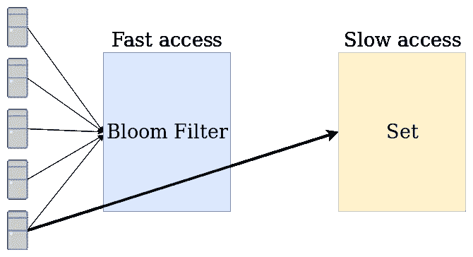
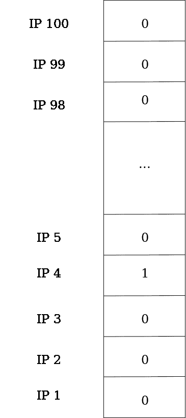
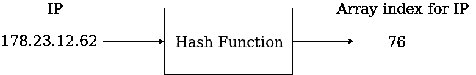
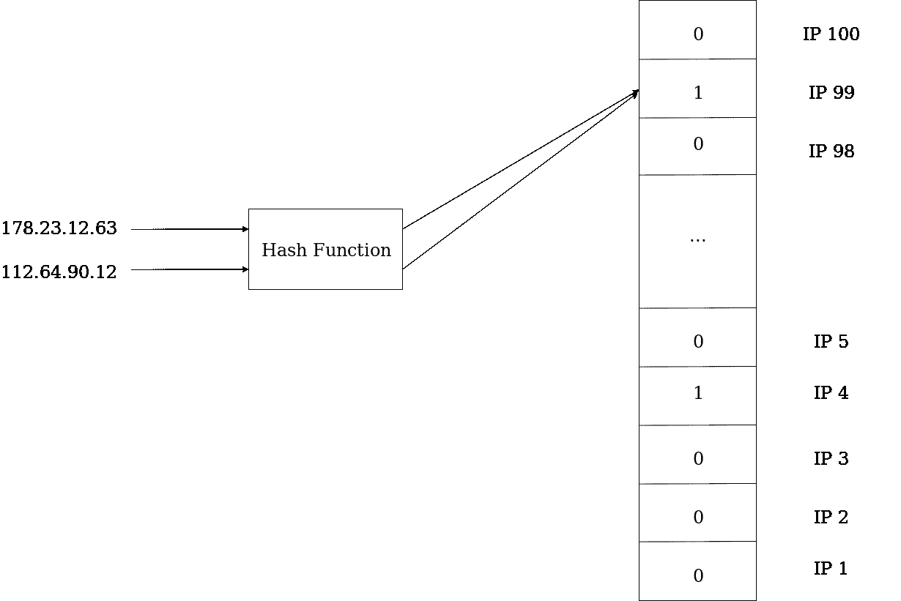
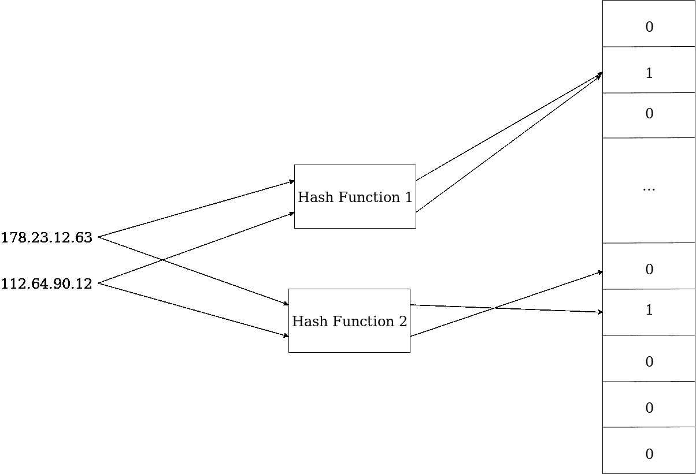

# 什么是布鲁姆过滤器？

> 原文：<https://medium.datadriveninvestor.com/what-the-hell-is-a-bloom-filter-8c654cb1ee60?source=collection_archive---------0----------------------->

[关于这篇和更多的帖子，请查看我的网站[https://diogodanielsoaresferreira . github . io](https://diogodanielsoaresferreira.github.io/)]

你好。

在这篇文章中，我将描述什么是 Bloom Filter，它的用途和使用它的场景。我还将从头开始用 Python 实现一个 Bloom Filter，以便更容易理解它的内部结构。

## 布隆过滤器的目标

Bloom Filter 是一种数据结构，其目标是以快速的方式检查一个元素是否是集合中的**而不是**(对于那些知道大 O 符号的人来说，使用 Bloom Filter 插入和检查一个元素是否属于一个集合的复杂度是 O(1))。简单地通过验证元素是否是集合中的**而不是**，这对于防止频繁执行计算密集型任务非常有用。理解 Bloom Filter 是一种概率数据结构是很重要的:它可以以 100%的概率告诉你一个元素不在数据集中，但是它不能以 100%的概率告诉你一个元素在集合中(假阳性是可能的)。让我们讨论一下可以使用 Bloom Filter 的场景，稍后你会明白为什么 Bloom Filter 具有这些特征，并详细解释其内部原理和 Python 实现！

A bloom filter is usually used before a search in a set with slower access. The number of searches in the set can be reduced, so as the overall search time.

## 情节

让我们考虑一些场景，在这些场景中，这种数据结构对于加速一些任务的计算是有用的。我们可以从一个核心网的路由器开始思考(那些你家里没有的:)。可能要求这些路由器的上行链路速度超过 100 Gbit/s。管理员可以添加 IP 黑名单来阻止其访问网络。这意味着每当路由器以超过 100 Gbit/s 的速度接收到一个数据包时，它必须查看其内存，并且最好执行一次对数搜索(O(log(n)))来检查 IP 是否被阻止，因为知道大多数 IP 没有被阻止，并且搜索不会返回大多数数据包的任何结果。在这种情况下，可以在访问存储器之前放置布隆过滤器，以确保大多数分组不需要等待搜索 IP 的时间就被发送到网络。

 [## 算法诱人的商业逻辑|数据驱动的投资者

### 某些机器行为总是让我感到惊讶。我对他们从自己的成就中学习的能力感到惊讶…

www.datadriveninvestor.com](https://www.datadriveninvestor.com/2019/03/22/the-seductive-business-logic-of-algorithms/) 

另一个场景是数据库示例。当数据库每秒有数百万次访问，并且大多数访问是通过数据库中不存在的关键字进行的搜索时，减少调用对数据库的影响可能很重要，原因有二:如果搜索次数减少，数据库引擎将更快地回复其他访问；如果客户端可以不等待数据库上的搜索，并且在不需要访问数据库的情况下获得结果(例如，不在内存中)，那么所实现的加速可能是显著的。

最后，为了加速在具有许多文件的文件夹中搜索文件，可以使用布隆过滤器来检查该文件是否确实不在该文件夹中。

更多使用布隆过滤器的典型场景可以在[这里](https://en.wikipedia.org/wiki/Bloom_filter#Examples)找到。

## 什么是布鲁姆过滤器？

让我们使用第一个场景来举例说明布隆过滤器的构造。想象一下，你把 100 个 IP 列入黑名单。标记一个 IP 是否被列入黑名单的最简单的方法是创建一个 100 位的列表，每一位是一个 IP。如果一个 IP 被列入黑名单，我们将该 IP 的位置标记为‘1’，否则为‘0’。

In this Bloom Filter, the IP number 4 is blacklisted and all other IP’s are not.

## 有多少 IP？

如果只使用 100 个 IP，这种实现是可行的。现实中每个 IPv4 地址有 32 位，也就是说有 4 ^ 294 ^ 967 ^ 296(2)个可能的地址(其中一部分是预留给专网、广播、组播等专网的，但仍然是一个庞大的数字)！黑名单上的 IP 数量最多不会超过数百个。我们无法构建一个如此庞大的列表，只使用数量减少的条目。我们必须找到 IP 和列表条目之间的映射。这就是散列函数的用武之地！

## 散列函数

哈希函数是将任意长度的输入转换为固定大小的值的函数。这样，我们可以创建一个固定大小的数组，并根据给定的 IP 计算散列函数的输出，它将始终生成一个小于或等于数组大小的数。哈希函数不是随机的，这意味着对于相同的输入，输出总是相同的。

A hash function receives an input that can be any string (in this case, an IP) and calculates a numerical representation. In this case, the numerical representation will be the position of the Bloom Filter corresponding to the input.

但是等等…有些事情不对劲。让我们回到我们的场景。想象一下，我们将 100 个 IP 列入黑名单。散列函数如何将我们的 100 个 IP 从可能的 2 个 IP 映射到 100 个不同的值，而不存储它们的任何信息？事实是，事实并非如此。会有碰撞。哈希函数保证每个 IP 都有一个唯一的数字映射，但是由于可能有 4 294 967 296 (2)个 IP，所以不可能将它们都映射到 100 个不同的值。哈希函数所能保证的是，它对输入的比特进行加扰，使得输出遵循均匀分布。这意味着，如果您将哈希函数的输入从 192.168.1.1 更改为 192.168.1.2，输出可能会完全不同，看似随机(但不是真正随机，因为每个输入总是映射到相同的输出)。

Example of a collision. Two different IP’s have the same hash, which means that their index in the Bloom Filter will be the same.

好的，现在从头开始:我们把 100 个 IP 列入黑名单。每个 IP 都将经过哈希函数，哈希函数的结果将返回一个小于或等于数组大小的数字。该数字将是标记 IP 是否被列入黑名单的数组的索引。但是会有碰撞，那么我们如何处理呢？

让我们假设 IP 的 178.23.12.63 和 112.64.90.12 有相同的散列。第一个 IP 被列入黑名单，第二个没有。当我们检查第二个 IP 的散列是否在布隆过滤器中时，它在，即使该 IP 从未被列入黑名单。这是否意味着我们有一个错误？

记得在开始我说过 Bloom Filter 的目标是检查集合中的元素是否是**而不是**。如果元素在布隆过滤器中的位置是 0，则该元素肯定是集合中的**而不是**。但是，如果 Bloom Filter 中某个元素的位置为 1，则该元素可能在集合中，也可能只是一个冲突。我们所能做的就是减少冲突的可能性，减少检查 IP 是否真的被列入黑名单所需的内存访问次数。

## 降低碰撞概率

有两种降低碰撞概率的主要方法，都是有代价的。一种可能性是增加数组的大小。如果我们增加数组的大小(从而使哈希函数返回一个比新数组小的数字或与新数组大小相同的数字)，冲突的可能性就会降低。具体地，误报的概率(当元素不在集合中时，布隆过滤器返回 1)是(1-e⁽ᵐ/ⁿ⁾)，其中 m 是期望插入过滤器中的元素的数量，n 是过滤器的大小。

降低冲突概率的另一种方法是增加哈希函数的数量。这意味着在我们的场景中，对于一个 IP，将使用各种散列函数来编码该 IP，并且数组中的各个位置将被标记为 1。如果我们使用 k 个哈希函数，那么现在误报的概率是(1-eᵐᵏ/ⁿ)ᵏ，这意味着哈希函数的最佳数量是(n/m)*ln(2)(这里有关于方程[的更多细节](https://en.wikipedia.org/wiki/Bloom_filter#Probability_of_false_positives))。

Example of a bloom filter with two hash functions. There is a collision in one of the hashes of the IP’s, but it is possible to check that the IP 112.64.90.12 is not in the set, because one of its Bloom Filter positions is not 1.

让我们用大约 50 行代码用 Python 实现一个 Bloom Filter，看看结果吧！

在下一段代码中，让我们从创建 BloomFilter 类开始。构造函数接收布隆过滤器的大小，并且可选地接收布隆过滤器将存储的预期元素的数量。我们将使用 bitarray 库创建一个位数组，并将它们全部设置为零。最后，给定 bloom 过滤器的大小和预期元素的数量，我们将散列函数的数量设置为返回最佳散列函数数量的等式。

现在让我们为布隆过滤器定义一个散列函数。所使用的实现(来自【这里】(【https://gist.github.com/mengzhuo/180cd6be8ba9e2743753】))实现了 DJB2 算法。让我们把它当作一个黑匣子，因为算法的解释超出了本文的范围。

现在我们有了一个散列函数，但是我们如何创建 K 个散列函数呢？我们可以表演一个简单的魔术。我们不是创建不同的散列函数，而是在散列函数中为每个输入添加一个数字。该数字将表示被调用的哈希函数的编号。因为哈希函数输入中的任何微小差异都会导致完全不同的哈希，所以结果可以被视为不同的哈希函数。很酷，对吧？

现在让我们创建一个函数，向 Bloom Filter 添加一个元素。为此，让我们遍历所有的散列函数，计算该项目的散列，最后将 1(或 True)放入散列的索引中。

唯一剩下的就是创建一个函数来检查布隆过滤器中的元素是否是**而不是**。为此，让我们再次遍历所有的散列函数。如果任何布隆过滤器位置具有 0，我们可以说该元素肯定不在集合中。否则，如果所有位置都有 1，我们就不能说该元素不在集合中。

就是这样！我们已经实现了我们的布隆过滤器。我们来试试吧！

让我们创建一个简单的测试来检查它是否工作。让我们创建一个有一百万个条目的 Bloom Filter，然后将元素的预期数量设置为 100 000。我们将元素“192.168.1.1”添加到我们的 Bloom Filter 中，作为被阻止的 IP。

为了测试它，我们将从 1 到 100 000 进行迭代，并检查 IP 192.168.1.i 是否在布隆过滤器中(当 i>254 时，没有 IP，例如 192.168.289，但在这种情况下，我们只是执行测试)。我们会把不知道是否在集合中的元素打印出来；所有其他不会被打印的元素肯定不在集合中。

> 192.168.1.1

哇！我们的 Bloom Filter 说，从 100，00 0 个 IP 中，唯一可以阻止的元素实际上是我们阻止的 IP！它没有产生任何假阳性！

以下是我们的布隆过滤器的完整代码:

这就是布鲁姆过滤器！我希望您已经详细了解了什么是 Bloom Filter 以及如何实现它。

感谢你的坚持！

[关于这篇和更多的帖子，请查看我的网站[https://diogodanielsoaresferreira . github . io](https://diogodanielsoaresferreira.github.io/)]