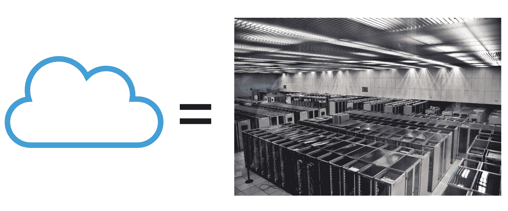
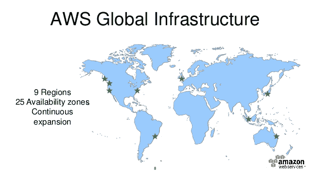
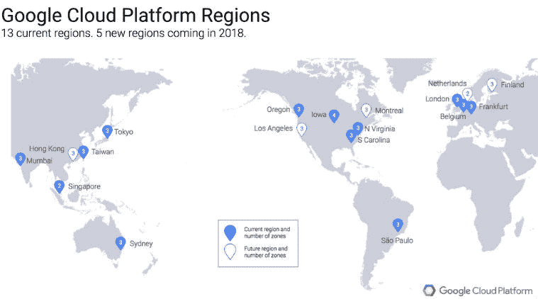
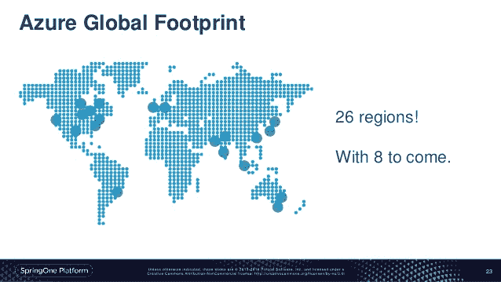

# 云是什么鬼？

> 原文：<https://medium.datadriveninvestor.com/what-the-hell-is-the-cloud-4da1b699f6f5?source=collection_archive---------6----------------------->

一步一步地解释它的历史，以及为什么你应该相信大型云提供商。

不管你对科技和互联网了解多少，每个人都会谈论这个叫做“云”的毛绒绒的东西。除了是软件开发中的新时尚之外，它还是一个每天都在使用的词。如果你有 instagram，你的照片在云上，如果你有 Whatsapp，你的信息被发送到云上，你从云上接收你朋友的信息。我知道这看起来像魔术，但它不是。云是服务器基础设施多年研发的成果。

> [DDI 编辑推荐—谷歌云平台上 TensorFlow 的机器学习](http://go.datadriveninvestor.com/tensorflowML/matf)

所以，到底…云是什么东西？简而言之，它只是一组许多服务器一起工作，每周 7 天每天 24 小时连接到互联网，处理大量信息并存储所有来自我们设备的数据(是的…令人毛骨悚然，但无论如何担心这个已经太晚了)。

像往常一样，让我们一步一步地讨论这个话题。你可能会问什么是服务器？这是一台电脑。什么使服务器不同于我们的台式计算机？什么都没有，同时又有很多…从基本的角度来看，服务器就是一台普通的电脑，可以托管自己的网站，所以你不需要支付托管费。如果你不出名或者需要处理大量信息，这对你自己的网站来说足够了。这意味着这个解决方案将工作，同时您的计算机不会冻结，不会失去电源和互联网连接。如果这些事情发生，你的网站将不再在线，因为每当我访问它，我将访问你的服务器(只是阅读你的网页信息，而不是攻击你，好吗？).

为什么我写“如果你不出名”呢？如果你很出名，这意味着你的网站将会被很多人同时访问。一个人在你的网站上执行的每一次点击都向服务器请求信息，如果一百万人同时请求信息，服务器将会关闭，这意味着计算机因请求而超载，无法再做出响应，在现实生活中，计算机会关闭或杀死与巨大需求相关的进程。

为了避免这种情况，几年前，一些公司开始了托管业务:服务器提供商提供不同的选项(总是与你的网站每秒能收到多少点击有关)来换取少量的费用。他们拥有比普通人的计算机更好的服务器，并提供 24/7 的可用性、安全性、性能和其他非功能性需求(所有软件产品/服务中都需要的需求，这些需求是软件架构设计的一部分，而不是软件需求/功能的一部分)。

随着时间的推移，要存储的信息以千兆字节计变得越来越大，因此解决方案是拥有更多的服务器:拥有更多的计算机来分担要处理的数据负载。您在提供商中托管的信息越多，所需的服务器数量就越多。这就是我们如何开始拥有服务器群的:一组相互连接的服务器，能够存储信息并处理来自用户的所有请求。服务器群看起来像这样

为了以比购买具有这些特征的计算机更低的价格向用户提供具有大量处理能力(RAM +硬盘+ CPU)的可能性，服务器演变为处理单元，你可以租用来分析数据，而不仅仅是存储网站。共享繁重的处理能力和托管的可能性被称为“云”。云提供商所做的是在一台配有你需要的内存、CPU 和硬盘的计算机上租赁给你一段处理时间，并按月或按年收取相当的费用。

对于你的惊讶和可能的失望，这就是云的样子，许多走廊里充满了冰箱般的架子，里面有没有屏幕的计算机，但有大量的 RAM 内存，CPU 容量和硬盘。

如今，我们使用的大多数基于互联网的软件，如 Google Drive、Amazon.com、Linkedin 和网上银行，都托管在世界上三大云提供商之一:谷歌云、亚马逊网络服务(AWS)和微软 Azure——你可以在此链接中看到这些服务托管在哪里[。这些公司多年来一直致力于云解决方案，他们的服务值得信赖，因为他们已经解决了无论如何都必须工作的服务所需的所有非功能性需求。](https://www.whoishostingthis.com/)

什么是非功能性需求？从你在家制作的小应用程序到 Whatsapp 这样的大服务，每个软件都有的功能。这些特性包括可用性、性能、安全性、可测试性、代码可读性、可扩展性、可伸缩性、可用性等等。

> 为了给你一个关于非功能需求的更好的解释，我会考虑将来写一篇关于这个话题的帖子。

让我们用一个例子来看看这一点，每次我们打开 Whatsapp 它都工作。该系统提供**可用性**，这意味着它在我们使用它的所有时间都可用。这并不意味着它是全天候的，因为我们并不是全天候检查它，但只要我们访问该应用程序，可用性就是 100%。你体验过几次离线的 Whatsapp？我只做过一次，2017 年 12 月 31 日。这是发生在我所在时区下午 3 点左右的一件大事。

**性能**怎么样？Whatsapp 在全球拥有数百万用户，当我们发送信息时，该系统几乎会立即对我们所有人做出回应，我们相信它是一个实时服务器。差不多就是这样，原因是系统的性能。它能够在不延迟或关闭的情况下，每秒处理数百万个请求。

安全呢？我们怎么知道一场大火不会毁掉数据？软件架构师对此也有解决方案。云中的所有信息在世界各地都有备份。为了向你解释这是如何工作的，我要告诉你一个秘密:脸书有自己的云，并且只被他们和他们的产品使用。

脸书服务器农场的位置是一个秘密，员工们签署了一份 NDA(保密协议),承诺永远不会对它的位置或任何其他信息说一个字。虽然，他们可以说“这是机密”，当我问及此事时，他们告诉我。如果你查一下这个网站的[，当你写“【www.facebook.com】](https://www.whoishostingthis.com/)”时，你会确认脸书是“自主托管的”，这意味着它有自己的服务器:

让我们假设脸书信息被托管在北美的一个小镇、巴西的另一个小镇和德国的另一个小镇的场地中央的某个地方。服务器的这种分布不仅有利于存储或处理信息，对我们用户也有好处，因为离我们越近的服务器，我们接收信息的速度就越快。现在想象一场悲剧发生了:一次闪电引起了北美服务器场的火灾。300 台服务器和数千个用户帐户的所有信息被销毁。你认为 facebook 不会再为这些用户服务了吗？

会的！这就是分布式云的神奇之处。这些帐户可能会在几分钟内无法访问，然后 facebook 会将所有受影响的帐户请求连接到它最近的服务器:Brasil。用户可能会经历某种延迟，但 facebook 无论如何都会工作，他们不会对此有太多抱怨。与此同时，脸书的员工将前所未有地工作，将信息恢复到新的电脑上。

他们是怎么做到的？正如我之前提到的，所有的信息都有备份，有时备份在同一个地方，或者在同一个城市，或者在同一个国家。其他一些，则是在不同的国家，用专用的连接方式连接。经过几个小时的数据传输，新的服务器有被烧毁的服务器的备份，它们被接入农场，与其余的幸存者一起工作。我们作为用户会经历什么？可能会有一点延迟，一个不寻常的慢连接，但仅此而已。

AWS、Google Cloud 和 Azure 都涵盖了同样的场景。这些公司不仅有钱拥有更好的服务器群，更好的硬件，可能是定制的，以满足他们的需求，他们还拥有多年的研发经验，可以提供世界上最好的服务。这是您应该信任这些云提供商并避免较小提供商的两个主要原因。

无论小供应商有多优秀，他们的工程师有多优秀，或者他们的营销/销售策略有多好，他们都没有经历大公司为改善服务所经历的一切，他们没有像大公司那样进行大量测试，主要是他们没有数以百万计的资金投资于基础设施，也没有数以千计的雇主工作并进行实验来发现新问题并确定最佳解决方案。

云是安全的，如果你选择主要的提供商，较小的提供商很可能会用你的数据进行实时实验。

> M **yth** :“把数据放在同一个国家更安全。”这是一个**坏的意图神话**由较小的供应商传播，以产生更多的销售。选择一个提供商取决于你和你的企业，我建议你选择一个全球知名的合作伙伴，这已经通过你使用的许多服务证明了它的正确工作。当你选择 Gmail 或 Outlook 作为电子邮件服务时，你选择它们是因为它们值得信赖，你了解这些公司，你信任它们在技术方面的历史轨迹。当它与云相关时，您也应该这样做。

无论你住在哪里，都会有一个来自这些主要玩家的服务器农场，看看下面的图片

最后，我会用一些建议来结束这篇文章。如果你在销售部门工作，或者你是开发团队的一员，并且想增加销售，做好你的功课，研究你的客户或潜在客户在哪里托管他们当前的软件，你可以给他/她提供一个更好的交易，但是你需要足够了解非功能性需求，以便证明你的提议。

无论如何，在销售部门有一名工程师总是好的，他可以处理这类建议、论证并设计出符合客户需求的解决方案。

有问题吗？建议？评论？请在下面的评论区留下你的话，我会尽力澄清你的疑惑！

我们谈谈吧！在 [Linkedin](https://linkedin.com/in/carovaldezg/) 上联系我。

回头见！

卡罗