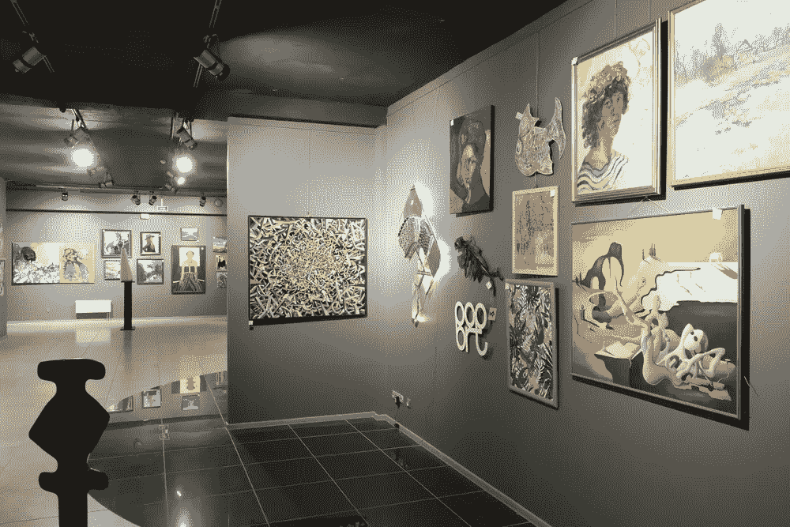

# 艺术品投资的历史揭示了它的未来

> 原文：<https://medium.datadriveninvestor.com/what-the-history-of-art-investment-reveals-about-its-future-f0c278a744e9?source=collection_archive---------7----------------------->

[Image by Chamille White](https://www.shutterstock.com/g/chamille)

艺术品投资传统上是展示个人财富和声望的一种方式。

过去，伟大的艺术学院培养出几乎每一个有能力出售其作品的艺术家，而这些机构反过来又控制着艺术品的展示和销售。

随着艺术家开始意识到出售他们的作品的潜在货币价值，第一家拍卖行(斯德哥尔摩拍卖行)于 1674 年开业。苏富比于 1744 年首次涉足拍卖和艺术领域，接着是佳士得于 1766 年。

这三家拍卖行的运营仍然相当成功。虽然他们基本上仍在经营着与创业之初相同的业务，但艺术界的格局和方法已经发生了巨大的变化。

事实上，随着区块链、人工智能、虚拟现实和增强现实等新兴技术的出现，我们正处于打击艺术世界的最新革命的黎明。

随着艺术和技术变得越来越交织在一起，人们理解这种融合将如何影响艺术投资是很重要的。

# **毫不奇怪，艺术品投资将越来越受到赚钱动机的驱动。**

对一些人来说，拥有艺术品是显示他们*有钱的一种方式，但这也是一种赚钱的方式。在许多圈子里，艺术品被视为一种金融产品——只是另一种可以利用的投资。*

如今，这种投资格局正在以一种非常特殊的方式发生变化:**能够进入市场的人数正在增加。**

进入艺术品市场变得比以往任何时候都容易。[符号化](https://medium.com/blockchain-art-collective/how-tokenization-is-turning-art-into-a-commodity-and-changing-monetization-d7eaee7b46c9)和部分所有权让个人有机会购买价格合理的艺术品股份，而不是像以前那样要么全有要么全无地购买一件艺术品。

但由于区块链的应用程序(也称为 dapps)、Artsy 或 Society Six 等在线平台，以及[平价艺术博览会等活动，寻找、欣赏和购买艺术品也变得越来越容易。](https://affordableartfair.com/)

## 人们不仅有更多的机会接触到艺术品本身，而且他们还可以投资更多可管理的金额。

这将极大地改变艺术品投资的格局。我认为这将导致艺术的进一步商品化，但也会让更多的人感到他们可以参与进来——这些人可能热爱艺术，但传统上却因价格太高而无法投资艺术。

# 有一点将保持不变:投资者仍将继续受到社会认可的投资的驱动。

艺术是一种具有巨大社会成分的投资。

拥有一幅毕加索的画不仅仅是金钱上的价值，甚至不仅仅是你看着它可能得到的快乐。这也是作为拥有一幅毕加索作品的*类型的人的社会方面。*

艺术的支持者通常能够判断出某些作品和风格何时会引起关注，无论是因为[它们的美丽](https://artplusmarketing.com/what-makes-art-good-it-probably-isnt-what-you-think-79cb6dba4201?source=user_profile---------5------------------)还是它们形式或创作的激进性质。我刚才提到的假想的毕加索在创作时可能真的不值那么多钱——或者至少不会被认为是一项好的投资。然而，几十年后，情况显然并非如此。

我想今天正在创作的一些数字艺术也会有类似的命运。

许多艺术家使用新的技术手段，就像毕加索的风格一样具有革命性。随着品味的改变和真正的数字稀缺性成为现实，即使看起来像荷马/佩佩混合交易卡一样奇怪的数字艺术也会变得非常昂贵。

# **所有这些都意味着具有前瞻性思维的艺术品投资者将投资于新的媒介和技术，以获得最佳回报。**

在艺术中，没有当日交易。除非你有惊人的手段，否则今天进不去，明天出不去。

回顾过去的 100 年，很容易选出革命性的时刻和具有里程碑意义的艺术家——巴斯奎特、沃霍尔、唐纳德·贾德、丹·克里斯滕森。事后看来，他们的崛起似乎很难被忽视。但是，当这个行业正在发生一场革命时，要知道什么在未来是有价值的要困难得多。

因此，从很多方面来看，投资艺术品都是一场赌博。

> 过去的艺术家通过突破界限获得声誉，你可以说今天的艺术家也在做同样的事情，只是技术和意图不同。

几十年后，像凯文·阿波施、普里马维拉·德·菲利皮、珍妮·霍尔泽、朱迪·芝加哥或玛丽娜·阿布罗莫维奇这样的艺术家会成为家喻户晓的名字吗？

很难说。

我们所知道的是，由于区块链和符号化，普通人投资艺术品已经变得容易得多，这些艺术品以后可能会变得更有价值。因此，对于任何对艺术品投资感兴趣的人来说，这无疑是开始考虑新选择和分散投资组合的正确时机。

**感谢阅读！**

**我们鼓励任何对艺术品鉴定感兴趣的人尝试我们的** [**入门套件**](https://blockchainartcollective.com/starterkit/) **。**

**我们也知道我们的用户是独特的，不是每个人都有完全相同的需求。如果您对 app 或解决方案的定制有任何疑问，请随时** [**联系我们。**](https://blockchainartcollective.com/inquire/)

[*本文原载于 Crunchbase。*](https://about.crunchbase.com/blog/what-the-history-of-art-investment-reveals-about-its-future/)