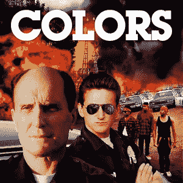

# 电影颜色和比特币有什么共同点

> 原文：<https://medium.datadriveninvestor.com/what-the-movie-colors-and-bitcoin-have-in-common-ccb936e178ce?source=collection_archive---------8----------------------->

首先，电影《色彩》棒极了。如果你没有看过，帮你自己一个忙，去看看。你不会失望的。罗伯特·杜瓦尔和西恩·潘你不会错的。

那么这部电影和比特币有什么共同点呢？在电影中，罗伯特·杜瓦尔的角色向西恩·潘的角色讲述了一个故事。这是一个教学时刻。

*有两头公牛站在山顶上。年轻的一个对年长的一个说:“嘿，爸爸，让我们跑到那里去和他们中的一只母牛做爱”。大儿子说:“没有儿子。让我们走下去，把他们都干了。*

比特币从 20k 美元跌到 8300 美元。涨到 2 万美元的速度快得离谱，人们想再看一遍。**他们想赚钱。**

但是我们真的应该从不同的角度来看待它。

假设你有 100 美元，以 8300 美元买入比特币。第二天，它涨到了$20k，所以你的钱翻倍了。太棒了。

但随着比特币在这个较低价格停留的时间越来越长，它给了你更多的时间来购买它。因此，你可以在 8300 美元左右的价位，在一段时间内投入 500 美元，而不是仅仅投入 100 美元。

**比特币涨到 2 万美元，你的钱又翻了一倍。但是你现在有 1000 美元，而不是只有 200 美元。**

有两头公牛站在山顶上。年轻的一个对年长的一个说:“嘿，爸爸，假设我们跑到那里，干了他们中的一个 ***比特币*** *”。大儿子说:“没有儿子。让我们走下去，把他们都干了。*

比特币花了很长时间才涨到 20000 美元，这让你把它们都搞砸了。

因为没有有趣的照片…

