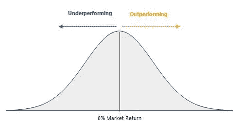
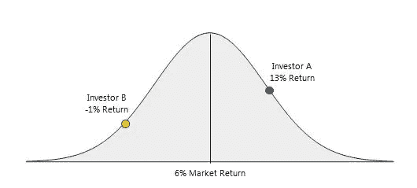
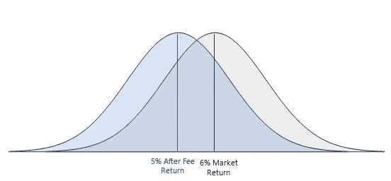
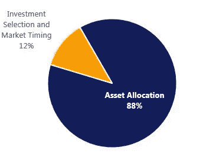

# 世界上最聪明的人对投资有什么看法

> 原文：<https://medium.datadriveninvestor.com/what-the-smartest-people-in-the-world-have-to-say-about-investing-db29e8ce17b9?source=collection_archive---------4----------------------->

看一看支持消极投资胜于积极投资的学术论文。

*底层学术论文:* [马科维茨，1952](http://www.efalken.com/LowVolClassics/markowitz_JF1952.pdf)；[夏普，1964 年](http://efinance.org.cn/cn/fm/Capital%20Asset%20Prices%20A%20Theory%20of%20Market%20Equilibrium%20under%20Conditions%20of%20Risk.pdf)；[布林森，胡德&比博，1995](https://www.cfapubs.org/doi/pdf/10.2469/faj.v51.n1.1869)；[伊博森&卡普兰，2000](https://www.jstor.org/stable/4480243?seq=1#page_scan_tab_contents)

# TL；博士；医生

*   主动管理的基金比被动管理的基金回报少得多
*   一只积极管理的基金过去的优异表现并不能保证他们将来会继续如此
*   如果一只基金表现良好，低管理费是最大的预测因素
*   选择股票和债券的适当组合比投资选择更能预测业绩
*   股票本来就比债券风险更大，但从历史上看，回报也更高

— — —

# **主动与被动投资**

每个人都听过一个朋友的故事，说有人“玩市场”赚了几千到几百万美元。你可能也看过一些电影，里面的交易者发现了市场上的小故障，然后赚了几百万。然而，这些故事受益于[选择偏差](http://www.investopedia.com/terms/s/sample_selection_basis.asp)，这意味着你只听说罕见的大规模盈利投资，而不是更常见的亏损。了解投资前景的唯一方法是观察一个长时期(50 多年)的所有数据点。

幸运的是，世界上一些最聪明的人(见上面潜在的学术论文)毕生致力于确定如何最好地进行投资，并根据 50 多年的历史投资数据得出了他们的结论。这些里程碑式的论文比较了主动管理基金(想想共同基金和对冲基金)和非管理基准基金(想想 T2 的标准普尔 500 指数(T3)和 T4 的纳斯达克(T5))的投资回报。基于这些比较，他们得出了以下结论:

1.  主动管理基金的平均回报率低于可比基准的回报率(在 15 年的时间框架内，每年高达 [2.55%](https://personal.vanguard.com/pdf/s296.pdf) ！)
2.  当考虑幸存偏差时，这种比较甚至更糟——这意味着表现不佳和被关闭的基金仍被考虑在内
3.  以往赢家的持续表现并不比抛硬币更容易预测

支撑这种情况的理论被称为“零和游戏”。它指出，所有投资者的持股共同构成了市场，市场的平均表现就是每个投资者的平均回报。因此，如果一个投资者跑赢市场，另一个投资者就在交易的另一边，相对于市场表现不佳。

为了真正理解这个概念，让我们试着把它形象化。所以下面的图表代表了每个投资者的所有回报(创建了一个[钟形曲线](http://www.investopedia.com/terms/b/bell-curve.asp)),中心是 6%的市场回报。

现在让我们在回报图上添加两个投资者，投资者 A 和投资者 B，回报率分别为 13%和-1%。为了让投资者 A 获得 12%的回报，它需要投资者 B(或类似的投资者)在交易的另一方，否则，投资者 A 将不能购买或出售任何投资。这就是“零和游戏”理论的由来。如果你把每个投资者的收益加起来，它总是等于市场的收益。

这意味着**为了让一个投资者在可重复的基础上跑赢市场，它需要其他投资者持续地站在等式的另一边**(相对于市场表现不佳)以使交易成功。这就引出了一个问题，如果你的表现一直低于市场，你会继续以同样的方式投资吗？不太可能。

因此，投资者不断“退出”积极投资游戏，只是购买指数来跟踪市场，并获得 6%的回报(在这种情况下)。表现不佳的投资者不断流失，导致老练的表现优异的投资者不得不相互竞争，并不时地落在表现不佳的一边。

接下来要考虑的是主动型基金经理通常收取的管理费，通常在 0.50%至 2.00%之间。这些费用自动限制了他们，迫使他们不仅要匹配市场的回报(这本身就很难)，还要超过他们的管理费。以下面 1.00%的管理费为例:

由于 1.00%的主动基金经理管理费，整个回报范围向左移动。虽然蓝色钟形曲线的一部分确实位于市场回报的右侧，但由于管理费较高，它代表的投资者数量要少得多。

> 这些事实甚至让世界上最好的(如果不是最好的)主动基金经理之一沃伦巴菲特[告诉他的继承人将他的财产投入低成本的被动指数基金。](http://www.businessinsider.com/warren-buffett-recommends-sp-500-index-2014-3)
> 
> “如果找不到针，就买干草堆”

# **资产配置**

希望现在你同意反复跑赢市场是非常困难的(扣除费用后几乎不可能)。如果没有，大约 5 年后，当你看到自己的投资回报时，再回来看看。研究人员面临的下一个挑战是确定最佳资产配置。就资产配置而言，我指的是投资组合中债券、股票和现金的组合(还有其他资产类别，如房地产和大宗商品，但我们现在将坚持简单的资产类别)。研究人员认为，选择合适的资产配置比选择你投资的单个基金更重要。事实上，来自 Vanguard 的[研究表明，一个投资组合的 88%的回报只能通过资产配置来解释，剩下的 12%由投资选择和市场时机决定(假设投资组合多元化)。](https://personal.vanguard.com/us/insights/investingtruths/investing-truth-about-risk)

Percentage of return explained by:

这意味着，只要将 80%投资于股票，20%投资于债券，你甚至在选择股票或债券指数之前就已经确定了投资组合的波动性。

几十年的研究表明，股票本来就比债券风险更大。因此，当弄清楚如何投资你的投资组合时，首先要确定的是你能够并愿意接受多大的风险。由于股票天生比债券风险更大，投资者要求从股票中获得更高的回报。否则，投资者只会投资于风险较低、回报较高的资产。所以总的概念是:

**更多的风险=更多的回报**

**风险越小=回报越少**

因此，一个 80%股票和 20%债券的投资组合比一个 50%股票和 50%债券的投资组合风险更大，回报也可能更高。因此，当你考虑到底应该如何投资时，要更多地关注股票和债券的组合，而不是你实际投资的具体投资。