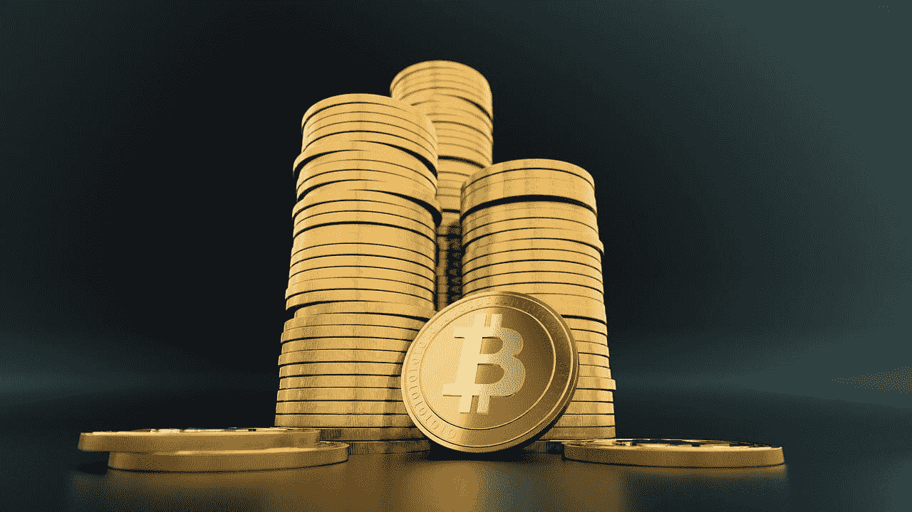
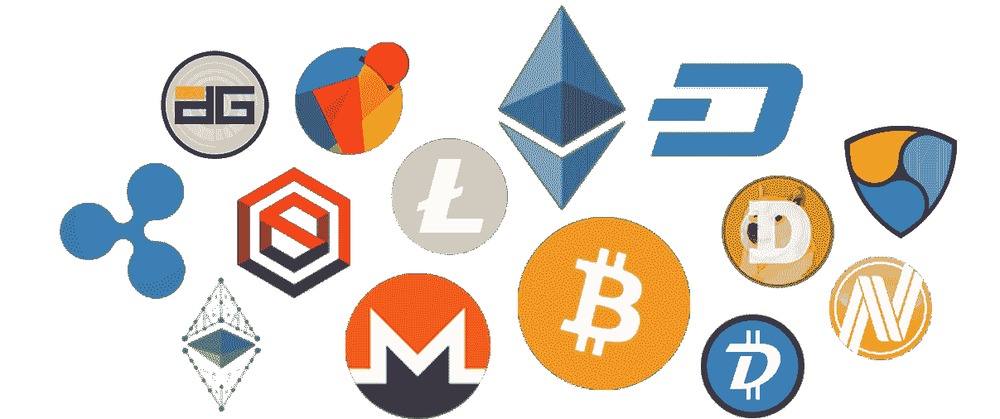

# 阅读白皮书时要注意什么——3 件简单而有效的事情

> 原文：<https://medium.datadriveninvestor.com/what-to-look-for-when-reading-a-whitepaper-3-simple-and-effective-things-14be902b7b7?source=collection_archive---------4----------------------->

所以你从你的朋友那里听说了比特币，你想开始投资它。你看看价格，发现买一个比特币大约需要 7000 美元。你对自己说“我没有 7000 美元来投资。有我能投资的其他代币吗？**我如何开始**？”

虽然有许多区块链项目有增长的潜力，但有更多的项目出售“狗屎硬币”或只是彻头彻尾的骗局。我们实际上如何找到值得投资的项目？虽然没有“放之四海而皆准”的答案，但你可以注意到一些事情，以区分一个有潜力留下来的项目和一个只是为了赚钱而留下来的项目。

在这篇文章中，我将与你分享评估项目的白皮书。这里有 3 种简单而有效的方法来评估一份白皮书，即使你对区块链没有多少了解，也可以使用。

# 白皮书

该白皮书包含许多有用的信息，例如公司希望解决的问题、产品/服务的概念、令牌的效用、上市策略和实施时间表。

听起来要吸收很多信息？我也这么认为。

# 公司之间的比较

好消息是，随着您阅读更多的白皮书，您会发现它们在概念和想要解决的问题方面有许多相似之处。对两家产品相似的公司进行比较是一个好的开始。市场上的一些常见概念如下:

*   P2P 支付解决方案(想想比特币)
*   区块链协议(想想以太坊和 NEO)
*   社交媒体(想想 Steemit)
*   区块链上的广告(想想基本的注意力象征)
*   分散交易(想想 IDEX)
*   还有更多！

通过比较类似公司的概念和应用程序，您可以看到哪些项目很可能脱颖而出，或者它们是否只是另一个与其他所有人拥有相同解决方案的项目。

与他们的竞争对手相比，很好地了解该公司的业务将使你在这个领域比许多甚至不阅读该公司白皮书的散户投资者更有优势。

# 关于代币的一切

许多人购买加密货币作为一种投资形式，认为这些代币会升值。无论一家公司的技术多么有前途，代币背后的经济学(或者代币经济学，如果你愿意的话)是代币价格的一个关键因素。虽然我不是经济学专家，但以下几点是你我在谈到令牌经济学时可以注意到的。

**代币供应**

代币供给是有限的还是无限的？简单的需求和供给逻辑表明，如果代币的供给是无限的，代币的价格在长期内不会上涨太多。

**令牌分配**

很大一部分令牌分配给了创始团队和他们的顾问吗？实际上有多少投入到业务发展中？这些问题将有助于从那些寻求为未来开发产品的公司中筛选出那些只为攫取现金而创造代币的公司。

**令牌的效用**

令牌的用户如何在生态系统中使用它？他们的竞争对手对他们的代币使用相同形式的效用吗？根据其实用性，您是否认为对该令牌的需求很高？

**交易所挂牌**

代币在多少交易所上市？这些交易所的日交易量高吗？流动性高的代币让你更容易套现。

# 社区情绪/新闻

这取决于你的辨别能力，可能对你有利，也可能对你不利。听取他人对项目的意见总是好的，因为这会让你对白皮书的评估更加客观。

然而，这个领域已经出现了许多骗局，人们被支付“抬价”(过度销售)项目，当项目被证明是一个骗局时，让那些“害怕错过”(FOMO)的人舔他们的伤口。

在评估别人的意见时，要始终保持敏锐，你应该做得很好！

# 给你的一篇文章

为了实现大规模采用，区块链内容需要被分解，并以大众理解的术语传达给他们。这也是我写这样的观点文章的原因——让大众更好地了解区块链技术和加密货币。

喜欢你读的吗？如果你是一家寻求内容营销支持的区块链公司，让我为你写更好的文章！

[今天提升你的营销](https://www.alphatechmarketing.com/contact/)

**联系我**
**网站**:[https://www.alphatechmarketing.com/](https://www.alphatechmarketing.com/)
**邮箱**:jiayung@alphatechmarketing.com
**领英:**[https://www.linkedin.com/in/jia-yung/](https://www.linkedin.com/in/jia-yung/)