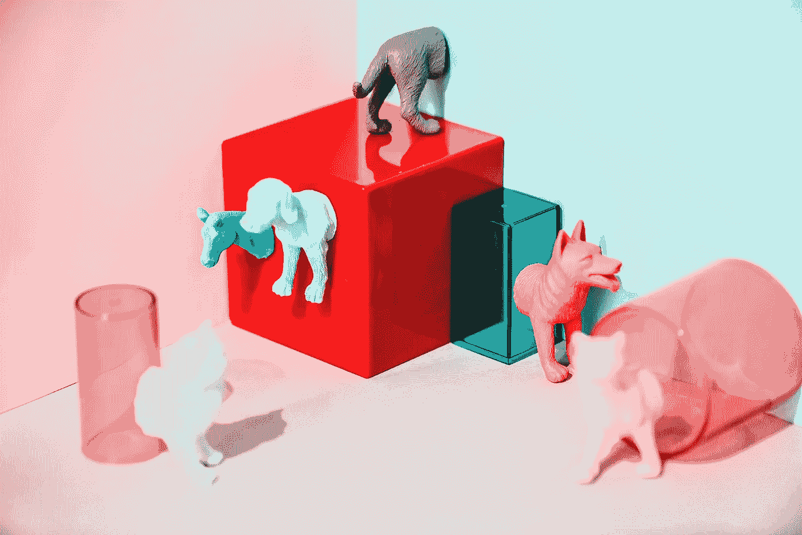

# 当你投射时要投射什么。

> 原文：<https://medium.datadriveninvestor.com/what-to-project-when-youre-projecting-357ff5af5d40?source=collection_archive---------15----------------------->

Many popular online demonstrations use 3D-Printing to make glasses. I’m still waiting for ones with built-in lasers.

# 早年。

> "预测未来的最好方法是创造未来."—据说是许多历史人物写的。

你可能已经听说过 3D 打印机。

您可能在工作场所使用过，也可能没有。

截至 2019 年，3D 打印的新奇感主要是为软件工程师、科技公司或希望投身创造万花筒的初创企业大师保留的。虽然 3D 打印的最大问题包括健康危害、打印非法材料，甚至推高能源消耗成本——*想象一下你的电费飙升到正常费用的两倍甚至三倍*——打印机本身仍然是 21 世纪最显著的科学突破之一。他们所拥有的未来就像人们想象的那样令人兴奋。

*但是……*

*…* 假设你不是在一家以打印航空零部件为生的实验室工作。如果你不急于使用 3D 打印机，让你的安钢优势在非法毒品交易中？如果你相当于乔-施莫呢；一天工作结束后，男人或女人坐在家里的沙发上，漫无目的地翻看网飞或卫星电视菜单？如果午夜让你产生了与快餐无关的渴望，那该怎么办？

你有创造的能力。

*而你现在想解决一个问题**？*

如果复杂的 3D 打印机的成本在未来 10 到 15 年内继续下降，它们将更容易被制造业以外的消费者或独立承包商获得。因此，消费者必须有操作打印机所需的说明和责任，而不违反联邦法律或身体伤害自己。

*(大多数人可能不太负责……)*

因此，这就是一本不涉及启动说明的方便的操作手册投入战斗的地方。因为普通消费者需要了解…

*…投射时要投射什么。*

# 需要思考的三大理念。

> “见鬼，这里没有规则——我们正在努力完成一些事情。”—托马斯·A·爱迪生，著名的发明家。

1.你的饮食，你的方式 —我们已经到了打印食物的地步，我们只需要对机器进行微调，这样它们就可以在更广泛的基础上运行。[像‘Foodini’这样的打印机允许人们打印比萨饼、意大利面——然后必须按照他们自己的方式烹饪。它就像帕帕-墨菲披萨，但是除了披萨之外还可以用来吃东西；最大的进展是，公司将开始提供一种打印机，除了打印食物之外，它还将烹饪食物。](https://www.cnn.com/2014/11/06/tech/innovation/foodini-machine-print-food/index.html)

我再也不用亲自去冰箱里翻出馄饨了——打印机很快就会为我做好一切。

2.**站岗的火箭发射器**——[3D 打印机可以打印枪支，毫不奇怪这仍然是更具争议的用途之一。枪支管制的倡导者将谴责任何试图让消费级 3D 打印机在他们想要的时候打印他们想要的任何枪支的行为。在十五年的时间里，想象公司将很快开发更高水平的可燃发展——比如说火箭发射器。](https://www.cnet.com/news/the-3d-printed-gun-controversy-everything-you-need-to-know/)

*忘记枪支*——使用 3D 打印机打印火箭发射器不仅会对任何挑战你的有机领域的人确立统治地位；它还能对潜在的攻击者或小偷提供终极的防盗威慑。尤其是在农场或可能仅由安全系统保护的较大地产上。在亚利桑那州西北部的某个地方，一群武装小偷游荡到一处房产，希望偷走居民的农场设备*…甚至可能是 3D 打印机本身！*

然而，当自动射击系统直接在他们站的地方发射火箭时，他们的抢劫企图被打断了。尽管清理工作可能会被证明是混乱的——而且烧焦的痕迹会在地产的沙漠地面上根深蒂固——但住户可以放心，3D 打印机不仅工作出色，而且回报丰厚。

有了火箭发射器，谁还需要保险？

*无名小卒，那是谁。*

3.多面体麦克曼森——你知道什么是无聊吗？普通的房子。你知道什么不无聊吗？一台 3D 打印机。你知道什么超越了无聊的概念，成为了你能想到的最酷的事情之一吗？形状像几何怪物的 3D 打印房屋。

A five-year-old’s dream (or nightmare) home come to life. Imagine this but 4000 square feet.

基本的住宅已经建成，但是一个技术亿万富翁或疯狂的数学家无疑将很快测试什么样的居住方式是可能的。有了打印塑料和金属的能力，就有了让任何家居造型变得栩栩如生的想法。

住在一个打印出来的房子里不仅会对你认为科学发展是解决人类问题的关键做出科学声明；它也为新的艺术设计成为主流提供了通道。传统、现代、科德角和牧场风格的房屋将成为过去…

… *新立体派*可能会在几十年后成为流行风格。那些想买一栋价值数百万美元的房子的人可能想探索一下一栋房子不仅仅只有六面的想法。也许一个人的梦想家园将由一座灯塔和一座珊瑚礁以及一个长方形组成。

*我们的幻想会天马行空。*

# **结论。**

> “建筑始于工程结束的地方。”——瓦尔特·格罗皮乌斯。

说真的，3D 打印的潜力远远没有得到充分利用。虽然我们仍处于这些机器的实验和试用阶段，但一旦它们变得足够复杂，能够以比旧方法更少的金钱和时间制造物品…

……那么，所有那些 1950 年代的科幻电视剧中，按下按钮，食物从烤箱里蹦出来的场景，可能终究不会远离现实。