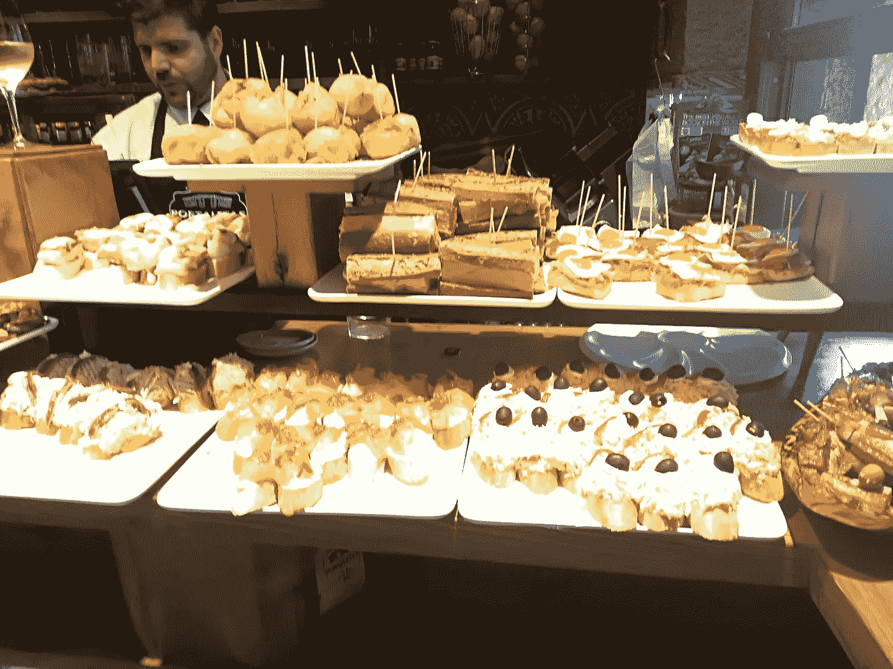
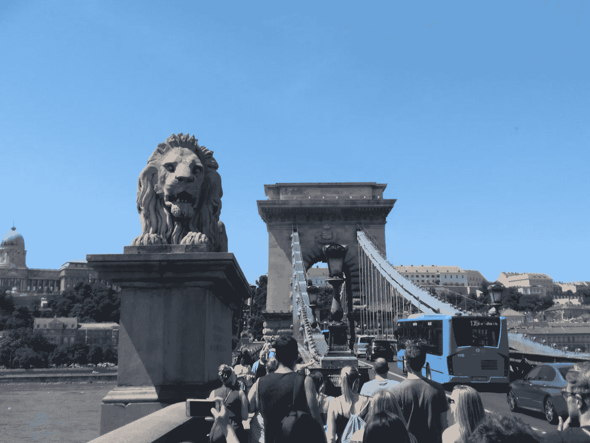

# 旅行教会了我做生意

> 原文：<https://medium.datadriveninvestor.com/what-traveling-has-taught-me-about-business-d601e0d62f3c?source=collection_archive---------16----------------------->

对我来说，旅行是我最大的投资之一。这听起来可能很疯狂，但即使我没有去过我想去的那么多地方，我可以说我从探索新地方中学到的东西比参加一些在线课程还多。

许多人把旅行作为逃离紧张生活的一种方式。我也是。然而，每次我收拾行李的时候，我都兴奋地享受着海滩上温暖的天气，就像我敞开心扉试图学习我从未想过的东西一样。

> 从小旅行就是我的重要组成部分；想想看，当我 17 岁的时候，我独自搬到了一个全新的国家。

当然，根据目的地的不同，你可以学到一堆关于历史、艺术、文化、宗教等的知识。以我个人的经验来看，我在这个长长的话题列表中增加了一项业务。

是的，你没看错，我写的是商业。如果你想一想，你就会意识到商业在许多方面与历史、艺术和文化相关。这是人性的一个基本部分。

好了，该谈正事了。以下是我在旅行中学到的最重要的事情。

# 你的问题总有解决的办法。

创造性是人类区别于其他动物王国的特征。在优步和 Lyft 接管运输行业之前，在我的祖国委内瑞拉，就有了这些平台的雏形。

拥有私人摩托车的人，称为 *mototaxistas* ，过去常常聚集在我们首都加拉加斯的不同战略点，向你收取低于传统出租车的费用。他们承诺会比其他公共交通工具更快地把你送到目的地。

This video shows how it is to ride a mototaxi in Caracas. The youtuber described it as the wildest public transport he has ever taken.

如果有人从委内瑞拉读到这里，他们可能会同意我的观点，T2 的电动出租车的确帮助了很多人，但也制造了混乱。然而，如果你接受了这个想法，这是任何成功企业的 30%，打磨它，然后执行它；那么你最终会得到像优步一样的东西；估值 680 亿美元的公司。
说起优步，如果你来西班牙，你会发现西班牙很封闭。通过类似的商业模式，他们为你提供 wifi 和淡水。

每当我去一个新的地方，这种思维方式让我睁大了眼睛和耳朵，也许你可以把下一个一百万美元的想法带到你的城市或国家。

# 食物可以成为赚钱机器。

几乎每个人在旅行时都会尝试新的口味。我不得不承认，在我的大多数旅行中，我吃了大量我通常不吃的食物。

但是食物并不是唯一与一个地方的美食相关的东西。当地人吃食物的方式可以成为一种可以输出到其他地方的商业模式。

在我的西班牙安达卢西亚之旅中，西班牙小吃不仅是一种饮食方式，也是一种生活方式。人们在紧张的一天后和朋友一起出去喝啤酒或一杯葡萄酒，同时品尝几道美味的菜肴。

从商业角度来看，tapas 可能是一个非常有利可图的系统。首先，你不必在每次有人点餐时都准备每一道菜，因为餐前小吃往往是按即食比例准备的。

A pinchos bar in San Sebastian, Spain

此外，由于餐前小吃是一种小开胃菜，你可以从小份中获益良多。例如，考虑西班牙煎蛋卷的 tapa 是 2.5 美元，但是作为餐馆，你正在提供整个煎蛋卷的第七部分，这花费了你大约 4 美元来准备。算一算，7 份西班牙煎蛋卷要 14 美元，而你只花了 4 美元来做它。在大多数情况下，人们会点至少三种不同的餐前小吃。

人们点餐前小吃边喝边吃，我们都知道各种饮料是餐馆最赚钱的商品。

想象一下，把餐前小吃带到当地的快餐车或美国的一个繁忙的城市，如果营销和执行得当，你的钱包很可能在未来几个月里增加。

# 历史=机遇

去一个外国地方而不了解它的历史几乎是不可能的。一个地方有多古老并不重要，总有一些东西在过去改变了那个地方。

在我去匈牙利布达佩斯的旅途中。我参加了一次最有趣的旅行，而且是免费的。嗯，它是免费的，因为根据你的经验，你想付多少就付多少。

A picture I took of the Széchenyi Chain Bridge in Budapest, Hungary

我穿越了这个国家几个世纪的丰富历史，这个国家曾经是历史上最强大帝国的一部分，一个受纳粹和苏联影响的国家，两个被多瑙河分割和连接的城市。这位导游非常令人惊讶，他知道这个国家令人兴奋的细节和有趣的事实。

然而，我去过几个历史悠久而有趣的城市，要么很难找到，要么根本不存在免费旅游。

如果你喜欢历史和与人交谈，也许，在你的城市，你可以开始做免费旅游，赚些外快。

# 励志奖金:

我已经从一个发展中国家变成了经济强国。如果你曾经去过不发达国家，你会看到那里的人们在最恶劣的社会和经济环境中茁壮成长。如果他们能做到，那么，你也能做到。

反过来也一样。如果你生活在一个贫穷的国家，你有机会去任何一个工业化国家旅行，那就像海绵一样，尽可能多的学习。也许有些想法你可以带回你的国家，加以改造，然后赚大钱。

这些例子虽然简单，但很好地说明了旅行如何帮助你了解新的商业模式，并激励你将这些知识带回家。

关闭这个帖子，我想鼓励你走出你的舒适区，去旅行，99.7%这样做的人不会后悔。