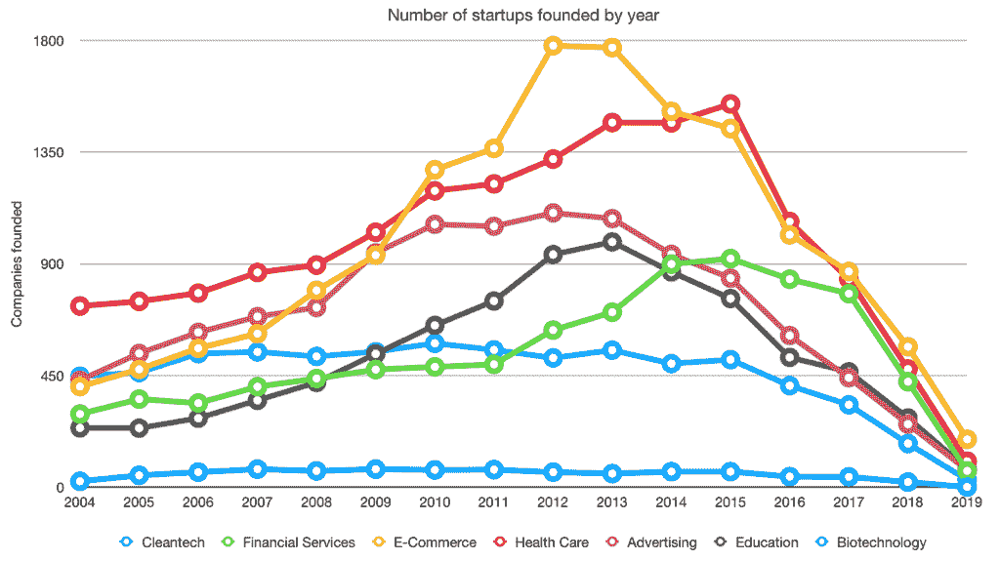
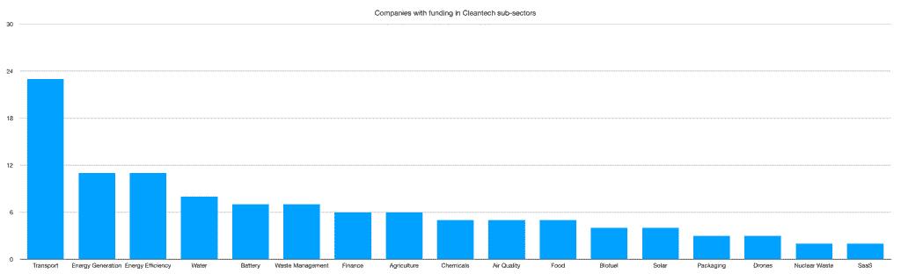
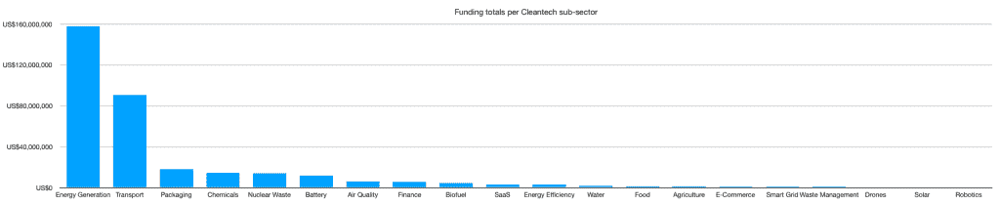
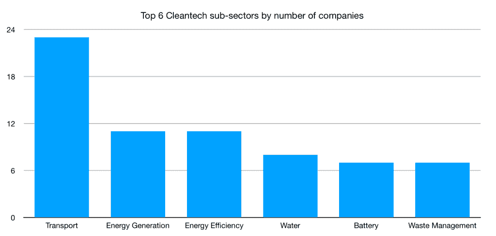
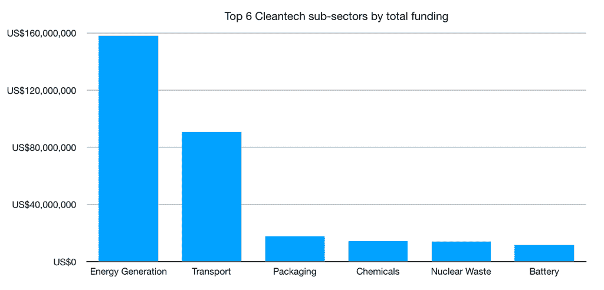
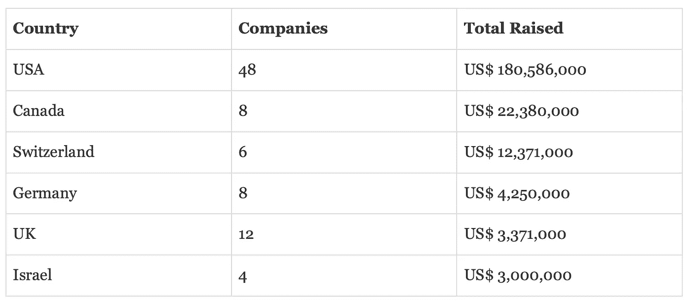
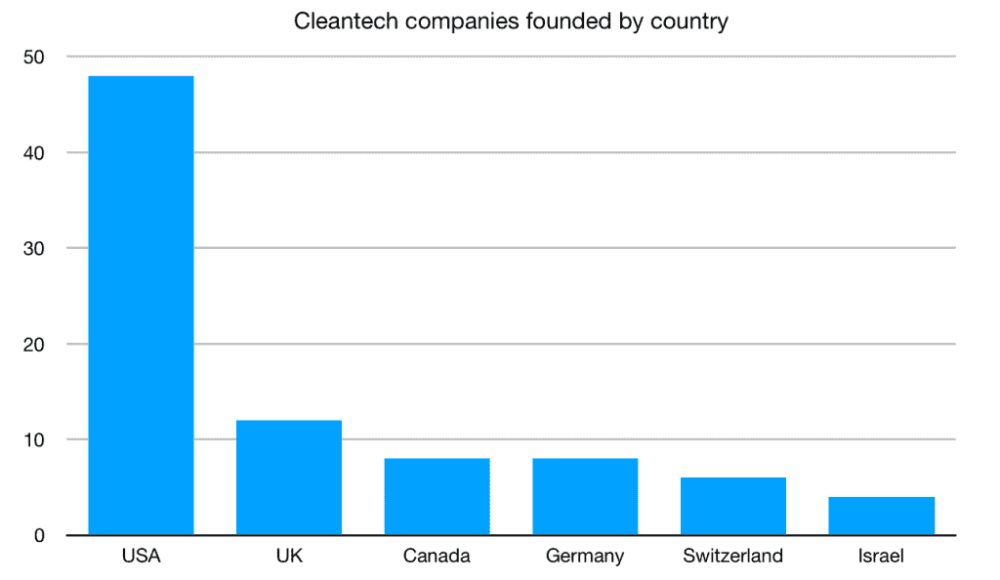
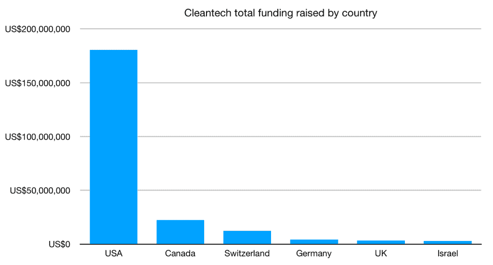

# 什么类型的清洁技术创业公司可以获得资金？

> 原文：<https://medium.datadriveninvestor.com/what-types-of-cleantech-startup-get-funding-2e7967208b54?source=collection_archive---------3----------------------->

Kyoto, Japan

## 能源创业公司是唯一获得资金的吗？

## 在过去 3 年里，65 家公司筹集了 3 . 79 亿美元，这些钱都用在了哪里？

在之前的一篇文章中，[我研究了初创企业清洁技术行业的整体情况，以及自 2004 年以来 490 亿美元清洁技术投资背后的数据](https://davidmytton.blog/the-data-behind-49bn-of-cleantech-investment/)。

 [## 金融科技初创公司正在颠覆全球银行业|数据驱动的投资者

### 传统的实体银行从未真正从金融危机后遭受的重大挫折中恢复过来…

www.datadriveninvestor.com](https://www.datadriveninvestor.com/2018/10/20/fintech-startups-are-disrupting-the-banking-industry-around-the-world/) 

清洁技术创业公司获得资助的数量之少让我印象深刻。**平均每年有 52 家清洁技术公司成立**，与电子商务相比微不足道，自 2004 年以来，电子商务每年平均有 988 家公司成立。

Source: [The data behind $49bn of cleantech investment](https://davidmytton.blog/the-data-behind-49bn-of-cleantech-investment/)

然而，随着许多清洁技术投资者的新活动以及对影响力投资的重新关注，事情看起来有点积极。[除了企业可以做的事情](https://davidmytton.blog/corporate-purchasing-an-unexpected-way-to-fight-climate-change/)，在清洁技术领域，初创公司似乎有很大的机会，有充足的可用资金，来自其他初创公司的竞争很少。

在这篇文章中，我将更近距离地观察过去 3 年中成立的清洁技术创业公司。启动了哪些项目，资金流向了哪里？

# 清洁技术需要风险投资吗？

我有点武断地选择回顾过去 3 年。很多公司在那之前就成立了，但是这个时间框架应该显示出有什么新的想法正在被推出。对于最感兴趣的公司来说，也应该有足够的时间筹集初始资金。

不幸的是，这确实意味着一些最近宣布融资的公司被切断了，原因是它们成立的时间。例如，突破能源风险投资公司(BEV)去年宣布了他们的 5 家公司的初始投资组合，这些公司的成立日期各不相同。

> BEV 表示，这些公司在获得 20 万至 2000 万美元的资金之前，都经过了严格的审查，这取决于它们的发展阶段和需求。最初的名单中既有年轻的公司(Form Energy 成立于去年)，也有相当成熟的公司(CarbonCure 已经存在了 10 年)。
> 
> [-比尔·盖茨领导的 10 亿美元能源基金正在扩大其对抗气候变化的创业投资组合](https://qz.com/1402301/bill-gatess-1-billion-energy-fund-is-expanding-its-portfolio-of-startups-fighting-climate-change/)

资金不一定是清洁技术公司是否重要的指标。然而，我的假设是[考虑到这个行业的资本密集型性质](https://davidmytton.blog/the-data-behind-49bn-of-cleantech-investment/)，大多数清洁技术公司将需要资金。

清洁技术领域似乎与生物技术相似，需要大量资金来开发和商业化产品。例如，这与 SaaS 形成了鲜明对比，在那里，最初的产品可以完全在内部用最少的资金制造出来，而自举是建立持久企业的一种非常有效的方式。[拓展全球 SaaS 业务是另一回事](https://davidmytton.blog/you-cant-build-a-saas-company-in-2018-without-significant-funding/)，但是一家成功的软件公司[完全可以在没有外部资本的情况下合法建立。](https://m.signalvnoise.com/reconsider/)

# 过去 3 年的清洁技术创业

使用 Crunchbase 搜索过去 3 年中成立的清洁技术和清洁能源类别的公司，会发现 205 个结果。

在这 205 家公司中，有 65 家筹集了总计 3.79 亿美元的资金。其中 63%被归类为“ [**种子**](https://medium.com/localglobe-notes/seed-has-come-of-age-bfbeb80a3b8)**”**，鉴于这些公司迄今为止的短暂生命，这是意料之中的。

然而，这 3.79 亿美元中的大部分仅投资于少数公司:

*   [英联邦聚变](https://www.cfs.energy/)(募集 1.15 亿美元)，美国——聚变能源。
*   [VOI 科技](https://www.voiscooters.com/)(融资 8900 万美元)，瑞典——运输(踏板车)。
*   [蒲公英能源](https://dandelionenergy.com/)(募集 2250 万美元)，美国——消费地热。
*   Zer0 盒子(筹得 1490 万美元)，中国——包装。
*   [深度隔离](http://www.deepisolation.com/)(筹集 1410 万美元)，美国)——核废料管理。

# 清洁技术子行业投资

能源和交通运输可能是清洁技术子行业中最受媒体关注的，但还有许多其他子行业也有创业活动。

根据过去 3 年中成立的公司总数，最大的子行业是:

1.  运输——23 家公司
2.  能源生产——11 家公司
3.  能源效率— 11 家公司
4.  水——8 家公司
5.  电池— 7 家公司
6.  废物管理— 7 家公司

按筹资总额分列:

1.  能源生产—1.57 亿美元
2.  运输——9000 万美元
3.  包装——1700 万美元
4.  化学品—1400 万美元
5.  核废料——1400 万美元
6.  电池——1100 万美元

# 清洁技术公司是在哪里创立和资助的？

正如预期的那样，美国在过去 3 年中成立的清洁技术公司数量(48，36%的公司)和总融资额(1 . 8 亿美元，53%的总融资额)方面占据主导地位。

其他上榜的国家包括巴西、瑞典、法国、爱沙尼亚、新加坡、土耳其和印度。

# 清洁技术创业公司在过去 3 年里发生了什么？

浏览过去 3 年里在清洁技术领域成立的所有初创公司，可以发现一些有趣的事情:

*   有 140 家公司没有任何形式的资金，或者还没有披露他们的资金。这对非常早期的公司来说是意料之中的，因为他们还没有达到可以筹集资金的阶段。大约在 12-18 个月前，有一批公司进行了融资，但绝对数量仍然很低。
*   我预计清洁技术公司将利用种子前资金或种子资金将其技术商业化，然后筹集更多资金以扩大规模。例如，Commonwealth Fusion 成立于 2017 年，并于 2019 年 6 月筹集了 1.15 亿美元的首轮融资，但【2018 年 9 月宣布他们筹集了一笔较小的未披露金额。该产品是麻省理工学院基于数十年研究的副产品。风险投资对于一个目的来说是理想的——商业化。
*   发现从事能源生产、太阳能和电池行业的公司并不奇怪，但还有一些更不寻常的公司，包括几家飞行出租车初创公司，如[优势飞行技术](https://www.ascendance-ft.com/)。
*   筹集资金最多的初创公司往往在美国，除非他们正在本地化已经在美国获得成功的产品，例如瑞典电动滑板车领域的 [VOI 科技](https://www.voiscooters.com/)(筹集资金 8900 万美元)。
*   美国在公司总数和融资总额方面都占据主导地位，尽管清洁技术投资者正在扩大他们的地理覆盖范围，例如突破能源风险投资公司(Breakthrough Energy Ventures)于 2019 年 5 月宣布了他们的€1 亿美元欧洲基金。
*   某些国家有更高密度的特定专业初创公司，例如 3 家包装初创公司中的 2 家——[Zer0 Box](https://www.crunchbase.com/organization/zero-box)和[汇都](https://huidugroup.cn/)——位于中国。

这支持了我的假设，与其他初创行业相比，清洁技术领域几乎没有竞争，但在有竞争的地方，清洁技术遵循与 SaaS 相同的规则:顶级公司筹集巨额资金，因为[赢家拿走最多的](https://tomtunguz.com/does-winner-take-most-in-saas/)。

投资者还需要小心，他们是在资助那些正在开发商业产品的公司，而不仅仅是继续资助一项应该仍处于 R&D 阶段的技术。通过查看名单上许多公司的创业网站，我得到的印象是，相当多的公司仍然非常早期，可能更适合作为研究项目，而不是盈利性公司。这与 SaaS 形成了鲜明对比，在那里，公司可以推出非常早期的 MVP，但仍然有可以立即销售的商业产品。