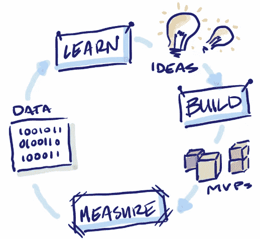

# 一个成功的人工智能项目的基础是什么？

> 原文：<https://medium.datadriveninvestor.com/what-underlies-a-succesful-ai-project-7c34bbd2db07?source=collection_archive---------5----------------------->

## 人工智能(Ai)可能是当今经济中最大的商业机会。

Photo by [Clinton Naik](https://unsplash.com/@clintnaik?utm_source=medium&utm_medium=referral) on [Unsplash](https://unsplash.com?utm_source=medium&utm_medium=referral)

也许没有一项技术比人工智能在最近几年引起了更多的炒作。在某些行业，它确实做到了这一点。人工智能为交通应用优步和 Waze、微目标在线广告、商业航班的自动驾驶仪以及亚马逊的 Alexa 等数字助理背后的算法提供了动力。

随着越来越多的组织开始感受到通过实施高级数据解决方案实现业务数字化转型的压力，否则将面临落后的风险。

 [## DDI 编辑推荐:5 本让你从新手变成专家的机器学习书籍|数据驱动…

### 机器学习行业的蓬勃发展重新引起了人们对人工智能的兴趣

www.datadriveninvestor.com](https://www.datadriveninvestor.com/2019/03/03/editors-pick-5-machine-learning-books/) 

> 但是如何选择合适的项目呢？

它应该是一个*时尚的、面向消费者的解决方案*，比如聊天机器人、虚拟助理或计算机视觉应用？还是专注于嵌入式的幕后项目更好，这些项目悄悄地帮助改善内部运营、员工效率或决策？

有几十个潜在的用例，但是资源有限，重要的是优先考虑既有**高商业价值**又有**高成功可能性的项目。**

> 这就是一个历史悠久的框架——五个 w 和一个 H——在组织开始他们的人工智能之路时发挥作用的地方。

# 一个理想的人工智能项目对这些问题都有清晰而令人信服的答案:

## **世卫组织**这个项目会受益吗？

确定预期目标受众是定义人工智能项目的关键步骤。一个关键的考虑是认识到“**受众**”不一定是外部的——受益于人工智能的人肯定可以是组织内部的员工，特别是如果用例旨在将*内部速度转化为价值或团队效率*。

比方说，一家金融科技组织正在考虑是否要建立一个面向外部的应用程序，具体来说，就是一个集成了移动银行应用程序和亚马逊 Echo 的虚拟助理。在深入项目之前，确定产品是否与特定的客户群最相关是至关重要的。一个重要的问题可能是:*这些特定的细分市场对整体业务战略有多重要？*

因此，世卫组织问题直接关系到人工智能项目的最终成败。数据科学团队当然可以开发创新的模型和系统，但如果他们在设计项目时没有考虑到目标受众对解决方案的应用，他们的工作成果就有可能变得无用或不被采用。

## **它将如何具体改善结果或体验，如何衡量？**

随着目标受众的确定，重要的是考虑人工智能应用程序或系统将如何改善受众的体验。这个**如何**应该尽可能量化，以显示一旦实施的人工智能的投资回报率(ROI)。

考虑在一家保险公司构建后台 Ai 应用程序的用例，该应用程序采用自由形式的文本注释(如保险和保修索赔、呼叫中心记录或医疗健康记录中的注释)，并自动为文本添加所有相关类别的标签，提取关键实体，如日期、位置和姓名。

*   这里的听众(世卫组织)是公司的内部员工，特别是那些处理索赔的员工或分析客户服务互动的经理。
*   一个如何做的问题可能是:这个系统将为以前必须手动完成这些任务的领域人类专家节省多少时间？

没有正确地量化潜在的人工智能用例，预先提出正确的问题会使管理层对未来努力的支持处于风险之中——能够衡量预期提升至关重要。在上面的示例中，衡量节省的工时是量化 ROI 的一种方式，但另一种方式可以是估计通过自动检测洞察力获得的增量收入(或通过预测欺诈索赔或未来风险事件节省的资金)，这些收入以前可能会被忽视，无论是由于人为错误、缺乏将手动审查扩展到所有数据的能力，还是数据复杂性。

*现实生活中的投资回报*:通过使用上述方法大规模自动扫描患者记录，欧洲的一家大型医院不仅改善了患者的治疗效果，还获得了数百万欧元的投资回报。他们通过使用文本分析来检测医疗记录中提到的次要条件和治疗，这些条件和治疗以前没有记录，因此也没有记入保险；此外，自动化这一过程节省了数百名医生花费在人工审查上的时间。

## **为什么**将人工智能用于此目的比现有流程更好？

人们很容易被人工智能成为一个新的“简单”按钮的想法所诱惑。但新并不总是意味着更有价值——当权衡各种人工智能项目的利弊时，考虑预期的好处是否值得替换现有流程所需的时间和投资。

例如，让我们说:

*   一家大型零售商的营销部门每周手动标记新许可的图像，以便它们可以在数字资产管理系统中被正确索引。
*   这样，员工可以为他们的演示文稿找到符合公司标准的图像，其中包含他们想要的特定元素(例如，商务人士、平板电脑、飞机场景等)。).
*   构建一个对象识别模型来自动检测和标记每张图像中的项目是否有用？

在这种情况下:

*   低数量的图像和自动化该过程的商业价值可能不足以克服从头开始训练和维护用于对象检测的健壮的深度学习模型所需的巨大努力。
*   然而，也许使用预先训练的模型(例如，YOLO、可可、面具 R-CNN 等。)可以提供实现这一愿望所需的捷径，而无需花费太多的资源。

## **如果成功有什么**的好处，如果失败有什么**什么**的后果？

到目前为止，量化一个成功的人工智能项目的潜在利益的重要性——无论是增加收入，运营成本节约，等等。—应该很清楚。但是风险也是应该预先检查的。

根据 VentureBeat 的说法，没有人愿意在人工智能项目开始之前就想到它们会失败，但现实是 87%的数据科学项目从未投入生产。因此，如果最坏的情况发生，评估后果是很重要的。

*   是否会对品牌声誉或客户信任度造成重大损害？
*   对 Ai 项目的组织信任度和数据团队的执行能力会有损害吗？
*   是否存在法规遵从性或客户隐私方面的风险？

Celent 分析师 Dan Latimore 在他的 2018 年出版物[银行业的人工智能](https://cdn2.hubspot.net/hubfs/2392451/Marketing%20Assets/Artificial%20Intelligence%20in%20Banking%20-%20Where%20to%20Start.pdf)中说得很好，他说:

> “选择一个定义明确、易于管理的项目，其失败不会是灾难性的，其成功将是鼓舞人心的。”

## **数据将来自哪里**，是否已经存在？

毫无疑问，数据是人工智能系统中最重要的元素。当今大多数现代人工智能解决方案都利用了监督机器学习算法，这需要一组带标签的数据，数据科学家可以从中训练机器。换句话说，计算机从它被馈送的示例(包括答案)中学习，并且通常，这些算法需要相当多的标记训练数据，以便产生高度准确的结果。

当组织想要实现酷的人工智能解决方案，但手头没有特定任务的数据时，就会出现这种脱节。那些处理第一个人工智能项目的企业可能会考虑选择只依赖内部数据的初始项目，而不是那些严重依赖第三方来源或定制大量训练数据的项目。

> 想想斯坦福的浮潜，亚马逊的机械土耳其人，或者谷歌的人工智能平台数据标签服务

## **最初的工作原型以及随后生产中的最终解决方案应该在什么时候**交付？

最后:最重要的时间线。就像一个自己动手的住宅建设项目，一个人工智能应用程序可以很容易地从一个伸展阶段构建到下一个阶段；似乎总是有一个*需要做更多的微调，另一个小功能需要添加。*

但是，为了与内部利益相关者建立信任，最好的做法是在短时间内让有限的解决方案部分端到端地工作，而不是在第一次通过时就瞄准一个完整的解决方案。

image Getty

现实生活中的例子:以一个面向客户的聊天机器人为例；第一个原型可以侧重于广度(即，它可以回答跨不同主题的各种简单询问)，也可以侧重于深度(它可以回答以许多不同方式提出的非常详细的问题，但只能回答几个主题)。然而，在第一次迭代中努力实现这两个目标可能是不现实的。一旦聊天机器人预览版赢得了内部用户的认可——也就是说，利益相关者确认一旦构建完成，它实际上将交付期望的业务成果——只有到那时，才适合完全充实应用程序。

何时的问题也触及到了一个——*或者也许是*——人工智能项目的关键步骤:可操作化。运营化是将数据洞察转化为实际的大规模业务和运营影响的过程。这意味着弥合设计机器学习模型的探索性工作和在实际生产系统和流程中部署所需的工业努力(更不用说精度)之间的巨大差距。

image google

人工智能项目的时间表不仅应该包括开发的时间和工作原型的最后期限，还应该包括投入生产和第二次(或第三次)迭代的最后期限。人工智能项目非常适合 MVP 方法，因为查看机器学习模型如何执行的最佳方式是在生产中，所以成功项目的关键是 ***尽早投入运营，经常调整和推出新版本。***

# 结论

当今最成功的组织已经接受了这样一个理念，即有效利用数据和技术不仅可以推动竞争优势，还可以改善员工和客户的体验。但在规划一个组织的人工智能战略时，重要的是要有战略性和深思熟虑。

最终，定义这些问题需要一个基本策略:合作。也就是说，在以一种将使项目成功的方式开始之前，真正定义人工智能项目的唯一方法是让每个人都参与进来，从业务到 IT 以及两者之间的人。就利害关系、当前流程、可交付成果、时间表等进行沟通。:这些重要的组件不能简单地由数据科学家或更大的数据团队决定和支配。