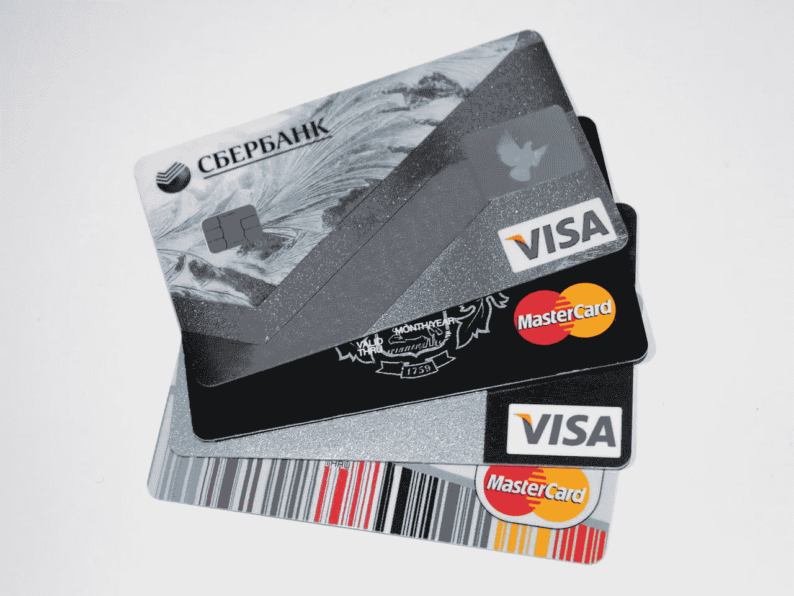
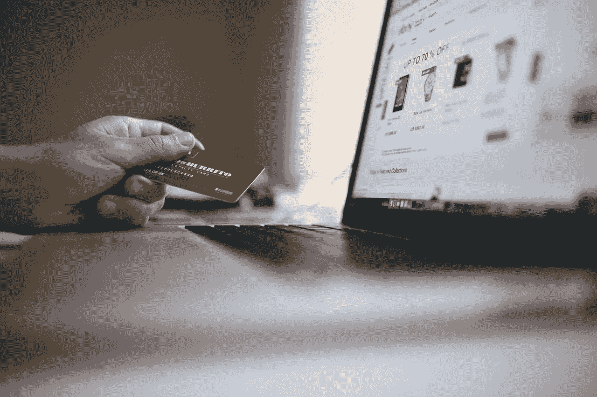
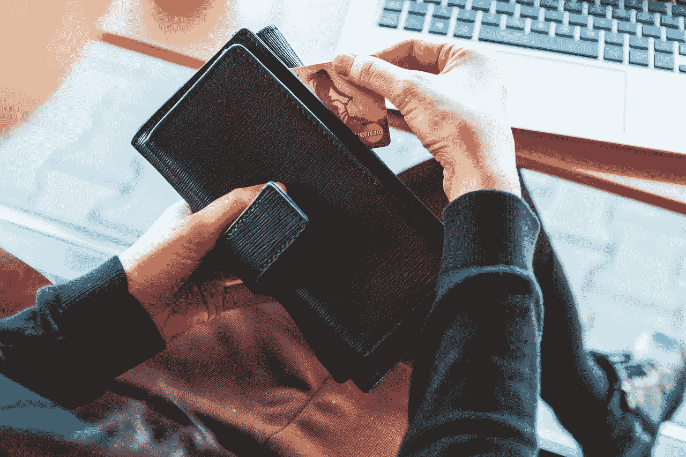

# Square Inc .有什么价值？

> 原文：<https://medium.datadriveninvestor.com/what-value-does-square-inc-sq-have-fd5b8f00ff1b?source=collection_archive---------6----------------------->

Square Inc .可以向我们展示 Stripe 可能进行的首次公开募股(IPO)的潜在价值。

解释一下，两家公司都是支付处理商。两者的区别在于 **Square Inc. (NYSE: SQ)** 主要是一家硬件公司，Stripe 是一家软件公司。

特别是，Square 销售允许商家接受信用卡和借记卡支付的销售点(POS)系统。另一方面，Stripe 卖支付接口；允许组织接受在线支付或应用程序支付的应用程序。

**Stripe 和 Square 公司都有巨大的平台**

因此，两家公司都运营着庞大的支付平台。例如，Stripe 的客户[包括](https://stripe.com/us/customers)超过 700，000 名 Lyft 司机，他们的 Lyft 应用程序中有 Stripe 界面。

与此同时，2017 年，Square 有 225，000 名活跃的发票卖家和 700 万名 Square Cash 应用程序用户，*扩展漫谈* [估计](https://expandedramblings.com/index.php/square-statistics/)。此外，2017 年约有两百万平方卖家。

有趣的是，正方形和条纹越来越接近。例如，两家公司都是移动商务的主要参与者。特别是，Stripe 为 iOS 和 Android 这两个世界上最受欢迎的移动操作系统提供软件开发包(SDK)。

此外，Stripe 在 25 个国家提供平台支付。详细来说，使用 Stripe 的平台包括 Shopify、Twitter、Medium、脸书、Pinterest 和 Kickstarter。因此，Stripe 似乎在主导基于应用的支付方面处于更有利的地位。

**Square Inc .(SQ)和 Stripe 会有多大价值？**

《财富》*[声称](http://fortune.com/2018/09/27/stripe-valuation-ipo-stock/)stripe 可能价值 200 亿美元。然而，Stripe 首席运营官克莱尔休斯约翰逊(Claire Hughes Johnson)坚称，她的公司没有 IPO 的计划。*

*约翰逊对首次公开募股不感兴趣的原因很容易理解。事实上，Stripe 在 2018 年 10 月能够从 Tiger Global Management 筹集到 2.45 亿美元的私人投资。因此，Stripe 可以在不发行股票的情况下筹集所需的所有资金。*

**

*然而，Stripe 的估值在过去三年里翻了一倍多。有趣的是，Stripe 在 2015 年 7 月身价 90 亿美元，*财富* [估算](http://fortune.com/2016/11/25/payments-stripe-valuation/)。*

*另一方面，Stripe 远非全球最有价值的 fintech 独角兽。值得注意的是，这一荣誉属于中国的蚂蚁金服，是他们给我们带来了支付宝。具体来说，Ant 在 2018 年 6 月的估值为 1500 亿美元。*

*Square 公司赚钱了吗？*

*Stripe 和 Ant 证明了支付平台可以赚很多钱。不过 Stripe 的支付接口和蚂蚁的数字钱包都是软件。*

*同时，Square 公司提供硬件和软件。重要的是，Square 的财务状况表明该公司正在赚钱。*

*例如，Square 在 2018 年第三季度的收入为 8.8211 亿美元，毛利润为 3.5266 亿美元。然而，Square 报告称，2018 年第三季度的运营亏损为-987 万美元，净收入为 1964 万美元。*

**

*此外，Square 在 2018 年 9 月 30 日实现了 4763 万美元的运营现金流和 3360 万美元的自由现金流。因此，Square 正在通过其支付平台产生现金。*

*特别是，Square (SQ) Inc .在 2018 年 9 月 30 日拥有 7.6507 亿美元的现金和等价物以及 5.2221 亿美元的短期投资。因此，截至 2018 年第三季度末，Square 拥有 12.87 亿美元的现金。*

***Square Inc. (SQ)是一家现金充裕、业务不断增长的公司***

*因此，Square Inc .是一家现金充裕、业务不断增长的公司。事实上，Stockrow 计算出 Square 在 2018 年第三季度的收入增长率为 50.75%。*

*因此，我认为 Square Inc .是一项潜在的价值投资，因为它为基于应用的经济提供了至关重要的基础设施。我预测 Square 将来会产生大量现金。*

*不幸的是，Square Inc .目前没有派息。此外，我认为市场先生在 2018 年 1 月 11 日将 Square 定价过高，为每股 66.23 美元。*

*尽管如此，Square Inc .是一个很好的投机工具，因为他们将它定位为向小企业提供金融科技服务。然而，Square 面临着很多竞争和很多威胁。*

***Square Inc .面临的诸多威胁***

*显然，Square Inc .面临的最大威胁是 PayPal Holdings(纳斯达克股票代码:PYPL)和 Stripe。解释一下，这两个支付平台都是在 Square 的美国本土与它直接竞争。*

*一个日益增长的威胁是拥有 Google Pay 的 Alphabet 公司。具体来说， **Alphabet (NASDAQ: GOOG)** 已经[获得](https://marketmadhouse.com/paypal-is-fighting-nazis-stripe-ipo-could-be-worth-20-billion/)许可，通过谷歌支付爱尔兰公司在爱尔兰和欧盟提供各种金融服务。然而，Alphabet 计划在欧洲提供的服务细节还不清楚。*

**

*像[普路托斯 Tap N' Pay](https://medium.com/me/stats/post/a524b3138a59) 和 [Pundi X](https://marketmadhouse.com/is-pundi-x-a-great-cryptocurrency-opportunity/) 这样的加密货币支付解决方案对 Square 构成了理论上的威胁。事实上，Pundi X 正试图建立 1000 个销售点终端，将哥伦比亚的客户连接到其基于以太坊的支付平台。*

*同时，单一欧元支付区(SEPA)接受普路托斯支付。解释一下，SEPA 是一个用于简化银行转账的欧盟范围的系统。在这种情况下，Pundi X 是发展中国家的威胁，普路托斯是欧洲的威胁。*

***中国对 Square 公司的威胁***

*最后，还有中国支付平台巨头 payment；蚂蚁金服的支付宝，还有微信支付。*

*例如，据商业机器[估计](https://merchantmachine.co.uk/digital-wallet/)腾讯控股**旗下的微信支付**在 2017 年拥有 6 亿用户。与此同时，支付宝拥有大约 4 亿用户。相比之下，最大的用户支付应用 PayPal 在 2017 年拥有 2.1 亿用户。*

*因此，Square 面临的主要威胁是蚂蚁金服或腾讯在美国提供销售点(POS)解决方案。美国消费者新闻与商业频道[报道](https://www.cnbc.com/2018/07/19/tencent-to-push-wechat-pay-in-us-despite-trade-war-with-china.html)很能说明问题的是，腾讯正计划在美国扩张微信。*

*微信可能会在美国迅速传播，因为它是一种快速读取(QR)代码的解决方案。解释一下，基于二维码的钱包，如 We Chat Pay 和 Walmart Pay，通过读取 POS 设备生成的条形码来批准支付。*

*因此，商家接受 QR 码支付所需的设备较少。更重要的是，电话和收银机之间没有会造成安全威胁的无线信号。*

***Square Inc .(SQ)是价值投资吗？***

*事实上，美国最大的零售商**沃尔玛(纽约证券交易所:WMT)** 接受二维码钱包，但不接受像 Apple Pay 这样使用无线连接的近场通信( [NFC](https://marketmadhouse.com/big-payment-app-battle-nfc-vs-qr-code/) )应用。在这种情况下，腾讯可能会迅速在美国建立庞大的业务，成为 Square 最大、最危险的竞争对手之一。*

**

*尽管竞争激烈，但我认为 Square Inc .是一项潜在的价值投资，因为人们普遍需要有效的支付解决方案。而且，我觉得 Square 还有很大的成长空间。*

*值得注意的是，微信支付等解决方案的广泛使用将为 Square 创造更多客户。解释一下，更多的客户将需要 POS 解决方案来接受基于电话的支付。特别是，更多的商家将需要 Square 提供的二维码生成器。*

*我的结论是，Square 是一项出色的投机性金融科技投资。如果你正在寻找一种未来价值投资来增加你的投资组合；Square Inc .(纽约证券交易所代码:SQ) 是一个很好的候选人。*

*这篇评论最初出现在[市场疯人院](https://marketmadhouse.com/)。*