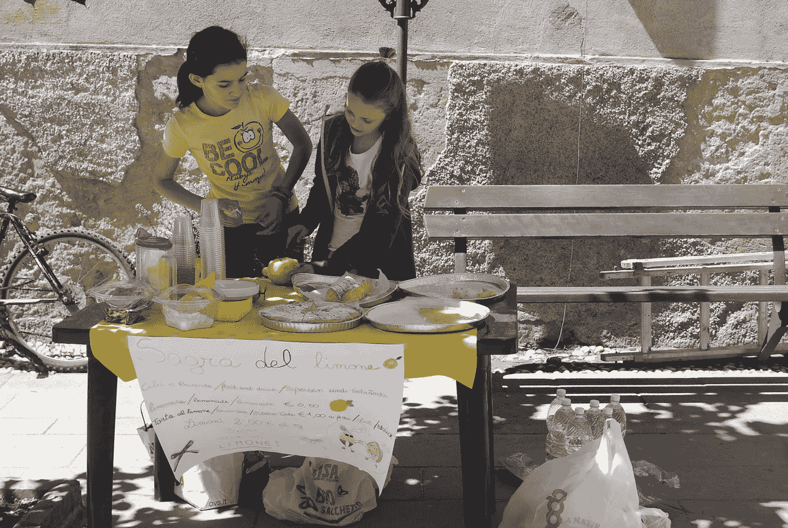

# 我们能从卖柠檬水的孩子身上学到什么，或者为什么企业家更容易离开他们的舒适区。

> 原文：<https://medium.datadriveninvestor.com/what-we-can-learn-from-kids-selling-lemonade-or-why-entrepreneurs-have-it-easier-to-leave-their-bea4990b3d6d?source=collection_archive---------38----------------------->

上周，我在大学参加了一个晚间活动，在等待演讲开始的时候，我遇到了两位年轻的硕士研究生，他们刚刚完成了管理和创业硕士学位。

他们都是 25 岁左右，对即将开始的创业充满了能量和热情。

这些年轻女性不仅对自己的想法充满热情，而且似乎很容易就走上了这条道路，这让我立刻感到敬畏。

那天晚上剩下的时间里，我一直在想，如果这家初创企业明显失败，他们的机会成本和可能损失的东西会比我各自的价值观低得多。但是这就是所有的不同吗？

当那天晚上和其他也见过这两个人的人交谈时，他说他们会让他想起那些在天气好的时候卖柠檬水，在小学时开始他们的第一笔生意的孩子们。

于是我苦苦思索，这段当时感觉深刻深刻的经历能给我什么教训。

当你有了更多的经验，在一条路上走得更远时，你会更多地考虑你可能会失去什么，而不是你可能会得到什么。

**#2:** 沉浸在你的想法中，将你的全部热情投入到一个项目/业务中，会让你看到更多的机会，你也更容易克服障碍。

**#3:** 当你对某件事充满激情时，你的能量会传播给你与之交谈的人，他们也会变得兴奋起来

我们从许多聪明的男人和女人那里知道:

> "如果你做你喜欢的事，你一生中一天也不会工作。"马克·安东尼

我们都有这样的经历，当你对正在做的工作充满激情时，你会更容易进入状态。

**那么，我们如何向摆柠檬水摊的孩子们学习呢？**

想象以下情况:这是一个阳光明媚的日子，人们很渴，你有一个好位置，那里有很多人经过。你家里有一些柠檬，你可以很容易地搭一个小摊来卖你的柠檬水。

**大人心里**会想:

*   我可以在没有许可证的情况下卖饮料吗？
*   万一发生什么事，我有保险吗？
*   这是对我时间的最好利用吗？我可以做别的事情赚更多的钱吗？
*   如果我没有足够的柠檬水，又喝完了怎么办？我该怎么处理剩下的东西？

而**孩子/创业头脑**？

*   会很有趣的。
*   我卖了这么多柠檬水，直到它空了。
*   事后可以买 xyz。

当然，我并不想说我们应该忽略一个企业所需的风险和许可；我也不想说企业家不是成年人(即使有些人更像孩子)。

我更想指出的是，一种心态是保护你留在舒适区，并确保你在走出舒适区之前做好一切准备。而企业家的思维模式更关注解决方案，并受想法背后的激情所驱动。

这两种心态都有其价值，将这两种观点结合在一起将有助于推动项目和风险管理，以理解和减少障碍，从而实现成功的实施。

对我来说，重要的认识是，观想我正在找借口呆在我的舒适区，关注问题以及为什么这不是一个好主意。这是我的头脑在说话，意识到这只是一种观点让我探索另一种观点，并意识到这有两个方面。通过承认这一点，我可以探索如何离开我的舒适区，也许我仍然决定不去做柠檬水摊生意，但现在这是一个明智的决定。

你对此有共鸣吗？你是否经常停留在某件事太难的原因的安慰中？或者你感觉到了来自你对事物的热情和克服前进中的障碍的动力吗？

我很想听听你的看法。

塞布丽娜