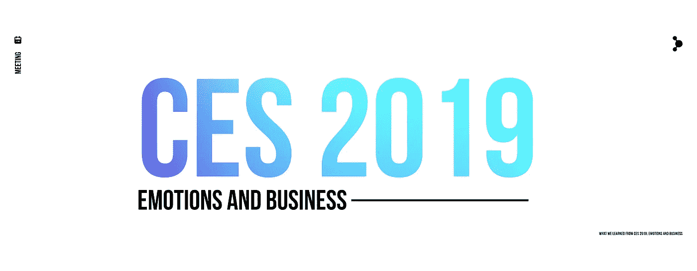
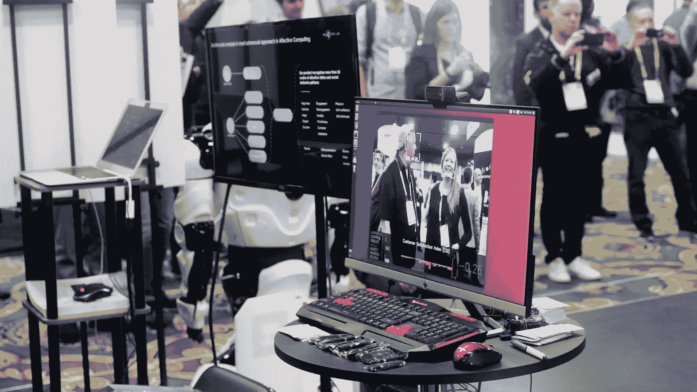
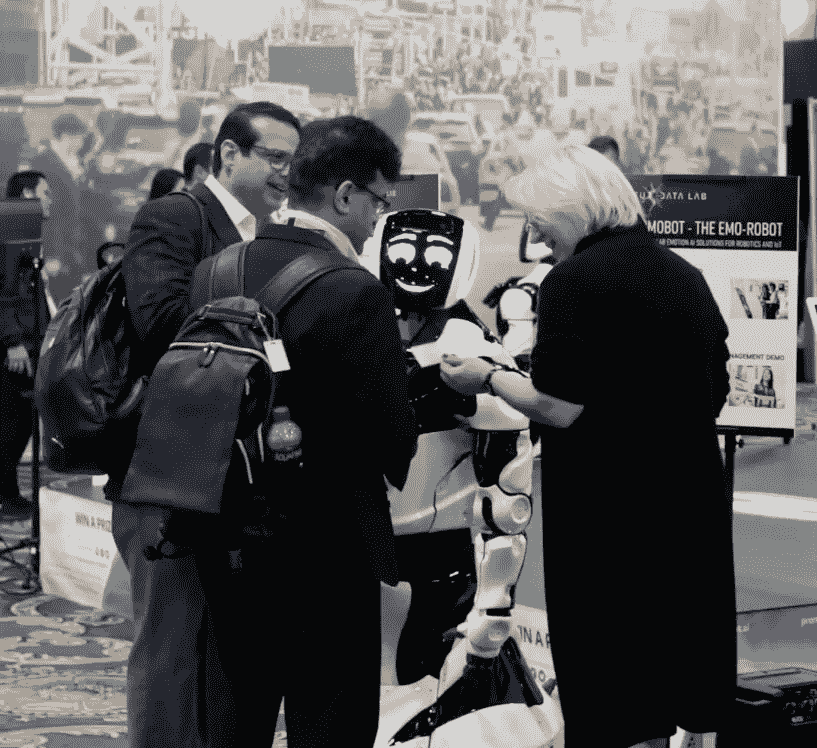
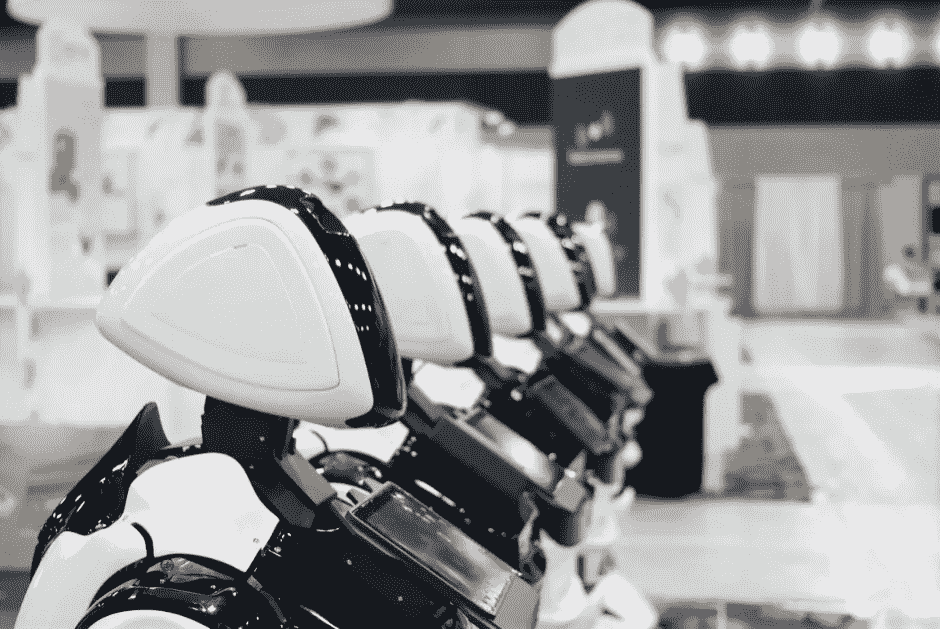
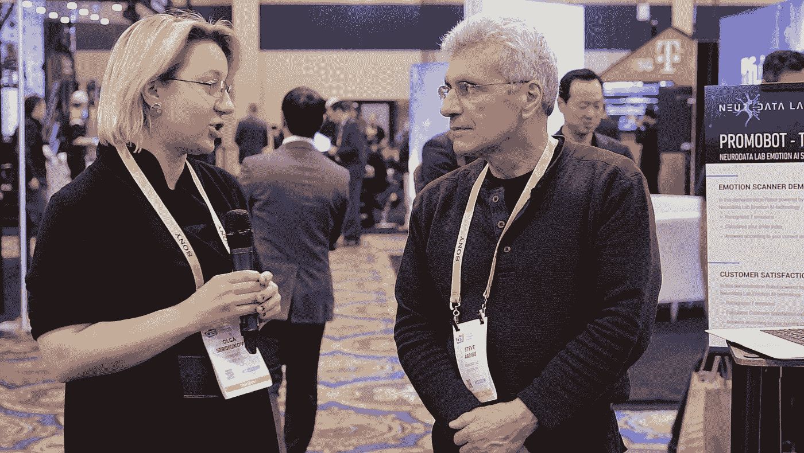

# 我们从 CES 2019 学到了什么:情感和商业

> 原文：<https://medium.datadriveninvestor.com/what-we-learned-from-ces-2019-emotions-and-business-10243ba6b10d?source=collection_archive---------16----------------------->

最近结束的 CES 2019 是世界上最大的消费技术展，也是最大的盛会。这是神经数据实验室的第一个这样的国际商业论坛，它满足并超过了我们最大的梦想。在这极其忙碌、充满活力和富有成效的四天里，我们能够与国际商业和媒体社区的代表交谈，收集各种有价值的见解，并了解基于情感人工智能的技术可以解决的商业问题。

在这篇文章中，我们将分享我们的一些收获，概述情感技术最突出的趋势，并总结我们在 CES 2019 上的经验。

[这里](https://gritdaily.com/ai-emotion-bots/)和[这里](https://venturebeat.com/2019/01/18/ces-2019-showed-us-computer-vision-will-go-big-this-year/)你可以阅读一些关于 Neurodata Lab 的情感 AI 的独立见解。您还可以在[的这两段](https://youtu.be/Q-kV6mSE_jk) [视频中，亲自了解我们展位的参观者对我们解决方案的看法。](https://youtu.be/sp7Wk_UoMOI)

# **我们为 CES 2019 带来的 Emotion AI 解决方案**

对于这次重要的国际会议，我们选择提出以下两个解决方案:

[**面向客户体验管理的实时情绪分析**](https://business.neurodatalab.com/cx)

在简单的网络摄像头和麦克风的帮助下，Neurodata 实验室的实时情绪分析跟踪了来到我们展位的人们的情绪和反应。该技术分析输入的视频和音频数据，并使用它来计算每位客人的客户满意度指数。

在商业环境中应用，该解决方案可以分析客户情绪或员工表现，并对数据进行实时人工智能分析。这是电子邮件调查、神秘顾客或“服务评级”按钮等商业工具的更智能、更公正的替代选择——这些做法往往主观且不一致，往往无法产生准确和有意义的数据。

At the booth: Neurodata Lab’s real-time emotion analytics for customer experience management

[**面向机器人和物联网的情感 AI 商业应用**](https://business.neurodatalab.com/robotics)

同样的技术可以用在办公室和销售点，那里的员工是机器人。Neurodata Lab 的云技术集成到了我们的合作伙伴 Promobot 的服务机器人中，该机器人也在 CES 展台上展示，使其能够同时识别与其交谈的几个人的情绪，相应地改变其反应，并测量这些人对互动的满意度。

凭借其基于分析的情绪实时计算客户满意度指数的能力，该系统可以持续评估机器人提供的服务质量——这是一项对企业具有特殊价值的功能。同时，机器人还可以通过其后续的自动分析和警报系统收集客户对特定办公室或销售点提供的服务的反馈。

At the booth: Promobot the Emo-robot with Neurodata Lab’s Emotion AI

# **来自企业的见解——人工智能情感的下一步是什么**

我们能够与 2000 多人交谈，并向他们展示我们的解决方案是如何工作的。十分之一的人给我们留下了名片，许多不同行业的公司都对我们的技术表现出浓厚的兴趣。这是一个与我们的目标受众建立联系并深入了解他们的业务需求和关注点的绝佳机会。就情感技术而言，我们观察到了几个明显的趋势:

**全天面对面服务仍然是客户旅程图**中的关键点之一，尤其是在银行和金融服务、酒店&旅游、零售、电信和其他以服务为导向的垂直行业。我们收到了沃尔玛、Citgo 石油公司、美国银行、本田、法国兴业银行等公司巨头的请求。似乎可以肯定的是，现在存在并将继续存在对基于情感人工智能的解决方案的需求，这些解决方案能够通过收集客观的实时反馈和听到客户的声音来分析客户情感和管理客户体验。

随着服务机器人行业的增长，**公司不仅对机器人本身感兴趣，而且对机器人将在销售点和服务办公室扮演的特定业务角色感兴趣**。跟踪机器人的表现并评估其商业价值的能力可能是客户购买决策的转折点。比起未来的技术，商界更感兴趣的是今天已经可用的实时情绪分析。

尽管如此，企业巨头的创新中心确实着眼于未来。他们正在寻找有效的方法来改善客户与产品的互动，使产品更直观，并彻底掌握客户对他们创作的态度和情感。他们的一些目标已经可以在现有情绪分析的帮助下完成，但随着未来的技术变得更像人类，这将肯定成为一个成熟的现实。

Promobot’s service robots at CES 2019

# CX 工业的现状

以下是神经数据实验室首席营销官兼业务发展负责人 Olga Serduikova 在 CES 2019 上代表该项目对行业现状的看法:

Olga Serduikova, Neurodata Lab, and Steve Ardire, Emotion AI Advisor

> “近年来，CX 管理已经成为许多公司的热门话题。今天的竞争与其说是关于产品或价格，不如说是关于企业能够提供的客户体验。新型客服不断涌现，如服务机器人、智能镜子、店内智能货架等。，这无疑给了公司吸引和留住客户的新机会。收集和分析数据、监控和控制客户体验的新方法正在出现。其中许多方法属于认知服务领域，并使用人工智能技术，包括文本识别、计算机视觉、情感人工智能。这为企业进入新的客户服务和 CX 水平开辟了许多令人兴奋的新机会。”