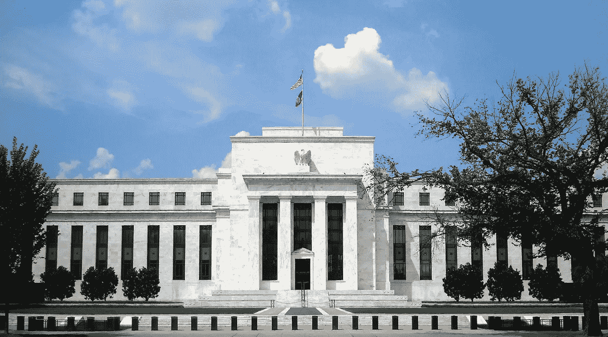
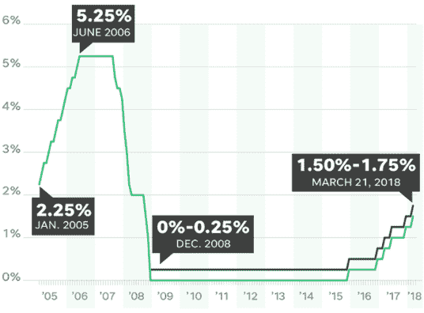

# 我们比关税更应该关心的是什么

> 原文：<https://medium.datadriveninvestor.com/what-we-should-care-about-more-than-tariffs-c72d38e1bc97?source=collection_archive---------4----------------------->

讨论“紧张”和“摇摆不定”的股票市场的头条新闻占据了每一份金融和商业杂志的头条，经济和金融记者用锐利的目光注视着股票市场的每一个动作。

特朗普的贸易关税和中国相应的报复引发了轩然大波，称潜在的贸易战是市场曲折发展的基础。

贸易战——无疑会导致消费者价格指数大幅上升——不太可能发生。贸易战真正开花结果的概率很低。

无论如何，市场停滞不前的令人不安的部分不是贸易战——而是迄今为止我们还没有从自然或市场中学到的东西。

## **加州森林大火&我们如何制造它们**

六个月前，我们看到北加州遭遇毁灭性的火灾，42 人死亡，近 7000 栋建筑被烧毁。然后，在 12 月，南加州目睹了加州历史上最大的火灾。

加州怎么会自燃成那样？

[预防森林火灾 100 多年](https://www.hcn.org/issues/49.21/wildfire-what-fire-researchers-learned-from-northern-california-blazes)。野火的扑灭阻止了建筑和清理的自然循环。小范围的局部野火在自然界庞大而复杂的抗脆弱系统中发挥着作用。野火清除了森林中的碎片和过度生长——阻止它们只会产生危险的堆积，随时可能着火。

大自然是一个动态的、抗脆弱的生态系统，它有无序的趋势——保持稳定的唯一方式是通过不稳定性和不可预测性。让小的野火燃烧是防止更大的、毁灭性的野火蔓延和燃烧的关键，这种大火会夺去人的生命，摧毁我们的家园。

我们需要小火来防止大火。

## 美联储&害怕小火灾

加州野火是一个宝贵的教训，告诉我们如何试图过度设计动态的、抗脆弱的系统，这些系统需要一定程度的混乱和波动，以便保持稳定，尽可能分散最少的伤害。

当美联储压低利率时，它会造成一种失衡——就像扑灭野火一样。人们受到激励去借款，银行发放信贷，使得商业投资看起来有利可图，而在其他情况下，商业投资看起来是有利可图的，这造成了全面的不当投资。越多的企业进入市场，而这些企业在预先支付较高的现金利率(时间偏好)时无法做到这一点，或者无法持续支付较高的利率，它们就必须向个人和企业支付更多的钱，导致价格上涨，消费品价格也随之上涨。繁荣不可能永远持续下去——经济将需要从市场中清除过剩的公司，正如我们在 2008 年信贷危机中看到的那样，导致了毁灭性的破产。这些泡沫像森林大火一样烧毁了经济，而人类已经阻止了多年。

频繁而适度的市场波动和由市场自然设定的利率将企业从经济中分散出来，使其处于一个更可预测、更健康的时间表中，这可能被解释为对一些人来说更可怕或“风险更大”。然而，这些市场调整在很大程度上是独立的，它们的影响是小的和局部的。

虽然美联储预测今年将加息三次，但他们仍然只预计到 2019 年底利率将为 2.9%。这是一件大事——在接下来的一年零九个月里，我们不会有 2.9%的利率(仍然非常低)。

*Graph of Federal Fund Rates from usatoday.com*

自 2008 年以来，利率一直处于这么低的水平(低于 2%)。自上次崩盘以来，我们已经进行了 10 年的灭火工作，看起来他们在 2020 年之前甚至没有打算达到 3%。

不管有没有美联储设定的人为利率，市场都会自然调整，但过去十年来，利率水平一直处于历史低位，为 1965 年以来的最低水平。

更不用说千禧一代是第一代甚至不知道什么是利率*的人*，因为他们成年后的大部分时间都生活在一个无息的世界里。不管这是容易的方式还是困难的方式，对利息和基本经济思想的再教育就在我们的未来。

*我们能坚持多久直到下一次火灾？*