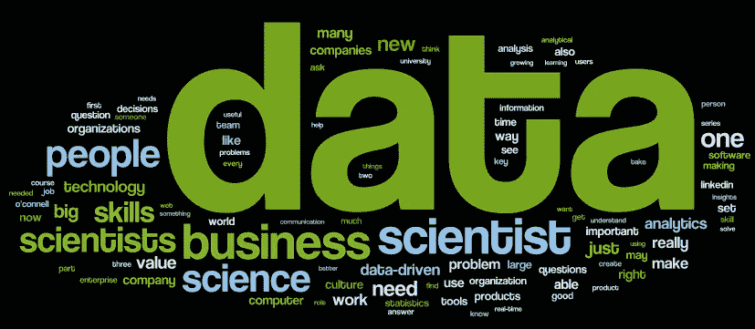

# 2022 年的数据科学家会是什么样子？

> 原文：<https://medium.datadriveninvestor.com/what-will-a-data-scientist-look-like-in-2022-d6ad3a1f4a9d?source=collection_archive---------19----------------------->

这是一个非常棘手的问题，为了回答这个问题，我首先需要确定我是否知道数据科学家今天是什么样子，或者 3 年前是什么样子！虽然我经营着一个培训分析人员和培养数据科学家的机构，但我一直觉得这个术语非常有趣。看看标题为— ***谁是数据科学家* t** —或者更糟—**什么是数据科学家** 的文章数量。因此，我们的任务是描述 2022 年数据科学家的样子，那时你还不知道这种动物，也不知道它是否存在。

事实上，《哈佛商业评论》在 2011 年宣称——数据科学家是 21 世纪最性感的工作。这使得一些组织通过将他们的 BI 和分析单元重新命名为数据科学来增加他们的性感商数。这也使得几种物种追逐任何贴有数据科学标签的工作。我们都想被认为在做性感的事情——所以没什么好惊讶的。

慢慢地，一个数据科学家所向披靡的形象被勾勒出来了……尽管有点粗略——一个天赋异禀的人，同时擅长技巧、技术和商业知识。自 2011 年以来，我们一直在[***Praxis***](http://praxis.ac.in/)开展这一项目，每一批招聘人员都变得越来越长，越来越令人望而生畏。这就像一个玻璃碗，你把写有你愿望的纸片扔进去。组织需要的全栈数据科学家是集超人蝙蝠侠和钢铁侠于一身的人。我们看着 JD，然后看着候选人，想知道为什么对这些可怜的不知情的灵魂有这么多的期望。今天的摇滚明星数据科学家理解并定义业务问题，访问正确的数据，对其进行正确的处理，使用正确的技术，建立惊人的模型并讲述故事。问题是——这个物种存在吗？

***未来的数据科学家会是什么样子？它们与我们刚才讨论的有多大不同？我想在这里挑选 4 个趋势:***

**1。公民数据科学家** —数据科学将从极客阶段进入商业阶段，在商业阶段，工具变得更加用户友好，并提供在预定义用例中工作的成熟算法。随着更多面向中小型企业的交钥匙解决方案、更多点击式访问、更高的自动化程度以及软件中嵌入更多领域专业知识，它将变得越来越易于使用。我们看到的是这个领域的商品化。因此，随着工具变得更容易获得和使用，我将看到进一步的商品化。越来越多的人和公司将能够使用它们，并能够创建非常先进的分析和预测模型，而无需成为统计或机器学习专家。最终，我认为中央数据科学组织将会消失，每个业务部门都将拥有大型专门的数据科学团队。当数据科学成为组织内部的主要决策工具时，它将取得成功。当需要做出决策时，管理层的第一反应是问“数据科学怎么说？”这种民主化将做两件事——它将成倍增加从事重要工作的公民数据科学家队伍；它还会让极客和专家做更高级的东西。一只就够了——现在我们有了两种这种难以捉摸的动物。

**2。专业化—** 让我在这里提出一个松散的类比。数据科学对于统计学和数学就像工程学对于物理科学一样。就像蒸汽机的发明和随后的工业革命应用科学知识创造了作为性感学科的工程学一样，计算机革命创造了数据科学家——一个可以在技术生态系统中应用科学的统计学家，这使她能够做迄今为止不可能的事情，进一步类推，随着技术变得更广泛和更深入，工程学变得越来越专业化——今天我们没有工程师——我们有机械工程师、化学工程师和电气工程师。继续类比，我预计超人数据科学家将赋予几种形式生命——跨技术和/或领域的专业化。数据世界擅长为角色起聪明的名字，所以我们可能会看到欺诈数据科学家、风险数据科学家和网络安全数据科学家，仅举几例。我们还将有数据可视化器、机器学习专家、人工智能明星。

**3。领域—** 我的下一个建议是，到 2020 年，大量的算法和平台将会完成；数据科学家将会比现在更接近业务。当今的数据科学家正在研究其他人不知道或不精通的工具和技术。这使得典型的技术出身的数据科学家与商业保持一点距离。一旦这些算法中的一些被模板化和菜单驱动，数据科学家的焦点将转移到业务方面。所提问题的质量将决定所获见解的质量和相关性——所提问题的质量将取决于她对该领域的了解程度。我们将进入一个以功能或垂直应用为重点的时代，例如，我们能否为小额贷款农民开发一个应用程序，不仅可以预测还款能力，还可以预测贷款发放后一段时间内的收款情况。这需要对不同作物和地域的耕作有深入的了解，并理解所有可能影响农民支付能力的环境因素或变量。

**4。数据**——这让我想到了下一点。更深入的领域知识和更广泛数据源的可用性将推动下一轮差异化，即选择正确指标和正确数据源的能力。我记得 DJ Patil 在最近的一次演讲中说过，物联网实际上是物的数据。2020 年的数据科学家必须成为数据大师——不是从技术的角度，而是从理解、识别和访问正确的数据源的角度，并将其整合在一起以丰富分析。在农民融资的例子中，考虑到农民种植的作物和使用的土壤，一段时间内的天气甚至气候数据对于评估特定地理区域农民的财务健康状况至关重要。

总的来说，构成当今数据科学家核心技能的分析和验证部分将在适当的时候变得越来越自动化。她需要用更深层次的领域和数据知识来补充她的分析技能——这些特定领域的知识将导致数据科学领域的专业化。超人将赋予一个英雄团队以生命，他们将提供专注的商业解决方案。DIY 数据科学家将会越来越多，而更高级的专业数据科学家将会越来越少。

因此，数据科学家将不得不在提出与企业相关的问题和成为一流的**卡格勒之间保持平衡。** *数据科学家将通过提出正确的问题、找到正确的数据来源以及确定正确的数据分析方法来增加价值。*此外，数据科学家将逐渐与领域专家和客户进行更紧密的接触。

本文由[**Praxis 商业基金会**](https://www.linkedin.com/in/charanpreet-singh-b880692/?originalSubdomain=in) **[***联合创始人兼董事 Charanpreet Singh***](http://praxis.ac.in/) 教授撰写。**