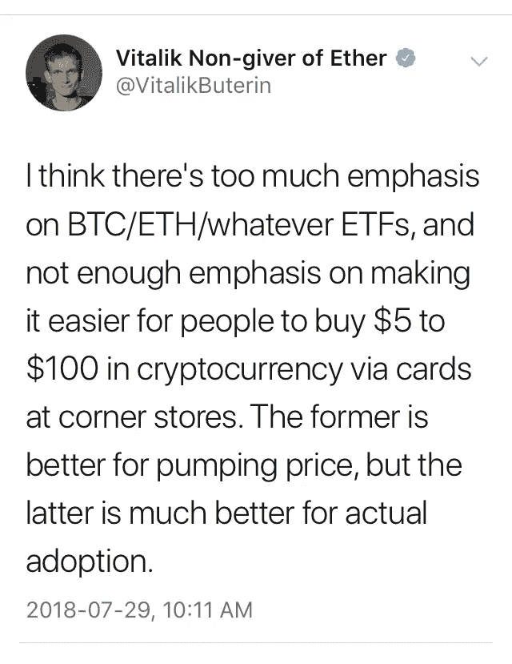
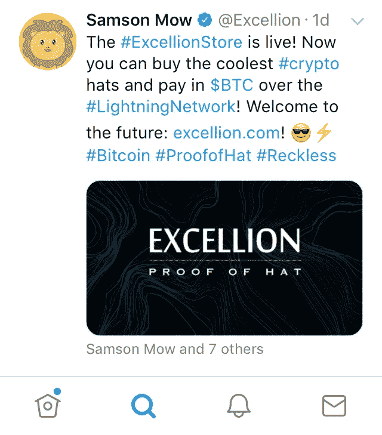
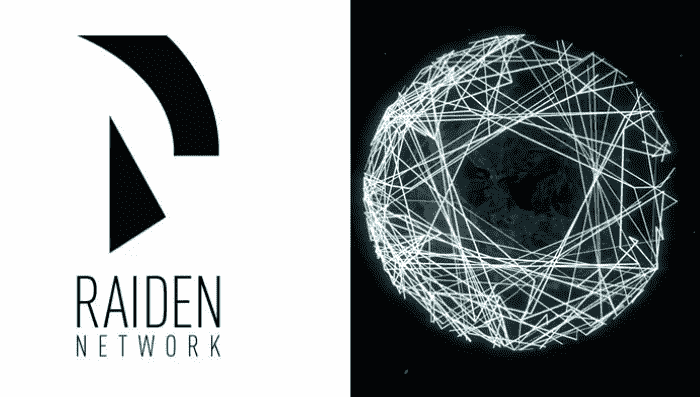
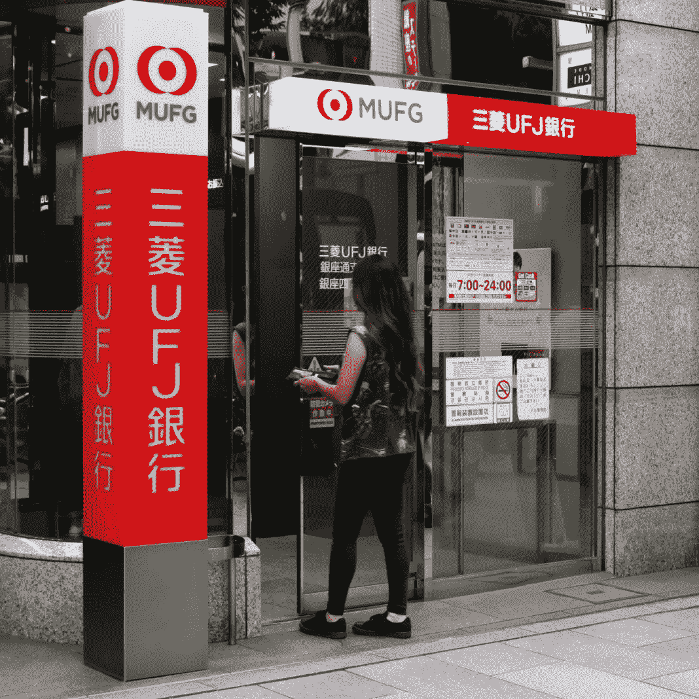

# 引发加密货币大规模采用的关键因素是什么——小额支付还是交易所交易基金？

> 原文：<https://medium.datadriveninvestor.com/what-will-be-the-linchpin-that-triggers-the-mass-adoption-of-cryptocurrency-micropayments-or-8cbeddff8b34?source=collection_archive---------1----------------------->

最近有很多关于美国证券交易委员会批准的比特币支持的交易所交易基金(ETF)将如何打开机构资金进入加密货币世界的闸门，从而使加密货币合法化的谈论。ETF 对投资者来说很棒，但它对加密货币的日常使用和大规模采用有什么作用呢？

Vitalik Buterin 最近在一条推文中对此发表了评论，他说:“我认为人们过于强调 BTC/ETH/无论什么 ETF，而没有足够重视让人们更容易在街角商店通过卡购买 5 美元到 100 美元的加密货币。前者更有利于提升价格，但后者更有利于实际采用。”

当我分享我对加密世界的热情并试图向某人解释如何开始时，我意识到这是多么复杂。随之而来的是各种各样的障碍；可以说是秘密体操。什么是数字钱包？这种交换采取什么支付方式？我需要多久才能通过验证并购买？我需要买多少才能开始？收回常规美元(法定货币)需要多长时间？我能在哪里购买少量的？什么交易所有特定的替代硬币？在哪个国家你需要开一个银行账户才能得到那枚代用币？最后， ***哪里可以花*** ？

在哪里可以花？对我们北美人来说，这是一个很难回答的问题。虽然在亚洲的一些零售商店和一些在线零售商接受 crypto 是件好事，但当我在北美这里购买咖啡时，这并没有什么好处。

加密货币正变得越来越主流，但简单的事实仍然是，我们仍然很难用它来满足我们的日常需求。

**比特币交易:**

[caption id = " " align = " align center " width = " 756 "]

图片提供:维基百科[/caption]

***扩展性***

可扩展性，即一项技术在保持效率的同时能够发展得多好，是推迟加密货币大规模采用的最大问题之一。用户数量的增长和每日交易量的增加无意中降低了网络速度，导致交易时间变慢。

如果加密货币想要与 Visa、Paypal、Mastercard 等竞争，它们需要加快交易时间，同时保持交易费用在支付系统格局中的竞争力。

> *“在接下来的五年里，我们将看到零售领域的大规模采用”Blockstream 的 CSO Samson Mow*

***链外解决方案***

离线交易是指发生在区块链境外的交易。这是一个点对点的支付渠道，允许快速的离线支付，仍然由母公司区块链担保。

***闪电网***

*闪电网络的工作原理是在比特币的区块链上增加一个额外的层，并允许用户在这个额外的层上创建任何两方之间的微支付通道。只要需要完成交易，这些支付渠道就存在，是点对点的，允许交易几乎立即发生，费用很低或不存在。*

*Blockstream 的 Lightning Network 正在与其他行业领导者合作，创建一个比特币小额支付系统，以低费用支持大量小额即时支付。*

*Blockstream 的 Samson Mow 最近在一条推文中宣布，在 http://www.excellion.com[使用闪电网络与 BTC 一起购买非常酷的加密帽子](http://www.excellion.com/)*

**

*Lightning 开发者 Jack Mallers 在 Lightning Labs 的 lnd 软件上创建了免费的 Zap Lightning 钱包，他将很快发布移动和桌面的消费者应用程序，使普通人更容易使用 Lightning。*

****雷电网络****

*作为以太坊区块链的补充，雷电网络是一种链外扩展解决方案，可与任何 ERC20 令牌配合使用，实现近即时、低费用、可扩展的支付。*

*雷电网络(Raiden Network)是以太坊的比特币闪电网络版本，其目标是为全球用户的日常购物提供可扩展的全球支付系统。*

**

*其他可扩展性解决方案正在开发中，包括[分片](https://en.wikipedia.org/wiki/Shard_(database_architecture))和[等离子](https://plasma.io/)，看到哪种扩展解决方案将占据主导地位只是时间问题。*

****各大银行测试自己的密码****

*金融巨头了解区块链技术的优势。世界最大的金融集团之一三菱 UFJ 金融集团最近开始试验自己的 MUFG 硬币，以探索“区块链技术如何应用于日常金融需求，如取款、存款、交易和小额支付。*

*MUFG 硬币旨在通过提供一种非常有用的货币，首先提供货币功能，试图解决数字货币目前面临的问题。*

*三菱 UFJ 金融集团创建了一家便利店，员工可以使用 MUFG 硬币进行小额支付，并在智能手机上显示二维码。除了在员工便利商店付款之外，硬币还可以用来在同事之间换钱。MUFG 预计，到 2019 年，约有 10 万名账户持有人将参与大规模试验。*

**

****ETF****

*交易所交易基金(ETF)类似于共同基金，因为它们是股票或债券的多样化投资组合，但像股票一样交易——全天以市场价格交易，而共同基金销售在交易日结束时以相同的价格对所有投资者执行。*

*ETF 允许投资者投资于广泛分散的投资组合，而不必购买单个股票或债券，通常具有更高的每日流动性，并且通常比共同基金的运营成本更低。*

*业内许多人认为，SEC 批准的比特币支持的 ETF 将通过将一波又一波机构投资者引入比特币舞台，为加密世界带来合法性。*

*比特币最著名的传播者之一安德烈亚斯·安东诺普洛斯不同意这种观点。*

> *“我要戳破你的泡沫。我知道很多人真的希望看到 ETF 的出现，因为“为了月亮和羊！”但我认为这是个糟糕的主意。”—安德烈亚斯·安东诺普洛斯*

*Antonopoulos 认为，比特币支持的 ETF 可能会打开机构资金的闸门，但它的实施可能会导致更多的集中化和可能的市场操纵，从而破坏让比特币如此引人注目的原则。*

*观察数字货币的未来将会是一件令人兴奋和非常有趣的事情。与此同时，我的母亲不再想听到任何这种加密废话，直到我可以提供一个坚实的支付选项，他们在宾果游戏中接受。显然，她赞同维塔利克·布特林的观点，即小额支付是通往启蒙或大规模采用的道路。*

*奥黛丽·奈斯比特*

*[螺旋营销&公关](http://www.spinspirational.com)*

*Linkedin 上的奥黛丽·奈斯比特*

*[@ audreynesbit 11 在推特上](https://twitter.com/AudreyNesbitt11)*