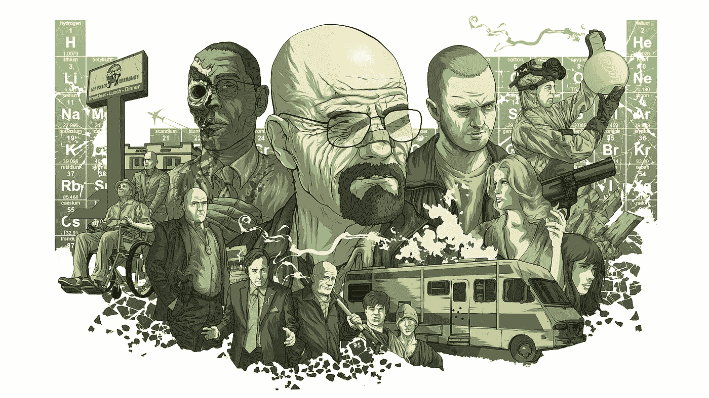
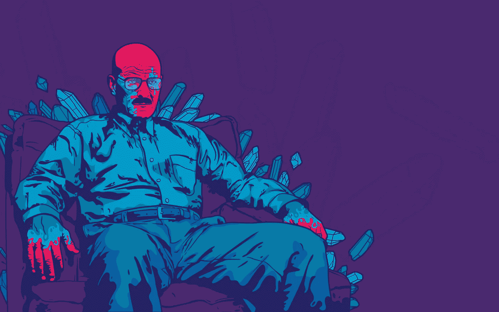

# 《绝命毒师》会教给你什么典型的 MBA 课程不会教给你的东西

> 原文：<https://medium.datadriveninvestor.com/what-will-breaking-bad-teach-you-that-a-typical-mba-program-will-not-5d1beea73c8e?source=collection_archive---------25----------------------->

《绝命毒师》被评为有史以来最好的电视剧之一。2013 年获得了 42 项艾美奖提名和 10 项艾美奖奖，其中包括最佳剧集，不难看出其中的原因。我是在《绝命毒师》第四季的时候认识的。几乎立刻，我就迷上了它。我狂看了四季，但不是因为典型的原因。不用说，写作、表演、导演和剧本都是无可挑剔的，但我却因为另一个原因迷上了它。

你看，2012 年是我对成为一名企业家的想法有所准备的一年，我在《绝命毒师》中看到了一家典型的初创公司可能面临的所有挑战。下面是我对《绝命毒师》的创业分析。

AMC，这个接演《绝命毒师》的电视网，在《绝命毒师》走红之前是一个相对不为人知的名字。毕竟，一个只播放好莱坞电影重播的基本有线频道并不完全是人们心目中的首选。这部剧的前提是一个化学学校的老师变成了一个毒枭，这一定引起了很多人的惊讶。但是，如果冒险让你害怕，你就不是一个企业家。创新是一个浪费的过程。要真正确定这个想法，不仅要有新奇的因素，还要有商业价值，需要反复试验。当《绝命毒师》的创作者向 AMC 提出这个想法时，电视上还没有这样的节目。它真的填补了一个空白，因为这是一个典型的戏剧系列的非传统的外观。像许多其他节目一样，《绝命毒师》不是一部典型的警察、医院或律师剧。此外，随着该剧的展开，它设法让观众着迷，因为沃尔特·怀特的角色越来越黑暗。想象一下蝙蝠侠逐渐变成小丑！这是一个我愿意花钱看的节目。

好人变坏很有意思。一个好角色的系统崩溃和向坏角色的转变令人感到奇怪的满足。他们说恶棍制造故事。我同意。要有一个可爱的好人，让坏人成为故事的中心。我们最近在复仇者联盟 3：无限战争看到了这一点。从写作的角度来看，让你的反派人物魅力四射，让男主角随机应变，你就拥有了一个完美的阴阳动态。一个完美的反派是拥有一个伟大英雄的必要因素。

像许多初创公司的创始人一样，沃尔特·怀特也找到了一种方法来拓展他的技能，并运用这些技能来获得最大的投资回报。沃尔特·怀特没有把他在化学方面的专业知识应用到当老师上，而是用它来制造冰毒，这让他在两年内建立了一个价值数百万美元的企业。现在，当然，我不是鼓励任何人开始制造冰毒，但重要的是将你的技能引导到一个你可以赚取最大回报的途径。正是由于这个原因，教育只能达到有限的目的。教育可能会让你踏入新行业的大门，但如何运用这些技能真正成长取决于你自己。我没有正式学习过电影制作，但鉴于我的金融和管理背景，我非常擅长控制成本，这让我获得了健康的投资回报。

一个企业家，特别是当他或她正在创业时，保持低成本是必须的。大量的生产力和优化来自于仔细的规划。沃尔特·怀特过于小心地预测可能伤害他的情况，并总是准备好行动计划，为他说一天。在沃尔特建立毒品帝国的努力中，杰西·平克曼是一个完美的助手。

在节目中，沃尔特·怀特强调他不会在产品质量上妥协。这使得冰毒具有独特的蓝色外观，因为其纯度接近 100%。这种对质量的高度关注是蓝色冰毒持续畅销的原因。创业也是如此。一个想在过度拥挤的市场中脱颖而出的初创公司必须找出自己的竞争优势，这将使他们能够获得更高的价格。要在当今竞争激烈的市场中取得成功，独特的定位是必不可少的。发挥你的优势很重要，但与此同时，你需要不断提供一致的价值，以保持客户忠诚度和品牌回忆价值。世界各地的公司已经接受了他们行业的动态特性，并一直在设计创新的方法来获取更大的市场份额。

继续，我们来谈谈联合创始人。在剧中，沃尔特·怀特与杰西·平克曼合伙建立了一个冰毒企业。然而不幸的是，沃尔特没有给杰西应有的尊重，也没有把他当作平等的伙伴。沃尔特认为杰西只是个跑腿的。这使他们的关系变得紧张，并多次经受考验，在此过程中影响业务。重要的是选择能带来互补技能的合作伙伴，并将他们视为平等的合作伙伴。在我即将开始的创业中，有很多联合创始人称赞我的冒险和好色心态。

所以对于所有的粉丝们，我希望你们喜欢阅读《绝命毒师》的独特视角。如果你发现更多与《绝命毒师》相关的创业理念，请在回复中分享。

***订阅*** [***【灵感】***](https://apple.co/2QnjduI) ***，由***[***Aalok Rathod***](https://www.facebook.com/aalok.rathod)***主持，这是一个以企业家和年轻领导者为特色的播客，分享他们如何成功的故事。获得*** [***的 9.99 美元会员资格的五折优惠***](https://apple.co/2QnjduI) ***。***

***订阅套餐详情在此:***[**https://bit.ly/2PFDUS8**](https://bit.ly/2PFDUS8)