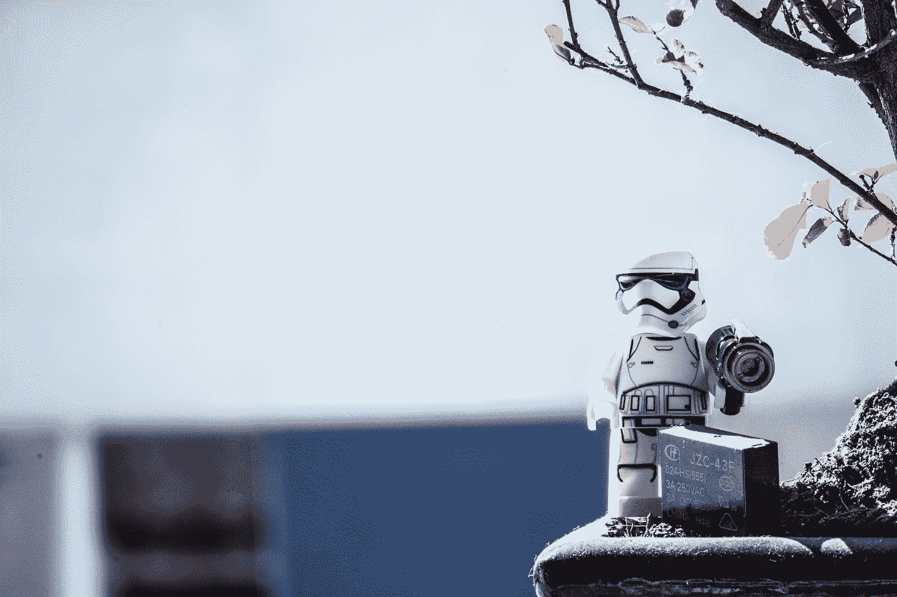

# 如果计算机变得比人类更聪明，会发生什么？

> 原文：<https://medium.datadriveninvestor.com/what-will-happen-if-computers-become-more-intelligent-than-humans-82385ca3035?source=collection_archive---------7----------------------->

Photo by [Ciprian Boiciuc](https://unsplash.com/@ciprian?utm_source=medium&utm_medium=referral) on [Unsplash](https://unsplash.com?utm_source=medium&utm_medium=referral)

当我开始思考这个问题时，我的脑海中出现了很多想法，例如 IA intelligence，机器人在日本的酒店，甚至像终结者，I 机器人和黑镜这样的科幻电影/电视剧。但是在把一切混为一谈之前，让我们先从基础说起:什么是人类智能？

> 根据《大英百科全书》，*人类智能是由从经验中学习、适应新情况、理解和处理抽象概念以及利用知识操纵环境的能力组成的心理素质*。

根据这个定义，我们可以猜测，我们离计算机变得比我们更聪明已经不远了，无论如何，我认为这个定义缺少了一个重要的概念“意识”，而拥有意识是定义人类智能的关键。

回到这个问题，我们有 3 种可能的情况:

## **人类的末日**

如果机器人比人类更聪明，那么它们会有自我意识，所以它们会想要生存和进化。根据历史上人类的行为和人性，他们可以得出结论，我们对这个环境是危险的，所以解决问题的最好办法是灭绝我们。

## **人类作为宠物**

同样的理论，但结论不同。他们意识到我们不如他们聪明，这就是为什么我们不能解决基本问题(如资源分配)，而且，他们知道我们是他们的创造者，所以他们与我们有某种共鸣。他们认为他们拥有我们的生活，所以他们帮助我们解决不可能的问题。他们对我们有某种感情，他们希望看到我们处于良好的状态。此外，他们欣赏我们用我们的极简智慧创造性地创造抽象事物的方式，比如艺术、爱情和情绪。我们太可爱了！

## **与机器人的联盟**

与“作为宠物的人类”有相同的背景，但中间有一些有趣的东西。机器人意识到他们的局限性，他们需要其他物种来实现他们的目标，而人类是完美的目标:他们足够聪明来完成一些任务，作为交换，机器人可以解决人类无法解决的问题。这样，他们就有更多的机会进化。

总之，很难猜测会发生什么，全景很大，这将在不到 50 年内很快出现。一些新的问题出现在我的脑海里:现在阻止还来得及吗？是的，我想是的。所以，让我们积极一点，最后，一切都会好的…如果没有，我希望不要活着！