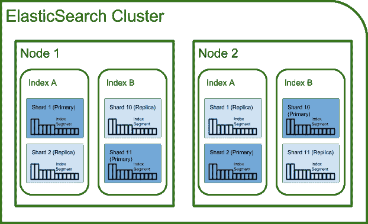

# 你能用 Elasticsearch 做什么

> 原文：<https://medium.datadriveninvestor.com/what-you-can-do-with-elasticsearch-506aa147d939?source=collection_archive---------1----------------------->

## Elasticsearch is 及其用例简介

Image credit: [https://miro.medium.com/max/875/1*BmvPfSSm2G8C-khX1rhCGg.png](https://miro.medium.com/max/875/1*BmvPfSSm2G8C-khX1rhCGg.png)

Elasticsearch 是当今最受欢迎的日志分析平台 ELK Stack 的核心。在这篇文章中，我将解释什么是 Elasticsearch，以及 Elasticsearch 的用例是什么。

# 什么是 Elasticsearch？

> Elasticsearch 是一个分布式、开源的搜索和分析引擎，适用于所有类型的数据，包括文本、数字、地理空间、结构化和非结构化数据。

## Elasticsearch 是一个开源项目

Elasticsearch 建立在 Apache Lucene 之上。它由 Elasticsearch N.V .于 2010 年首次发布，Elasticsearch 是一个用 Java 开发并由 Elastic 管理的开源项目。代码库包括来自 Elastic 内部和外部开发人员的贡献。

Elasticsearch 支持多种语言，官方客户端可用:Java、JavaScript (Node.js)、Go、。NET (C#)、PHP、Perl、Python 和 Ruby。它可扩展到数 Pb 的结构化和非结构化数据，并使用反规范化来提高搜索性能。

在 Apache 2 许可下，可以免费使用 Elasticsearch 的开源特性，在 Elastic 许可下，还可以使用其他免费特性。付费订阅提供对支持以及高级功能(如警报和机器学习)的访问。Elasticsearch 被许多大组织使用，如维基百科、卫报、StackOverflow、GitHub 等。

Elasticsearch 是 ELK 堆栈的核心组件，因为它具有简单的 REST APIs、分布式特性、速度和可伸缩性。

# 麋鹿栈

Image credit: [https://mhamadelitawi.com/wp-content/uploads/2019/12/elkWall.png](https://mhamadelitawi.com/wp-content/uploads/2019/12/elkWall.png)

“ELK”是三个开源项目的缩写。

1.  Elasticsearch:搜索和分析引擎
2.  Logstash:服务器端数据处理管道，它同时从多个来源获取数据，对其进行转换，然后将其发送到一个“stash ”,如 Elasticsearch
3.  Kibana:在 Elasticsearch 中用图表和图形可视化数据

# 后端组件

Image credit: [https://raw.githubusercontent.com/exo-addons/exo-es-search/master/doc/images/image_05.png](https://raw.githubusercontent.com/exo-addons/exo-es-search/master/doc/images/image_05.png)

## 文件

文档是可以被索引的基本信息单元。Elasticsearch 存储已经序列化为 JSON 文档的复杂数据结构。这类似于表 RDBMS 中的单个 raw。每个文档都属于一种类型，驻留在一个索引中，并与一个名为 UID 的唯一标识符相关联。

## 索引

索引是具有相似特征的文档的集合。索引有一个唯一的名称，在执行索引搜索、更新和删除操作时引用该索引。索引类似于 RDBMS 中的数据库。

## 结节

它指的是 Elasticsearch 的单个运行实例。节点是存储数据并参与集群的索引和搜索功能的单个服务器。节点由名称标识，默认情况下，名称是启动时分配给节点的随机通用唯一标识符(UUID)。

## 碎片和复制品

该索引还使用碎片的概念来提高性能。您可以将单个索引分成几个部分，并托管在集群中的任何节点上。每个碎片都是一个功能齐全的独立索引。碎片允许水平分割数据卷，也可能在多个节点中并行化操作，从而提高性能。

还可以通过将索引的多个副本制作成副本来使用碎片，这在云环境中有助于提供高可用性。

Image credit: [https://codingexplained.com/wp-content/uploads/1-1024x591.png](https://codingexplained.com/wp-content/uploads/1-1024x591.png)

## 串

集群是一个或多个节点的集合，这些节点共同保存您的全部数据，并提供联合索引和搜索功能。Elasticsearch 在分布式环境中运行:通过跨集群复制，辅助集群可以作为热备份投入运行。

我希望您对后端组件有所了解。我们来看看 ELasticsearch 有哪些用例。

# Elasticsearch 是一个 NoSQL 数据库

Elasticsearch 以类似文档的格式存储数据，文档以 JSON 格式序列化。这增加了它的非关系性质，因此它可以用作 NoSQL/非关系数据库。

## 无模式/用户定义的模式

Elasticsearch 也支持无模式和用户定义的模式。如果不指定映射，Elasticsearch 在索引过程中检测文档中的新字段时，默认情况下会动态生成一个映射。

除此之外，您还可以定义文档的模式。Elasticsearch 中的模式是一个映射，它描述了 JSON 文档中的字段及其数据类型，以及它们在 Lucene 索引中应该如何被索引。

# Elasticsearch 是一个全文搜索引擎

Elasticsearch 是一个基于 Apache Lucene 的全文搜索和分析引擎。传统的 SQL 数据库管理系统不是为针对大量数据的全文搜索而设计的。Elasticsearch 使对来自多个来源的数据执行数据聚合操作以及执行和组合多种类型的搜索(从结构化、非结构化、地理到度量)变得更加容易。

## 模糊搜索

模糊搜索是一种宽容的拼写错误。Elasticsearch 的模糊查询是一个适用于多种情况的强大工具。用户名搜索、拼写错误和其他问题经常可以用这个非常规的查询来解决。

## 自动完成和即时搜索

即时搜索对延迟非常敏感，感觉“即时”的阈值通常被认为是 100 毫秒。搜索几乎每一次击键也意味着更高的搜索吞吐量。因此，重要的是搜索要便宜，而且这些索引要适合内存。

自动完成搜索也显示最可能完成的搜索的结果，应该被认为是两个独立的搜索问题。将以前搜索的数据全部保存在内存中，并提供模糊搜索，可能比正在搜索的内容少得多，这使得搜索更加可行。由于自动完成搜索会比完全搜索看到更多的搜索负载，保持两个独立的 Elasticsearch 集群将减少延迟。

## 用户定义的搜索

最终用户可以在 Elasticsearch 中使用自定义过滤器、评分和聚合来定义自己的搜索。用户定义搜索的一种常见方法是将搜索请求限制到某些索引，和/或用过滤器包装用户的查询。自定义搜索请求可能会导致搜索占用大量 CPU 资源、占用大量内存或导致 Elasticsearch 崩溃。所以用户应该小心用户定义的搜索请求。

# 作为分析引擎的弹性搜索

分析用例是最流行的弹性搜索用例之一。具体来说，Elasticsearch 通常用于日志分析，对数字数据(如应用程序和基础架构性能指标)进行切片和切块。虽然 Apache Solr 之前提供了 faceting，但 Elasticsearch 将 faceting 带到了另一个层次，使其用户能够使用 Elasticsearch 的聚合查询来聚合数据。这些聚集查询是像 Kibana 这样的工具中几乎所有数据可视化的动力。

# 机器学习的弹性搜索

机器学习作为 Elasticsearch X-Pack 的一项功能，可用于**时间序列异常检测**。借助 X-Pack，机器学习功能可用于实时分析 Elasticsearch 中的时间序列数据，如日志文件、应用和性能指标、网络流量或财务/交易数据。机器学习作业提供了一种灵活的方法来分析存储在 Elasticsearch 中的任何时间序列数据。这些作业在集群中自动分布和管理，就像索引和分片一样。因此，机器学习作业对节点故障具有弹性。

最后，Elasticsearch 可以通过 Elasticsearch 服务部署为托管、管理的服务，该服务可在 AWS、GCP 和阿里云上使用，或者下载并安装在自己的硬件上或云中。

我希望你对 Elasticsearch 及其后端组件和 Elasticsearch 的用例有所了解。感谢您的阅读！

# 参考

1.  什么是弹性搜索？，elastic.co
2.  Giovanni Pagano Dritto，[关于弹性搜索及其使用的概述](https://towardsdatascience.com/an-overview-on-elasticsearch-and-its-usage-e26df1d1d24a) (2019)，towardsdatascience.com
3.  Elasticsearch 文档，[elastic search 的用途，以及需要学习的内容](https://www.elastic.co/blog/found-uses-of-elasticsearch)，Elasticsearch
4.  史蒂夫·多德森，[为弹性堆栈引入机器学习](https://www.elastic.co/blog/introducing-machine-learning-for-the-elastic-stack) (2017)，Elastic