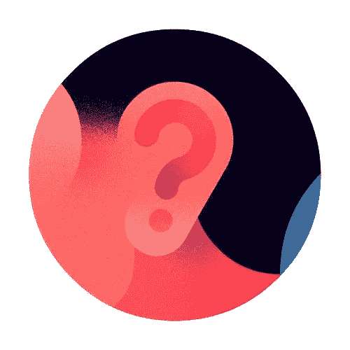
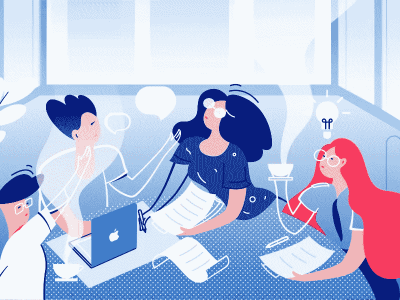

# 你忘了问你的同事什么

> 原文：<https://medium.datadriveninvestor.com/what-you-forget-to-ask-your-colleagues-about-d59acfcbb011?source=collection_archive---------15----------------------->

## “你在干什么？”“你好吗？”

by [Robin Davey](http://robindavey.co.uk)

作为一名博士生，我学到了这一课，但它可能也适用于其他职位，尤其是任何解决问题的工作。所以请耐心听我说，告诉我这对你是否有效！

作为一名博士生，我经常花时间在复杂的问题上，或者对乏味的任务感到厌倦。所以我需要休息。(我也有过美好的时光，寻找创造性的解决方案，经历编码狂潮以构建一个令人兴奋的功能，或者进行冷静的分析，但那时我不需要任何休息。)所以，如果我效率不高，我会休息一下，去看看其他博士生。不是去喝酒，不是去聊体育比赛结果或我看过的上一部电影，而是去问问他们在做什么。那是我最好的休息，我会告诉你为什么。这甚至导致我成为一篇文章的合著者之一，这篇文章是由我的一个博士生同学首先撰写的。

> “你在干什么？”

# 当你打扰别人休息时，他们在做什么？

让我们假设他们不在脸书或 Youtube 上，如果是这样，你可以毫无问题地打扰他们。

但大多数时候，他们的职业可以分为三类(与我在第一段中谈到的相同):

*   他们进入状态了！
*   他们很高傲。
*   他们很无聊。

我怎么知道这个？除了我作为编年史干扰者的个人经历，当你走进某人的办公室，你有更多的机会看到他们做一些需要时间的事情。1)**区**:这是他们的主要任务/工作，他们擅长于此，并花费大量时间来为团队带来价值。2)他们被一些他们不知道如何解决的事情卡住了。所以只是需要时间，他们不会放手。因此，你很有可能发现他们坚定地盯着屏幕，或者沮丧地敲着桌子。3)他们正在做一些单调乏味的工作，这些工作需要花费很长时间，但是他们必须完成这些工作才能做一些很酷的事情。再说一次，这需要时间，你有很大的机会在这个问题上打断他们。

(他们也可能在发邮件，或者在开会，但是要么你注意到了，然后找其他人去打扰，要么你可能也在做同样的事情，没有休息。所以让我们忽略这一点，专注于他们工作的核心。)

那么，现在你已经知道当你精力充沛地闯入他们的办公室时，他们可能在做什么了，与一大杯咖啡相比，这种休息的价值在哪里呢？

Discuss by [LemonZhang](https://dribbble.com/Lemonzhang)

# 问“你在做什么”的价值

## 学习-教学间歇

> -你在做什么？
> 
> -给我 30 秒，我告诉你。

如果他们处于最佳状态，他们可能不会倾向于休息。但是他们可以用很短的时间——在一段没有看你的时间之后,*给我 30 秒来写下这个函数并运行我的测试脚本。*”—这对你们两个来说仍然很有价值。在这种情况下，你不能帮助他们，但可以向你解释他们在做什么。首先，它可以让你更好地了解他们在做什么，稍后与他们讨论，并建立一个友好的环境。这也让你知道他们的**专长**，如果你需要这种专长，有人可以寻求帮助。第二，他们可以**教你一些他们发现的东西**，他们正在使用的一种很酷的方法，或者他们在最近的一篇论文中读到的东西。最后，谈论他们取得的所有进步会让他们感觉很好。它甚至可以通过仿真的力量给你一些能量。他们感觉很好，你学到了一些东西，他们很高兴，你也一样。

## 解决问题的休息时间

> -嘿，怎么了？做一些很酷的事情？
> 
> -是的，但我有点卡住了…也许你能帮忙！

这些是我最喜欢的。当有人陷入困境时，我会情不自禁地去帮助他们。解决问题的感觉总是很好。首先，你帮助了一个朋友，他/她对此心存感激(帮助别人的感觉总是好的)。第二，你可能会克服或帮助克服一个智力挑战，当它被解决时，你会感到聪明/有用。

所以，在某些情况下，他们遇到的问题不在他们的专业领域。因此**如果你有答案(在博士的背景下，统计分析通常属于这一类)，或者如果你能把他们介绍给知道如何解决这个问题的人，你就可以帮助**他们。问题解决了，他们可以做更有趣的事情，他们很开心，你也是。

*这种类型的交流让一位朋友兼博士生前来寻求关于统计分析的帮助。在一次课间休息时，他发现了我对统计学的兴趣，我问他用什么方法来回答他的特殊研究问题。在就某种类型的模型如何工作以及线性模型中不同类型的效应之间的差异进行了多次交流后，我成为了他的文章的合著者，这篇文章很快将发表在科学同行评审期刊上。*

但是你并不总是能够解决他们的问题，因为他们通常是需要特定专业知识的复杂问题。在这种情况下，让他们向您解释可能仍然有助于解决问题。你也可以对问题提出天真的看法或全新的观点，并提出解决问题的替代方案。问题可能没有解决，但他们不再被卡住了，他们可以继续工作，他们很高兴，你也一样。

## 呼吸暂停

> 嗨！你今天在做有趣的事情吗？
> 
> -上帝不！我受不了这个，太讨厌了。谢谢你的休息。你呢，你在做什么？
> 
> -事实上，我有点事，也许你能帮忙。

有时候，人们只是在做他们不得不做的无聊的事情。在这种情况下，短暂的休息总是受欢迎的。这不会持续很长时间，但会让他们呼吸，他们很高兴，你也是。这也是你和他们交流的一个机会(见[关于奥普拉·温弗瑞如何与人交流的视频](https://www.youtube.com/watch?v=v-ps2nfkAiA))。

# (现在)他们当然乐意帮忙

但是别忘了，你有一个休息的理由。虽然大多数人总是乐于助人，但如果你曾经帮助过他们，他们会更乐意这样做。你真幸运！由于上述情况之一，你已经做到了。所以现在，如果你遇到困难，你可以向他们寻求帮助，或者如果你正在做一些无聊的事情，可以休息一下(见上文，看看他们能给你带来什么)。

经过这样的休息之后，你就可以出发了！这当然比只是一杯咖啡要好，即使我承认有时候你只是需要这种额外的帮助。

# 主动休息带来的无条件好处

不管结果如何，这些休息都有无条件的好处。

*   你最好了解你同事的能力/技能，以及他们是否能在需要时帮助你；
*   你更了解他们，与他们建立联系，建立同理心，更好的沟通和更好的工作环境；
*   你肯定会学到东西，人们很乐意解释他们所做的事情(尤其是在学术界)；
*   你培养了解决问题和理解的能力。

> 如果你正在休息，不要犹豫，问问你的同事他们在做什么！

其他类型的休息对你的工作有益吗？体育聊天休息有帮助吗？你怎么想呢?

你可以从我的博士经历中读到另一个教训:[我应该先做一个原型](https://medium.com/@clmentviguier/i-should-have-made-a-prototype-first-e74c6c7a480b)。