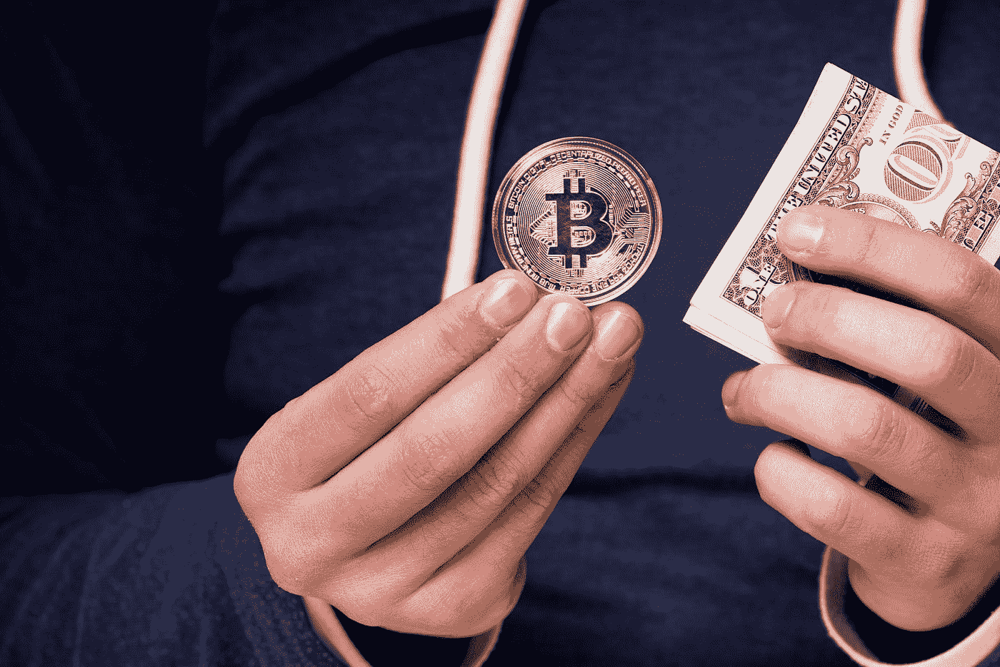

# 投资前你需要了解的加密货币

> 原文：<https://medium.datadriveninvestor.com/what-you-need-to-know-about-cryptocurrencies-before-investing-e333496eb779?source=collection_archive---------8----------------------->

关于加密货币和投资加密货币的大量信息已经成为一把双刃剑。怎么会？虽然正确的信息会加快你在区块链和加密货币投资的旅程，但错误的信息会毁灭性地毁掉你的财富。现在，区块链理工大学已经成为主流，诈骗项目正在各地涌现。投资者必须决定哪些项目值得投资，哪些项目可能会导致严重的财务损失。[获得正确的信息](https://www.forbes.com/sites/forbesfinancecouncil/2018/03/30/seven-questions-to-ask-before-investing-in-cryptocurrency/#244994649d0a)的确是一项艰巨的任务，因为区分真正的加密货币项目和骗局变得越来越难。

据报道，2017 年首次公开募股(ico)的产品中，大约有一半蒸发到了空气中，导致投资者遭受巨大损失。韩国政府暂停了 ICOs，以保护公众免受欺诈者的损失。与此同时，中国禁止开发、交易和提供[加密货币信息](https://bitcoincryptocurrency.com/best-investment-questions/)，作为保护公众的一种方式。这项禁令仍然有效。在投资任何加密货币之前，你到底需要知道什么？

## 项目是否有合适的技术，所采用的商业模式是否可行？

普通投资者可能不理解加密货币所用技术的本质。然而，你所投资的公司应该提供一份文件，其中包含有关该产品的所有技术和非技术信息(称为“白皮书”)。一旦投资者对运行产品的基本技术有了概念，他们最终就能更好地做出决定。[区块链产品](https://www.tractica.com/artificial-intelligence/the-viability-of-enterprise-blockchain-beyond-financial-services/)的可行性也可以与该产品旨在引入的解决方案进行权衡。例如，Patientory 是区块链的一款产品，旨在用于卫生领域。考虑到对永久、可访问且安全的医疗记录的需求，政府和私人医院可能会采用这种产品，从而增强产品的生命力。

## 产品是否得到适当监管，是否合法？

区块链技术先于政策和框架形成。世界各地的政府都在努力制定法规和政策，以跟上不断发展的技术。在投资任何项目之前，你应该检查他们的操作是否合法。先查一下公司的注册情况。公司注册在哪里？他们有办公室吗？谁是产品背后的团队领导？还有谁在谈论这个产品？有没有有影响力的人物为其代言？

尽可能多地获取关于公司、公司领导以及他们之前表现的信息。这将需要时间和精力，但给你的投资保证。

## 竞争对手是谁？

在过去的两年里，区块链产品充斥了市场。每个项目都有“扰乱市场”的承诺。每种产品还会发起一场声势浩大的宣传活动，目的是吸引投资者。在投资它们之前，花点时间做适当的研究。找出谁还在这个产品已经开始颠覆的利基市场中运营。比较和对比项目[的可行性和发展潜力](https://hackernoon.com/12-questions-to-ask-yourself-before-investing-in-an-ico-ffbb2169a893)，这样你就能做出明智的决定。

一些行业，如健康行业，有大量的产品承诺解决这个或那个问题。花时间研究他们的不同点、相似点和现实的路线图。

## 你愿意投资多少？

无论投资机会如何，这都是基本的投资决策问题之一。它也适用于区块链理工大学的产品。你可以做的一件事是通过投资不同的区块链产品来分散风险。使用你从回答前面的问题中获得的所有信息来决定你应该投资多少。一定要密切关注你的投资，知道何时兑现或撤出。

## 最后，请记住这一点…

加密货币仍处于萌芽阶段，肯定会有很多变化会影响该行业的盈利能力。例如，您所在国家或地区的税法可能会发生变化。你需要从每一个可靠的来源跟上所有最新的新闻、评论、趋势和市场分析。利用所有可用的信息，做出最适合你财务目标的投资决策。

*原载于 2018 年 6 月 20 日*[*www.datadriveninvestor.com*](http://www.datadriveninvestor.com/2018/06/20/what-you-need-to-know-about-cryptocurrencies-before-investing/)*。*