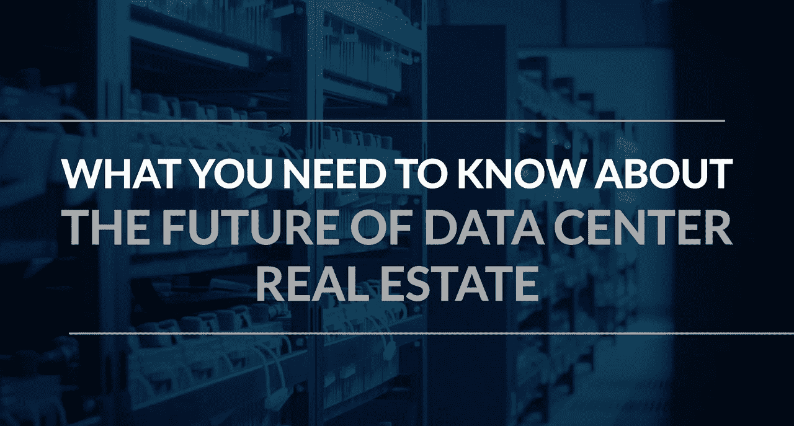

# 关于数据中心房地产的未来，您需要了解什么

> 原文：<https://medium.datadriveninvestor.com/what-you-need-to-know-about-the-future-of-data-center-real-estate-c460daec98a0?source=collection_archive---------6----------------------->

随着云计算、人工智能和物联网(IoT)等服务和技术继续占据中心舞台，对数据中心的需求正在快速增长。这些存储、处理和分发数据的仓库需求量很大，因为需要大量的能量和信息来跟上这些创新的增长。

“一辆自动驾驶汽车将需要比我们今天使用的汽车多 40 倍的带宽，”[Altegris/AACA 机会主义房地产基金的投资组合经理伯尔·伊斯特](https://www.barrons.com/articles/data-centers-take-center-stage-in-real-estate-investing-1526681085)说。“美国对数据中心的需求每年增长 30%。”

有相当多的因素影响了数据中心物业的快速增长，并赋予了市场自己的身份。

## **将数据中心分开**

根据[的一份报告](http://www.us.jll.com/united-states/en-us/research/property/data-centers)，2016 年，美国 15 个主要市场中的 9 个——包括芝加哥、北弗吉尼亚州和北加利福尼亚州——对云计算的需求增长了 30%。自那以后，这些地区的数据中心资产投资也有所增加。

越来越多的公司开始依赖云计算，这要求更严格的安全性。这意味着需要更多的服务器来跟上通过它们运行的数据和信息的数量，并且它们不再被限制在公司办公楼内的一个小房间内。相反，公司将这些业务转移到更大、更易管理的地方。

这种日益增长的需求也使得专家顾问能够将其服务扩展到新的领域，这为投资者提供了做出更明智决策的能力。

## 一个技术驱动的社会创造了这种繁荣

当我们想到云计算和存储时，很容易想象需要更少的设备而不是更多的设备。虽然在用户端可能是这种情况，但是数据仍然需要一个存放的地方。这导致了专门为此目的建造的商业房地产的巨大繁荣。

随着我们越来越接近依赖技术的生态系统，越来越多的这些属性将需要提供安全的存储和分发。

亚马逊网络服务公司的詹姆斯·汉密尔顿预测云提供商可能需要在数百个地区建立数据中心来满足消费者的需求。

“每个地区将需要至少三个数据中心，最大的将运行数十个独立的设施，”他说。对于那些已经选择或仍在考虑投资数据中心物业的人来说，这是一个好消息。

## **投资数据中心的正确方法**

对于希望了解更多投资机会的个人和公司来说，[强烈建议联系科技和房地产行业的专家](https://www.linkedin.com/in/steve-friedman-0785bb/)。合适的顾问可以提供所需的所有信息和指导，以确保您的下一项投资是正确的。