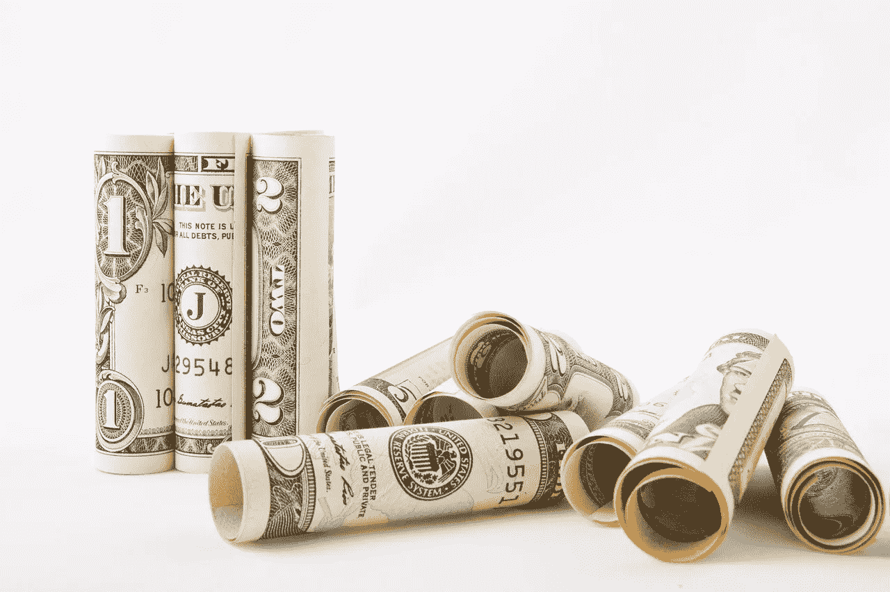
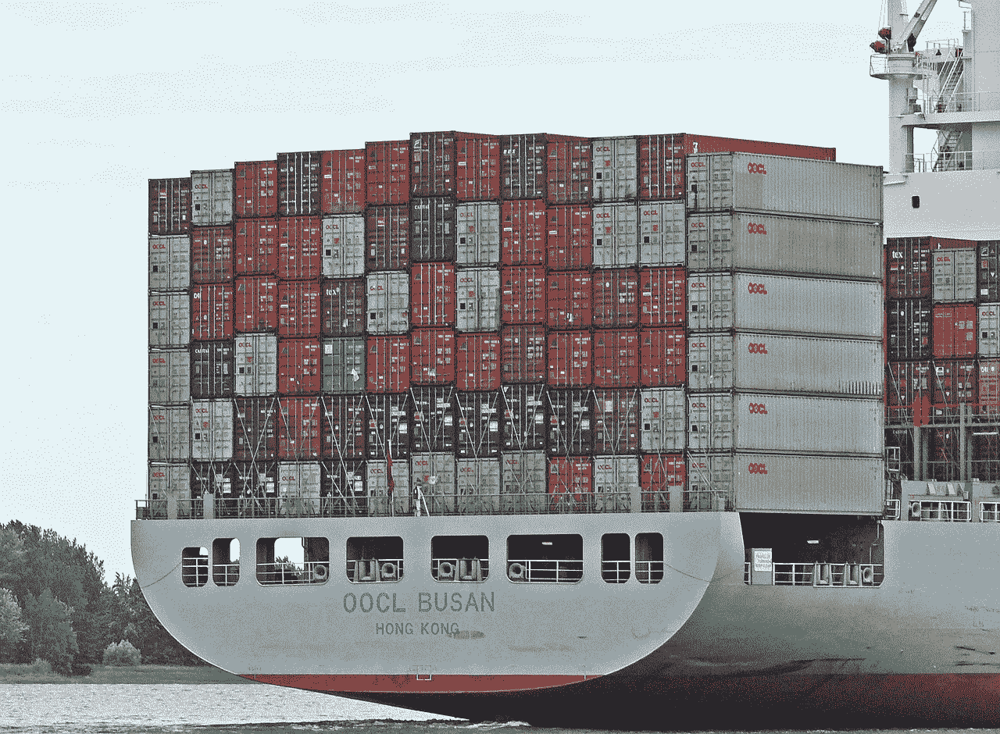

# 关于特朗普贸易战，你应该知道什么

> 原文：<https://medium.datadriveninvestor.com/what-you-should-know-about-the-trump-trade-war-866dd62d256d?source=collection_archive---------17----------------------->

关于美国总统唐纳德·特朗普(纽约共和党)与中国的“贸易战”，有几个要点每个人都应该明白。特别是，投资者、交易者和投机者如果想赚钱，就需要了解这些现实。

首先，对贸易战现实的良好理解可以告诉你在哪里投资。例如，投资者和投机者可以辨别贸易冲突可能影响哪些股票。

**特朗普贸易战最重要的影响**

考虑到这一点，我列出了贸易战最明显但被忽视的影响。这些影响包括:

1.  为了在贸易战中生存，美国将不得不使美元贬值。显然，美国人不可能在强势美元下保持贸易竞争力。

2.目前，包括印度和中国在内的许多竞争对手的货币都要疲软得多。显然，这让一个进口中国或印度商品的进口商“物有所值”。

3.因此，降低美元价值的努力是不可避免的。

4.没人知道贸易战会持续多久。特别是马云[认为](http://fortune.com/2018/09/19/china-us-trade-war-20-years-jack-ma-alibaba/)会持续 20 年。另一方面，我认为它只会持续一年，因为美国缺乏长期贸易战的政治意愿。

5.美国国内没有对贸易战的政治支持。尽管有反华情绪，但没有草根支持，甚至没有关于贸易战的讨论。

6.贸易战还没有影响到普通美国人——目前还没有。到目前为止，特朗普政府避免了会提高消费者价格的关税。我怀疑，对选民强烈反对的担忧推动了这一政策。

7.贸易战可能很快会影响普通美国人。美国最大的零售商**沃尔玛(纽约证券交易所:WMT)** 据说在一封信中敦促美国贸易代表 Robert (Bob) Emmet Lighthizer 将各种商品从关税清单中删除， *The Hill* [*报道*](https://thehill.com/policy/finance/407589-walmart-warns-trump-tariffs-forcing-them-to-consider-raising-prices) 。

8.沃尔玛在信中警告称:“直接影响将是提高消费者的价格，并向美国企业和制造商征税。”。

9.美国是一个石油出口国。由于钻探热潮，美国最近成为石油出口国。因此，美国可以没有大量的货币储备，也可以接受强势美元。比如说；美国可以把通常花在石油上的钱再投资到基础设施建设上。

10.定于 11 月 6 日举行的美国国会选举日程将决定贸易战的命运。

11.如果共和党赢得参议院(上议院)的控制权，特朗普可能会淡化战争，或者可能结束战争。美国宪法赋予参议院监督贸易的权力。

12.特朗普可以瞬间失去他的贸易权限。如果特朗普走得太远，共和党人；理论上是自由贸易者，可能会剥夺他的贸易权力。

13.民主党控制参议院可能会鼓励特朗普扩大贸易战。

14.许多民主党人赞同特朗普关于贸易的基本观点(即中国进口伤害了美国工人)。在贸易问题上采取强硬立场是特朗普能够在民主党人身上得分的少数方式之一。

15.长期贸易战对中国比对美国有利。中国领导人不必像美国人那样每隔几年就竞选连任。因此，他们可以等到贸易战结束。

16.没有美国的粮食和石油等出口，中国或许可以生存。

17.没有廉价的中国商品，目前的美国消费经济是不可持续的。

18.一场咄咄逼人的贸易战将使美国消费经济面临风险。

19.高消费价格可能导致美国零售业的崩溃，并消灭数百万个工作岗位。

20.没有一个美国政治家能在美国零售业崩溃的反弹中幸存下来。

21.所以，严重的贸易战不太可能。

22.贸易战很有可能是一场政治噱头，旨在帮助共和党人参加 11 月的选举。

23.此外，特朗普和中国领导人有可能达成一项保全面子的政治解决方案，并将于 11 月(大选后)宣布。

在这种情况下，在 2018 年 11 月 6 日之前，任何投资者或投机者都不应有任何举动。我的建议是，等到美国国会选举之后，再进行任何与贸易战有关的投资或投机。

直到 2018 年 11 月 7 日，我们才能知道贸易战是否是真的。记得那个日期。

这篇文章的评论最初出现在 [*市场疯人院*](https://marketmadhouse.com/) 你的包厢席，为市场的疯狂和政治的愚蠢。