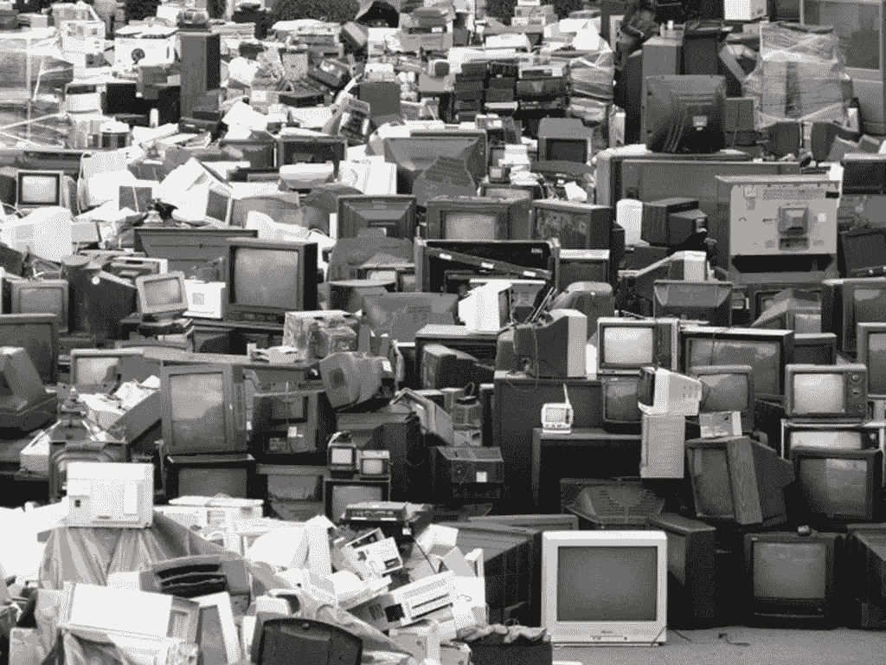

# 机器人先生到底怎么了？

> 原文：<https://medium.datadriveninvestor.com/whatever-happened-to-mr-robot-a226c62ded0d?source=collection_archive---------24----------------------->

这是电视上对高科技未来最热门、最性感、最邪恶的展望。凭借拉米·马雷克、克里斯汀·史莱特和卡莉·查肯的精湛才华，这是一个关于不可靠的叙述者如何改变我们看待世界的方式的紧凑范例。

[https://iscrapapp.com/blog/places-to-find-e-waste-for-scrap/](https://iscrapapp.com/blog/places-to-find-e-waste-for-scrap/)

那么为什么我们没有完成这个故事呢？这个节目吸引了大批追随者。该剧“邪恶”社会的假面(本身是《V》中盖伊·福克斯面具的翻版)在流行文化中成了现实生活中匿名黑客文化的同义词。对于一部高科技惊悚片来说，它做到了一件不可能的事。它已经超越了作为一个“类型”节目的基础，并被更广泛的、不懂技术的观众所接受。

在我看来，问题在于反乌托邦不可避免地会变得乏味。没有人想看到故事的结局。没有人希望看到世界的演变，无论是向更光明还是更黑暗的方向。反乌托邦被困在情感和视觉风格的领域里，而角色们，虽然他们自己可能会成长和改变，却被困在一个静止的世界里。在我们得出结论之前，大多数这类节目都停播了。在某种程度上，这是因为观众通常会在两三季后变得稀薄。当你最终不得不面对没有解决办法的事实时，崩溃的快感就会消失，唯一的出路就是倒下。

但是，即使当一部牢牢设定在反乌托邦的电视剧被允许用肮脏的沥青色蝴蝶结将一切捆绑起来，也没有人会对结局感到满意。这在一定程度上是因为反乌托邦本身就是一种终结游戏。这是一种熵状态，在这种状态下，维护社会的努力与生活在其中的人们的堕落和自我中心完美地平衡了。

我觉得，以一种奇怪的方式，反面题材的叙事最好由这种放弃来服务。有一种近乎洛夫克拉夫特式的厄运感笼罩着这个故事，即使有一个“幸福的结局”，因为幸福总是个人的。这个世界仍然是一个反乌托邦，它没有改变，只是我们的英雄们找到了一种与之共存的方式。从另一个角度来看，看着世界最终自我毁灭远没有你想象的那么令人满意。

因为，说到底，反乌托邦都是关于中局的。我们在他们有足够的时间变得有趣后进入他们，我们实际上对看到他们去了哪里，随着时间的推移他们变成了什么并不感兴趣。它们只是一盘端上来的戏剧，而不是我们在那里观看的真正原因。