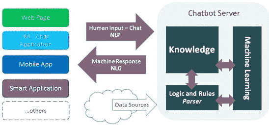

# 都在聊些什么？

> 原文：<https://medium.datadriveninvestor.com/whats-all-the-chatter-about-8276caa4a3c7?source=collection_archive---------10----------------------->

"请稍等，一会儿会有代表来接你."*播放糟糕的等待音乐。*

是的，我们都知道那种被搁置的愤怒感觉。他们说你很快会得到帮助，但 20 分钟后你放弃了，电话开着，你开始做其他事情。当有人最终接电话时，你已经等了很久，以至于部分忘记了你打电话的目的。通话结束 15 分钟后，你想起来了，但是已经太晚了，你不可能再打电话了。你认为，“一定有更好的方法来寻求帮助，”你是对的。有。它叫做聊天机器人。

## 什么是聊天机器人？

简单地说，聊天机器人是一种设计用来模拟与人类对话的计算机程序。这些对话通常发生在互联网上，可以像问时间一样简单。

## 不同的类型

目前使用的聊天机器人主要有两种类型:基于规则的方法和自学聊天机器人。

 [## 对话式营销是文字数据驱动的投资者

### 在购买之前，先谈一谈。这样做的营销人员将走在游戏的前面。这是保罗·因斯的前提…

www.datadriveninvestor.com](https://www.datadriveninvestor.com/2019/01/31/conversational-marketing-is-the-word/) 

基于规则的聊天机器人只能根据训练它的特定规则来回答问题。规则可以简单或复杂，但聊天机器人只是遵循规则。当你需要更好的体验保证时，这些类型的聊天机器人会很有用，因为自学聊天机器人可能有点不太可预测。他们通常也更快，更容易训练。基于规则的聊天机器人的一些缺点是，它们需要更长的编码时间，因为你必须手动写出所有的规则。他们的对话流程也不够灵活，这会降低用户体验。

自学聊天机器人或人工智能聊天机器人可以根据它们获得的数据回答问题，通过使用人工智能来确定适当的响应。这些类型的聊天机器人的优势包括更灵活的对话，以获得更好的用户体验，并随着他们对人类行为的了解越来越多而不断改进。他们也有更好的决策技能，因为他们的选择包括他们所学到的东西，而不仅仅是他们的规则。自学型聊天机器人的缺点是，因为没有设定行为规则，所以需要更长的训练时间。这种规则的缺乏也意味着它们不太可预测，有时回答得不太好。

最近，我用 python 制作了一个自学聊天机器人，可以回答关于人工智能的问题。这些信息取自我解释人工智能的文章，并放入聊天机器人可以访问的附加文件中。当你问它一个问题时，它会在文档中快速搜索，找到你的问题的答案。答案并不完美，因为有时它没有以最好的方式回应，但总的来说，这个项目是成功的。

Anatomy of a chatbot

## 聊天机器人是如何工作的？

首先，你有自己的平台，比如网页或移动应用程序，你可以用它们来运行聊天机器人。这些平台是你看到机器人输入和输出的地方。一旦你输入一个响应，这些单词就会被自然语言处理器(NLP)处理，这样机器人就能理解你在说什么。在它理解了响应之后，它使用自己的代码做出适当的响应。代码可以包括机器学习、规则和/或由数据源给出的知识。响应使用自然语言生成器(NLG)将信息转换成原始输入语言。然后响应出现在平台上。

## 它们有什么用？

除了使用聊天机器人来消除等待状态，他们还能做什么？你可能已经注意到，当你说“嘿谷歌”或“Siri”时，你的手机通常会有回应。那是因为这两个都是聊天机器人的例子。它们可以用于个人服务，如开灯或锁门。聊天机器人现在也常用在网站上。角落里会弹出一条小消息，询问他们是否可以帮助你，以便公司可以改善他们的用户体验。聊天机器人的一个不太为人知的用途是在 Woebot(用于精神健康)或 Duolingo(用于语言学习)等受益应用程序中。就 Woebot 而言，它每天都会检查你的身体状况，并提供管理健康的提示和技巧。使用 Duolingo，你可以用任何语言与机器人聊天，这样你就可以提高你的语言技能。

## 我可以制作自己的聊天机器人吗？

是啊！如果你有兴趣了解更多关于聊天机器人的知识，并想创建自己的聊天机器人，那就来吧！你的聊天机器人不必太复杂，尤其是如果你是一个初学者。如果你以前从未编码过，我建议你在开始项目之前学习如何用 python 编码，但是边学边做也是可能的。不要担心把你的聊天机器人变成一些花哨的应用程序，它可以只是一个在线计算机程序。了解聊天机器人的最好方法是创建一个聊天机器人，所以开始吧！建起来！

我希望你喜欢这篇关于聊天机器人的文章，并在下面留下评论，让我知道你喜欢什么，我可以改进什么。

如果你想读更多我的文章，可以看看现代时尚背后的科学；人工智能。