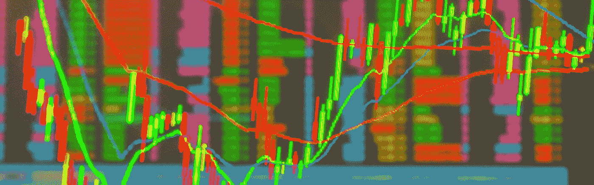

# Crypto 的非理性市场背后是什么？

> 原文：<https://medium.datadriveninvestor.com/whats-behind-crypto-s-irrational-markets-880e550bc9f?source=collection_archive---------16----------------------->

在过去的几个月里，有三件事让我质疑加密市场的健全性。

在每一个案例中，新闻都来自于项目的[治理](https://cryptolawinsider.com/the-beginners-guide-to-blockchain-governance/)或商业模式的*重大*缺陷。市场确实如此…这些项目的估值保持完全不变，甚至有所上升，这向我发出了现实和秘密市场价格之间存在明显脱节的信号。

 [## 总部位于瑞士的 ETP 进入加密交易市场|数据驱动的投资者

### 虽然金融市场几乎没有沉闷的时刻，特别是在引入…

www.datadriveninvestor.com](https://www.datadriveninvestor.com/2019/03/10/swiss-based-etp-enters-the-crypto-trading-market/) 

谢天谢地，*密码法律内幕*不是投资指南。我们并不声称建议买卖哪些代币。

但这并不意味着我们没有密切关注正在发生的事情，没有注意到荒谬动摇了市场。

为了确保你在加密市场中不被暗算，请继续阅读，以更好地了解你所面临的挑战…

# Tether 的严重估值问题和治理

两个月前，纽约州监管机构将 Tether 告上法庭，指控其在外汇储备方面误导投资者。

最后，泰瑟不得不承认它只有 75 美分来支持每一枚泰瑟硬币。尽管他们向用户承诺 1:1 美元的稳定币值。

稳定币的意义在于通过将加密货币和法定货币固定在一个固定的价格上来弥补二者之间的差距。

这种挂钩降低了资产支持硬币价值大幅波动的可能性，从而对买家具有吸引力。从理论上讲，这也让它们对从银行到街角杂货商的每个人都更加友好。

为什么？因为他们可以信任它。

但要让一个稳定的货币兑现这一承诺，它必须有其储备资产的坚实支持。如果没有这一点，资产价值的大幅波动可能会破坏联系汇率制。

货币可能会在一夜之间崩溃。

所以你会认为当人们发现 Tether 的储量不足时，价格就会下跌，对吗？

它没有。即使在铁证如山的情况下，Tether 不再是稳定的硬币，硬币仍然以 1.00 美元的价格交易。跟 1:1 背的一样。

# 科莫多的破钱包

接下来是[科莫多](https://komodoplatform.com/)，这个项目[从它自己的用户那里窃取来“保护”他们](https://cryptolawinsider.com/komodo-steals-users-funds-to-protect-them-from-being-hacked/)。

本月早些时候，有消息称，隐私币 Komodo 的 Agama 钱包 T3 存在一个 T2 重大漏洞。

该项目的领导层立即跳出来保护用户免受潜在的黑客攻击。并主动进入用户的钱包，取走他们的部分资金用于“安全保管”。

这不是一笔小数目，估计在 KMD 达到 1 184 万美元，在 BTC 达到 75 万美元。

现在，该项目的领导层仍在努力解决如何归还资金的问题。这将是一个困难、耗时和不完善的过程。

同样，你会认为，在对其平台的信任受到如此侵蚀后，科莫多的估值会大幅下降。

然而，恰恰相反，科莫多的市场价格已经*上涨*。

# ZCoin:对通货膨胀开放

与 [ZCash](https://z.cash/) 和 [Horizen](https://www.horizen.global/) 不同，它们的[隐私](https://cryptolawinsider.com/data-privacy-nothing-to-hide/)协议是用 zk-SNARK 技术构建的，ZCoin 打造了自己的道路，并走向市场提供自己的“零硬币协议”。

Zerocoin 协议的工作原理是允许人们燃烧自己的硬币，然后花等量的钱。这保护了用户的隐私，因为新硬币没有交易历史。

今年 4 月，Zerocoin 协议出现了[一个关键性缺陷。这个缺陷使得攻击者有可能制造出无限数量的自己的硬币。事实上，他们发现这些假硬币已经占到了 Zcoin 流通总量的 1%。](https://cryptoslate.com/zerocoin-exploit-found-zcoin-attacked-other-privacy-coins-at-risk/)

更糟糕的是，这不是开发人员可以通过快速补丁修复的编码错误漏洞。

这是该项目的原始零知识证明中的一个固有的加密缺陷。这实质上使得 Zerocoin 协议上的交易隐私变得毫无价值。

领导层对这一严重漏洞的回应是什么？

虽然我们相信只要有足够的时间，Zerocoin 是可以修复的，但我们决定不再投入更多的资源。这符合我们从零币过渡到适马的路线图……

因此，三个月来，零币协议一直对潜在的攻击敞开大门。

再一次，在这样的新闻之后，你会认为 ZCoin 的价格会暴跌。

*注:ZCoin 是* [*发布适马*](https://zcoin.io/zcoins-sigma-is-released/) *两周后，我们将不得不拭目以待这个新的隐私协议如何执行。尽管考虑到项目对漏洞的反应和他们的跟踪记录，我还是有我的担心。*

相反，与 Komodo 一样，ZCoin 已从 2019 年 5 月中旬的 7.22 美元低点上涨，稳定在 11 美元至 12 美元之间。

# 这对密码法律内部人士意味着什么？

为什么即使在这些项目中发现了治理、信任和技术方面的重大失败，市场也没有退缩？

我不知道，事实上没人知道。

正如已故伟大的约翰·梅纳德·凯恩斯(John Maynard Keynes)所警告的，“市场保持非理性的时间可能比你保持偿付能力的时间还要长。”

加密市场是非理性的，投资者似乎根本不了解在 Tether、Komodo 或 ZCoin 上交易代币的风险。

一个不稳定的 stablecoin，一个不安全的平台和一个不私密的隐私币——这些都是巨大的缺陷，市场对它们进行相应的估值只是时间问题。

迪安·斯坦贝克

迪恩·斯坦贝克(Dean Steinbeck)是加密法律内幕 [*的董事总经理，是加密货币和区块链技术相关法律问题的主要权威。*](https://www.cryptolawinsider.com)*[了解更多信息](https://cryptolawinsider.com/cryptos-irrational-markets/)*

*原载于 2019 年 7 月 16 日*[*https://cryptolawinsider.com*](https://cryptolawinsider.com/cryptos-irrational-markets/)*。*