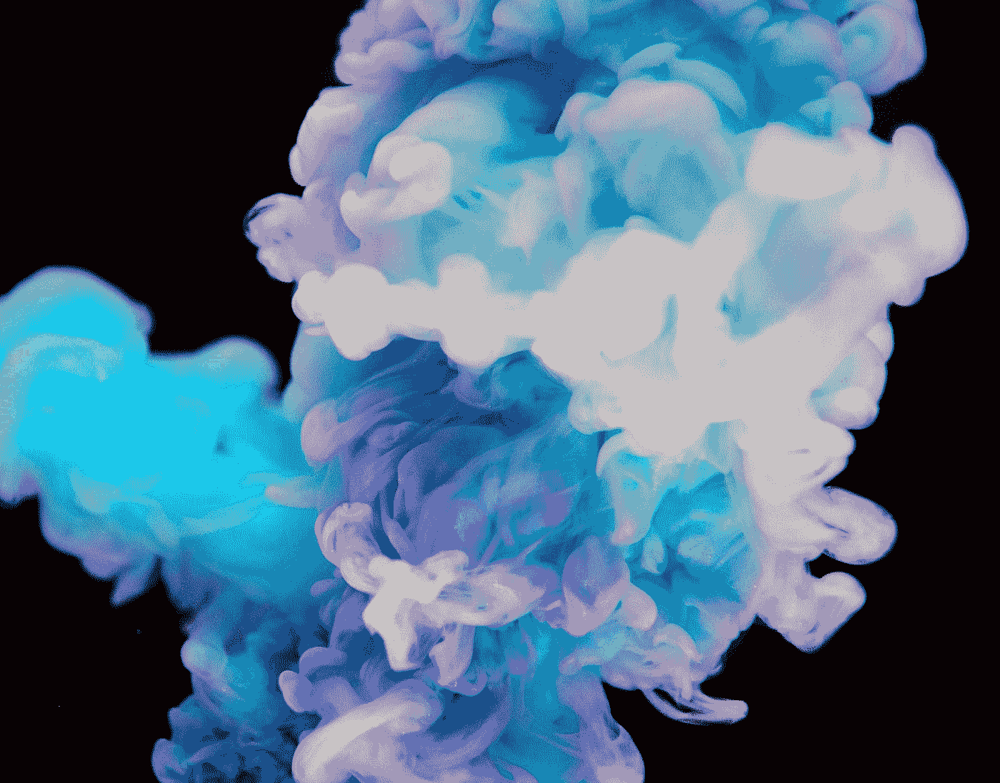
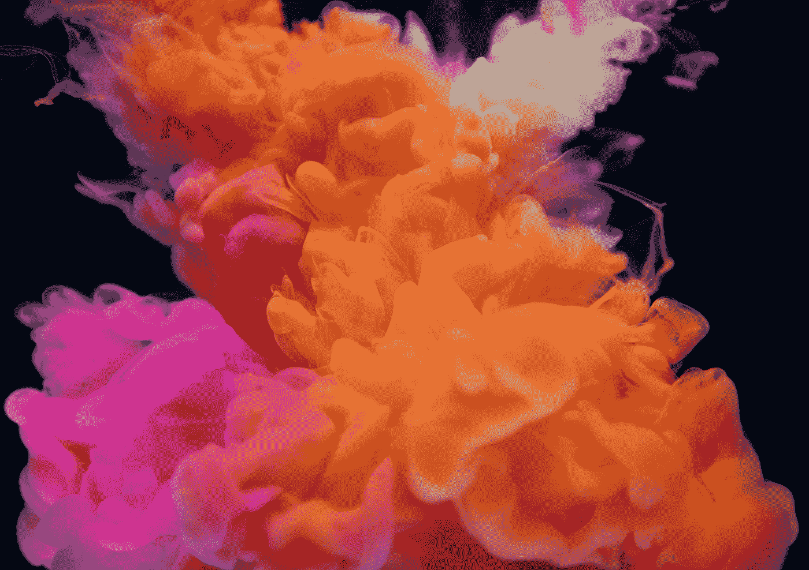
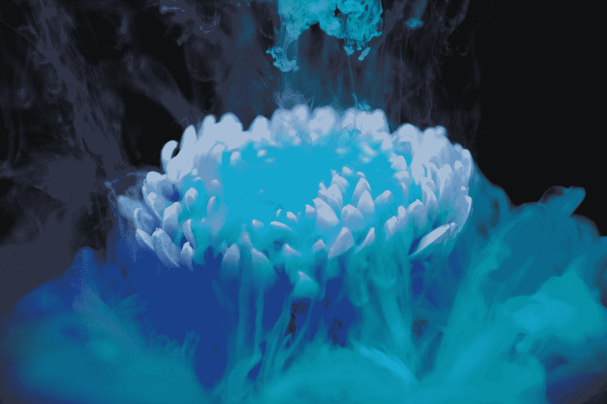
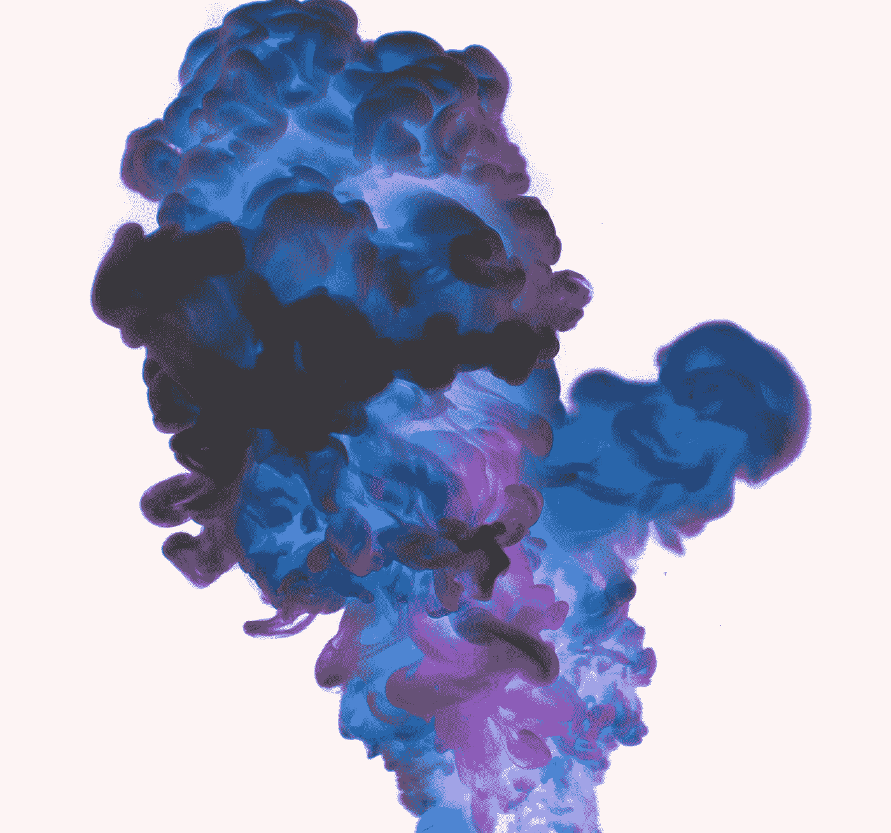

# 是什么造成了更多的空气污染，柴油车还是你的洗发水？

> 原文：<https://medium.datadriveninvestor.com/whats-causing-more-air-pollution-diesel-cars-or-your-shampoo-f43d68fcfe51?source=collection_archive---------6----------------------->

## 最近的一项研究发现，厨房和浴室清洁产品中使用的日常化学物质现在比交通污染更严重。以下是你需要知道的关于你正在呼吸的东西…

Photo by [rawpixel](https://unsplash.com/@rawpixel?utm_source=medium&utm_medium=referral) on [Unsplash](https://unsplash.com?utm_source=medium&utm_medium=referral)

发表在研究杂志[科学](http://science.sciencemag.org/cgi/doi/10.1126/science.aaq0524)上的新发现报告称，洗发水、除臭剂和清洁喷雾等家用物品中使用的化学物质可能与汽车一样导致空气质量不佳。

这项研究的关键发现[表明，使用一些家用化学产品时产生的潜在有害的“单位产品排放量”可能“比汽车尾气高一到两个数量级”](http://science.sciencemag.org/content/359/6377/760.full)

虽然大多数关于改善空气质量的讨论都集中在交通造成的室外污染上，但这项最新研究却将焦点转移到了更广泛的“城市空气质量”上。

戴森健康和美容副总裁保罗·道森说:“新家具、清洁剂、除臭剂、甚至香烛释放的烟雾是最常见的室内空气污染物。”

Photo by [rawpixel](https://unsplash.com/@rawpixel?utm_source=medium&utm_medium=referral) on [Unsplash](https://unsplash.com?utm_source=medium&utm_medium=referral)

他继续说道，“影响室内空气质量的因素有很多。它们可能是外部因素，如附近是否有工业或房间是否面向道路交通会影响房间的空气质量。或内部来源；个人烹饪或清洁的频率，是否使用大量的气雾剂，如除臭剂或发胶。甚至自然空气流通的水平也可以调节室内空气质量。”

据报道，空气污染是全球人类健康的第五大风险，仅次于营养不良、饮食风险、高血压和烟草。

《科学》编辑汤姆·惠普尔在《纽约时报》上解释说，最近的一项室内空气质量研究中，“科学家研究洛杉矶的空气污染发现，空气中多达一半的挥发性有机化合物(VOCs)实际上来自于家用产品，包括油漆、杀虫剂、漂白剂和香水。”

布莱恩·麦克唐纳博士是美国政府科学机构国家海洋和大气管理局(NOAA)领导这项研究的化学科学小组成员。

他解释道:“随着交通变得更加清洁，这些其他来源变得越来越重要，”他认为，并补充道，“我们日常生活中使用的东西会影响空气污染。”

Photo by [rawpixel](https://unsplash.com/@rawpixel?utm_source=medium&utm_medium=referral) on [Unsplash](https://unsplash.com?utm_source=medium&utm_medium=referral)

挥发性有机化合物是一种化合物，随着时间的推移，可以降解为 PM 2.5 颗粒，这种颗粒小到足以穿透人类的肺部，经常与呼吸健康问题有关，并与英国每年近 3 万人的过早死亡有关。

由于美国和欧洲努力控制汽车尾气排放，汽车挥发性有机化合物的排放量已经稳步下降。因此，其他挥发性有机化合物排放源的相对重要性可能会增加。

这项研究也恰逢英国政府的[环境、食品和农村事务部(DEFRA)](https://www.gov.uk/government/organisations/department-for-environment-food-rural-affairs) 发布空气污染排放数据，他们说[“反映了近年来在减排方面取得的成就，并表明英国从 2011 年起遵守所有排放上限。”](https://www.gov.uk/government/statistics/emissions-of-air-pollutants)

英国政府最近签署了雄心勃勃的目标，根据国家排放上限指令，到 2020 年和 2030 年减少五种主要污染物的排放，包括非甲烷挥发性有机化合物。

Photo by [rawpixel](https://unsplash.com/@rawpixel?utm_source=medium&utm_medium=referral) on [Unsplash](https://unsplash.com?utm_source=medium&utm_medium=referral)

DEFRA 的发言人说:

“自 2005 年以来，非甲烷挥发性有机化合物的排放量已经下降了 33%，根据国家排放上限指令，我们已经签署了进一步减少它们的宏伟目标。

“自 2010 年以来，空气污染有了显著改善，但我们认识到还有更多工作要做，这就是我们投资 35 亿英镑改善空气质量和减少有害排放的原因。消费品中非甲烷挥发性有机化合物的排放将被视为我们清洁空气战略的一部分，该战略将于今年晚些时候公布，以供咨询。”

亨利·托拜厄斯·琼斯是英国伦敦的自由记者和编辑。点击 [Twitter](https://twitter.com/henrytojones) 和 [Instagram](https://twitter.com/henrytojones) 关注他。