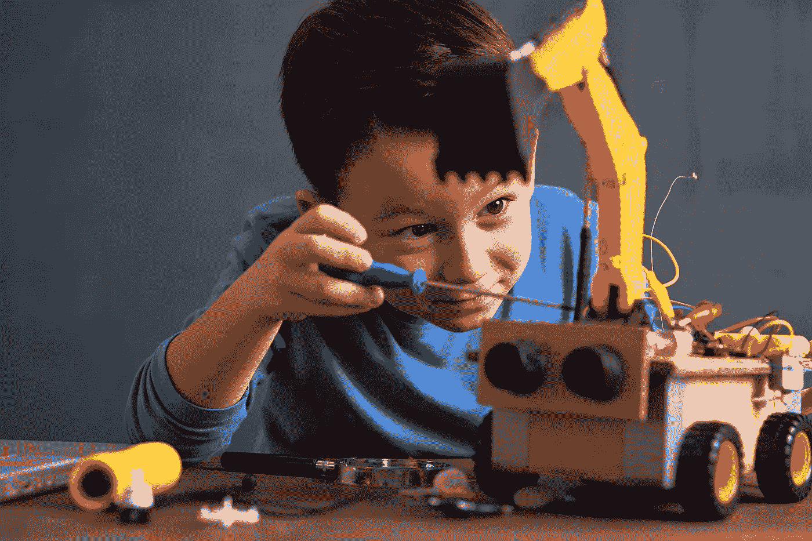
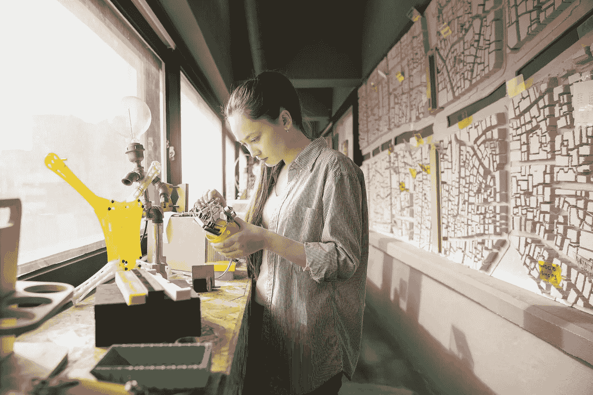

# 2019 年是什么在推动 STEM 教育？

> 原文：<https://medium.datadriveninvestor.com/whats-driving-stem-education-in-2019-bc7b73a1ac7b?source=collection_archive---------3----------------------->

## 前进道路上的新趋势

Image: Getty / Boy Working On Robot Car

*作者:* [*安德鲁·b·劳普*](https://medium.com/u/d8c8d333927a?source=post_page-----bc7b73a1ac7b--------------------------------)*/*[*@ stem CEO*](https://twitter.com/stemceo)

在许多方面，2018 年是 STEM 教育领域加速和进步的一年。

自“STEM”一词首次流行以来的大约十几年里，这个指代科学、技术、工程和数学学科的首字母缩写词已经成为一个家喻户晓的术语。

不仅是传统的小学科学教育工作者在谈论 STEM，似乎我们的整个全球文化也开始转向承认科学创新的力量和重要性，因为我们共同寻找解决现代挑战的办法。

对于探索 STEM 的各种主题和学科的年轻人来说，这确实是一个令人兴奋的时刻，尽管工作具有挑战性，但作为一名致力于促进 STEM 教育机会的教育家或教育领导者，这也是前所未有的振奋人心。

当我们回顾 2018 年及其前几年时，我们也可以展望即将出现的趋势。

## 现场报道:关于 STEM 教育趋势的研究

Image: Getty / Female Engineer Working On A Project

由于 STEM 教学技术的快速变化，很难预测 STEM 教育的趋势和影响。

然而，回顾 2013 年的一份负责预测 2020 年 STEM 的报告，为全球 STEM 从业者提供了一些关键的启示。该报告重点介绍了十几项“值得关注的技术”。

# 2013–2014

*   [**学习分析**](https://cehdvision2020.umn.edu/blog/technology-and-learning-analytics/)
*   [**移动学习**](https://files.eric.ed.gov/fulltext/ED562382.pdf)
*   [**在线学习/ MOOCs**](https://www.aaas.org/news/massive-open-online-courses-help-make-stem-education-more-accessible-do-they-work-all-students)
*   [**虚拟远程实验室**](https://peerj.com/preprints/26715/)

# 2014–2016

*   [**3D 打印**](https://www.asme.org/career-education/articles/career-and-education/3d-printing-engages-students-stem)
*   [**电子游戏**](https://medium.com/@stemceo/how-video-games-help-students-level-up-stem-learning-ca75d5b6a29c) **和** [**游戏化**](https://medium.com/@stemceo/can-gamification-solve-the-stem-talent-gap-ec7e006aa80b)
*   [**沉浸式学习环境**](https://online-journals.org/index.php/i-jac/article/download/7407/4656)
*   [**可穿戴技术**](https://digitalcommons.unomaha.edu/cgi/viewcontent.cgi?article=1009&context=ctlle)

Image: Getty / 3D Printing Team

# 2017–2020+

*   [**柔性显示屏**](https://www.sciencenewsforstudents.org/article/digital-displays-get-flexible)
*   **物联网**
*   **[**机器学习/ AI**](https://medium.com/@stemceo/how-advancements-in-ai-could-radically-change-the-way-children-learn-in-the-classroom-ee4ea799a952)**
*   **[**区块链/ DLT**](https://medium.com/datadriveninvestor/blockchain-a-revolution-for-stem-education-654050e22355)**

**这些技术已经开始在我们的教室和生活中发挥作用，这份报告为未来提供了坚实的一瞥。**

**回想起来，仅仅几年前，移动和在线学习工具的使用还是一个“新”想法，这令人惊讶。今天，小学和大学的课堂在很大程度上已经将个人技术的使用与教学完全结合起来。**

**在教室里使用智能手机或平板电脑不再是什么奇怪的事情，这种对技术的舒适已经为未来奠定了基础。**

**此外，使用“开箱即用”的方法，如[游戏化](https://www.siliconrepublic.com/careers/gamification-stem-talent-gap)和替代或沉浸式环境，似乎可能会有回报。**

**《美国新闻与世界报道》最近的一篇文章分享了一些关于 STEM 进步的有希望的消息，指出“参加数学或科学 AP 考试的学生人数从未如此之多。参加这些考试的学生人数从 2003 年的 27.3 万增加到 2013 年的 52.7 万，几乎翻了一番。”**

**随着教育工作者和管理人员不仅继续投资于现成的 [STEM 教学产品、](https://www.forbes.com/sites/forbestechcouncil/2018/05/29/the-rise-of-the-stem-toy/#4217d178724a)，而且还投资于一种思维模式，这种思维模式重视经过适当准备的教育工作者的力量，并优先考虑让学生在课堂上和现实世界中接触科学、技术、工程和数学的有意义、丰富的机会，对数学和科学的高级课程的兴趣似乎只会增加。**

## **展望未来:2019 年及以后 STEM 教育的未来**

****

**Image: Getty / Successful Learning**

**教育界的许多思想领袖对 STEM 的未来仍然保持兴奋和前瞻性的思考，并且越来越多的 STEM 倡议正在通过全球合作进行，这种合作远远超越了政治边界。**

**在一份关注 STEM 教育未来的[报告](https://innovation.ed.gov/files/2016/09/AIR-STEM2026_Report_2016.pdf)中，STEM 2026 愿景的原则如下:**

*   ****参与式和网络化的实践社区****
*   ****邀请有意游戏和冒险的可及性学习活动****
*   ****教育经验，包括解决“重大挑战”的跨学科方法****
*   **[**灵活的**](https://www.gettingsmart.com/2018/08/why-flexible-learning-environments/) **和创新技术支持的包容性学习空间****
*   ****创新与** [**通达**](https://medium.com/datadriveninvestor/honoring-learners-with-special-needs-in-stem-and-beyond-36adcc16f99c) **措施之学****
*   ****[**促进多样性**](https://medium.com/@stemceo/what-does-it-really-mean-to-give-students-an-equal-stem-education-deeebe92797b) **和机遇在 STEM** 的社会文化形象和环境****

****最值得注意的是，这“六个相互关联的组成部分”没有一个是规定的或特定于实现成功的特定方法。****

****STEM 教育设计灵活，未来的目标不是所有的教室都配备 3D 打印机和保证结果的最新软件包，而是教育工作者和学生共同努力，从根本上改变我们对 STEM 教室的传统观念。****

## ****这些新兴的 STEM 趋势在实践中是什么样的？****

****一些专家预测，更多的学校将投资于多用途创客空间，在这里学生可以通过实验、机器人技术、编程，甚至模拟现实世界中解决工程问题的低技术团队活动，参与真正的动手解决问题。****

****其他人[预测](https://edtechdigest.com/2017/11/27/whats-in-store-for-the-2018-education-industry/)随着谷歌等公司继续积极扩大其就业渠道，硅谷的技术官僚将继续对 STEM 教育趋势产生重大影响。但是，与此同时，个人产品或服务似乎可能会变得远不如对数字文化和自我导向学习的更[全面](https://www.siliconrepublic.com/careers/stem-education-programmes-initiatives)的承诺[重要。](http://www.edweek.org/tm/articles/2014/10/29/ctq_crowley_digitalliteracy.html)****

****此外，尽管协作学习远非新趋势，但许多人预计，获得免费或低成本协作技术的机会越来越多，这将有助于更有活力、由小组驱动的课堂工作，让学生更好地准备好为共同的事业、共同的问题而合作的经历。****

****STEM 教育的未来可能会涉及一些闪亮的铃铛和哨子，如 [AI](https://medium.com/@stemceo/how-advancements-in-ai-could-radically-change-the-way-children-learn-in-the-classroom-ee4ea799a952) 甚至是用于[编码课程](https://www.usatoday.com/story/tech/news/2017/09/25/pres-trump-ivanka-trump-unveil-200-million-coding-education-grant/701566001/)的新资金流，但未来最重要的是，我们现在正在以一种不同于制造飞机的方式建立我们的成功。****

********

****Image: Getty / Building And Coding A Robot****

****随着超过 15 年的经验和实验的结束，STEM 教育的下一步看起来比以往任何时候都更光明，我们可以一起照亮通往全球解决方案的道路，这些解决方案可以共同推动我们所有人——用我们的脚踩加速器。****

*****本文最初于 2017 年 12 月 5 日刊登在 Silicon Republic 上，并于 2018 年 12 月 1 日更新为 Medium&2019 年 4 月 7 日。*****

****[Andrew B. Raupp](https://medium.com/u/d8c8d333927a?source=post_page-----bc7b73a1ac7b--------------------------------) 是创始人/执行董事 [@stemdotorg](https://twitter.com/stemdotorg) 。*“通过健全的政策&实践使科学、技术、工程和数学(STEM)教育民主化……”*****