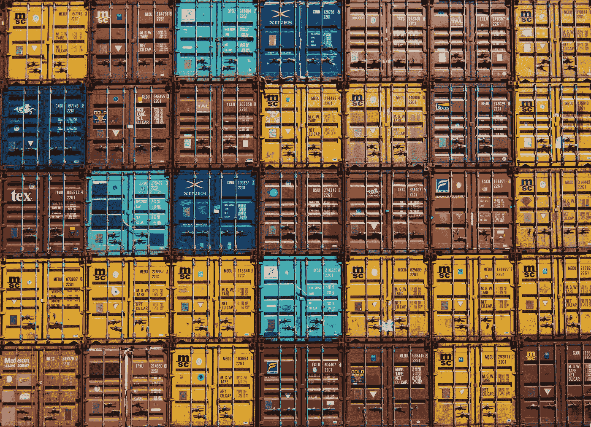

# 当今物流世界发生了什么:9/16–9/22

> 原文：<https://medium.datadriveninvestor.com/whats-happening-in-the-logistics-world-today-9-16-9-22-45741905ebe3?source=collection_archive---------29----------------------->

## 供应链团结起来对抗气候风险，宜家变得更酷，埃隆·马斯克认为他是美国宇航局等等。

# 1) Aldi 是一家小型合伙企业。

我们都知道并且热爱阿尔迪，至少我希望如此。基本上，这是有史以来最好的杂货店。我们也都知道并热爱 Instacart(如果不是，你需要跟上时代)。嗯，这两个公司已经合作，感恩节后，35 个州和 5000 个邮政编码的用户将能够在他们的虚拟购物车中装满阿尔迪食品。

Instacart 在达拉斯、亚特兰大、芝加哥和洛杉矶进行了几个试点项目，最终都获得了积极的回应。由于这些飞行员有如此高的成功率，所以两人联手是显而易见的。

我不知道你怎么想，但我对此超级兴奋。主要是因为我可以在 Aldi 购物，而不会感到极度不知所措。

# 2)供应链中的气候风险？

气候风险正成为企业检查供应链的主要部分。由于这是一个每个人都需要意识到的问题，[大公司已经联合起来改善他们的供应链实践](https://www.triplepundit.com/2018/09/top-companies-come-together-to-fight-climate-risk-in-supply-chains/)，并采取行动应对气候风险。

可口可乐和玛氏公司只是加入气候弹性价值链领导者平台的众多公司中的两家。这个数字平台旨在通过提高对气候风险的认识，帮助企业建立更具弹性的供应链。

物流和供应链行业再次走到一起。

# 3)宜家紧跟潮流，推出零排放汽车。

宜家非常酷，和其他几家公司一起提供零排放汽车。[到 2020 年，宜家的目标是实现零排放的送货上门服务。](http://fortune.com/2018/09/16/ikea-zero-emissions-delivery-2020/)此次活动的目标城市将是阿姆斯特丹、纽约、巴黎、洛杉矶和上海。进入这 5 个城市的运输将主要由电动汽车完成。

太棒了。

# 4) Postmates 筹集 3 亿美元风险资金。

啊，另一个我最喜欢的应用程序。如果你从未听说过 Postmates(如果你没有，我会非常生气)，它们就像 Instacart 和 Ubereats 的组合。所以基本上，他们会给你送杂货，还会从露丝的克里斯那里给你拿晚餐。多酷？！

Postmates 宣布他们已经获得了 3 亿美元的风险投资，这笔投资由 Tiger Global Management 牵头。伴随着这笔资金而来的还有一个消息，他们这一年的增长打破了记录！

恭喜你，邮局主管。我超级为你骄傲。

# 5)马士基与 Damco 强强联手。

世界最大的集装箱运输公司马士基航运公司宣布，他们将与 Damco 供应链服务公司合并。这次合并将于 2019 年 1 月 1 日进行。马士基表示，这次合并将通过创造更少的接触点和更广泛的服务提供来增强整体客户体验。

这对于许多人来说并不奇怪，因为马士基在过去几年里一直试图重建他们的整体商业模式。

# 其他新闻你应该看看。动手吧。你知道你想。

## 1)货运初创公司筹集 1.85 亿美元资金。干得好，护卫队！

 [## 数字货运初创公司 Convoy 融资 1.85 亿美元，价值超过 10 亿美元

### 数字货运预订初创公司 Convoy 在由谷歌母公司的一家投资机构牵头的一轮融资中筹集了 1.85 亿美元

www.wsj.com](https://www.wsj.com/articles/digital-freight-startup-convoy-raises-185-million-surpasses-1-billion-in-value-1537524002) 

## 2)佛罗伦萨飓风袭击严重，但北卡罗来纳州获得 1400 万美元的修复费用。

 [## 佛罗伦萨飓风过后，北卡罗来纳州获得 1400 万美元用于基础设施维修

### 交通部下属的联邦公路管理局宣布拨款 1400 万美元用于…

www.supplychaindive.com](https://www.supplychaindive.com/news/DOT-14-million-relief-funds-north-carolina-florence/532953/) 

## 3)埃隆·马斯克基本成了 NASA。

 [## SpaceX 将搭载一名日本亿万富翁(还有艺术家！)2023 年绕月

### 一名日本亿万富翁和一群艺术家最早将于 2023 年造访月球，成为第一位私人…

www.space.com](https://www.space.com/41854-spacex-unveils-1st-private-moon-flight-passenger.html) 

*有其他好的物流消息吗？！请在下面的评论中告诉我。当然，请随时在 LinkedIn 上与我联系，告诉我我做得有多棒。谢了。拜拜。*