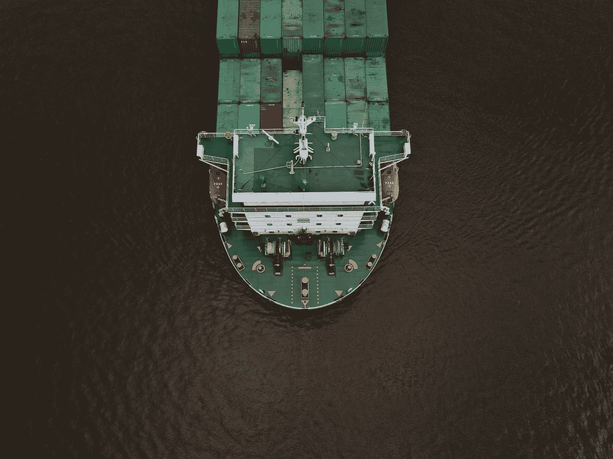
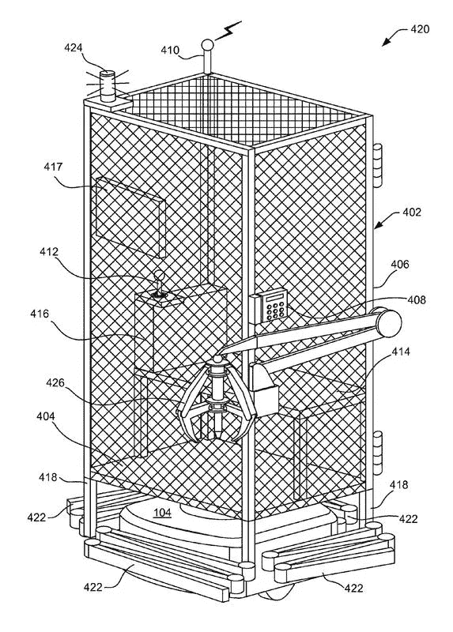

# 当今物流世界发生了什么:9 月 9 日–9 月 15 日

> 原文：<https://medium.datadriveninvestor.com/whats-happening-in-the-logistics-world-today-9-9-9-15-42284a575ed8?source=collection_archive---------14----------------------->

## 优步、亚马逊和沃尔玛正在接管世界。

# ①冰淇淋的优步？说什么？！

我的梦想刚刚实现了。不撒谎。通用磨坊为冰淇淋品牌哈根达斯发布了第一款点播应用。这款名为 HaagenDazs Now (clever)的应用程序将允许顾客订购冰淇淋，并在任何地点送货上门，即使他们没有站着不动。

现在，我们都知道直接向消费者交付并不是一件新鲜事。有了 UberEats、Dinner Delivered(查塔努加之类的东西)、GrubHub 等应用，哦，更不用说我在上一篇博文中偶然提到的送咖啡的无人机了，冰淇淋赶上这股潮流只是时间问题。唯一不同的是，哈根达斯是唯一一家真正将顾客送到任何地方的食品配送服务，即使他们在商店之间走动，比如从塔吉特百货到老海军。

数数。我。英寸

# 2)沃尔玛开始涉足物流领域。

是的，真的。[沃尔玛将加倍支出，希望吸引新的卡车司机，为他们提供高达 1500 美元的推荐奖金](https://www.bloomberg.com/news/articles/2018-09-10/walmart-expects-to-double-its-truck-driver-recruitment-spending)——这将通过电子商务和交付能力提升他们的整体网络。[有了这笔投资，它将确保商品从配送中心转移到实体店。](https://digiday.com/retail/bolster-e-commerce-push-walmart-increases-investment-logistics/)

除此之外，[沃尔玛以高达 2 . 25 亿美元的价格收购了 corner shop Inc .](https://news.walmart.com/2018/09/13/walmart-to-acquire-cornershop-in-mexico-and-chile-further-investing-in-last-mile-delivery-and-strengthening-omnichannel-strategy)帮助超市按需送货，这将特别针对墨西哥和智利。Cornershop，Inc 基本上就像我们的 Shipt 或 Instacart 版本。

你可以在下面查看更多关于 Cornershop，Inc .的信息。

 [## 街角商店

### 我们去了超市的街角小店，一小时后回来。

cornershopapp.com](https://cornershopapp.com/) 

# 3)区块链换食物？

Ripe.io，又称 [Ripe Technology，筹集了 240 万美元的种子资金。](https://www.freightwaves.com/news/startup-working-for-more-transparent-food-supply-chain-raises-24-million-in-seed-funding)你问什么是种子基金？嗯，这是一种基于股权的融资，投资者在企业的早期阶段对其进行投资。基本上，它帮助公司开始运作。也许你会在鲨鱼池里看到。这笔资金是由马士基成长和津津乐道工程完成的。

关于成熟技术，我只说一点:他们为食品和农业行业提供区块链技术。他们的使命是为食品提供透明度，这是通过一个技术平台实现的，该平台允许供应链上的每个人，从生产者到经销商，都能够跟踪食品的旅程。

我在下面提供了他们的网站信息。

 [## 熟了——让我们来谈谈我们食物的质量

### Ripe.io 正在通过区块链技术和物联网改变食品系统的轨迹。由…

www.ripe.io](http://www.ripe.io/) 

# 4)亚马逊又来了。

[亚马逊已经获得了一项专利](http://www.bostonherald.com/business/business_markets/2018/09/amazon_has_patented_a_system_that_would_put_workers_in_a_cage_on?mod=djemlogistics_h#.W5aBKvKQk6c.twitter)，它将把人和机器配对，而不仅仅是任何一种机器——笼子。真的，亚马逊？！真的吗？！这种类型的“机器”是一个笼状外壳，位于手推车顶部，驱动仓库周围的货架。虽然亚马逊从未实施这项专利，并表示他们不打算这样做，但这台机器的设计是为了让工人能够以安全的方式进入机器人专用区。

请记住，这只是亚马逊的众多专利之一。其他产品包括跟踪工人手部动作的腕带，从 25 英尺高的无人机上扔下包裹，或者最酷的一种——让无人机连接起来形成一个浮动仓库。

让亚马逊来想出疯狂的专利创意吧。保持金色，亚马逊。

如果你想知道，这里有一张亚马逊最新专利的照片:

What a creepy looking cage, Amazon.

# **其他你应该完全了解的好消息:**

## 1)好像乐高再酷不过了，他们决定造一辆能开的车。但是，不是一般的车，是该死的布加迪。什么？！

 [## 乐高用 100 多万块技术材料建造了一辆真人大小的可驾驶的布加迪

### 这可能是人们用乐高建造的最疯狂的东西，积木背后的公司建造了一个…

techcrunch.com](https://techcrunch.com/2018/08/30/lego-built-a-life-size-drivable-bugatti-from-over-a-million-technic-pieces/) 

## 2)终于，一家公司在产假问题上达成一致。人们生孩子。不要因此惩罚他们。谢了。

 [## 微软将开始要求合作伙伴和供应商提供带薪探亲假

### 微软将开始要求商业伙伴和供应商提供带薪探亲假，该公司在博客中说…

www.cnbc.com](https://www.cnbc.com/2018/08/30/microsoft-will-require-partners-suppliers-to-offer-paid-family-leave.html) 

## 3)无人机帮助救灾？物流终于与时俱进了。

 [## 波多黎各无人机测试最后一英里救灾

### 无人机载着时间紧迫和温度敏感的药物上周在波多黎各上空飞行，因为五个寒冷…

www.supplychaindive.com](https://www.supplychaindive.com/news/drone-disaster-relief-medical-supplies-Merck-ATT/531316/) 

## 4)亚马逊又一次试图接管世界。这里没什么新鲜的。

 [## 亚马逊订购 2 万辆货车用于最后一英里送货计划

### 作为 6 月份宣布的最后一英里计划的一部分，亚马逊向梅赛德斯-奔驰订购了 20，000 辆货车，该计划将招募…

www.supplychaindive.com](https://www.supplychaindive.com/news/amazon-20000-vans-mercedes-benz-delivery-last-mile/531732/) 

*有其他很酷的物流新闻吗？！请在下面的评论中告诉我。当然，请随时在 LinkedIn 上与我联系，告诉我我做得有多棒。谢了。拜拜。*