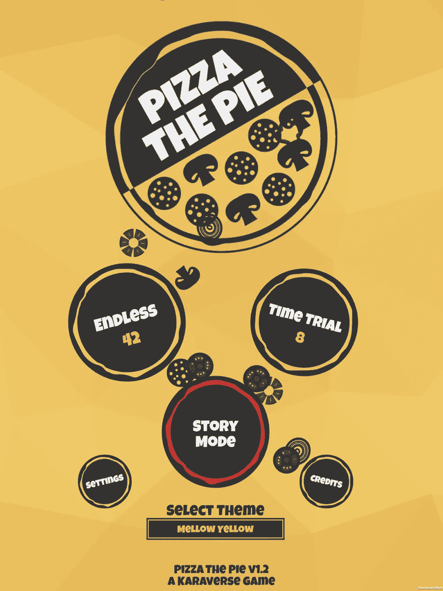
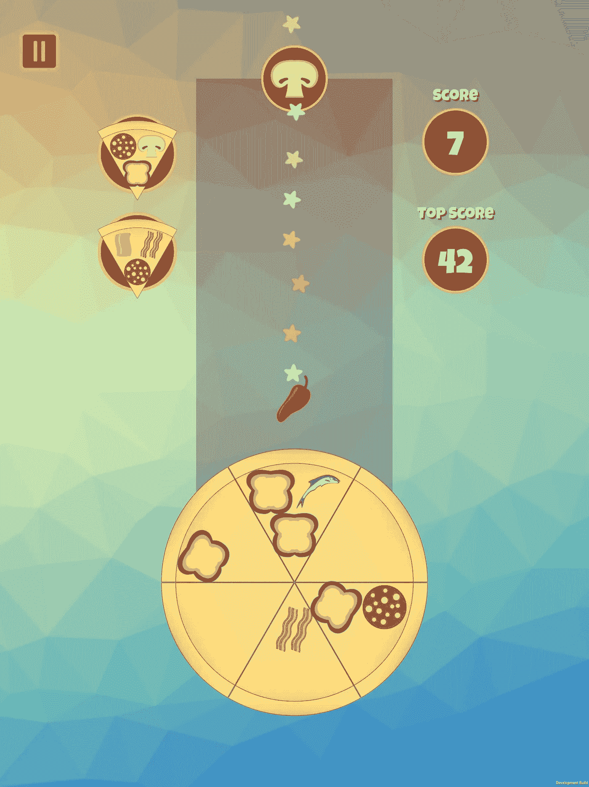
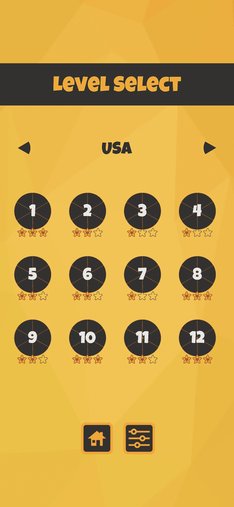
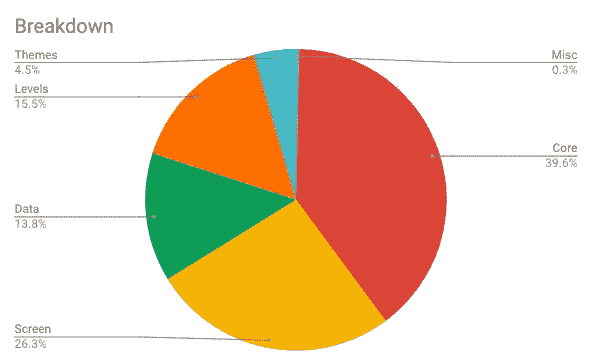
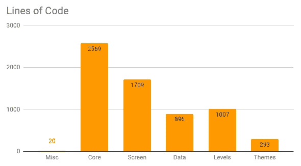

# 游戏里有什么？超过 7500 行代码的惊人分析

> 原文：<https://medium.datadriveninvestor.com/whats-in-a-game-the-surprising-analysis-of-over-7500-lines-of-code-1fb9f0ca6529?source=collection_archive---------2----------------------->

去年，我决定是时候制作我的第一个视频游戏了。虽然我有丰富的网站建设经验，但视频游戏是一个完全不同的领域。挑战相当不同。焦点不是浏览器兼容性，而是平台和操作系统的差异。没有前端和后端的概念(除非你处理在线游戏)。你不能只是推出一款游戏，然后用时间来修正它，第一印象比网站重要得多。营销也极其重要。对于视频游戏，你需要大肆宣传，而网站是在发布后逐渐成长的。使用网站的摩擦也比从应用商店下载游戏要少得多。

我在 12 月推出了 iOS 版的[披萨饼](https://pizzathepie.app)。在对游戏的开发进行事后分析时，我决定看看我在哪里花了最多的精力。虽然编码和图形之间的分裂相当均匀，但是深入编程揭示了一些有趣的信息。

我的分析是在 1.2 版本发布后完成的，这增加了对 iPad 的支持，也意味着我现在可以同时支持纵向和横向。我把所有东西都分成了以下几类:

1.  **核心(游戏性和事件)**
2.  **等级(和等级标准)**
3.  **数据(保存和加载)**
4.  **屏幕(屏幕、弹出窗口和用户界面)**
5.  **主题(背景、音乐和音效)**

## 核心和游戏性

我在制作披萨饼时的主要目标之一是确保游戏尽可能简单。有几条规则是我从一开始就确定的，并且我总是确保遵守。每块披萨总有三种配料，每块披萨正好有六块，游戏可以用一只手在触摸屏上玩。

比萨饼馅饼相当简单。有从天而降的浇头。您需要旋转比萨饼，以便配料形成与订单菜单中的比萨饼切片相匹配的比萨饼切片。当然，这将变得重复，所以我不得不添加一些额外的元素，使游戏更加动态——奖金，连击，定时器，炸弹等等。其中一些是为了帮助你摆脱困境，而另一些却给你珍贵的披萨片带来了灾难。

控制也非常简单:用手指旋转披萨，双击屏幕快速放下配料。这就是全部了。你可以玩游戏，吃一块你想要的披萨。

## 级别

主屏幕上有三种模式可供选择:故事、无尽和计时赛。在内部，这些被认为是级别。虽然我在 AppStore 上宣传 Pizza The Pie 只有这三种游戏模式，但事实是实际上有近 8 种不同的游戏方式。故事模式有 58 个级别，分为 5 个区域。每个地区都有自己的主题，并引入了新的游戏元素。

例如，美国增加了帮助清除坏切片的组合，而欧洲则引入了“酸弹”，彻底改变了游戏的焦点。像其他几乎所有的手机游戏一样，每一关都有三颗星。获得这些星星的标准也随着等级的不同而不同:使用的浇头数量，完成的时间，完成的组合等等。

无尽和时间考验实际上是故事模式中已经存在的两种模式，但它们被进一步扩展，具有额外的功能和 UI 元素。

## 保存和加载数据

每个世界都有自己的保存文件，无尽和计时模式也是如此。我在追踪每个关卡和每个玩家的大量设置。等级设置包括最好的分数，最好的时间，最大的连击，连击的数量，以及你获得了多少颗星等等。把玩家设置想象成关卡设置，但是贯穿整个游戏:你玩了多少游戏，总玩时间，总赢数，总输数，完成的总切片数等等。所有这些信息都存储在本地，从不与任何人共享。这纯粹是比萨饼内部工作所需的数据。

## 屏幕和用户界面

不涉及任何细节，这里是所有需要某种形式的代码才能工作的屏幕:标题屏幕，关卡选择，关卡细节，胜利飞溅，失败飞溅，暂停菜单，教程，设置，故事和学分。所有这些都支持横向和纵向模式，所以我需要以编程方式移动某些 UI 组件。在布局元素时，我还会考虑屏幕尺寸。除了屏幕之外，还有各种通过代码处理的图标。订单菜单、当前分数和计时器等等。

## 主题

一个用户可以选择自己的主题进行无休止的和时间的考验。在故事模式中，主题是预先选定的。也有各种声音效果，根据你的动作在整个游戏中播放。点击按钮、放置浇头、炸弹爆炸等。所有这些都由主题管理器、音乐管理器和音效管理器来处理。

所以你有它。这五个主要组成部分构成了 Pizza 馅饼的代码库。

# 崩溃

在开始做 Pizza The Pie 之前，我的假设是:85%的代码是游戏性的，10%是屏幕，剩下的 5%是我没有仔细考虑过的。我肯定会大吃一惊。我在两个月内完成了大部分的游戏，我预计还需要一两个月来完成剩下的工作，包括艺术资产的创造。细节决定成败，花了将近九个多月才完成一款游戏。

在检查了 7500 多行代码和 81 个 c-sharp 文件(删除了所有的注释和变量声明)之后，代码被分解成这样。

Breakdown by lines of code

# 结论

正如我在我的第一篇文章《我如何制作我的第一个视频游戏》中提到的，制作一个视频游戏不是一件容易的事情。难的不一定是编码——实际完成和推出游戏所需的计划、时间和投入可以说更难。我的建议是:保持简单，高估一切。我从没想过我的游戏会有 7500 多行代码。核心游戏甚至不代表总代码库的 40%。所有其他被认为是理所当然的元素实际上都是巨大的时间推移。这些数字不包括我花在创作(和再创作)艺术品上的时间，不仅是为了游戏，也是为了它的推广。我建的网站。投入营销和研究的努力量。新闻资料袋。测试期。像这样的文章。

这是一次学习的经历，而且很有趣。我不知道我是否会制作另一款游戏，但我会专注于进一步改进 Pizza The Pie，并把它带到更多的平台上。

我希望你喜欢这篇文章，并希望它能帮助你构建一个视频游戏。喜欢就鼓掌，别忘了试试 iPhone 和 iPad 上的[披萨饼](https://itunes.apple.com/app/id1411752306?fbclid=IwAR0H7t755xrRuIQJWCvqXUNCR_X0uo8b7V2ZbcscYR_Lz9BIFoZa7RBOlLY)。

## 来自 DDI 的相关故事:

 [## 数据科学和软件工程哪个更有前途？

### 大约一个月前，当我坐在咖啡馆里为一个客户开发网站时，我发现了这个女人…

medium.com](https://medium.com/datadriveninvestor/which-is-more-promising-data-science-or-software-engineering-7e425e9ec4f4)