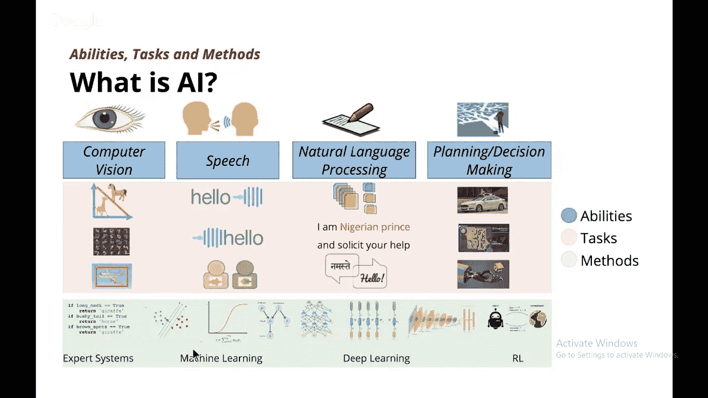

# “行话里有什么？”

> 原文：<https://medium.datadriveninvestor.com/whats-in-a-jargon-e9e6a5e4420b?source=collection_archive---------15----------------------->

Credits:One Fourth Labs

## AI|ML|CV|NLP|DS

*   **Khangjrakpam Arjun，南亚 University(yooarjun@gmail.com)**

哈佛大学将数据科学家这一职业称为“*21 世纪最性感的工作*”这些天你一定遇到过很多令人困惑的术语，比如数据科学(ds)、人工智能(AI)、机器学习(ML)、图像处理、模式识别、计算机视觉(CV)等等。在报纸、社交媒体和互联网上。我们听说人工智能驱动的汽车、机器、医疗保健、制造业、智能城市、智能交通等。影响着我们生活的几乎每一个领域及其潜力。那么，你难道没有想到，为什么与人工智能相关的工作不应该是本世纪最酷的工作，为什么我们不应该努力开发这些由人工智能驱动的应用程序？如果 AI 有这么大的影响，数据科学是最酷的工作，这些是一样的吗？作为一个 DS、DL、ML、AI 领域的新手，我不确定我实际上适合哪个领域，我越是试图将它们分开，对我来说就越没有意义。这是因为有多层重叠的领域，但没有两个领域可以合并成一个术语吗？为什么我们会有书名为《模式识别与机器学习》的书？模式识别和 ML 是一样的吗，如果是，那么为什么我们有不同的术语，如果它们是不同的，那么为什么不为两者分别出一本书呢？当我们听到像艾伦·图灵数据科学和人工智能研究所这样的研究机构的名字时，你是否也感到惊讶，为什么“数据科学”和“人工智能”这个词会一起使用？这个行话似乎有很多混乱。你准备好打破这个行话了吗？坚持到最后。

让我们先来看看这些术语的定义。韦氏词典将**人工智能**定义为:

> 计算机科学的一个分支，研究计算机智能行为的模拟。

它还将**机器学习**描述为:

> 计算机通过不断将新数据纳入现有统计模型来提高自身性能(如分析图像文件)的过程。

亚当·皮-奥雷说过:

> 被称为*机器学习*的整个专业致力于**构建算法**，允许计算机基于经验开发新的行为。

那么，ML 和 AI 不同是因为它涉及到构建算法吗？ML 也包括构建算法吗？同样，当我们研究人工智能时，它是否不涉及学习和数据，而这些是机器学习和数据科学等术语的一部分。当我们在人工智能的定义中看到“模拟”这个词时，你不会想到“它是如何模拟的”这个问题吗？仅仅阅读这两个术语的定义就给了我们一个非常模糊的画面。维基百科将数据科学定义为:

> 数据科学是一个[**跨学科**](https://en.wikipedia.org/wiki/Interdisciplinary) 领域，它使用科学的方法、流程、算法和系统从各种形式的****数据中提取**知识和见解，包括结构化和非结构化。******

******但是人工智能也是一个多学科领域，应用于医疗保健、制造、空间技术、农业、国防等。如果我们看看目前人工智能研究的领域，它有适应性学习，文本解析，模式识别，专家系统，语音识别，自然语言等。因此人工智能是多学科的。所以多学科不是区分 AI 和数据科学的标准。******

******让我们来了解一下人工智能的定义。我们可以把它分为三个平台: **1。能力:**它可以被归类为计算机可以拥有的能力，如计算机视觉(CV)、语音、自然语言处理、计划/决策等。******

******2。任务:**从图片中检测文字，识别语音，识别特定语言等。****

******3。方法:**专家系统、机器学习、深度学习、强化学习等。****

****如果一个系统可以使用 SVM 或神经网络来区分鸟类或动物，那么它只是人工智能的一小部分，只能完成特定的任务，而不像人类可以识别模式、语音、做出决定或计划等。这个系统仍将是一个人工智能支持的系统。因此，人工智能包括这些能力、任务和方法的任何或所有不同组合。****

****现在让我们看一个机器学习的例子。假设一个系统想要从大量不同的图片中识别一只猫。首先，我们必须给出包含猫的图片的不同的标记数据集，并且还提供我们认为与标记数据集和函数有关系的函数，该函数可以由 SVM 方程或人工神经网络函数捕获，并且告诉计算机计算函数的参数。我们看到人工智能包含了我们迄今为止看到的所有任务，包括人工智能。****

****看看模式识别，模式识别的现代定义是:****

> ****模式识别领域涉及通过使用计算机算法自动发现数据中的规律，并使用这些规律采取行动，例如将数据分类成不同的类别。****

****如果我们看看计算机视觉、语音和 NLP，它们的任务中都有模式识别，即识别和发现数据中的规律模式，并通过计算机算法使用这些规律，采取诸如分类、回归、聚类、生成等行动。因此，大多数人工智能任务都涉及模式识别。因此，这些任务中的每一个都跨越了不同的能力，并且可以通过不同的方法来解决。****

****接着讲**图像处理**，和计算机视觉有区别吗？*图像处理摄取图像并给出图像*。在计算机视觉中，如果我们要进行图像分类，它会获取一幅图像并给出该图像的类别。通过图像处理获得的相同结果可以使用机器学习算法来实现。****

*******现在，数据科学是人工智能的一部分，还是反过来，或者两者都不是？*******

****在数据科学中，我们可以使用最大似然算法来预测销售结果、业务增长、利润等。用于数值和结构化数据。所以，如果我们在处理图片数据，最好叫 ***计算机视觉*** ，带语音数据— ***语音*** ，带文本数据— ***自然语言处理*** 。既然文本、语音、数字、图片都是数据，看看科学的定义:****

> ****科学是智力和实践活动，包括通过**观察**和**实验**对**物理**和自然世界的结构和行为的系统**研究**。****

****人们可以说，在 NLP 工作的人也在从事数据科学工作，在计算机视觉工作的人也可以说是在从事数据科学工作。在分解任务的特殊性和与之相关的术语之后，将处理 NLP 的人识别为从事 NLP 而不是数据科学的人会更好，也更准确，因为数据科学的范围更广，也更令人困惑。****

*******最后，深度学习和 AI、机器学习有区别吗？*******

****深度学习是机器学习的子集，机器学习是 AI 的子集。因此，AI 是最初爆发的无所不包的概念，然后是后来蓬勃发展的 ML，最后是有希望将 AI 的进步提升到另一个水平的 DL。有趣不是吗？****

****因此，可以看出，所有这些行话似乎在不同的地方有所重叠，但如果我们处理的是具体的任务，那么这些任务中的每一项都有具体的术语，不能与具有更广泛含义的术语相混淆。我希望我已经在某种程度上成功地为你解开了这个术语之谜。****