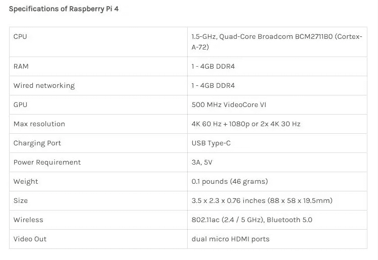
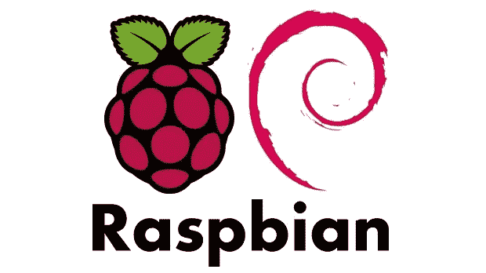
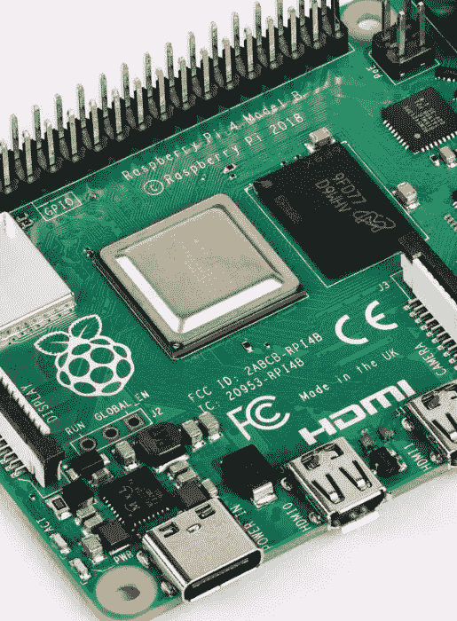
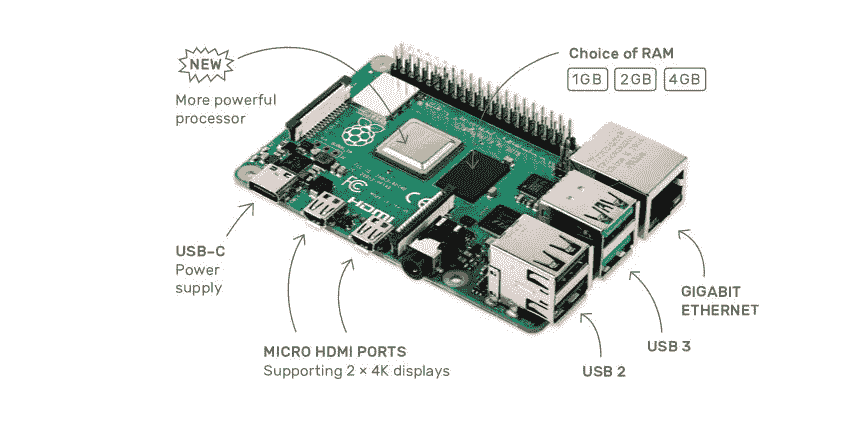

# Raspberry Pi 4 的新特性——规格和特性

> 原文：<https://medium.datadriveninvestor.com/whats-new-in-raspberry-pi-4-it-s-specifications-and-features-ce9bc4cbd07c?source=collection_archive---------7----------------------->

去年，推出了“经典树莓派”的最终版本，我们可以说这是一次进化，而不是一次革命。Raspberry Pi 3 的两种型号，即 A+型和 B+型主板都耗尽了平台的最后一点可用性能。从一开始，基金会就明确要做一些比上一次更有趣的事情。在了解树莓 Pi 4 的特性和规格之前，先给大家介绍一下“什么是树莓 Pi”？

基本上，Raspberry Pi 是一种低成本、信用卡大小的计算机，可以插入计算机显示器或电视，并使用标准的鼠标和键盘。这个小设备使人们能够探索计算，并学习如何用 Python 和 Scratch 等语言编程。单板计算机能够做你期望从台式计算机得到的一切，即从浏览互联网和播放高质量视频到制作电子表格、玩游戏和文字处理。此外，Raspberry Pi 具有与外部世界互动的能力，并已被广泛用于各种数字制造商项目，从机器、音乐和专利探测器到气象站和带红外摄像头的推特鸟舍。你可以看到 Raspberry Pi 正在被世界各地的孩子所采用，以便学习程序并建立对计算机如何工作的理解。

 [## 认识 Raspberry Pi——革命性的计算设备——数据驱动的投资者

### 计算机过去笨重、昂贵且难以操作的日子一去不复返了。随着技术的进步…

www.datadriveninvestor.com](https://www.datadriveninvestor.com/2019/01/23/meet-raspberry-pi-a-revolutionary-computing-device/) 

我们都认为这需要一些时间；直到明年，人们才真正考虑更新和新版本的树莓。但是，几天前，我们对树莓派 4 感到惊讶。新的树莓 Pi 4 是一个完全不同的野兽，尽管它的表面看起来很像以前的树莓 Pi 模型。与早期的 Raspberry Pi 板相比，这里有一些激进的架构变化。

**新拉斯贝恩软件**

基于即将发布的 Debian 10 Buster 发布了一个彻底翻新的操作系统，它支持 Raspberry Pi 4。它通过广泛的现代化用户界面在幕后进行了几项技术改进，更新的应用程序包括 Chromium 74 web 浏览器。因此，建议那些愿意马上使用拉斯贝恩克星的人。在这个意义上，我们强烈建议你下载新的图像，而不是更新当前的卡。由 Broadcom 的 Eric Anholt 开发的 Mesa“V3D”驱动程序在过去五年中被用于 Raspberry Pi。该软件的优势包括——OpenGL 加速的网页浏览和桌面合成，能够在 x 下的窗口中运行 3D 应用程序。该软件还减少了平台中大约一半的封闭源代码行。

**看看新特性:**

**处理器—**

在 Raspberry Pi 4 中，有一个封装的处理器，它获得了相同的散热器以实现更好的热控制，因为他们早期的模型从外面看起来可能很相似。由于 Raspberry Pi 3 是由 Broadcom BCM2837 处理器和主频为 1.4GHz 的四核 Arm Cortex-A53 构建的，所以新的是由 Broadcom BCM2711 和主频为 1.5 GHz 的 64 位四核 Arm Cortex-A72 组成的。然而，这似乎并不重要，因为这两种处理器的核心架构之间已经存在一些差异。

虽然 A53 被设计为中档内核，但就性能而言，A72 可能是一个性能内核，因此尽管时钟速度上的差异很小，但内核之间的重要性能差异绝对相当重要。据概述，新的树莓 Pi4 运行速度比以往任何时候都快，快得足以取代普通用户的桌面。

**USB 和以太网-**

然而，在所有可能性中，与以前型号最显著的区别是，由于 USB hub Associate 为 Pi 提供局域网控制器而发挥作用的硅芯片 LAN7515 在新主板中缺失。取而代之的是 VLI VL805，它通过 PCI 专用总线提供 USB 3.0 集线器。新 BCM2711 提供的 PCI Express 总线意味着它具有 3.0 USB 的能力，此外，千兆以太网现在在单独的总线上为 Broadcom BCM54213PE 提供 USB 流量。它标志着新的 Raspberry Pi four 拥有“真正的”千兆局域网，而不是像我们通常看到的 Raspberry Pi three，Model B+那样受到限制。是的。你察觉到了。新的 Raspberry Pi 板具有每个“真正的”千兆位 LAN 和 2 个 USB 3.0 端口，同样还有几个额外的“传统”USB 2 端口。

**无线支持-**

Raspberry Pi4 也提供无线支持，它是一个 RF 屏蔽模块，采用的是与 Raspberry Pi 3 型号 B+相同的 Cypress CYW43455 芯片。此外，它还提供双频 2.4 GHz 和 5GHz IEEE 802.11.b/g/n/ac 无线网络以及蓝牙 5.5 和蓝牙 LE。为了完整起见，最终的大规模芯片——位于 most 处理器封装的正确位置——是用于主板的 LPDDR4 SDRAM，它采用微米 FBGA 封装芯片的形式，这可能是与以前的 Raspberry Pi 型号的另一个巨大区别。

**记忆-**

为了完成芯片的最后一位，它位于主处理器封装的右侧。用于主板的 LPDDR4 SDRAM 采用微米 FBGA 封装芯片的形状，这是与以前的 Raspberry Pi 型号的另一个巨大差异。与以前的任何主板不同，新的 Raspberry Pi 4 现在有三种不同的型号，其中每一种都提供不同的内存选项，如 1GB、2GB 和 4GB 的 RAM。

**给电路板供电-**

另一个巨大的区别是电源插孔，以前型号的小 USB 插孔不见了，取而代之的可能是 USB-C 插孔。这是一个明显的修正案。Raspberry Pi three 型号 B+的设备报价容差已经非常小，因此新板将需要高达 3 安培的电流，这不是以前的小型 USB 报价可以提供的。

**新官方电源-**

随着从小 USB 到 USB-C 的切换，官方提供了一种替代电源。但是，尽管 USB-C 充电器的零售价格通常在 10 美元到 60 美元之间，但新的 15W 官方报价仅为 8 美元，这有点打破市场。因此，很多人甚至没有意识到树莓派的价值。此外，就像最初的小型 USB 报价一样，新的 USB-C 电源报价被设计为影响报价，而不是充电器。