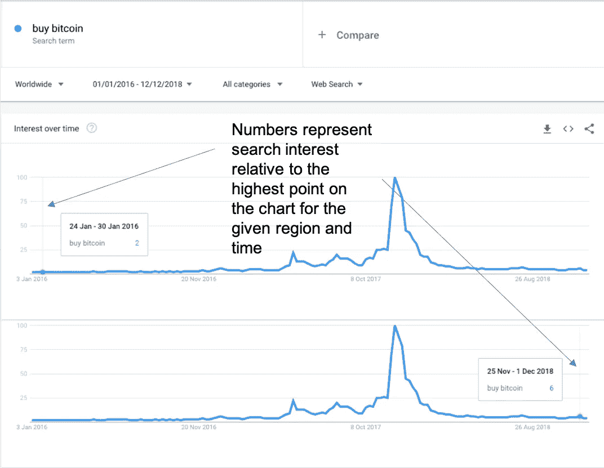
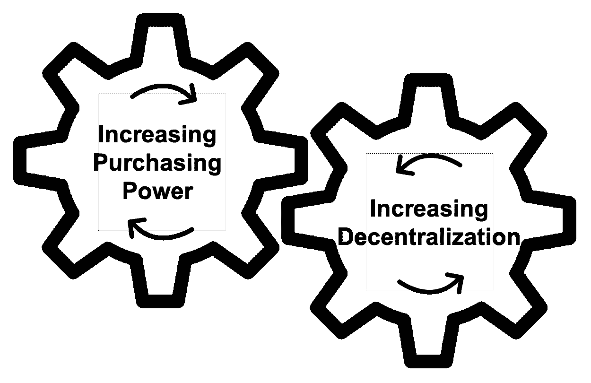
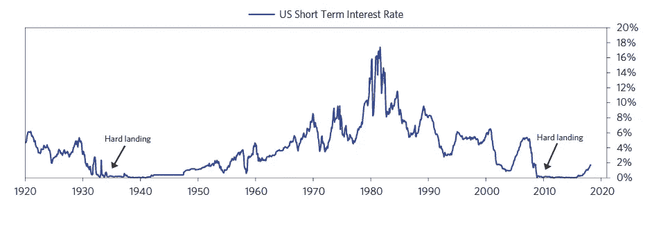
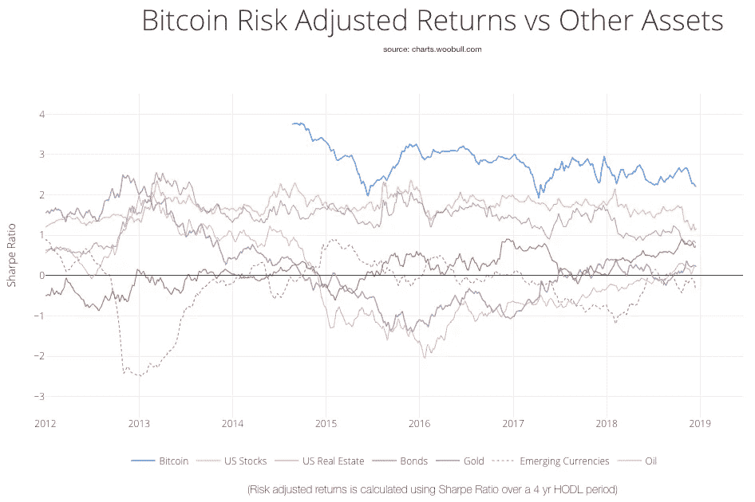

# 比特币的下一步是什么:2019 年及以后

> 原文：<https://medium.datadriveninvestor.com/whats-next-for-bitcoin-2019-and-beyond-5202bafa62dc?source=collection_archive---------1----------------------->

在撰写本文时，你可以用大约 3400 美元(USD)购买一个比特币。自 2017 年 12 月 11 日达到 19380 美元的历史高点以来，比特币的价值已下跌超过 80%(数据来自比特币基地)。尽管如此，比特币仍在进步…

即使在过去 12 个月购买力大幅下降后，今天使用比特币的人比 3 年前还多。谷歌趋势的数据可以说明这一点，该数据表明，与 2016 年初相比，现在搜索“购买比特币”的人数增加了 3 倍。

Source: Google Trends Search Tool

比特币仍然非常活跃。然而，在过去 12 个月购买力大幅下降后，人们问得最多的问题可能是:“如果比特币今天没有发挥货币的功能，它为什么会在未来发挥这些功能？”

在这篇文章中，我将讨论两个关键问题:(一)比特币的货币化路径，因为它对我有意义；以及(ii)在未来 3-5 年内会发生什么样的大规模变化来帮助比特币走上这条货币化之路。

# **重要原则**

首先，*比特币是货币*。如果你拥有比特币，只有当其他人用他们持有的商品、服务或其他货币从你这里接受比特币时，你才能获得回报。一枚比特币(或比特币的一部分)不是一家提供现金流追索权的公司的股份；优惠权利；股息流；或按比例分享公司的清算价值。它也不像石油那样可以在生产中消耗殆尽。

虽然这似乎是一个非常简单或无伤大雅的区别，但它实际上非常重要，因为要理解比特币的微妙之处，你必须从货币的角度来分析它。

此外，现实是比特币的发明创造了*一个自由的货币市场*。其结果是，决定持有、支出和接受多少资金的将是供求关系，而不是监管。这很重要，因为自 19 世纪以来，自由的货币市场就不存在了。

# **货币的主要功能——交易媒介**

一旦我们接受比特币是货币，我们就可以开始思考货币的功能。

当我们能够彼此交换价值时，生活会变得更美好。为了进行这种价值交换，我们可以进行物物交换(用商品或服务交换其他商品或服务)。然而，物物交换通常不是一种选择，因为不可避免地，交换双方的需求、规模、时间框架或地点会缺乏一致性。

为了解决物物交换系统的缺点，我们使用一种中间商品，即货币。这样，货币的主要功能是促进人与人之间的交流。然而，仅仅因为交换某种特定商品容易或方便，并不意味着它会被社会用作交换媒介。更确切地说，特定商品必须首先具有储存价值的能力。

# **交换媒介前的价值储存**

只有当货币具有储存价值的能力时，人们才会接受货币来交换他们的商品或服务，也就是说，它是一种价值储存手段。根据定义，如果持有人可以在任何时候在市场上出售它，并收回与持有人收到或获得该商品时相同或不太相似的价值，那么该商品就是价值储存手段。

2008 年和 2009 年在津巴布韦发生的事件说明了储值要求。在某个时间点，津巴布韦人不再接受津巴布韦元来换取他们的商品或服务，因为他们不再认为这种货币有储存价值的能力。那时，津巴布韦人只接受美元作为交换，因为美元是一种优越的价值储存手段。今天在津巴布韦仍然如此。类似的事件在 20 世纪 80 年代末的阿根廷、2016 年至今的委内瑞拉以及许多其他国家都发生过。

货币储存价值的能力是由供求关系决定的。中央政府有一些锦囊妙计来确保对他们创造的货币有足够的需求。特别是，它们规定税收只能用政府的钱支付，银行系统只能用政府批准的钱开户和交易。此外，各国有法定货币法，迫使人们接受当地货币的商品和服务。

其结果是，对政府货币的需求是持续的，只要货币供应不失控，货币将在足够长的时间内保持价值(即作为价值储存手段)，人们不会偏离使用货币作为社会交换媒介。

# **比特币作为价值储存手段**

我认为可以肯定地说，至少在未来 10-15 年内，政府不太可能强制要求社会必须将比特币作为货币来使用，从而产生对比特币的持续需求。所以，比特币没有，也不会有政府钱有的尾巴风。相反，对比特币的持续需求需要有机发展。

比特币能成为价值储存手段吗？我的文章“[比特币就像黄金，但它更优越](https://medium.com/datadriveninvestor/bitcoin-is-like-gold-but-its-superior-675977c83746)”包含了黄金作为价值储存手段的解释，允许黄金作为价值储存手段的属性，以及比特币应该能够作为价值储存手段的属性。简而言之，比特币的供应上限和通缩货币政策意味着它与黄金具有相似的属性。因此，比特币很有可能在未来充当价值储存手段，就像今天黄金充当价值储存手段一样。

然而，比特币不会仅仅因为像黄金但更优越而成为价值储存手段。相反，在严格供应的同时，需要有更多的人希望用比特币储存财富。

# **有助于比特币成为价值储存手段的宏观主题**

只有对比特币的需求不断增加，比特币才能发挥价值储存的功能。尽管比特币在不久的将来不太可能发挥价值储存的功能，但它可以在中短期内继续取得进展。

以下是我认为将在未来 3-5 年内导致比特币需求增加的主要主题。

1.  **另一种加密货币取代比特币成为货币的可能性极小，这一事实的进一步证据和理解**

比特币可以作为价值储存手段的假设在很大程度上依赖于 2100 万比特币的供应上限。这种严格的供应赋予了比特币商品所需要的基本属性，以便能够发挥价值储存的功能。

然而，尽管有供应上限，许多人并不认为比特币是稀缺的。人们的想法是这样的:“因为比特币是开源软件，可以下载，稍加修改，重新分配，新的比特币将成为比特币的替代品。”对许多人来说，比特币并不稀缺，因为“你可以创造另一种加密货币，然后有 4200 万枚硬币，另一种加密货币，我们将有 6300 万枚硬币，等等。!"如果我们看看与比特币竞争的加密货币的数量，很明显，这个领域也有很多人赞同这种想法。

然而，这种心态没有考虑到这样的事实:(一)自由的货币市场往往会导致“赢家通吃”的结果；(二)随着自由货币市场经济现实的展开，让比特币变得有价值的特征得到了增强。

*(i)自由的货币市场往往会导致“赢家通吃”的结果*

比特币的存在创造了一个自由的货币市场(供求而非监管决定了持有、使用和接受哪种货币)。当货币存在自由市场时，所有人都会*只*持有购买力最强的货币(最值钱的货币)。如果在任何时候，任何人持有的一种货币相对于另一种货币的购买力下降，那么他们就会转向更强的货币。他们这样做是因为持有弱势货币会损失太多。津巴布韦人民从当地货币转向美元的例子是这一现实的一个很好的例子。

然后，随着人们转向购买力更强的货币，他们的行为同时增加了对强势货币的需求，减少了对弱势货币的需求，进一步增强和削弱了相应货币的购买力。随着时间的推移，越来越多的人为了维持生计被迫转行。

最终的结果是“赢家通吃”,一旦赢家获得了所有的价值，输的钱就变得一文不值。

(二)*随着自由货币市场经济现实的展开，比特币的价值特征得到了增强*

比特币是开放的、无边界的、去中心化的、抵制审查的、不可改变的，在这方面没有其他加密货币(或任何其他形式的货币)能与之媲美。这些特征使比特币系统能够:(I)抵制来自任何人的审查，包括强大的央行、现有金融系统的监管者和政府，如果比特币完全货币化，他们都会损失很多；以及(ii)维持预定的货币政策。

随着比特币相对于其他货币的购买力增加(作为上述动态的结果)，更多的网络参与者在经济上被激励加入比特币网络。随着这些额外的参与者开始对网络做出贡献(例如，通过运行一个完整的节点或贡献散列功率)，他们的行动进一步增强和保证了去中心化、审查阻力和不变性的重要特征。

随着比特币系统的重要功能得到增强和夸大，比特币变得更有价值，最终导致购买力增加，然后循环往复。

比特币的良性循环

Increasing purchasing power results in enhanced and exaggerated decentralization, censorship resistance and immutability, which in turn makes bitcoin more valuable, which results in an increased purchasing power and then the cycle repeats.

现在还为时尚早，没有多少人完全明白他们在参与什么，但有明显的证据表明，在这场“赢家通吃”的竞争中，比特币已经遥遥领先于竞争对手。在撰写本文时，比特币储存的总财富为 610 亿美元，而最接近的挑战者 XRP 和以太储存的总财富分别为 135 亿美元和 97 亿美元。此外，比特币系统目前每天移动 20-50 亿美元的价值，而 XRP 和以太链分别只处理 2000-2.2 亿美元和 5 亿-10 亿美元(数据来自 [coinmetrics.io](https://coinmetrics.io/) )。

“赢家通吃”的结果可能只会慢慢显现，我们可能需要很多年才能达到终点。然而，随着时间的推移，越来越多的人会越来越清楚，比特币没有替代品。随着越来越多的人开始理解，我们可以预计会看到对比特币的更多需求，因此会有更多的财富储存在比特币中。

**2。经济不稳定**

2018 年 12 月 3 日，美国 3 年期国债收益率超过 5 年期国债收益率，这是 10 多年来的第一次。在金融界，这是可怕的“反向收益率曲线”的第一个迹象，这种曲线出现在美国过去的七次衰退之前。

这还不算悲观，但如果 3 个月期国债收益率超过 10 年期国债收益率，那么历史表明美国将经历衰退。由于美国是世界上最大的经济体，与世界上许多其他经济体相连，他们经历的任何衰退都可能影响到世界的大部分地区。

国债收益率由市场供求原则决定，你可以在[这个](https://www.treasury.gov/resource-center/data-chart-center/interest-rates/Pages/TextView.aspx?data=yieldYear&year=2018)官方政府网站上关注每日走势。3 个月和 10 年之间的利差越来越近，在撰写本文时，它只有 2018 年初的 36%。这是值得关注的事情。你可以在这里和[这里](https://www.investopedia.com/articles/investing/101314/importance-us-treasury-rates.asp)阅读更多关于是什么导致了美国国债收益率的变动。

下一次经济衰退会如何发展？

布里奇沃特联合公司(Bridgewater Associates)的创始人兼首席投资官雷伊·达里奥一段时间以来一直在谈论他预计下一次低迷将如何结束。他的观点是，政策制定者将无法像 2008 年那样迅速纠正这种状况，我们不会看到另一个像 2010 年至 2018 年那样的十年经济增长和资产价值升值。

为了应对 2008 年的债务危机，各国央行将短期利率降至 0%，并大量印刷钞票购买金融资产(后一种措施被称为“量化宽松”)。这些措施刺激了消费，经济得以复苏。

然而，这一次，同样的杠杆不一定会像 2008 年那样有效或可用。这是因为短期利率比 12 年前低(美国现在是 2.5%，而 2007 年是 6%)，在社会开始质疑货币的价值和稳定性之前，量化宽松(印钞)只能使用这么多次(这会带来中央政府希望避免的一系列问题)。在这个简短的[视频](https://www.youtube.com/watch?v=4eBoFSVakdo)中，Dalio 先生提供了一个广泛的概述，他还写了一本书，名为“[理解重大债务危机的模板](https://www.principles.com/)”，其中包括“48 个案例研究的概要”，涵盖了过去 100 年中发生的大多数重大债务危机。

他的观点是，当前的形势类似于上世纪 30 年代末。如果这是正确的，那么这一点意义重大，因为从那个时期开始，利率上升了 40 年。这与我们过去 35 年所经历的情况相反，在过去 35 年里，利率一直稳步下降，接近于零。

美国短期利率

Short-term interest rates have been declining for the past 35 years. Source: A Template For Understanding Big Debt Crises, Ray Dalio.

如果你想知道其他主要经济中心的利率是什么样的，中国是 3%，日本是 0%，欧洲是 0%。

*这对比特币意味着什么？*

随着利率的提高，20 世纪 30 年代末和 40 年代初是一个低增长和低资产回报率的时期。如果我们回头看看具体情况，美国的股票价格在 1937-1938 年达到顶峰，下跌了 50%，然后花了十年时间才恢复到以前的价格。房地产的价值也下降了。如果雷伊·达里奥是正确的，类似的事情在未来 3-5 年发生，那么世界将经历一些没有多少人熟悉的事情。

目前，人们购买股票、房地产和债券来储存他们的收入和财富。然而，如果这些资产的回报在很长一段时间内为负，那么许多人可能会寻找其他方式来投资他们的财富。如果到这个时候，比特币又开始升值了(即使只是很短的一段时间)，那么对于寻找替代品的人来说，它可能看起来非常有吸引力。毕竟，与美国股票、美国房地产、美国债券、黄金和新兴市场货币相比，如果持有 4 年，比特币一直在提供最佳的风险调整回报。

Source: woobull.com

同样重要的是，要记住在过去 35 年中遭受损失的人在经济衰退期间将如何看待比特币(见我的文章[比特币要解决的巨大世界问题](https://medium.com/@grantralph18/the-big-world-problem-for-bitcoin-to-solve-c09ca8108486)以了解更多关于财富和收入差距的信息)。

与当前由政府资金和央行管理的金融体系不同，比特币体系及其本土货币比特币将资金和国家分离开来，而且从未有过以牺牲较贫困的多数人为代价、偏袒少数富人的历史。如果普遍的收入和财富差距与经济衰退相结合，那么在这些时候，比特币很可能会在较贫困的大多数人中间产生共鸣。

The recent violent demonstrations against taxes and the wealthy elite in France are another example of the growing discontent by the poorer majority.

**3。** **托管解决方案和一只比特币 ETF**

比特币资产是一种数字无记名工具，可以近乎实时地进行点对点交易。此外，比特币系统的去中心化和该系统固有的经济激励意味着转账实际上是最终的。

在这种情况下，以比特币储存大量财富需要采取非常谨慎的步骤并实施特定的做法，以防范自然灾害、人为错误、盗窃、抢劫或扣押的不可逆转的影响。

为了实施这些预防措施和实践，你需要有一套非常特殊的技能。目前，很少有公司向机构提供这些服务，提供这些服务的公司没有为传统资产提供类似服务的历史(因此在传统金融市场中不具备必要的商誉)。

*保管方案*

2019 年，我们可以期待两家非常成熟的公司， [Fidelity Investments](https://institutional.fidelity.com/app/literature/press-release/9883768/fidelity-launches-new-company-fidelity-digital-assets.html) 和 [Northern Trust](https://www.bloomberg.com/news/articles/2018-07-31/northern-trust-looks-to-join-burgeoning-crypto-custody-business) 为机构投资者推出托管服务。也有人建议来自[高盛](https://www.bloomberg.com/news/articles/2018-08-06/goldman-is-said-to-consider-custody-offering-for-crypto-funds)、[摩根大通、道富银行和纽约梅隆银行](https://www.bloomberg.com/news/articles/2018-06-18/regulated-crypto-custody-is-almost-here-it-s-a-game-changer)的解决方案也可能在不久的将来出现。

由传统参与者提供托管解决方案将受到大型机构投资者的欢迎，因为这将使他们能够履行自己的义务(法律和其他义务)，并轻松地向比特币分配资本。

*比特币 ETF*

2018 年有许多失败的 ETF 申请，但有一项申请最早有可能在 2019 年 2 月 27 日获得批准。这是 Van Eck/SolidX 应用程序。通过查看通过申请生成的文件、美国证券交易委员会(SEC)向 Van Eck 提出的进一步问题以及 SEC 对其他申请的回应，似乎在该特定 ETF 获得批准之前，只有一个悬而未决的问题需要解决。

最后一个未完成的市场基础设施是让许多加密货币交易所与一个规模相当大的受监管市场达成监控共享协议。这将使母交易所和监管机构能够发现任何市场操纵行为，并最终保护投资者和公众利益。

根据 Gabor Gurbacs(他是 Van Eck 应用的负责人)最近在“比特币做了什么”[播客](https://www.whatbitcoindid.com/podcast/vanecks-gabor-gurbacs-on-bringing-a-bitcoin-etf-to-market)上的采访，随着纳斯达克证券交易所与许多加密货币交易所达成这些协议，这似乎是最后一步。如果这是在 2 月份，那么没有理由为什么这个 EFT 申请不能被批准。无论如何，我们很可能会在 2019 年看到比特币 ETF。

*这对比特币意味着什么？*

托管解决方案和比特币交易所交易基金将使美国银行、摩根大通、摩根士丹利、瑞银等大型机构变得更容易。获取比特币并进行投资。我不认为我们可以指望这些传统参与者立即分配数百亿美元，但在未来几年，随着比特币的价值主张得到更广泛的理解，我们应该期待看到这些管理和分配世界大部分财富的组织进行一些有意义的参与。

# **作为价值储存手段的比特币**

在上一节中，我强调了一些可以在未来 3-5 年内创造更多比特币需求的主题(因此有助于比特币有朝一日成为价值储存手段)。请注意，这些不是唯一相关的主题，还有其他主题也可以发挥作用。举例来说，闪电网络的持续增长可以作为比特币可以服务数十亿人的证据，这将大大有助于解决该领域的残余不确定性。

*比特币何时能发挥储值功能*

只有当世界上相当一部分人长期以比特币储存财富时，比特币才会发挥价值储存的作用。为了实现这一点，更多的人需要学习关于比特币的各种知识，并越来越适应比特币，这只有在一段较长的时间内才有可能发生。我们不能忘记，比特币是前所未见的，它只有 10 年的历史。

我不认为我们应该期待比特币在未来 3-5 年内起到价值储存的作用。更有可能的是，再过 10 到 15 年，中国才会实现这一目标。

# **作为价值储存手段和交易媒介的比特币**

目前，绝大多数拥有比特币的人不想花掉它，因为他们预计比特币在未来 5-10 年内会升值。所以，在这些人看来，现在花比特币的机会成本太高了。然而，随着越来越多的人重视比特币，存储在比特币中的财富数量将会增加，到那时，进一步上涨的潜力将会减少，因为比特币在这个世界上只能获取这么多价值。在这一点上，花比特币的机会成本会少得多。

此外，当比特币在社会中受到广泛重视，并作为价值储存手段发挥作用时，它不仅会被接受，还会被要求进行交换。这是因为在自由市场中，当一种形式的货币被社会认为比另一种形式的货币具有更高的价值储存时，商品和服务的卖方开始要求更高的价值储存作为交换。结果是，到那时，比特币的持有者将不得不花掉他们的比特币。

这一原则在当地货币购买力崩溃的国家(如津巴布韦、委内瑞拉、阿根廷等)再次得到证明。).在这些时候，商品和服务的卖家要求美元，而不接受当地货币，因为美元是他们唯一可以使用的具有储存价值潜力的货币。

如果比特币成为优于任何其他货币的价值储存手段，同样或类似的情况也会发生。到那时，它将在全球范围内被用作交换媒介。然而，比特币成为大多数人使用的交易媒介的世界可能还需要 15-25 年。

# **关闭**

比特币购买力的波动并不新鲜。在 2011 年至 2015 年期间，比特币在四个不同的场合损失了超过 80%的价值。尽管如此，它每次都反弹，创下历史新高。可能迄今为止最令人印象深刻的复苏是比特币在 2017 年 3 月达到超过 1200 美元的历史新高。这一复苏尤其令人印象深刻，因为它是在 3 年多之后才发生的。

让我们期待比特币的下一次复苏，以及之后会发生什么！

*免责声明:评论、观点、意见和对未来事件的任何预测反映引用作者的观点，不一定反映其雇主或为同一雇主工作的其他专业人士的观点，不保证未来事件或结果，也不旨在提供财务规划或投资建议。*