# 移动投资的下一步是什么？

> 原文：<https://medium.datadriveninvestor.com/whats-next-for-mobility-investment-e9e1898e943?source=collection_archive---------2----------------------->

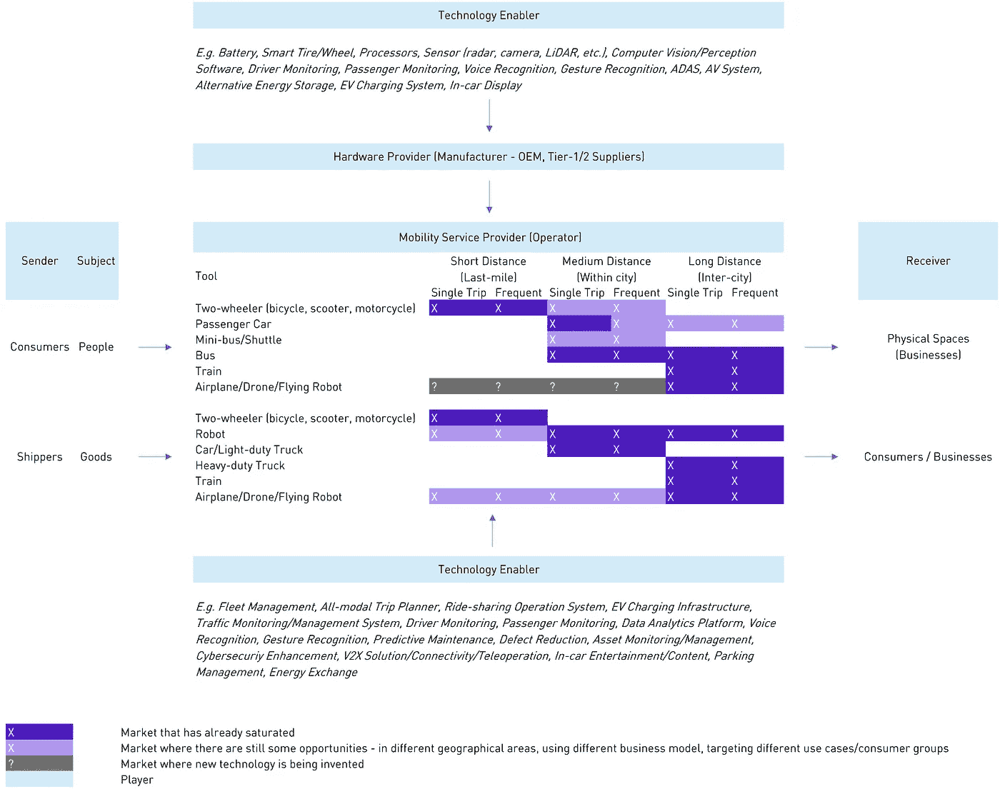

Mobility Investment Landscape (as of July 2019, by Fan)

自从优步存在以来，我们的日常交通活动发生了很大变化。自那以后，流动性也成了一个热门投资话题。从人们在世界各地追逐优步模仿者的早期阶段，到人们对自动驾驶汽车进行大量投资的阶段，我们几乎所有人都认为，未来必须大幅改变移动性。

当城市共享移动空间( **B2C** )已经饱和时，人们开始投资能够带来更大变化的技术/业务( **B2B** )，从电动汽车/电动汽车基础设施到驾驶员监控、车载语音助理和 V2X 解决方案。

当投资于使能技术时，投资者通常不希望这些公司在 10 年后生存下来——如果发生这种情况，这可能是一件坏事。相反，投资者预计这些公司未来会被原始设备制造商/一级供应商等“大公司”收购。投资论点相当简单:“大公司”财大气粗，可以从这些技术中获益，为什么他们不应该收购呢？

然而，发生的故事可能与投资者所想的不同。

## 汽车行业的参与者在收购软件公司时都很谨慎

当我们回顾 M&A 在汽车领域的历史时，我们会发现**<**5%的交易是为了收购软件公司。汽车公司仍然把大部分资金花在硬件制造(从零部件到汽车)上。

尽管收购软件公司的趋势越来越明显，但收购数量仍远低于投资者的预期。2018 年，汽车行业软件公司仅有 **24 M & A 交易。**

除了 M&A 交易量低，收购前的时间也相对较长。被汽车公司收购前的软件创业公司平均寿命约为 **10.4 年**，中位数为 **7 年**。

就我个人而言，我认为这种情况有三个原因。首先，公司有复杂的组织结构——在进行收购之前，许多利益相关方需要被收买。第二，公司非常厌恶风险——他们更喜欢观望。第三，汽车公司只关心硬件，这使得他们很难理解敏捷软件世界是如何工作的。

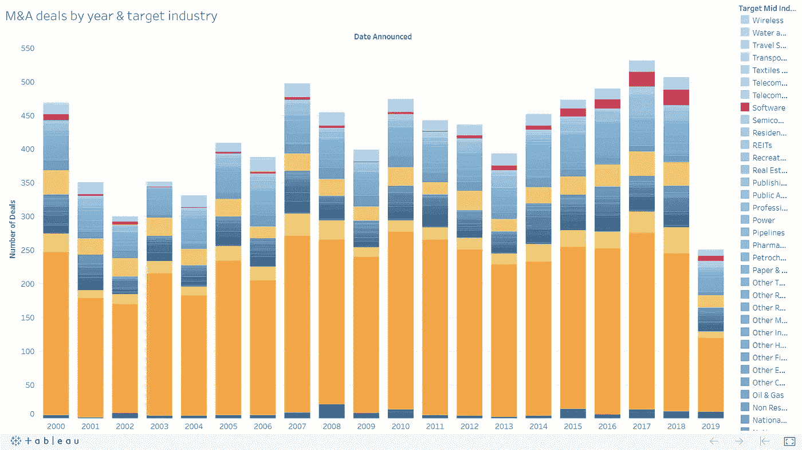

Number of M&A deals (completed & pending deals) in the automotive industry by year (Source: [Thomson One](https://public.tableau.com/profile/fan.wen5373#!/vizhome/AutomotiveMA/MAdealsbyyeartargetindustry))

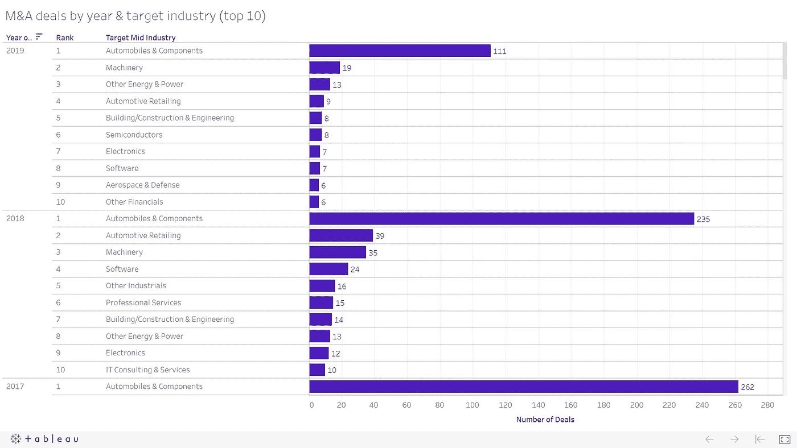

Rank of M&A deals (completed & pending deals) in the automotive industry by category (Source: [Thomson One](https://public.tableau.com/profile/fan.wen5373#!/vizhome/AutomotiveMA/MAdealsbyyeartargetindustry))

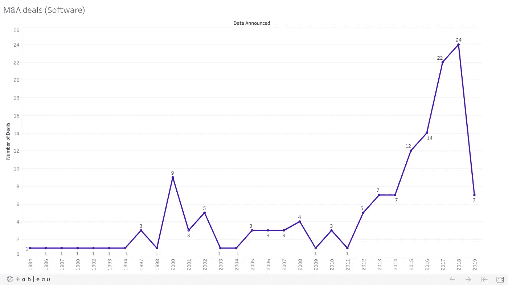

Number of M&A deals (completed & pending deals) for software companies in the automotive industry (Source: [Thomson One](https://public.tableau.com/profile/fan.wen5373#!/vizhome/AutomotiveMA/MAdealsbyyeartargetindustry))

## 收购的回报可能对投资者不利

如果我们研究一下 M&A 为硬件制造商提供支持技术的交易(例如，将被集成到车辆中以改进现有功能/添加新功能的软件/硬件)，我们会发现平均收购价值约为 3000 万至 8000 万美元([参见此处的详细数据](https://fanw.co/downloads/Automotive_Deals.xlsx))。

想想看，如果你在一个非常早期的阶段投资一家估值约 800 万美元的公司(并承担巨大风险),而你最终在 7-10 年内获得**10 倍的上限回报**，你还会感到兴奋吗？

## 回到 B2C 领域？

Mobility Investment Landscape (as of July 2019, by Fan)

如果硬件制造商的使能技术不再受到投资者的青睐，我们下一步该何去何从？

让我们再来看看移动投资的前景。我们将会看到:

1.  **同样的问题并没有在每个市场、每个人群中得到解决。**
    比如中距离的出行，在很多发达国家已经通过公交/地铁解决了，但在巴基斯坦、埃及等公共交通较差的国家还没有满足需求。在这个领域工作的公司包括 [Swvl](https://swvl.com/) 、[空运](https://rideairlift.com)和 [Fluxbie](https://www.fluxbie.com/) 。
    例如，仍然需要针对日常通勤者、机场-市区旅行者和学童的拼车解决方案。在这个领域工作的公司有: [co-mute](https://www.co-mute.com/) 、 [Hugo](https://www.ridehugo.com/) 、[Part.co](https://www.ridepart.co/)等。再举一个例子，亚马逊一直在为美国的卡车司机打造其 [Flex](https://flex.amazon.com/) 平台。许多其他市场，如新兴市场，仍然需要卡车司机和托运人的市场。在这个领域工作的公司有: [Truckpad](https://www.truckpad.com.br/) 、 [Loop](https://loopfreight.io/) 等。
2.  同样的问题可以用更好的方法解决。
    比如在尼日尼亚、埃及等交通极度拥挤的国家，一辆摩托车用于中距离的城市出行会比乘用车快很多。在这个领域工作的公司包括[戈卡达](https://gokada.ng/)、[马克斯](https://max.ng/)、[萨夫博达](https://safeboda.com/ug/)。例如，尽管已经有许多最后一英里送货机器人公司，但新的更好的解决方案正在不断创新。Refraction AI 正在研发一种更轻更便宜的机器人，用于 1-3 英里范围内的送货。
    例如，物流公司可以利用现有的未充分利用的城市空间，并从这些微小的空间中提取价值，而不是花费大量资金建立最后一英里的交付网络。在这个领域工作的公司有:[邦德](https://www.withbond.com/)、[鳄梨](https://avocado.delivery/)。
    例如，公司不再等待需要几十年才能建成的电动汽车基础设施，而是将电池制成便携式或交付给用户。在这个领域工作的公司包括: [Sparkcharge](https://sparkcharge.io/) ， [Chargewheel](https://chargewheel.com/) 。
3.  新的商业模式正在被发明。
    例如，代替消费者为旅行付费的是实体场所(如餐厅、活动场所等。)那想吸引人的人可以出价并补偿邀请人的优步之行。在这个领域工作的公司包括: [Berymo](http://berymo.com/) 和 [Freebird](http://freebirdrides.com/) 。
4.  新的问题出现了。
    例如，随着不同移动解决方案的推出，人们需要一个全模式的平台来计划他们的行程和购买机票，而不是为每个服务运营商下载应用程序。在这个领域工作的公司包括: [Ubirider](http://ubirider.com) 。
    再举一个例子，随着电动滑板车进入城市，给电动滑板车充电已经成为一个挑战。像 Swiftmile 这样的公司正在创新解决方案来解决这个新问题。

总之，仍然有必要关注使能技术，特别是那些用于服务运营商的技术，因为这些使能技术可以作为基础设施运营商存在。然而，我们可能需要避免将大部分精力放在使能技术上——尤其是那些为硬件制造商准备的技术。

鉴于 B2C 市场上的机会，在我们认为已经饱和的空间上下注可能不是一个坏主意。

*本研究由* [*范文*](https://www.linkedin.com/in/fanwen/) *完成，并得到了* [*塔里克·埃利萨维*](https://www.linkedin.com/in/tarekelessawi/) *、* [*贾尼斯·斯克里韦里斯*](https://www.linkedin.com/in/janisskriveris/) *、*[马克·布歇](https://www.linkedin.com/in/marc-bouchet/) *和* [*艾迪森·哈尼卡特的帮助*](https://www.linkedin.com/in/addison-huneycutt/)

*免责声明:本文不是也不应被视为“投资建议”或关于行动方案的“建议”，包括但不限于任何适用法律或法规中使用的术语。*

*附录*

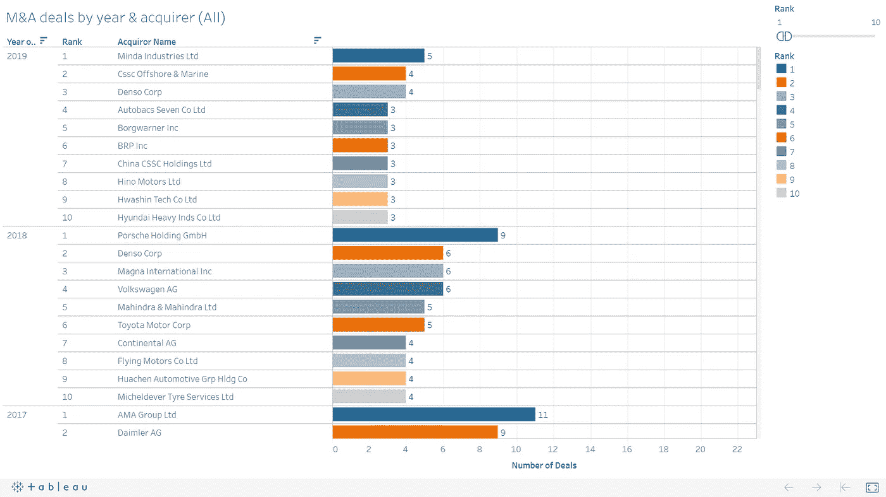

Number of M&A deals (completed & pending deals) in the automotive industry by year & acquirer (Source: [Thomson One](https://public.tableau.com/profile/fan.wen5373#!/vizhome/AutomotiveMA/MAdealsbyyeartargetindustry))

Number of M&A deals (completed & pending deals) **for software companies** in the automotive industry (Source: [Thomson One](https://public.tableau.com/profile/fan.wen5373#!/vizhome/AutomotiveMA/MAdealsbyyeartargetindustry))

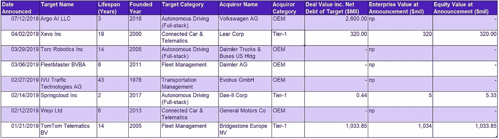

Number of M&A deals (fully & partially, completed & pending deals) for software companies in the automotive industry in 2019 (Source: [Thomson One](https://fanw.co/downloads/Automobile - Software M&A (2009-19).xlsx))

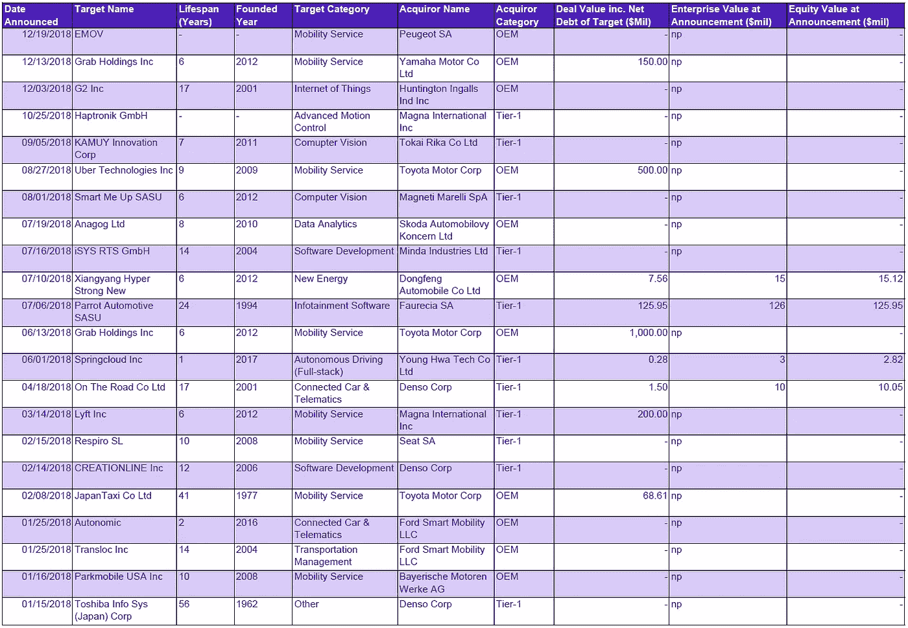

Number of M&A deals (fully & partially, completed & pending deals) for software companies in the automotive industry in 2018 (Source: [Thomson One](https://fanw.co/downloads/Automobile - Software M&A (2009-19).xlsx))

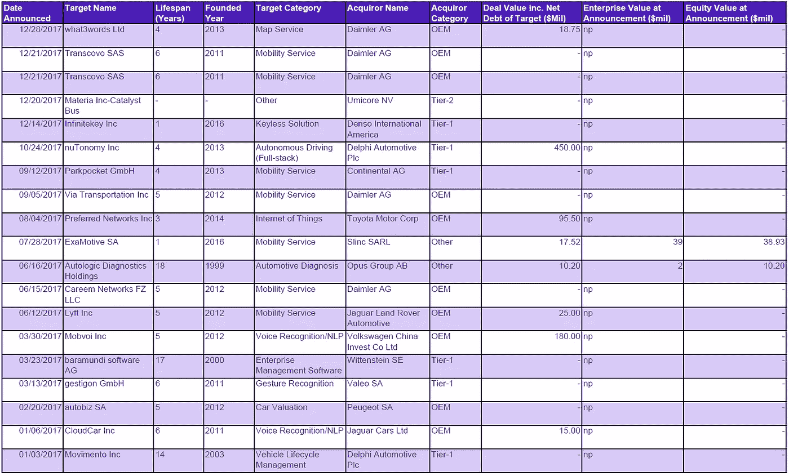

Number of M&A deals (fully & partially, completed & pending deals) for software companies in the automotive industry in 2017 (Source: [Thomson One](https://fanw.co/downloads/Automobile - Software M&A (2009-19).xlsx))

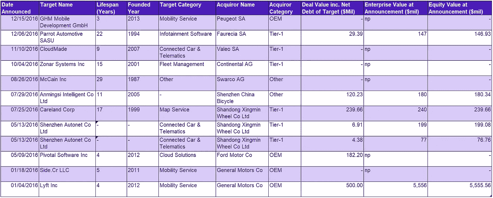

Number of M&A deals (fully & partially, completed & pending deals) for software companies in the automotive industry in 2016 (Source: [Thomson One](https://fanw.co/downloads/Automobile - Software M&A (2009-19).xlsx))

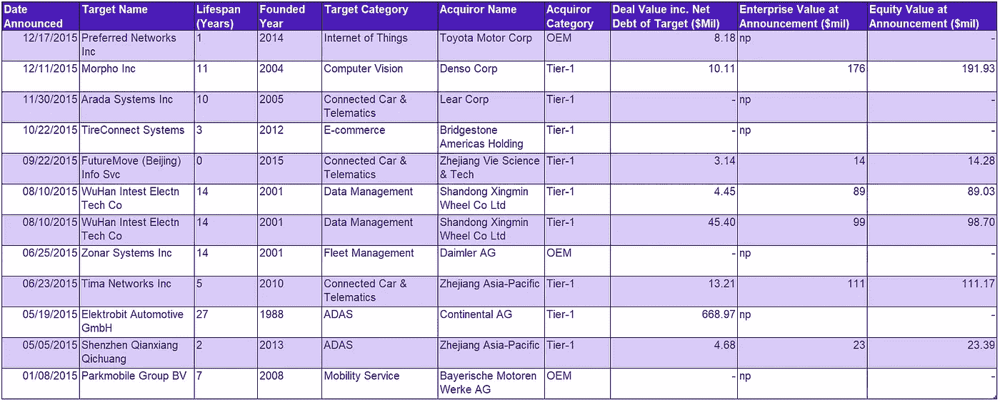

Number of M&A deals (fully or partially, completed & pending deals) for software companies in the automotive industry in 2015 (Source: [Thomson One](https://fanw.co/downloads/Automobile - Software M&A (2009-19).xlsx))

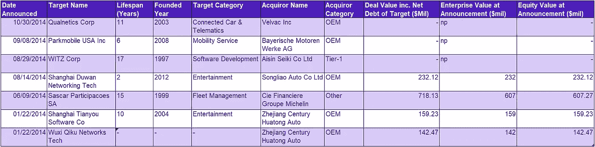

Number of M&A deals (fully or partially, completed & pending deals) for software companies in the automotive industry in 2014 (Source: [Thomson One](https://fanw.co/downloads/Automobile - Software M&A (2009-19).xlsx))

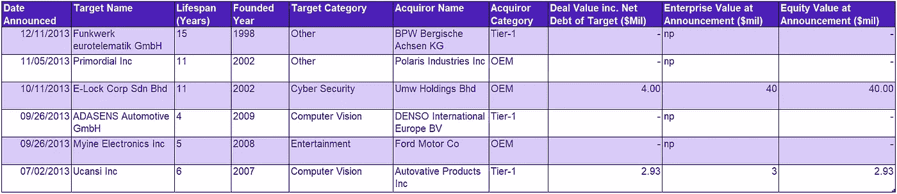

Number of M&A deals (fully or partially, completed & pending deals) for software companies in the automotive industry in 2013 (Source: [Thomson One](https://fanw.co/downloads/Automobile - Software M&A (2009-19).xlsx))

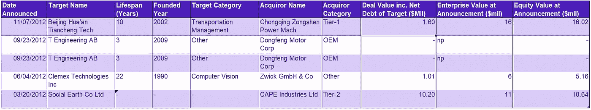

Number of M&A deals (fully or partially, completed & pending deals) for software companies in the automotive industry in 2012 (Source: [Thomson One](https://fanw.co/downloads/Automobile - Software M&A (2009-19).xlsx))

Number of M&A deals (fully or partially, completed & pending deals) for software companies in the automotive industry in 2011 (Source: [Thomson One](https://fanw.co/downloads/Automobile - Software M&A (2009-19).xlsx))

Number of M&A deals (fully or partially, completed & pending deals) for software companies in the automotive industry in 2010 (Source: [Thomson One](https://fanw.co/downloads/Automobile - Software M&A (2009-19).xlsx))

Number of M&A deals (fully or partially, completed & pending deals) for software companies in the automotive industry in 2009 (Source: [Thomson One](https://fanw.co/downloads/Automobile - Software M&A (2009-19).xlsx))

*在此* *查看汽车行业所有公司达成的并购交易* [*。*](http://fanw.co/downloads/M&A_Automotive.xlsx)