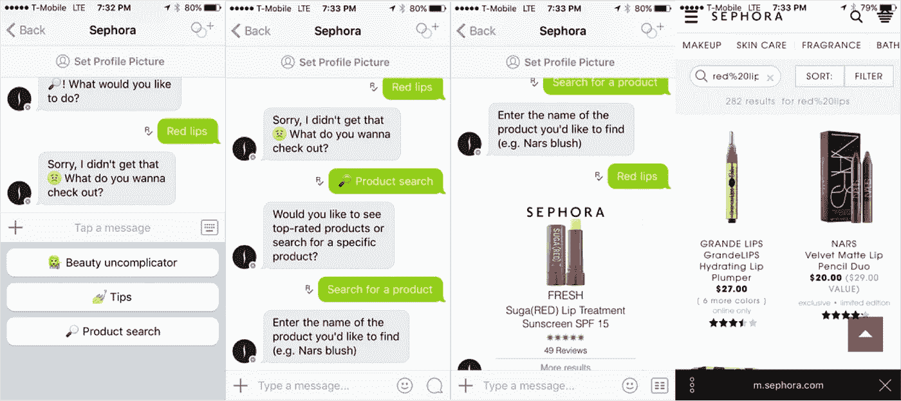
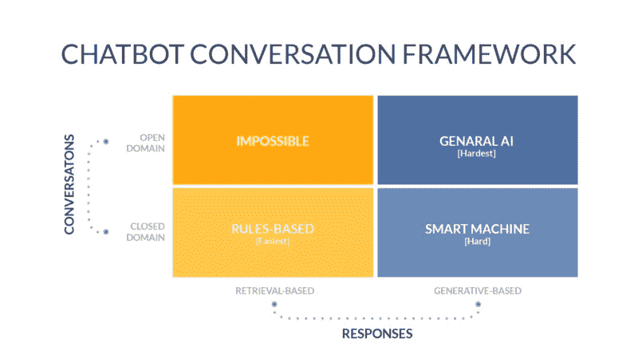
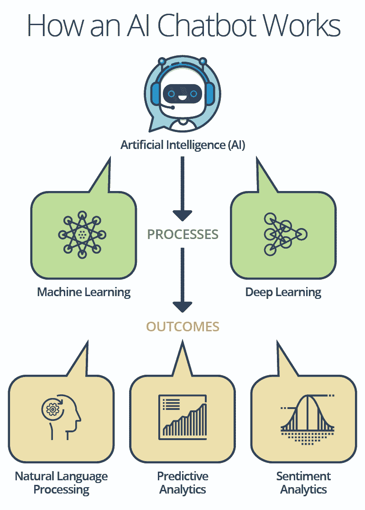
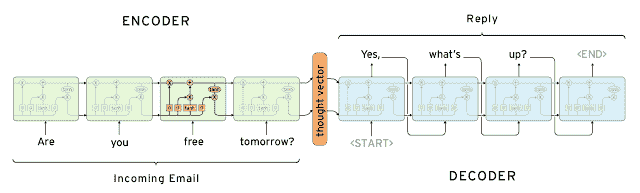
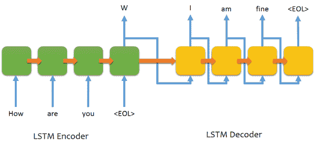

# 聊天机器人是怎么回事？

> 原文：<https://medium.datadriveninvestor.com/whats-the-deal-with-chatbots-e1269eb206eb?source=collection_archive---------2----------------------->

“请不要挂断。我们所有的服务代表都很忙。很快会有代表来见你。”

然后你就等着听那烦人的音乐，听不到，音质也很差，在背景中播放。

 [## 对话式营销是文字数据驱动的投资者

### 在购买之前，先谈一谈。这样做的营销人员将走在游戏的前面。这是保罗·因斯的前提…

www.datadriveninvestor.com](https://www.datadriveninvestor.com/2019/01/31/conversational-marketing-is-the-word/) 

在某一点上，你把电话开到了扬声器，继续你的生活，电话在后面响着。时间在流逝。十分钟变成了二十分钟。20 变成 40 然后 2 小时。

“他们关门了吗？我想是的，但是为什么呢？”今天是工作日，现在是下午 5 点。营业时间是从早上 9 点到晚上 9 点。“你心里想

这不是你的第一次经历。你为了一个问题要等几个小时。这不管用。这是行不通的，所以必须改变。

聊天机器人，进来吧！！

## **那么，什么是聊天机器人？**

简单地说，聊天机器人是一种由人工智能支持的程序，用于模拟复杂的类似人类的对话。它发展了机器和人类之间的交流，这种交流是通过信息或语音命令进行的。

互联网的出现以及连接和数据日益增长的重要性引发了聊天机器人开发的革命。谷歌根本不足以解决我们的好奇心，因为谷歌提供了获取信息的途径，但没有明显的结果**。我们人类需要更多，一种向导或助手的类型，来更快更容易地得到我们想要的东西。**

**以丝芙兰为例。用户可以连接丝芙兰的聊天机器人，通过 Kik 的平台提供化妆相关的技巧、产品和建议。这是聊天机器人革新零售行业的一个很好的例子！丝芙兰的聊天机器人可以快速响应客户的提示，例如提供与产品相关的评论和论坛。**

****

**聊天机器人主要是**“对话”系统**，它们被设计用来解决问题或服务于某种目的。他们应该像文本伙伴一样处理各种查询。聊天机器人可以分为四类**:****

********

## ******聊天机器人背后的技术是什么？******

****聊天机器人和语音助手背后的主要底层技术是**人工智能，**更具体地说，**自然语言处理(NLP)。**人工智能中的这一部分侧重于对**词语**的理解和处理。这就是为什么机器人听起来几乎像人类一样。NLP 中的引擎为智能人工智能聊天机器人的复杂系统提供动力，这些机器人正在进入我们周围的世界，并有可能彻底变革 **C-2-C、B-2-B 模型**以及几乎任何**交互**。****

****最近，Google 展示了 project Duplex 在 NLP 方面的惊人进展。这里有一个视频展示了 google duplex 令人兴奋的功能:****

****[https://www.youtube.com/watch?v=D5VN56jQMWM](https://www.youtube.com/watch?v=D5VN56jQMWM)****

****现在回到聊天机器人，有**两种主要类型:******

## ******开放域******

****就像名字一样，这些聊天机器人是**开放式/通用机器人**。一些例子包括 Alexa、Google home、Cortona、Siri 等。这些机器人旨在**模仿类似人类的行为**，因此是通用机器人。然而，他们不能回答具体的问题，如报告公司上一季度的销售情况等。****

## ******封闭域******

****这些也被称为专门的机器人。它们执行非常特殊的功能。根据它们的类型，它们可以很容易(基于检索)或很难(基于生成)开发。例子包括订购食物或预订机票机器人。然而，较新的基于生成的复杂机器人增加了一个额外的对话方面，即模仿智能体的语言处理。****

********

****A simple breakdown of how chatbots work.****

## ****基于检索的模型与基于生成的模型:****

******检索型(更容易):**顾名思义。**“检索”预定义响应和短语库**中的响应。这个聊天机器人根据输入和**上下文**选择它认为最**【合适】**的响应。它选择一种启发式方法，可以像复杂的机器学习分类器的表达式匹配一样简单。然而，这些系统**不会生成任何新文本**，这**减少了智能机器人开发中的一大部分复杂性。******

******生成模型(更难):**顾名思义，**【生成】反应**从无到有。机器翻译技术被用来驱动这些机器人，但机器人不是从一种语言翻译到另一种语言，而是从**输入到输出**(响应)**“翻译”**。****

****这两种方法各有利弊。对于基于检索的响应，程序不会**生成任何新文本，而是**从一组响应中挑选出最佳响应。这里，基于检索的程序不能犯语法错误，除非源**本身有错误**。然而，基于检索的方法将不能处理**没有响应的**看不见的情况。出于完全相同的原因，它不能引用**上下文身份信息**，如对话中提到的姓名。没有真正意义上的**【学习】**。****

****生成模型有**【更聪明】**。他们给人的印象是真正的人与人之间的对话。然而，这给智能机器人的训练和开发带来了很高的复杂性。生成模型需要更大的数据集。随着其他人工智能领域的进步，现在有可能使用**深度学习技术，如序列对序列(Seq2Seq)** ，这对于**生成文本**是最佳的。然而，我们在这个领域仍然处于早期，所以目前大多数聊天机器人系统都是基于检索模型的。****

********

****Seq2Seq framework.****

*****图片借用自* [*聊天机器人深度学习:Part*](http://www.wildml.com/2016/04/deep-learning-for-chatbots-part-1-introduction/) 1****

## ****Seq-2-Seq 模型…这是如何工作的？****

****在此之前，必须对数据进行预处理。无论数据组织得有多好，输入的数据都必须经过预处理才能在算法中使用。****

******处理完数据后，******

******Seq2Seq** 模型的工作方式如下:我们一次从一个组件获取一个输入序列(在本例中是一个单词)，然后它一次输出一个组件的序列。这个模型由 **RNN(递归神经网络)**组成:一个编码器和一个解码器。Seq2Seq 型号有三个主要部件:****

******编码器→注意机构→解码器******

****首先，**编码器**在每个时间步长将输入过程**转换为一个符号(字)**。主要目的是将符号的**序列转换成固定**大小的特征向量**，该特征向量通过仅编码序列中必要的信息而**丢失不必要的信息来工作。********

****

***图片借用自*[*farizrahman 4 u/seq 2 seq*](https://github.com/farizrahman4u/seq2seq)**

**Seq2Seq 型号的工作方式和你想象的一样。隐藏状态的**序列**影响每个**后续隐藏状态**，直到最后**列出整个序列的摘要。**这种状态也被称为**上下文或思维向量，**它代表序列的最终意图。基于上下文，解码器生成**另一个序列，**具体地说**一次一个符号(字)**。这里，在每个时间步上，解码器受上下文和**先前生成的符号的影响。****

****

**双向 RNN。来源:[https://colah.github.io/posts/2015-09-NN-Types-FP/](https://colah.github.io/posts/2015-09-NN-Types-FP/)**

**在编码器中，使用了**双向 RNN** 。被称为双向 GRU **(门控循环单元)**架构，这是两个位于 GRU 的 rnn 向**相反方向移动。**一个 RNN 按**正常顺序**输入句子，另一个 RNN 按**相反顺序**输入。在每个时间步，由 **A 和 A’表示的编码输出被加到“y”**中，使得网络不仅能够对序列中的单词进行编码，还能够绘制出出现在句子中不同点的单词之间的**关系。这非常有用，因为人类语言非常注重感知和句子结构。放在开头的词和放在结尾的词有完全不同的意思。一个合理的无缝**类人模仿**的聊天机器人需要具备这个能力。****

****注意机制:****

**Seq2Seq 框架的一个限制是来自输入句子的全部信息应该被编码到一个固定长度的向量中，称为**上下文。**随着序列变长(在长度上)，有**相当大的信息损失**。因此，基本的 Seq2Seq 模型在**解码大序列**方面取得了有限的成功。**注意机制**解决了这个问题。在论文[中介绍了神经机器翻译通过联合学习对齐和翻译](https://arxiv.org/abs/1409.0473)，帮助解码器在解码时选择性地查看输入序列。这将从编码器中取出 b **urden 来编码输入中的每一个有用的内容。****

**一个简单的说法是:如果你有一份报告要读。基本的 Seq2Seq 框架将遍历整个报告(相当于一个人阅读整个报告一次),然后**总结**获得的信息。但是，为了有效地跟踪报告，一个很好的策略是将 r **报告分成几个部分(时间步长)**并在每个部分做笔记。然后，**将留存的信息**传递给各个部门，最终，你会对报告**有一个全面的了解**。注意力机制会这样做，它会总结每个部分，并有选择地传递信息，这样**会最小化信息的总体损失**。**

**这是如何组合在一起的？**

**通过将这三个组件放在一起，我们现在有了一个能够进行对话的智能聊天机器人。现在，结果取决于输入的**数据和训练的持续时间**。你训练算法越多，它就变得越好。NLP 是一个正在发展的领域。在聊天机器人和语音助手中利用人工智能的真正潜力的过程中，我们仍然处于非常早期的阶段。然而，这个行业正在快速发展，现在是利用人工智能热潮的时候了。**

**你可以在这里制作你自己的聊天机器人。我附上了我的 [**GitHub 链接**](https://github.com/abhinit75/chatbot) ，其中有这个聊天机器人的代码。**随便玩！****

> **如果你喜欢读这篇文章，一定要鼓掌并与家人和朋友分享！**

****查看我的** [**网站**](https://abhinitpatil.com/) **了解更多！****