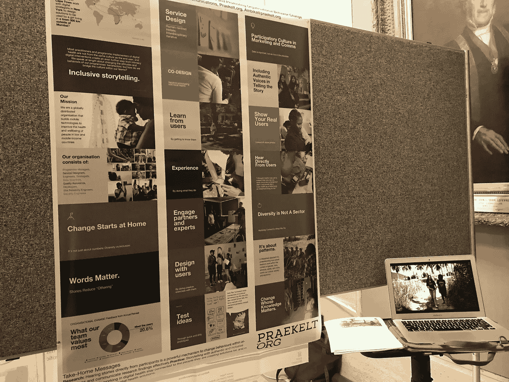
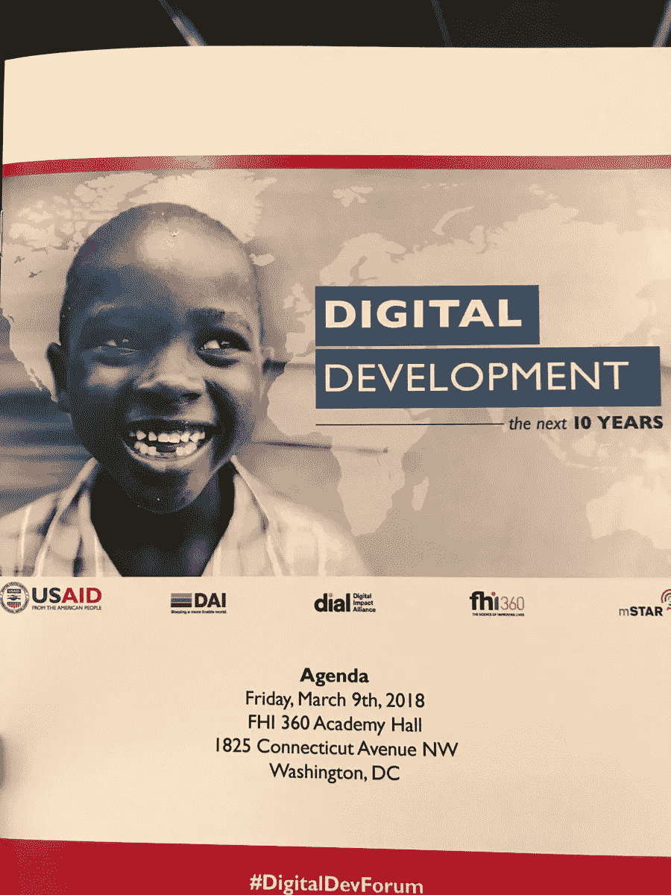
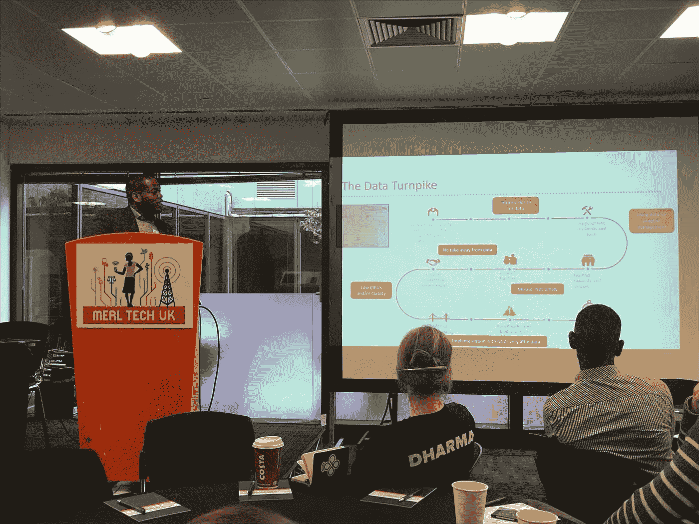

# 如何处理数据——弥合发展中的数据鸿沟

> 原文：<https://medium.datadriveninvestor.com/whats-the-deal-with-data-bridging-the-data-divide-in-development-b3f0f7c3c9b5?source=collection_archive---------0----------------------->

在 Praekelt.org 从事传播工作时，我有机会亲眼目睹分享故事在推动影响力和改变态度方面的力量。在过去的一个月里，我参加了几个无关的活动，都涉及到数据、评估和数字发展，这再次证明了寻找共同点以分享和交流我们所重视的数据的重要性。

**讲故事和数据**

我最近在伦敦[大学的行为改变会议上展示了一张关于“讲故事促进组织改变”的海报。](http://www.ucl.ac.uk/behaviour-change/events/conf-18)我们目前在 Praekelt 的评估借鉴了该中心的工作成果，这是该领域的一项重大变革。但我并没有提交一份关于我们敏捷的实验性调查的摘要:我是在分享关于我如何利用电影和我们的故事来创造组织内部的变化的信息。

在我的摘要被接受后，我意识到我必须以海报的形式展示我的发现。对于许多从业者(比如我自己)来说，我们真的不知道海报意味着什么。值得庆幸的是，我得到了学者的建议和设计同事的支持，将我的视频、照片和讲故事的素材转化为我可以用大头针固定的视觉形式。当纽约的印刷商告诉我“这真是一张很棒的海报”时，我开始意识到这是一张非典型的海报。

一旦我到达 UCL 的海报馆，我就能明白为什么了。几乎，如果不是所有的，房间里的海报都有图表、数字和图形——很多很多的数据点。另一方面，我的海报几乎没有“数据”。它色彩缤纷，展示了一些引人入胜的图片，讲述了我们以人为中心的设计过程，并配有在我的笔记本电脑上播放的视频。这绝对是对房间周围“研究”的背离。

研究和实践之间的这种分歧在会议中多次出现。首先，今年，与会者被要求根据他们是从事研究/学术还是项目/实践来选择贴纸标签。许多会议讨论了如何弥合鸿沟，使实践者更容易获得研究成果，并将项目创建者的经验带到学术界。

对我来说，值得庆幸的是，紧密团结的从业者群体对我的无图表海报感到安慰和联系，也许学者们对视觉效果也有点放松:我们带着会议上的最佳海报奖之一回家了。

**数据党派和派系**

伦敦会议只是我开始意识到围绕数字发展中的数据鸿沟的对话的开始。“为什么我们要使用数据这个词呢？还有人看重吗？还有人知道这是什么意思吗？”IBI 的首席创新官安东尼·沃德尔在美国国际开发署数字发展论坛的分组会议上挑衅性地提出。会议聚集了美国各地从事数字发展的组织，要求他们考虑未来十年数字发展演变的关键点——访问、包容性、人工智能，当然还有数据的作用。

这一专题分组会议分享了各组织内部，特别是方案小组和国家办事处同事之间使用和理解数据的最佳做法。它还扩展到与受益者、政府和捐助者分享。我们质疑谁的数据重要，我们为什么重视数据，以及如何让其他人关心数据。

萨姆希尔·瓦斯德夫(Samhir Vasdev)，IREX 的数字发展顾问，在小组讨论中谈到了麻省理工学院的倡议和他们的[数据文化实验室](https://databasic.io/en/culture/)，该实验室分享练习以帮助人们理解数据。他谈到举办数据聚会，团队可以学习并理解他们所创造的也是数据。这些聚会允许人们探索他们产生的数据，但也许没有机会进行审问。真正的目的是了解他们自己的数据告诉他们什么新知识，或者数据挑战他们探索什么进一步的问题。“数据聚会是鼓励团队探索他们的数据并将其转化为他们可以在程序中直接使用的见解或问题的好方法。”

理解数据可以增强能力。但是，被告知前进的道路并不一定意味着参与者可以或将要走这条路。正如瓦斯德夫指出的，“像这样的演习有其自身的风险。在某些情况下，当与产生数据的受益人一起处理数据时，他们可能开始要求从他们的数据中得到结果或采取行动。你必须准备好管理这些期望，或者将它们与资源联系起来，以便采取有意义的行动。“可以想象，如果参与者看到他们的数据导致需要一个新的诊所，但诊所从未建成，他们会有多沮丧。

**大数据、偏差和 M & E**

在伦敦举行的 [MERL(监测、评估、研究和学习)技术大会](http://merltech.org/)开幕式上，[邦德](https://www.bond.org.uk/)公司的效率和学习顾问 André Clark 在主题演讲中谈到了数据在发展中日益增长的重要性。房间里的许多声音与我在过去一个月里观察到的趋势和担忧产生了共鸣。数据是答案吗？怎么是答案？

André Clark’s keynote at MERL Tech

“这个工具不会解决你的问题，”一位发言者在臭名昭著的非正式失败节上说，与会者展示了他们的失败，从彼此的错误中学习。演讲者分享了一个新的报道计划的例子，这个计划没有达到预期的效果。她指出，“我们最初认为技术会帮助我们更快更有效地工作，但现在我们清楚地看到高质量数据比及时数据更重要”。尽管数字数据可能更好更快，但这并不意味着它解决了原来的问题。

在使用数据评估问题时，我们必须确保我们没有幻想我们实际上正在处理手边的核心问题。例如，在我关于社交网络分析的演讲中，我们讨论了在媒体和娱乐中使用定量流程的机遇和挑战。会议始终强调由技术驱动的更慢、更深入的流程的重要性，而不是更快、更短的流程。

这适用于 M&E 实践中数据的使用方式。例如，我参加了一场关于“大数据”在 M&E 的作用以及融合是否不可避免的激烈辩论。正如一位发言者提到的，“如果你闭上眼睛，忘记眼前的问题是大数据，你可能会觉得这是 M&E 使用的任何其他工具”。无论是大数据还是小数据，围绕数据收集、偏见、不可访问性、语言和工具的问题在 M&E 都存在。

提出的其他核心问题是权力动态、包容性，以及技术是由人创造的，因此它不是中性的。正如[国际新闻](https://www.internews.org/)的人道主义项目高级主管 Anahi Ayala Iacucci 明确表示的那样，“我们有偏见，所以我们在制造有偏见的工具。”在她的演讲中，她谈到了技术如何调解和改变人类关系。如果我们采取更慢、更深入的方法，我们将有能力真正探索偏见，理解数据的价值和复杂性。

“评估者不理解数据，管理者和公众也不理解评估，”Daira 的 Maliha Khan 说，这让我想起了我最初对翻译和弥合空间差距的担忧。许多会议都试图解决这个问题，一个很好的例子就是库珀史密斯在马拉维的 Kuunika projec t，该项目使用当地的视觉插图来配合平板电脑上的调查问题。另一位发言者推动我们进入衡量领域，而不是监测领域，这有可能成为我们都同意的一页。

作为一个觉得不仅要对外交流我们的工作，还要在我们的项目内部分享知识的人，这一切给我留下了什么样的印象？我想我会从安娜·玛利亚·佩特鲁塞利那里得到指导，她是[漫画救济](https://www.comicrelief.com/)的数据分析师，她谈到了组织与其致力于数据驱动，不如致力于数据通知。

为了更进一步，在 Praekelt，我们区分了数据驱动和证据驱动，后者承认需要关注研究设计，强调质量，而不仅仅是数量。证据包括数据的使用，但也包括并非所有数据都是平等的，在解释数据时，我们同时关注数据来源*和*研究设计。

我有信心将我们的数据转化为知识，不管我们选择如何使用它，并意识到偏见如何影响我们的行为，这可能是统一之旅的第一步。我还认为，这条新的前进道路将利用讲故事的力量，让数据变得可访问，让组织更好地了解信息。是的，这是一条人迹罕至的路，但希望这能改变一切。

***如果你有兴趣加入这个对话，我们鼓励你提交有史以来第一个*** [***MERL 理工大学 Jozi***](http://merltech.org/present-or-lead-a-session-jozi-2018/) ***。摘要截止日期为 3 月 31 日。***

*由 Praekelt.org*公关部主管 Ambika Samarthya-Howard 撰写