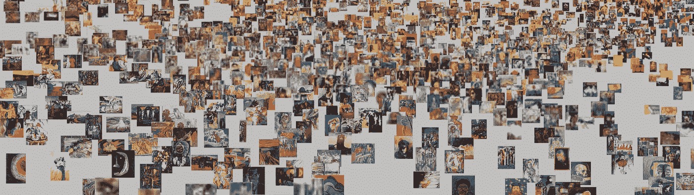
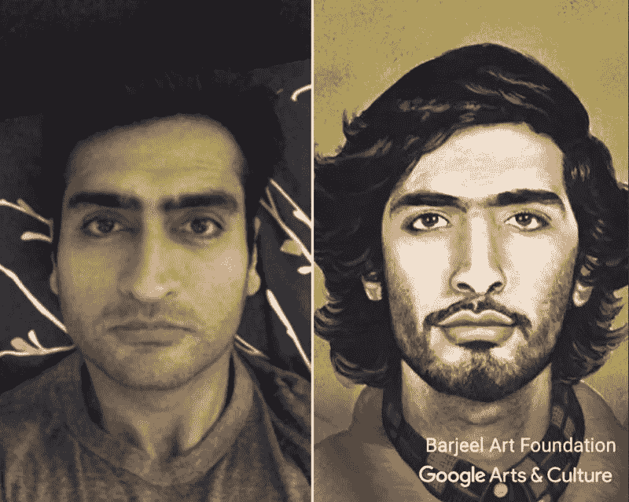

# 人工智能和机器学习有什么区别？

> 原文：<https://medium.datadriveninvestor.com/whats-the-difference-between-artificial-intelligence-and-machine-learning-97eba2a97f93?source=collection_archive---------3----------------------->

对一些人来说，人工智能仅仅是一个营销噱头，对另一些人来说，它是自人类掌握火以来最大的革命。让我们把事情简单化:

Bayesian Optimization to get the best cookie recipe

**人工智能**:人工智能(AI)是机器执行需要智能的任务的能力，比如理解、认识和分析。

*举个例子，* [*Google Brain 优化了 cookie 食谱*](https://www.blog.google/technology/research/makings-smart-cookie/) *拜 AI 所赐，使用* [*贝叶斯优化*](https://cloud.google.com/blog/big-data/2017/08/hyperparameter-tuning-in-cloud-machine-learning-engine-using-bayesian-optimization) *而不是 ML。*

**机器学习**:机器学习(ML)是一种人工智能，它使用统计学在数据库中寻找重复模式。它可以对输入数据库的输出进行分类、聚类和预测，而无需被告知匹配规则。

*例如，ML 被用于* [*追踪濒临灭绝的鲸鱼*](https://www.blog.google/technology/ai/one-students-quest-track-endangered-whales-machine-learning/) *，分析鲸鱼的叫声和迁徙模式。*

有几种类型的 ML(非穷举):非监督 ML、监督 ML、神经网络或深度 ML、强化 ML。

**非监督机器学习**:算法面对非结构化数据，被要求发现模式。

*例如，通过视觉相似性将无监督的 ML 应用于 Google Arts &文化的集合，应用于* [*地图艺术品。*](https://artsexperiments.withgoogle.com/tsnemap/)

T-sne map to cluster artworks thanks to non-supervized ML

**受监督的机器学习**:在面对新的未标记数据集之前，机器被训练识别已标记数据集上的模式，并被要求进行正确的匹配。

*举个例子，这是一种给* [*生活杂志的图片集自动贴标签的方法。*](https://artsexperiments.withgoogle.com/lifetags/)

**深度学习或神经网络**:该算法模仿人脑的结构，将神经元分层，以专注于特定的特征(形状、颜色等)。)

*例如，* [*艺术自拍*](https://www.blog.google/outreach-initiatives/arts-culture/exploring-art-through-selfies-google-arts-culture/) *分析自拍上的人脸特征，将其与相似的人像进行匹配。*

**强化学习**:机器可以通过试错学习，接受奖励和惩罚。

*比如 DeepMind 让一个* [*算法玩雅达利游戏*](https://deepmind.com/research/publications/playing-atari-deep-reinforcement-learning/) *使用深度强化 ML。*

关于[的更多资源使用谷歌学习人工智能](https://ai.google/education/)

