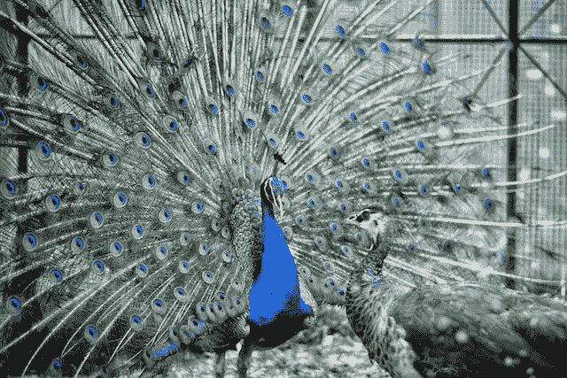

# 公关和营销有什么区别？

> 原文：<https://medium.datadriveninvestor.com/whats-the-difference-between-public-relations-and-marketing-84f3d8077474?source=collection_archive---------43----------------------->

我们这些长期从事公关工作的人都假设(而且经常拔毛)人们知道公关和营销的区别。这两个术语经常被混淆和错误使用。那么公关和营销的区别是什么呢？

这很简单(也很复杂)。公共关系通常专注于免费或盈利的报道，而营销则专注于付费以及视觉观感。公共关系通常是围绕特定的产品、事件或故事制造轰动效应。营销更多的是销售产品或为整个品牌创造知名度。

对我来说，公共关系就是揭开层层面纱，找到人际关系。这种产品或服务如何与人相关或使人受益？这不是关于产品的特性，而是关于它如何影响一个人的生活。

好吧，让我进一步简化一下。几年前，我为一个大型儿童景点做重叠营销和公关活动，该景点在大规模翻新(耗资数百万)后重新开放。

# 营销

营销活动负责品牌创建、标牌、用户地图、整个景点的视觉效果、广告创建、网站设计以及创建用户体验的整体观感。当你去一个大型景点时，想想你看到和读到的所有不同的东西。迪士尼世界将会是一个终极的例子，一个清晰定义的品牌将会贯穿整个公园。

# 公关

当所有的营销材料都在开发的时候，我正在努力创建一个公共关系活动(我可以自豪地说它获奖了)。在这个景点重新开放前的八个星期里，我研究了我们如何在社区中激发激情，并讲述关于公园的各种故事。我们不是发布一份列出所有特色的新闻稿，而是每周发布新闻稿，深入每个元素(水上公园、宠物动物园、攀岩区等等)。我们向媒体提供了一个功能(正在建设中)之旅，并分享了一些设计的幕后见解，以及一些艺术家对成品外观的渲染。

除了新闻稿，每周媒体都会收到一页儿童故事书。在为期八周的活动结束时，每周的页面被放在一起，以创建一个故事书，从始至终展示吉祥物游览公园。营销团队创作了这本故事书，这是我公关活动的一部分。我与他们密切合作，确保品牌声音和形象包含在我所有的公关材料中。

我公关活动的另一部分是为政治家、社区领袖和媒体举办的 sneek 高峰旅游。这些活动在整个施工进度的关键点举行，在公园正式向公众开放前一周也是如此。再一次，这是关于产生兴奋、兴趣和免费媒体报道。

# 公共关系的价值

公共关系通常与营销密切相关——不管是直接的还是间接的。上面的例子是直接参与。间接是指在[举行新闻发布会](https://howtocommunications.com/downloads/how-to-organize-a-press-conference/)或活动，并确保品牌得到很好的展示，或在问题管理的情况下得到保护。

在数字时代，公共关系甚至更有价值。我们曾经严重依赖媒体来分享我们的故事，现在公司和个人可以使用他们的网站、社交媒体网站和电子邮件分发列表。虽然这减轻了公关专业人士的负担，让(不切实际的)媒体暴民露面，但也降低了其他人的门槛。即使你控制了你的网站和社交媒体，你仍然应该把公共关系看作是讲故事。

谁是你的观众？你讲的是什么故事？他们为什么要关心？受到启发？听着。

我希望这有助于消除市场营销和公共关系之间的一些混淆。

花几分钟思考一下你的组织。你正在进行或可能开展的营销活动和公共关系有哪些？各有什么好处？他们如何合作？

如果你喜欢你读过的内容，请在下面发表评论或注册[，接受我的免费建议](https://howtocommunications.com/how-to-write-a-press-release/)。

另外[在这里发表](https://howtocommunications.com/whats-the-difference-between-public-relations-and-marketing/)。