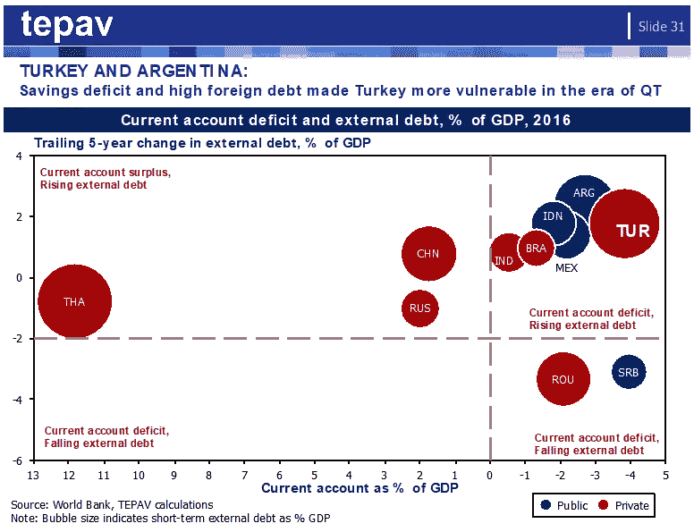

# 土耳其里拉怎么了？

> 原文：<https://medium.datadriveninvestor.com/whats-the-matter-with-the-turkish-lira-86c20911b658?source=collection_archive---------6----------------------->

土耳其共和国(CBRT)中央银行本周加息 125 个基点，令市场感到意外。两周前，该银行已经将利率提高了 300 个基点。这一举措现在能提振土耳其里拉对美元的价值吗？我不这么认为。

首先，CBRT 的意外举措并不被认为是其决心抗击通胀的迹象。这看起来只是在两周后的大选前稳定里拉的政治举措。里拉的快速贬值一直被认为是土耳其经济危机的主要迹象。如果没有它，我们会在没有汇率稳定感的情况下参加第一次选举。这对任何在任者都不是好事，尤其是对一个已经掌权 16 年的人来说。

其次，缩减恐慌始于大约 5 年前，但自那以来，土耳其的外币债务已经翻了一番。更具体地说，在缩减恐慌条件下，土耳其、中国和阿根廷继续增加其外币债务。土耳其和阿根廷的风险更大，因此它们的债务增幅高于中国。

第三，土耳其和中国积累了以外币计价的私人部门债务，而阿根廷积累了公共债务。处理公共部门债务比处理私人部门债务更容易。对阿根廷有利，对土耳其和中国不利。

第四，中国和土耳其是完全不同的动物。除了是一个经济和政治庞然大物之外，中国还有经常账户盈余，而土耳其的经常账户赤字更高，而且还在不断上升。对中国来说更容易，对土耳其来说更难。

第五，与中国相比，土耳其的短期债务占 GDP 的比例也明显较高。看一下下图。气球越大，短期债务占 GDP 的比例就越高。看看土耳其的气球比中国的大多少。

出现这种问题的时机非常不好。随着全球从量化宽松(QE)转向量化紧缩(QT)，外币高负债国家需要从杠杆化转向去杠杆化。如果你不能印刷美元，你需要想办法降低你的债务。

做不到这一点的国家立即脱颖而出。每个人现在都想知道土耳其将如何有序地去杠杆化。是要硬着陆还是软着陆？这就是为什么简单的加息不足以让里拉稳定下来，即使是在短期内。不管有没有 IMF，土耳其都需要一个稳定方案。看看阿根廷比索现在是怎么稳定的就知道了。

这些是事实。任何对抗他们的政府都注定要失败。

[**这篇评论发表在 2018 年 6 月 9 日的《赫里耶每日新闻》上**](http://www.hurriyetdailynews.com/opinion/guven-sak/whats-the-matter-with-the-turkish-lira-133025)

【www.tepav.org.tr】最初发表于**。**