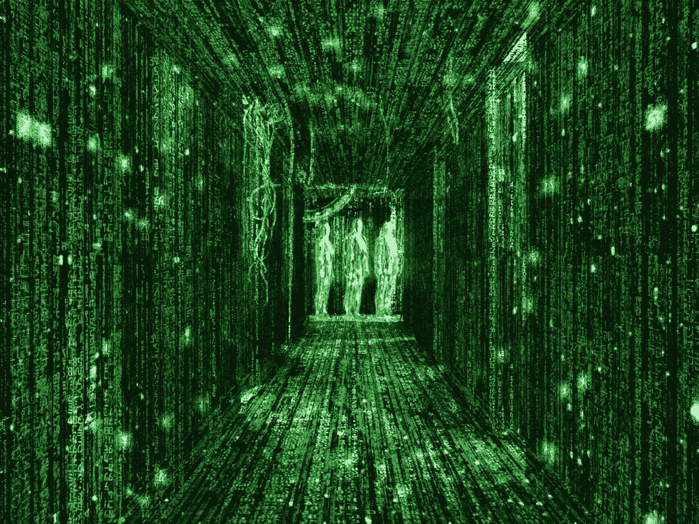

# 在寻找“知识”的过程中……

> 原文：<https://medium.datadriveninvestor.com/whats-the-most-real-thing-bcde3fd386ce?source=collection_archive---------7----------------------->

> 介绍

在经历了笛卡尔式的质疑我所观察和感受到的一切(有意识或无意识，经验或理论，先验或后验)的有效性的怀疑之后，我得出结论，“逻各斯”的存在，一个“理性”的形而上学术语，是最基本的“知识”，它既不会受到怀疑，也不会改变。

# 1.笛卡尔对“知识”的怀疑和追求

勒内·笛卡尔，17 世纪的数学家/哲学家，是最深刻的质疑一切事物的有效性和真实性的思想家之一，从信仰到想法到思想再到物质。他认为，我们的感官经验，知识的主要模式，往往是不可靠的，因此应该高度怀疑。例如，这个世界可能是一个超级智能生物和我们看到的世界的视频游戏模拟，我们的生活可能是那个生物的娱乐来源。他还指出，我们认为正确的大多数东西是如何在没有太多分析和理性的情况下被认为是正确的，这些东西会因你出生的时间、出生地和周围环境的不同而有很大差异。例如，当你生气和平静时，你相信的事情是完全不同的，因此提出了“哪一个是真的”的问题现在你可能会说，疯狂的头脑所相信的东西将无法通过理性的考验，那么这就提出了一个问题，我们如何确定没有其他的精神状态比我们目前的状态更理性、更真实。这让我们得出结论，我们的信仰仍然会发生变化，并对其真实性持怀疑态度。因此，我们的信仰和想法也不是“知识”

正如笛卡尔在 1964 年《沉思 I》的开篇所写的:

> 自从我第一次意识到我已经接受了，甚至从我年轻的时候，许多错误的观点是正确的，已经过去了几年，因此我后来基于这样的原则是非常值得怀疑的；从那时起，我确信在我的一生中有必要进行一次清除
> 
> **我自己采纳了所有的意见，并重新开始从基础建设的工作。——勒内·笛卡尔**

这驱使他热切地寻求“知识”——这是一个永恒的事实，他不会怀疑——然后他可以将它作为第一原则，以自下而上的方式建立我们对世界的理解。我之所以介绍笛卡尔的怀疑，是为了展示我、笛卡尔和其他哲学家寻找真正“知识”的背景，我希望在接下来的几页中传达我的理解和我的进步。

 [## 释放结果的简单哲学|数据驱动的投资者

### 这是我们播客中帕迪·布鲁斯南的一段话。帕迪是一个正念和冥想老师，一个…

www.datadriveninvestor.com](https://www.datadriveninvestor.com/2020/03/16/a-simple-philosophy-to-unlock-results/) 

# 2.为什么逻辑/理性是真实的？

我说的逻辑/理性是什么意思？

当我在这里写逻辑或理性时，我指的是“过程”,通过这个过程，我们——无意识地或有意识地——从陈述的前提中演绎地或归纳地得出一些结论。理智是我们拥有的最重要的东西。它是我们发展隐含假设的机制，我们在生活中无意识地表现出来。这也是我们处理和解决问题的手段。到目前为止，逻辑是我们每个人都会玩的唯一的语言游戏，因为我们都自觉或不自觉地遵守规则。我们只是没有意识到。

***将逻辑和理性视为‘知识’***

我希望我已经真正掌握了我所说的“原因”,因为接下来的事情是从我在前面一段中所建立的东西而来的。对我来说，“理性/逻辑”是我发现的“知识”之一。因为当我用笛卡尔式的怀疑来质疑“理性/逻辑”的有效性时，我意识到我在用我已经假定为不真实的同样的机制来得出这个机制是不真实和不合理的结论。简而言之，我试图用理性来证明理性是不真实的。不需要哲学学位就能理解这个陈述和练习听起来有多矛盾。一旦我意识到我不能怀疑理性而不假设它的有效性，我开始把理性或推理过程视为我不能怀疑的事情，因为如果我开始怀疑，我会以失去“怀疑”的真正意义为代价。

***可能的异议***

*   现在你可能不同意说“但是，为什么许多人的行为是非理性的？不就是说“**推理**的过程在那里不存在吗？”对此，我会说，不。理性仍然存在，因为大多数情况下，我们认为非理性的人并没有得到错误的推理过程(非推论),因为他们的演绎是正确的，但这只是他们的逻辑前提是错误的，不完整的或不是每个人都同意的。我所定义的“理性”在每个人身上都非常活跃和普遍。让我们从逻辑上来探讨这个问题。

> 前提 1:天体的位置和排列会影响你。
> 
> 前提 2:占星术告诉你如何回溯地改变天体排列的变化。
> 
> 前提 3:科学研究一个变量相对于其他变量的数量变化。
> 
> 结论:因此，占星术是一门科学。

如果你注意到了，这里的逻辑或者说推理过程是没有问题的。这个结论实际上是从所提出的前提中得出的。在这种情况下，我会说“逻各斯”仍然存在。现在，我们认为相信占星术是科学的人是非理性的，因为他们的前提不正确。另一个..

> 前提一:佛祖无所不知
> 
> 前提 2:他没有说谎。
> 
> 前提三:他说我们过去的行为(前世的业力行为)在很大程度上决定了我们这辈子做什么和能做什么。
> 
> 结论:过去的生活是存在的，我们过去做过的事情决定了我们现在的生活。

在这里，结论也是从前提得出的逻辑的必然结果。推理的过程——‘逻各斯’——仍然存在。不是说演绎是错的或对的，而是演绎推理是基于前提的，我们不知道这些前提是真的，也不是每个人都同意的。因此，我们认为这是非常不合理的。在这里，错误的信息和不真实的前提再次被误认为是非理性的。

*   现在你可能会反对说“但是很明显，动物在它们的生活中不会推理。”对此，我会说，是的，至少不是有意识的，但是你没有理解我的意思。我并不主张我们在日常生活中谈论的原因的存在。我在为理性本身的形而上学现实辩护。我主张推理过程的普遍存在，它构成了我们所知道和关心的一切。包括我们在内的动物都有一些基本的前提，比如我需要生存，我的基因需要传递，自然是有选择性的。从这些基本前提出发，可以推断出在假设的条件下什么样的行为是最好的，通过这样做，动物已经成功地进化成行为和身体模式都很复杂，但可以理解。我们可以科学地研究行为和身体特征的进化，这一事实证明了在进化过程中理性是普遍存在的。
*   现在你可能会说“但是根据你的推理，我们不能用英语文学来批评英语”。是的，你可以用英语批评语言本身，就像我们用更真实的想法、更好的前提和合理的推理来批评坏想法、坏前提和坏推理一样。但是当你试图用自身来证明某件事是不真实的和无效的(即这里的原因)时，它就变成了一个悖论。
*   现在你可以继续反对，说，“但是你不是假设了语言的不存在，通过语言来传达它吗”我会说，我不这么认为，主要是因为我可以用其他语言来传达证明和逻辑推理。当我看到我可以用不同的语言做证明时，这意味着语言本身并不是真实的和永恒的，而是语言所包含的东西。这就是原因。你可以用不同的语言讲述“推理的过程”,但如果你不自觉或不自觉地使用它，你就无法四处走动。现在，如果你认为语言是一种形而上学的交流，而不是我们通常理解的方式，我会说语言确实存在，因为理性的声音在它的基本意义上就是语言。这就是为什么我之前提到，理性是我们唯一可以使用的语言。因为，语言和理性的形而上学现实都是真实的，都是相同的，展示它们都在笛卡尔怀疑的考验中幸存是多余的。这就是为什么我只特别指出“原因”。

# 5.“当我怀疑逻各斯时，我怀疑怀疑”

我认为我们别无选择，只能接受“逻各斯”的现实，因为这是我们怀疑的机制。如果我们开始怀疑这两件事，我们就开始失去怀疑的意义，这是笛卡尔怀疑论的精髓。开始怀疑逻各斯和开始怀疑怀疑是一样的。这是自相矛盾的，自相矛盾的，没有任何结果。因此，除了在“理性/逻各斯”上插上一面旗帜，并把它确立为现实的根本基础之外，别无他法。因此，我用自己的话总结道:“当我怀疑逻各斯时，我怀疑怀疑。”

# 结论

我既不假定自己有非凡的知识，也不假装通过这篇文章有惊人的认识。这篇论文是我的一次尝试，用笼罩着我的笛卡尔怀疑论来阐明和强化我的思想和结论。这样做，我达到了一个瞬间的智力高峰，在那里我把“逻各斯”作为基本的现实。我希望通过我的旅程发现更多。我非常乐意接受与我在论文中提到的相反的进一步的论点、理由和证据。希望你喜欢。