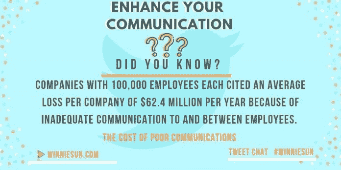
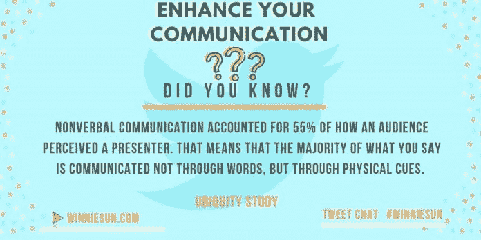

# 成功的词是什么？

> 原文：<https://medium.datadriveninvestor.com/whats-the-word-for-success-a89c7b83f110?source=collection_archive---------12----------------------->

## 沟通可以建立个人和商业上的信心

秩序问题。世界上最好的想法也会因为缺乏描述而化为乌有。无论是口头的、书面的还是用崇高的肢体语言传达的，改进的交流可以提升你的事业，最终提升你的生活。

[温妮·孙](https://twitter.com/winniesun)、[安托瓦内特·小调](https://twitter.com/antoinette_typ)和[艾丽莎·卡彭特](https://twitter.com/NotOkThatsOk)对此有一个词:练习。结果是更大的信心和成功。

 [## 在创业之旅中，拥抱学习|数据驱动的投资者

### 好像建立一个数百万美元的公司还不够困难，企业家必须额外照顾他们的…

www.datadriveninvestor.com](https://www.datadriveninvestor.com/2018/10/16/on-the-entrepreneurial-trek-embrace-the-learning/) 

孙自诩为“财富语者”她是一名金融顾问企业家、演说家和媒体名人，曾被美国消费者新闻与商业频道、福克斯商业、切达等媒体报道，并在 100 多个不同媒体的采访中露面。

Minor 是千禧一代的职业博主，也是社交媒体教练和发言人，被提名为 30 名 30 岁以下人士之一，以前被称为年轻专业人士。

Carpenter 是一名主题演讲人和学习促进者。

三人一起找到了一些精选词汇来解释他们是如何沟通的，并为那些寻求自信在自己的生活和事业中取得成功的人提供了一些指导。

“拥有你的自信，”孙说。“与书面交流相比，口头交流——面对面、打电话或虚拟交流——如何传递自信？

“自信是一种强大的心态，”她说。“每天早上醒来，我们都会决定如何面对新的一天。有些人选择扮演软弱的角色，但我更愿意扮演自信、坚强和对自己及周围人有信心的角色。”

Minor 说眼睛有。

“当面传递自信始于与人交谈时直视对方的眼睛，”她说。“这也是尊重的表现。坐直，自信地发出你的声音，而不是大喊大叫。

“对你正在谈论的东西要有知识，”Minor 说。“事先对话题和谈话对象做些调查，让谈话不那么令人生畏。”

听觉对视觉同样重要。

“倾听是一项非常重要的技能，”Minor 说。“这有助于进行一场精彩的对话。有时候我们反应太快，以至于没有听进去进行一次有质量的谈话。”

面对面的交流甚至胜过最好的在线对话。

“与面对面交流相比，书面交流更难传递自信，”卡彭特说。“我用眼神交流，练习积极倾听。在给出答案之前，我对我所知道的和我需要了解的事情持开放和诚实的态度。”

# 欢迎输入

强烈的第一印象可能是成功或失败的关键。

“在与团队成员甚至潜在客户会面时，你如何表现得开放、乐于接受意见和合作？”孙问道。

“交流是双向的，”她说。“我们必须掌握这一点，并发挥我们的作用，实践、倾听并保持积极参与，直到信息完整并具有支持性。敞开心扉，邀请他人与你交流。其余的将自然发生。”

从一开始，就由有需要的人带头。

“邀请对方先提出他们的要求和需求，”Minor 说。“在谈生意时泄露所有秘密之前，我向他们表明我关心他们，我对他们感兴趣。先花 10 分钟互相了解一下就可以了。”

共同利益必须是真诚的。

“这一切都始于沟通，让人们知道你想听到新的想法，并邀请合作，”卡彭特说。“问吧，你对此有什么想法？你会改变什么？你有什么建议或补充吗？

“创造一个包容的环境，让人们知道他们的意见被倾听和重视，”她说。“这将有助于你获得业务，建立长期关系。”

开放、有效的沟通会减少困惑和压力。专家们提供了他们的最佳建议，以确保他们与同事的沟通清晰而简洁。

“当你以每小时 100 万英里的速度工作时，肯定会有一些东西‘迷失在翻译中’，”孙说。“我们必须有意识地传递信息。谈话结束后，以书面形式总结事情，这样每个人都可以在他们所说或所听到的不准确时进行调整。

“交流的很大一部分是问精心设计的问题，”她说。"然后确保你完整地收到了答案."

# 说清楚

这就是学校的课程在现实生活中的应用。

“我在销售课上学到的最重要的东西是重复别人说过的话，并要求澄清:我听到你说的是……对吗？”Minor 说。“那真的很有帮助。对于通过电子邮件交流的客户，我不得不经常这样做。我打电话澄清。

“我非常支持销售课程，”她说。“每个人都应该带他们去学习如何成为更好的沟通者。这是我学到的对商业和职业发展最有影响的技能。”

卡彭特驳斥了沟通有限度的观点。

“过度沟通总比完全不沟通好，”她说。“当我们不给信息，不透明的时候，人们就开始填空，做出假设。

“转述别人说的话，问问你是否理解正确，”卡彭特说。“对你不理解或需要澄清的地方提出问题。不要害怕提出更多的问题。”

除了拼写检查之外，三位专家都称赞[在语法上](https://twitter.com/Grammarly)是帮助保持交流无误的最佳程序。

“没有这个工具，我将无法经营我的企业，”Minor 说。“它能发现打字错误和语法错误。它还会将每周报告发送到您的电子邮件中。”

有效的沟通有助于团队中的每个人保持一致。这对[远程工作者](https://medium.com/datadriveninvestor/remote-workers-out-of-sight-not-out-of-mind-f62b9f70dc1d)尤为重要。

“在领导团队方面，我的前任经理是我难以置信的榜样，”孙说。“他总是说，不管你和团队中的谁说话，你都需要让别人知道你说的是同一件事。你的团队需要知道你是公平的。

“我喜欢同时与我团队的多名成员进行公开对话，这样他们就能同时听到，”她说。“保持公平，保持一致，保持开放。”

# 一个要来的人

规划也能加强沟通。

“我非常喜欢会议议程，”Minor 说。“有一个复习指南，它使谈话进展迅速。你必须让你的团队感觉良好，能够就任何问题来找你。

“作为一名团队成员，以解决方案的方式向你的团队提出任何问题总是很棒的，”她说。

团队成员知道该期待什么有助于沟通，无论他们是近是远。

“保持一致和持续的衡量是很重要的，”卡彭特说。“对于虚拟团队来说，更重要的是交流你在项目中的位置，以及你需要什么帮助和资源。你不能直接闯进别人的工作场所问问题。

“开放办公时间、一对一和团队会议都是很好的交流方式，”她说。“在工作之外了解你的团队和同事也很重要。他们的动机是什么？他们喜欢做什么来取乐？”

除了团队之外，良好的沟通对于建立和维持业务关系中的融洽关系也是至关重要的。

“我喜欢多交流，并花时间确保我听到，听，记笔记，并能充分解释，”孙说。“有了沟通，用一种可联系的方式准确地表达事情是一种明智的时间投资。”

管理联系人有助于提高工作效率。

“我保留了一份我想与之保持关系的人的名单，”Minor 说。“他们每个人都会收到一封电子邮件、一个电话或一张节日贺卡、一封感谢信，或者当他们取得重大成就时。我的目标是至少每个季度与他们沟通一次。”

这并不意味着联系人必须是知心朋友。

卡彭特说:“你不必和所有同事都成为朋友，但你必须尊重他们。”“如果你很难找到共同的兴趣，那就问一些你的联系人感兴趣的事情，比如孩子或者爱好。你可能会对你们的共同点感到惊讶。”

# 听和学

听力是一项被低估的技能。然而，它从一开始就决定着交流的成败。

孙说:“倾听和提高你生活中其他重要技能没有什么不同。”“练习，用心，边听边反思。

“我也喜欢打笔记，所以我确定我听到了对方说的话，”她说。"作为一名财务顾问，这一点至关重要."

忍住在谈话中填补空白的冲动。

“好的听力需要对有意义的停顿感到舒服，”Minor 说。“如果你马上做出反应，你可能没有在听。我们尽量避免谈话中的绝对沉默，但要求几秒钟来处理和做笔记是可以的。”

好的沟通是一种[交流](https://www.datadriveninvestor.com/glossary/exchange/)，而不是竞赛。

“目标是[带着理解](https://medium.com/datadriveninvestor/tips-for-entrepreneurs-not-spoken-for-9de87df8653)与回应的意图去倾听，”卡彭特说。“这意味着听完整的对话，等待至少四秒钟来处理，然后做出反应。我们常常在别人说完之前就准备好了回应。”

表情符号和俚语经常出现在交流中，但它们有它们的位置。

“我喜欢表情符号，因为除了文字之外，还有很多交流，”孙说。“这是语气、感觉和意象。这很重要。

“如今，花时间帮助澄清你的语气很重要，”她说。"我们需要注意别人会如何接收我们的信息。"

这导致了 Minor 对表情符号的谨慎。

她说:“当我们实际上需要直截了当地谈论这个话题时，一些人把它们当作软化信息的拐杖。”。"如果我们不是通过短信聊天，那么我说不要表情符号."

卡彭特是所有关于位置和背景。

“在工作场所的谈话中，我通常会避开表情符号和俚语，但这取决于文化，”她说。“某些文化鼓励使用缩写形式。试探你的听众。如果你仍然不确定，最好还是离开，直到你更好地理解这种文化。”

# 实践、务实的领导者

良好的沟通会造就伟大的领导者，尤其是当他们执掌不同背景和教育的团队时。

“领导力从我们做起，”孙说。“我们需要积极实践，成为更好的领导者、倾听者和普通人。我们永远不应该停止学习，虚心接受新的课程。

“我改变了我的沟通方式，因为它与不同的人相关，”她说。“每个人都是独一无二的，这是一个更有效地联系和沟通的机会。”

圈子又回到了群体洞察力。

“理解团队成员如何最好地接受沟通是关键，”Minor 说。“他们需要视觉效果吗？他们擅长书面交流吗？作为一名领导者，意味着你可以灵活运用自己的领导风格。”

同样的信息在不同的日子会收到不同的信息。

“这是关于你的信息的影响，而不仅仅是意图，”卡彭特说。“某人如何感受、询问或解释你的信息可能与你的意图不同。尊重他们的意见，并就此展开开诚布公的对话，这一点很重要。”

口头交流、书面交流和图像都需要协同工作，才能有效地代表你的立场。

“真正拥有自己的品牌，”孙说。“没有人像你了解你一样了解你。在所有的设计、沟通和风格上与你的团队紧密合作，将所有的东西整合在一起。

“我的资深团队成员非常了解我们的品牌，但你仍然需要时不时地插话，以保持事情的私密性，”她说。

伟大的沟通不是一次性的奇迹。

“练习，练习，再练习，”Minor 说。“录自己，实际上*自己看*。这对许多人来说是不舒服的，但却是必要的。然后请朋友观看，反馈意见。”

即使是专家也面临挑战。

“这对我来说很难，”卡彭特说。“我尽量保持一致。我从我的团队、客户和合作伙伴那里寻找外部观点。有时候，我们太专注于自己的品牌，以至于看不到别人是如何看待它的。”

# 适应环境

了解你的听众是交流的首要规则，它影响谈话风格。

“交流很大程度上是关于另一个人的，”孙说。“每个人都不一样。当你与他人相处时，花时间去倾听和倾听以及良好沟通的所有其他要素是最成功的。”

Minor 补充道,“根据受众的特点，总是有调整沟通方式的空间。好好利用它。”

无论年龄大小，交流常数是最重要的。

“归根结底，人就是人，”卡彭特说。“由于各种原因，我们都以不同的方式体验生活，包括我们这一代人。就沟通偏好进行对话——文本、电子邮件、面对面——并考虑相应地调整或增加一种沟通方式。

“我们都希望被重视和倾听，但基于偏好和世代的不同，交流方式也不同，”她说。“进行对话并弥合这一差距非常重要。”

企业家不需要寻找隐藏的沟通宝藏。

孙说:“提高你的沟通技巧的最佳资源之一就在你自己身上。”。“一遍又一遍地练习倾听和交流是一个深思熟虑的、有意的决定。

“作为一名财务顾问，在这方面帮助了我，”她说。“我进行了大量的练习。使用直播帮助我进一步提高了沟通技巧。”

Minor 建议[加入演讲会](https://medium.com/datadriveninvestor/your-story-starts-with-the-spoken-word-5b86ce1dcf2f)并查看公共演讲课程的图书馆列表。

她说:“这不仅仅是站在人群面前，还需要精心制作信息，阅读肢体语言，并当场调整你的沟通方式。”

卡彭特更喜欢讲述她的故事。

“讲故事是我一直在做的事情，对我的工作类型来说是必要的，”她说。“我一直在观看我欣赏的人的演讲，观看精彩演讲的失败，然后练习。”

她的书 [*如何倾听和如何被倾听:工作中的包容性对话*](https://www.amazon.com/How-Listen-Heard-Inclusive-Conversations/dp/1632651637/ref=sr_1_1?keywords=alissa+carpenter&qid=1570632126&sr=8-1) ，可以预订。

“在这本书里，我用简单的方式和小章节来分解如何提高你的沟通技巧，”卡彭特说。

**关于作者**

吉姆·卡扎曼是拉戈金融服务公司的经理，曾在空军和联邦政府的公共事务部门工作。你可以在[推特](https://twitter.com/JKatzaman)、[脸书](https://www.facebook.com/jim.katzaman)和 [LinkedIn](https://www.linkedin.com/in/jim-katzaman-33641b21/) 上和他联系。

*原载于 2019 年 11 月 8 日*[*https://www.datadriveninvestor.com*](https://www.datadriveninvestor.com/2019/11/08/whats-the-word-for-success/)T22。