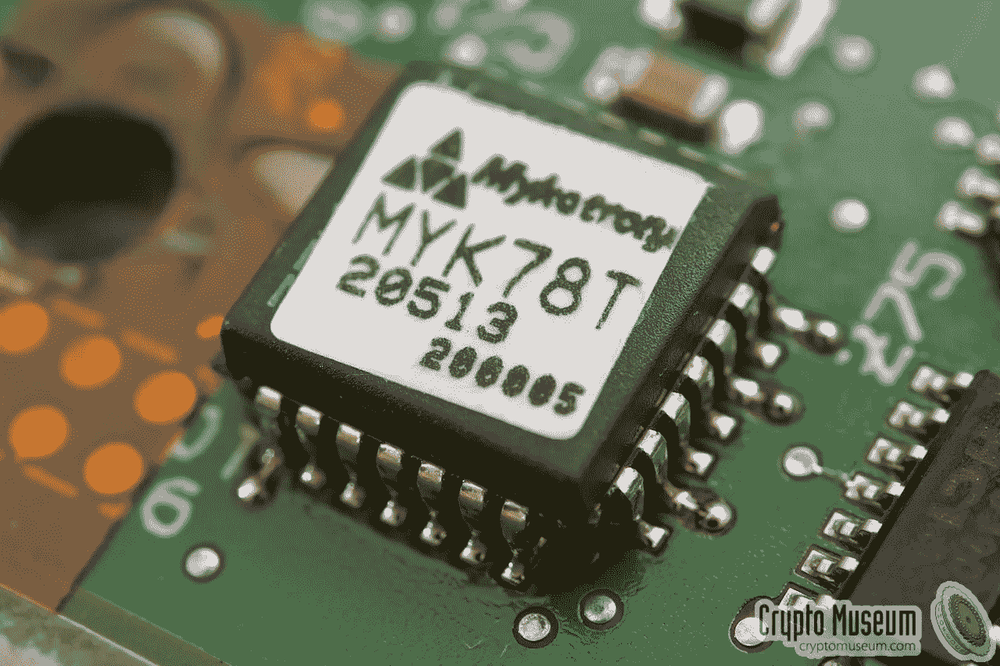

# 加密中的这些后门是怎么回事？

> 原文：<https://medium.datadriveninvestor.com/whats-with-all-these-backdoors-in-encryption-d0d93d7ec94a?source=collection_archive---------2----------------------->

从凯撒密码到 RSA，自从安全通信和信息保密的需要存在以来，密码学已经被使用了几千年。[加密](https://lifehacker.com/a-beginners-guide-to-encryption-what-it-is-and-how-to-1508196946)的工作原理是使用一种算法将原始的“明文”数据转换成“密文”，这种密文只能用有效的加密密钥解密。在这个网络不安全的时代，我们都应该鼓励和实践更多的网络安全，而不是破坏它。从网上购物到发送信息，人们每天都在使用加密技术，这使我们能够保护和防止敏感信息被除预期接收者之外的任何人未经授权访问或拦截。

多年来，政府一直要求进入软件和服务的后门。五眼情报联盟强烈呼吁执法和法律当局能够访问罪犯和恐怖分子的加密数据。由美、英、澳、加、新组成，在一年一度的五国部长级 [2018](https://www.homeaffairs.gov.au/about-us/our-portfolios/national-security/security-coordination/five-country-ministerial-2018#content-index-1) 上，五眼国一致认为“ ***隐私不是绝对的*** ”。

澳大利亚最近[在 2018 年 12 月通过了](https://www.bbc.co.uk/news/world-australia-46463029)他们有争议的反加密法。该法案被称为[援助和访问法案](https://www.legislation.gov.au/Details/C2018A00148)，它强制要求任何网站或数据托管在澳大利亚的组织在被要求时允许当局访问其 it 系统。加密立法遭到了许多网络安全专家和开发者以及科技公司的质疑和失望。苹果、思科、卡巴斯基实验室、Mozilla 和其他各种组织和个人反对加密立法，并就 2018 年电信和其他立法修正案(协助和访问)向澳大利亚议会情报和安全联合委员会(PJCIS)提交了[回应](https://www.aph.gov.au/Parliamentary_Business/Committees/Joint/Intelligence_and_Security/TelcoAmendmentBill2018/Submissions)，敦促他们不要通过推动开发者将系统性弱点引入他们的产品来削弱加密。

[后门](https://searchsecurity.techtarget.com/definition/back-door)是一种绕过加密或身份验证而不被发现的手段，用来访问计算机系统或数据。开发人员可能会创建一个后门程序，以便可以访问应用程序或操作系统进行故障排除，但后门程序也会带来安全风险，因为它们提供了一种方法，一旦被发现，系统就可能被利用。黑客可以利用它们安装恶意软件、修改代码或检测文件，并获得系统或数据访问权限。

2005 年，人们发现超过 100 部手机，其中大部分属于希腊政府高层成员，包括当时的总理科斯塔斯·卡拉曼利斯，被不明身份的人通过合法接入沃达丰希腊公司的电话交换机进行了长达十个月的[窃听。2010 年，IBM 的安全研究人员发现，在 IP 网络中支持合法监听的思科架构是不安全的](https://www.theregister.co.uk/2007/07/11/greek_mobile_wiretap_latest/)。该协议将为恶意攻击者提供便利，并将接管 Cisco IOS 路由器，而与这些路由器相关的 ISP 也将最终被黑客攻击。

## 后门已被证明是脆弱的，那么为什么这么多政府仍在推动他们？

执法部门声称，强大的加密技术正在阻止他们监控犯罪分子和恐怖分子，以及访问可能有助于他们调查的数据，联邦调查局称这个问题为“[变暗](https://www.fbi.gov/services/operational-technology/going-dark)”。他们指出，他们截获罪犯和恐怖分子通信的法定权力和权限与他们截获这些通信的实际技术能力之间的差距越来越大。

我们看到这种情况发生在 2015 年，当时联邦调查局找到了圣贝纳迪诺袭击事件的一名枪手的 iPhone，但无法解锁，因为它受到 PIN 保护，并被编程为在十次密码尝试失败后自动删除所有数据。联邦调查局随后求助于美国国家安全局，后者同样也不知道如何窃听电话。当他们联系苹果公司创建并安装新的 iOS 操作系统来访问手机内容时，苹果公司拒绝这样做。这场联邦调查局与苹果的纠纷引发了人们的辩论，人们表达了他们的观点，即为什么苹果应该帮助联邦调查局解锁 iPhone，或者为什么苹果拒绝联邦调查局的要求是正确的。最终，有问题的 iPhone 在第三方的帮助下被解锁。

如果苹果确实制造了一个后门来帮助联邦调查局绕过手机的安全性，谁能说这个后门只会用在那部特定的 iPhone 上呢？一旦后门存在，没有保证或方法来控制谁或它可能被用来做什么。苹果很清楚这一点，许多其他网络安全专家也表示反对创建后门。计算机科学家和安全专家发表了许多论文，探索限制强加密的立法，并研究创建一个为执法机构的特殊访问而设计的安全系统是否可行。

密钥托管作为一种“中间立场”被提出来，可以满足争论双方的要求。[密钥托管](https://www.nap.edu/read/5131/chapter/10)的概念是，一旦执法部门获得必要的法律授权，受信任的第三方或“托管代理”将保护密钥，使他们能够解密加密数据。然而，已经发现基于密钥的加密成本高，难以实现，并且与没有恢复功能的类似系统相比，其安全性更低。

Image from [Crypto Museum](https://www.cryptomuseum.com/crypto/usa/clipper.htm)

快船芯片是一个硬连线后门的基础上存储加密密钥托管。由美国国家安全局于 1993 年开发的 Clipper 芯片被发现有严重的[漏洞](https://www.mattblaze.org/papers/eesproto.pdf)(除了其内置的窃听和监视功能)，由于缺乏采用和商业风险的失败，它在推出三年内就失效了。

目前，还没有一种安全的公平密码系统被普遍采用。在商业产品或数据和通信服务中为执法机构的特殊访问实施后门会引起相当大的道德问题。它不仅威胁到网络安全和隐私，也威胁到人权。在加密的信使应用程序中交流的脆弱人群可能会受到暴虐政府的迫害，这些政府利用后门监控公民的活动。强制性后门肯定不会阻止犯罪分子或恐怖分子继续使用强加密来逃避执法，犯罪分子可以很容易地从黑市、不受监管的邻近司法管辖区或通过在线下载免费的开源加密软件获得加密技术。

我们生活在监控的黄金时代。正如隐私法专家彼得·斯维尔在他为 Slate 撰写的[文章](https://slate.com/technology/2015/07/encryption-back-doors-arent-necessary-were-already-in-a-golden-age-of-surveillance.html)中写道:

> *“无法直接访问这些通信的一小部分内容并不保证会导致隐私的后续损害……”*

如果你的国家要求后门，你会有什么反应？

*表达的所有观点和意见都是我自己的。

**参考文献:**

*解码加密辩论:为什么立法限制强加密不会解决“变暗”问题*
[https://www . slide share . net/HughJMcCarthy/Decoding-the-Encryption-Debate-Hugh-j-McCarthy-September-2016222905691 pdf](https://www.slideshare.net/HughJMcCarthy/decoding-the-encryption-debate-hugh-j-mccarthy-september-2016222905691pdf)

*门垫下的钥匙:通过要求政府访问所有数据和通信来加强不安全*
[https://www . schneier . com/academic/paper files/paper-Keys-Under-door mats . pdf](https://www.schneier.com/academic/paperfiles/paper-keys-under-doormats.pdf)

*托管加密标准*
[https://www.mattblaze.org/papers/eesproto.pdf](https://www.mattblaze.org/papers/eesproto.pdf)中的协议失败

*密钥恢复、密钥托管和可信第三方加密的风险* [https://www . schneier . com/academic/archives/1997/04/The _ Risks _ of _ Key _ rec . html](https://www.schneier.com/academic/archives/1997/04/the_risks_of_key_rec.html)

[https://www . eff . org/deep links/2018/05/there-no-middle-ground-encryption](https://www.eff.org/deeplinks/2018/05/there-no-middle-ground-encryption)

[https://search compliance . techtarget . com/feature/Going-dark-Weighing-the-public-safety-costs-of-end-to-end-end-encryption](https://searchcompliance.techtarget.com/feature/Going-dark-Weighing-the-public-safety-costs-of-end-to-end-encryption)

 [## 政府不应该削弱加密。我们已经处于监控的黄金时代。

### 最近几个月，在联邦调查局局长詹姆斯·科米的领导下，执法部门向“变暗”问题发起了战争…

slate.com](https://slate.com/technology/2015/07/encryption-back-doors-arent-necessary-were-already-in-a-golden-age-of-surveillance.html)