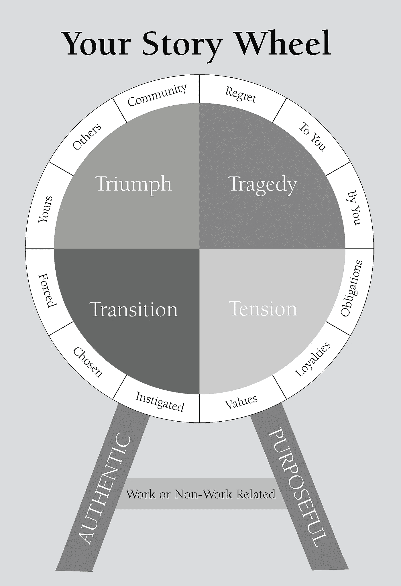

# 你的个人故事是什么？

> 原文：<https://medium.datadriveninvestor.com/whats-your-personal-story-d94b40056a12?source=collection_archive---------33----------------------->

讲故事已经成为一种真正的时尚。市场分析师分享的调查显示了一些惊人的事情。如果一个人谈论对他特别重要的问题，读者会把这个人视为朋友。也许，当他不隐藏自己的问题，并真诚地解释他是如何摆脱这些问题的时候，每个人都显得那么亲近和亲爱。

有时我们害怕变得真诚

约翰尼想建立一个博客业务。他听到了很多建议，但仍然不相信他的个人故事会有趣。一次又一次，他告诉；

- *我的生活如此沉闷，我的工作实在是平淡无奇。所以，没人会对我的东西感兴趣…*

听起来很熟悉？如果是这样，把这个故事读完，你就会发现真实的情况。

由于约翰尼是一个热情的旅行者，他决定涵盖与旅行中的惊喜和危险有关的话题。尽管他在旅行中克服了许多困难，但他害怕用个人化和友好的风格写作。你知道，他害怕自己看起来很可笑。

所以，他只是提供了一些广泛传播的信息，对于大多数类似的博客来说都是一样的。结果令人难过，但也在意料之中。

网站的流量非常小。

**看来人们害怕讲故事**

《全新的思维》一书的作者丹尼尔·H·平克说，讲故事是每个成功的、有抱负的人都应该具备的最重要的技能之一。他认为:讲故事给作者的形象带来了一些脆弱性和脆弱感。丹尼尔·H·平克声称读者和客户喜欢这样。

在这里我们会让你震惊。根据统计数据，十分之九的雇主承认他们不知道如何讲述个人故事。与此同时，90%参加公共活动的人抱怨说，他们厌倦了听那些老生常谈的事实，厌倦了高管们的演讲。

**为什么会这样？**

美国退休人员协会的一项研究(2010 年进行)指出，35%的 45 岁以上的人“长期孤独”。接下来，将近 20%的美国公民(大约有 6000 万人)因为孤独和不断的沉思而痛苦。

作为对这样一个问题的回应，大众媒体开始开展一些与讲故事有某种联系的项目。例如，其中一个是 TED，这是一个独立的教育平台，邀请来自世界各地的杰出人士在大量观众面前讲述他们的故事。

我记得有一次似乎是最感人的。

这个故事是由著名作家，哈利波特故事的作者乔安·罗琳分享的。她声称自己一直生活在贫困中，不相信自己会像现在这样受欢迎。在一个社会组织工作后，她参加了两次会议，这两次会议改变了她的生活，给了她在痛苦的离婚后生活下去的力量。特别是，乔安·罗琳与酷刑的受害者交谈；许多年来，作者都无法忘记这个人是如何握着她的手祝她好运的。第二次是乔安妮被邀请与来自极权国家的难民一起进入房间。她说她从来没有听到过如此可怕的叫喊，当她看着这个刚刚知道他的母亲在他的祖国被杀害的男人时。

此外，史蒂夫·乔布斯(尤其是关于他的致命疾病和延续生命的尝试)和奥普拉·温弗瑞(她公开讲述了她过去经历的种族歧视)等杰出人物讲述了大量故事。

**如何写出令人印象深刻的故事**

尽管在你的个人生活中不可能有什么秘诀，但有几条无懈可击的原则:

激情

-人类的失败；

-同理心；

——勇气；

-弱点；

-天真无邪；

-不可预测的点。

反映这些特征和感受的故事对所有读者来说都将是有趣的和引人入胜的。

最后，我们会给你一些在商业中讲故事的想法:

-创作故事:“我是谁？”，‘我们是谁？’；

-价值故事:“我们如何工作？”，‘我们信仰什么？’；

*   愿景故事:“我们要去哪里？”