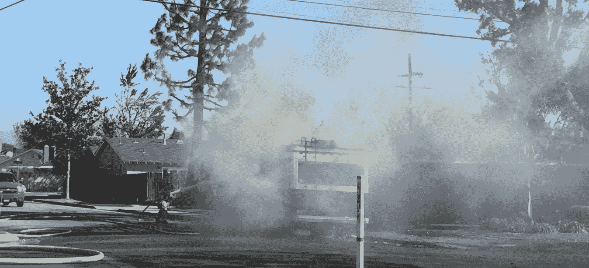
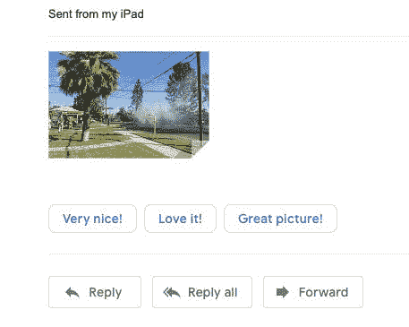

# 当人工智能是哑巴时，它比根本没有人工智能更糟糕

> 原文：<https://medium.datadriveninvestor.com/when-ai-is-dumb-its-worse-than-no-ai-at-all-4de5ca05908f?source=collection_archive---------13----------------------->

The above image received in an email. Should I reply “Very nice!” or “Love it!”?

我最近查看了我的 Gmail，看到一张房车着火的照片。消防队刚刚扑灭了大火，浓烟滚滚。几个路人观看了这一行动。一个人拍了照片，后来用电子邮件发给了我。下面是这封邮件的截图。

谷歌，作为人工智能(AI)机器，给了我 3 个快捷选项来回复这封邮件，“非常好！”，“爱死了！”，以及“很棒的画面！”

Which option should I choose?

这些选项都不好。事实上，它们太糟糕了，只会分散注意力。坏 AI 挡了我的路。没有 AI 比坏 AI 好。

# 以下是我对这些选择的问题

## (1)我从来不用“！”(感叹号)在我的电子邮件中。

所有三个单击选项的末尾都有一个感叹号。机器人在暗示我应该用感叹号。如果我屈服了，开始选择简单的一键点击选项，我会开始对那些与我交流的人显得更加乐观。这可能意味着他们开始认为我的回答是假的，或者更糟，是讽刺性的。走捷径回答的诱惑是存在的，但我会损害我自己的完整性和我的关系的完整性。

## (2)我在邮件里从来不用两个字的回复。

交流平台是电子邮件。这不是发短信。这些简短/快速的回复意味着我有效地给出了一个“竖起大拇指”的回复。这是毫无意义的回应。它只是完成“接收确认”。机器人自动回复我的时候呢？机器人确认收到意味着什么？如果我收到的回应是机械的，我根本没有得到确认。如果我是发照片的人，我想要的不仅仅是毫无意义的回复。

## (3)答复完全不符合上下文

这可能是最重要的问题。图为起火的大型房车。为什么我会回复“很好！”或者“爱死了！”？对于大多数正常人来说，汽车起火没什么可爱的。

# 解决方案？

一个解决方案是引入大量的人类进行训练。

人工智能需要“学习”不合适的选项——使用智能人训练机器。当然，机器人可能会使训练过程更有效率。他们可以给出 6 个回答，其中 3 个说积极的事情，3 个说不那么积极的事情，比如“呀！”或者“哦不！”或者“那不好。”即便如此，在机器人确定不是草或树导致否定回答，而是烟和消防车之前，你需要大量的训练。也许有了更多的电子邮件和真实的人类回复，你就需要更少的人工智能培训课程了？谷歌不应该有数据吗？

谷歌的人工智能需要更多的工作。他们需要分析更多的数据，并让人类来帮助他们。当一张图片包含烟雾或包含消防车时，“爱死它了！”绝不是响应的一部分(除非是消防员的烧烤晚宴活动？)

为了让它私人化，他们仍然需要查看我以前所有的电子邮件来理解“爱它！”从来不是我个人对任何事情的回应，像我这样的人*从来不会在邮件回复中使用两个字的感叹词。*

我们的世界将不得不计划长期容忍近乎无用的机器人助手。可能是谷歌有数据显示，这三个回复选项对于 80%的附有照片的电子邮件来说是最佳选择。剩下的时间，我们只需要容忍不完美。

我们应该很高兴我们还能进行一对一的个人交流。在未来，发送和确认都将完全自动化(机器人与机器人对话)，没有人会真正关心。

**更新:2019 年 1 月 15 日**

看起来我们离机器人还有很长的路要走。theverge.com 最近报道，一家日本酒店不得不解雇他们的机器人员工:

[https://www . the verge . com/2019/1/15/18184198/japans-robot-hotel-lay-off-work-for-humans](https://www.theverge.com/2019/1/15/18184198/japans-robot-hotel-lay-off-work-for-humans)