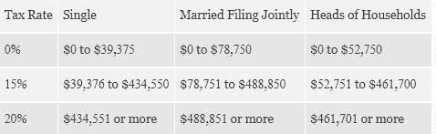
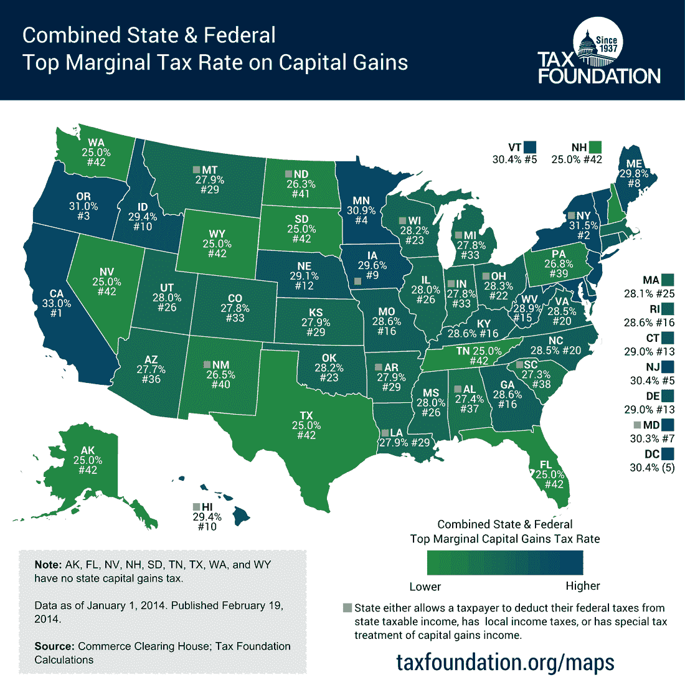

# 何时以及如何最好地行使你的股票期权

> 原文：<https://medium.datadriveninvestor.com/when-and-how-best-to-exercise-your-stock-options-67615a499a26?source=collection_archive---------7----------------------->

即使在经验丰富的企业家和经营者中，对股票期权也有很多困惑。因此，这篇文章将首先快速更新核心概念，然后提供三个核心原则，这样你就可以做出明智的决定。免责声明:一篇短文永远不能公正地对待边缘案例，这也不是财务建议，请务必咨询专业规划师，以决定您的具体情况。

股票是你被授予的股份。创业公司很少会给你直接的股票——与同等的公司工作相比，他们提供更长的工作时间和更低的薪水，所以股票真的是最大的财务驱动力。授权计划可能会让一个初创公司的员工与公司目标保持最大程度的一致。

这就把我们带到了期权，即购买股票的权利，而不是义务。业内人士在指“股票期权”时，会经常用到“股票”这个词，但关键是你买入期权(“行使”在“执行价”)，然后卖出。你可以在同一天行使和出售，事实上，通过出售的利润为购买期权提供资金是非常常见的。但是如果你决定持有一只股票，你可能会因收益而被征税。如果你的卖价最终低于你的行权价，那么你确实会亏钱，这是互联网泡沫破裂期间硅谷发生的普遍现象。

资本利得是你因投资或财产升值而产生的收益，然后卖掉它。在美国，有联邦税，大多数州有额外的州税，目前从 0 到 13.3%不等(著名的是加州)。对于联邦税，税率根据你的收入而变化，并且已经被大幅修改，下表总结了今天的情况:

如果你持有股票超过一年，长期资本收益会下降到 0%、15%或 20%，这也取决于你的收入，这就是为什么你会看到大多数人至少在那段时间内行使和持有股票。

请注意，时钟开始滴答作响时，你行使又名购买期权，而不是当你被授予或授予。

位置很重要。下面的图表总结了当你考虑 20%的资本收益加州税时，美国现在的情况。外卖——世界不是平的，你的初创公司总部所在地不仅对公司运营至关重要，对你的财务状况也很重要。

83(b)是一个简单的文件，允许你预先支付公平市场估价(FMV)的税款，这可能低于公司将增长到的水平。这只适用于你拥有未归属的股份，而不是期权，这种情况在你拥有方正股份时确实会发生。创始人股票非常便宜，通常只有几分钱，而且预先缴税不会给企业家带来过多的负担。使用的估值通常是最后一个，除非公司在融资之外进行了更新的 FMV。如果公司最终价值下降，那么你最终会多付了税，但如果你认为这是一个非常可能的结果，那么你应该首先重新考虑整个创业。

当你已经购买了期权，但需要更多的流动性，或者想用出售获得的资金投资于不同的、可能更好的东西时，你该怎么办？无论是对现有投资者或新投资者，还是通过经纪人，二次发行总是有可能的。如果你的公司做得很好，你持有的 10%的二级股票不会被仔细审查。但除此之外，如果你要离开这家公司，这真的是唯一可以做的事情，因为这发出了一个信号，表明你对这家公司不够信任，无法继续持有该股。

那么，如何理解这一切呢？虽然细节很重要，不确定性会混淆正确的行动，但三个一般原则真的很简单。第一，尽早买入你的期权，只要你认为市场至少一年内不会下跌。第二，如果你是创始人，申请 83b。第三，持有股票至少一年，当你觉得可以把资金更好地用在其他地方时卖出。

有什么关于股票的想法或者经验可以咳咳分享吗？评论离开。

*这是和我的同事***合作的。这些都是专注于实践见解的有目的的短文(我称之为 GL；dr —良好的长度；确实读过)。如果它们能让人们对某个话题产生足够的兴趣，从而进行更深入的探索，我会感到非常兴奋。我在三星的创新部门* [*NEXT*](http://samsungnext.com/) *工作，专注于深度科技领域软件和服务的早期风险投资，这里表达的所有观点都是我自己的。**