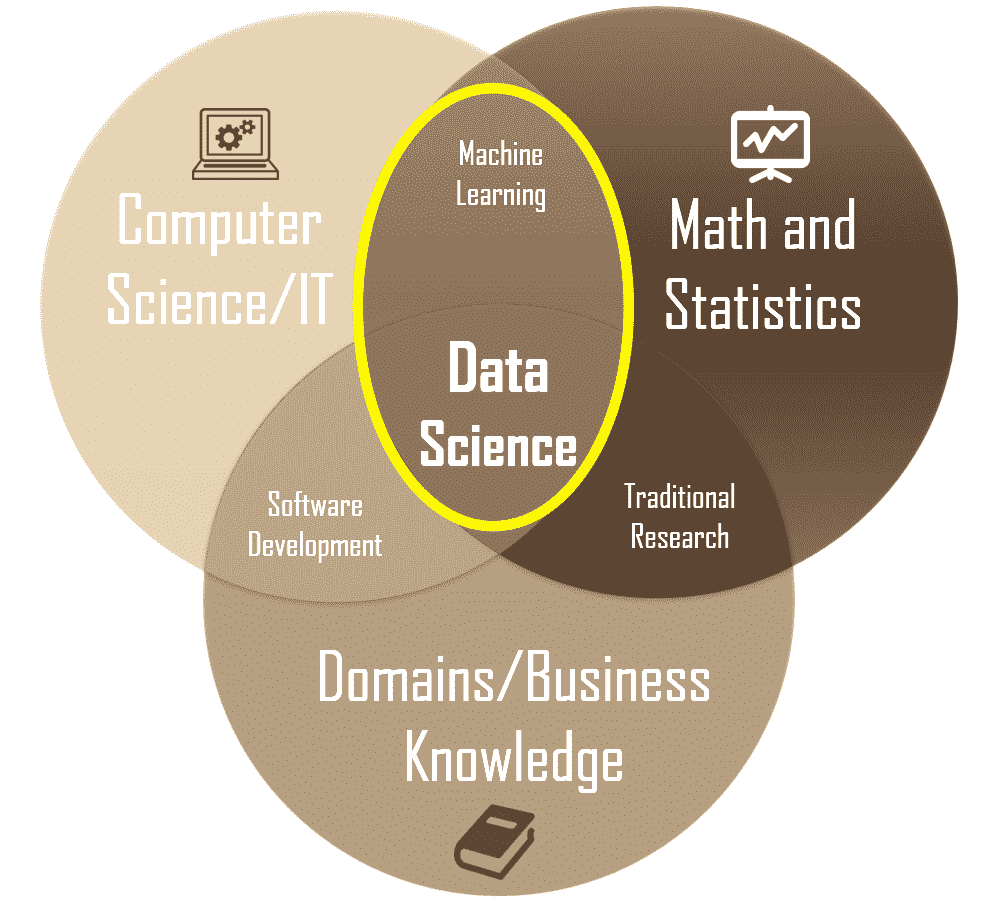
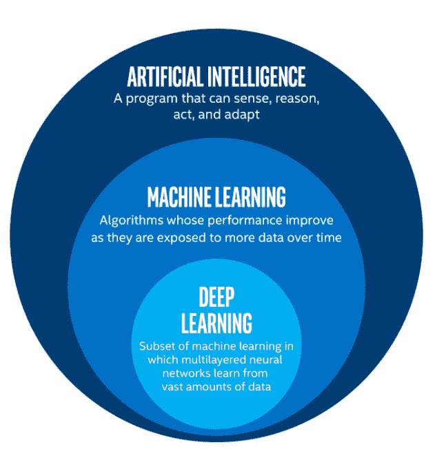
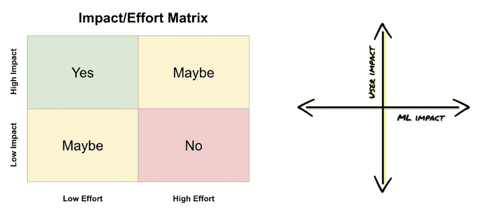

# 何时以及如何将机器学习添加到产品路线图中

> 原文：<https://medium.datadriveninvestor.com/when-and-how-to-add-machine-learning-to-a-product-roadmap-f91bbc3b2776?source=collection_archive---------1----------------------->

Photo by [Bea Rose](https://www.twenty20.com/photos/7bff1611-ca46-4852-b9c0-5bf917003ae5) via Twenty20

我最近为一个名为 [*的正在进行的系列节目做出了贡献，通过回答这个问题来询问产品*](https://medium.com/@womeninproduct) 中的女性:“我何时以及如何将机器学习添加到产品路线图中？”。原载于[2019 . 9 . 17 版](https://medium.com/@womeninproduct/ask-wip-when-and-how-to-add-machine-learning-to-product-roadmap-f73fc38c1326)，以下是我的完整回答。感谢 [@mdy](https://medium.com/u/f6f82d9dceac?source=post_page-----f91bbc3b2776--------------------------------) 编辑此片！

在安捷伦担任全球产品经理期间，我迷上了高级统计学及其商业应用，在加州大学洛杉矶分校安德森分校攻读 MBA 期间，我跟随[Richard Stern](https://www.linkedin.com/in/richard-stern-1b93697/)博士学习建模和预测，并跟随[Anand Bodapati](https://www.anderson.ucla.edu/faculty-and-research/marketing/faculty/bodapati)博士学习一对一营销和营销研究。当我后来作为一名工程讲师和开发人员工作时，我从机器学习(ML)产品管理从业者那里寻求最佳实践的见解，以了解如何在构建应用程序中利用 ML。

 [## 金融中的机器学习|数据驱动的投资者

### 在我们讲述一些机器学习金融应用之前，我们先来了解一下什么是机器学习。机器…

www.datadriveninvestor.com](https://www.datadriveninvestor.com/2019/02/08/machine-learning-in-finance/) 

现在我已经回到了产品管理的工作中，我已经将这些经验融入到对如何将 ML 应用到产品路线图和我可能构建的任何应用程序中的更好理解中。以下是我学到的东西，希望对你也有帮助。

# 目录

**简介**
—什么是机器学习？
—人工智能>机器学习>深度学习
**基于机器学习的解决方案什么时候合适？**
—非常适合基于 ML 的解决方案的问题
—不需要基于 ML 的解决方案的问题
**我需要什么才能成功？我如何将机器学习融入我的路线图？**
— 1。了解业务需求
— 2。制定问题假设
— 3。定义清晰的成功衡量标准
— 4。评估你的候选项目。确认您拥有成功完成
— 6 所需的数据。建立健康的数据收集实践
— 7。应对风险和挑战
— 8。期望迭代
**结论**
**资源和引用**

# 介绍

您是否正在寻找改进个性化、自然语言处理(NLP)或搜索定制的方法？机器学习(ML)可能是你需要的工具。本文将描述什么是机器学习，它可以为您解决什么问题，以及如何将该工具包纳入您的产品路线图。更重要的是，这篇文章还解释了什么时候机器学习是*而不是*这项工作的合适工具。

注意:机器学习从概念到执行需要几个步骤，包括数据准备、模型开发和实际部署过程。虽然产品经理需要积极参与到这些阶段中，但是这些主题目前已经超出了本文的范围。

# 什么是机器学习？

人工智能研究的先驱亚瑟·塞缪尔(Arthur Samuel)为我们提供了一个简明的定义:“机器学习是在没有明确编程的情况下赋予计算机学习能力的研究领域。”传统编程要求我们提供数据和规则来生成答案，而机器学习要求我们提供想要的答案和数据来生成规则。

在学术界，机器学习是[数据科学](https://towardsdatascience.com/introduction-to-statistics-e9d72d818745)的一个子集，数据研究涉及开发记录、存储和分析数据的方法，以有效提取有用的信息。

Image credit: [https://towardsdatascience.com](https://towardsdatascience.com/introduction-to-statistics-e9d72d818745)

# 人工智能>机器学习>深度学习

机器学习(ML)有时会与人工智能(AI)和深度学习(DL)混淆，这两者有关联但有区别。每当机器根据一套解决问题的规定规则(即算法)完成任务时，这种“智能”行为就是所谓的人工智能，[包括 ML 和 DL](https://towardsdatascience.com/clearing-the-confusion-ai-vs-machine-learning-vs-deep-learning-differences-fce69b21d5eb) 。ML 是 AI 的子集，DL 是 ML 的子集。从 AI 到 DL 的进展通常代表了更多与人类无关的规则定义，因此需要越来越多的数据。下图显示了 ML 和 DL 在人工智能学科中的位置。

Image credit: [https://blog.stateofthedapps.com/](https://blog.stateofthedapps.com/growing-artificial-intelligence-with-blockchain-4ee14bff2974)

# 什么时候基于机器学习的解决方案是合适的？

## 非常适合基于 ML 的解决方案的问题

机器学习的良好用例包括需要个性化、排序、分类、回归、聚类或识别异常的问题。请注意，您想要解决的问题类型将决定要使用的算法的选择(例如，对于聚类，您可以使用 k-means)。

一般来说，要让机器学习对企业有意义，您的问题应该具有以下特征:

*   **需要复杂的逻辑，用人类定义的规则或试探法**解决是不切实际的。例如，搜索引擎通常具有连续发生的多个排名阶段，例如初始检索、初级排名、上下文排名和个性化排名。这是机器学习的一个很好的应用。
*   **问题将迅速扩大**。如果您预计您的问题将扩展到成千上万的用户或者更多，那么它可能是 ML 的一个很好的用例。比方说，你有一个在线零售平台，并希望在三到六个月内有成千上万的客户利用你的新服务。[零售客户的期望](https://www.slideshare.net/EpsilonMktg/the-power-of-me-the-impact-of-personalization-on-marketing-performance/1)正是如此，你需要个性化的体验，并能为 ML 提供一个好的理由。
*   **需要按比例个性化**。除非你可以降低问题空间的复杂性，例如，为一个特定的部分或类别而不是为每个人创建解决方案，否则你最好使用 ML 来定义你所使用的规则。
*   **需要随时间快速变化的规则**。如果您的规则年复一年地保持静态，那么启发式解决方案是首选。然而，如果你的企业的成功依赖于快速适应和规则的改变，那么 ML 是一个很好的途径。例如，如果你有一个搜索产品，而艾德·希兰推出了一张新专辑，你的算法需要实时适应，并服从 ML 解决方案。
*   **具有已知的预定义最终结果**。例如，在网上零售中，您希望您的模型提供导致销售的推荐。在搜索中，输入“衬衫”应该会返回最有可能导致购买的衬衫列表。
*   **不要求 100%的精度**。如果商业成功能够以高概率的准确性而不是完美来实现，那么 ML 是一个好的选择。例如，如果用户并不总是想要所提供的东西，推荐系统就不会被认为是有缺陷的。用户仍然可以有很好的体验，程序可以从销售的缺乏中学习，以在未来提供改进的推荐。

## 不需要基于 ML 的解决方案的问题

谷歌 Gmail 的一些功能很好地说明了基于启发式的解决方案是首选。在下面的截图中，Gmail 会查找包含“附件”或“附加”等词的短语，以便在有人可能忘记附加文件时弹出提醒。尽管一个 ML 系统很可能会捕捉到更多的潜在错误，但它的建设成本要高得多。启发式解决方案提供了良好的用户体验，并允许将组织资源用于更有影响力的项目。

A successful heuristic-based solution (Image by [Google/Gmail](https://medium.com/google-design/human-centered-machine-learning-a770d10562cd))

# 我需要什么才能成功？

一个成功的机器学习项目需要具备以下条件:

*   **明确定义的业务问题**。机器学习将工程工作从确定性过程转移到实验性过程，因此更需要知道你想要预先实现什么。
*   **右翼团队。**你需要一个同时具备数据科学和工程技能的团队。在数据科学中，角色可以包括 ML 科学家、应用科学家、数据科学家和/或研究科学家。在工程中，角色可以包括商业智能工程师、数据工程师、软件工程师、开发经理和/或技术项目经理。
*   **对项目潜在风险和回报的把握**。即使一个项目从 ML 的角度来看是可行的，开发和维护一个基于 ML 的解决方案所需要的努力水平可能会使这种方法不切实际。例如，如果您的模型在生产中需要非常频繁地更新，以至于需要大量维护，这可能不值得。
*   **足够的数据**。线性模型至少需要几千行数据，神经网络至少需要几十万行数据。如果你没有数据，你将需要策略来获得它，并且可能需要坚持基于启发式的方法，直到你有了数据。
*   **数据具有清晰的模式。**由于算法需要模式来学习，所以你需要对你的数据中存在哪些模式有所了解，即使你在开始之前并不知道确切的模式。你应该能够定性地阐明这些模式，或者至少有一种直觉。
*   **高质量数据**。俗话说，“垃圾进来，垃圾出去。”依靠您的数据科学家来帮助您确定数据的状态和/或如何获取数据:
    1。足够完整和简单
    2。与你正在解决的问题相关
    3。最近，反映用户当前的行为
    4。代表您所针对的细分市场和时间段
    5。无偏
    6。尊重用户隐私，安全可靠
*   **合适的技术**。有几个开源工具和平台，如[亚马逊人工智能](https://aws.amazon.com/amazon-ai/)、 [TensorFlow](https://www.tensorflow.org/) (最初由谷歌开发)，以及[许多其他](https://github.com/showcases/machine-learning)工具和平台，使机器学习今天几乎可以为任何公司所用。

# 我如何将机器学习融入我的路线图？

虽然具体细节可能因项目和公司而异，但这些是您需要考虑的一般步骤。

## 1.了解业务需求

从避免许多公司和产品团队犯下的错误开始:不要直接进入以机器学习作为解决方案的产品战略，直接专注于要解决的有意义的问题。

机器学习和启发式一样，只是解决人类需求的另一种工具。如果您和您的利益相关者在业务需求上不一致，那么您只会构建一个对您的客户或您的业务没有意义的非常强大(并且昂贵)的系统。

## 2.阐明问题假设

对于上一步中确定的每个业务需求，制定并记录您打算测试的假设。一般来说，你的假设陈述会有以下几个部分:

*   你正在测试的一个变化(“用 ML 提高搜索排名将…”)
*   期望的结果(“…让我们的客户找到正确的产品…”)
*   成功指标(“…时间缩短了 15%。”)
*   模型输出的描述(“模型将对每个可能的产品评分……”)
*   预测因素(“…通过使用客户最近查看的产品、之前购买的产品类型、之前购买的产品的货币价值，以及我们自己对经常聚集在一起的产品的理解…”)
*   目标(“…预测客户最终选择购买的产品。”)

## 3.定义清晰的成功衡量标准

如果我们要解决问题并满足业务需求，成功会是什么样子？你和你的利益相关者需要在问题假设的基础上，对这意味着什么达成共识。

例如，您是否预期某些绩效指标会变动？你期待新的商机被释放吗？实际上，我们是在谈论总收入的增加吗？提高营销优惠的针对性，从而降低每个新获得客户的平均成本？通过基于 ML 的交互式自助系统提高客户满意度？

你越能在实际目标方面表现出成功，你的团队就越容易保持专注并证明 ML 努力的商业利益。

## 4.评估你的候选项目

有了明确的业务需求、要解决的客户问题和清晰的成功衡量标准，在路线图定义过程的早期组建一个由 UX/UI 专业人员、ML 专家和数据科学家组成的团队。

创建一个 2x2 矩阵，标出每个候选项目的影响和所需的工作量，确定影响最大/工作量最小的工作的优先级，然后在迭代要确定优先级的功能或项目时，根据 ROI 对产品创意进行排序。

Left: Impact/Effort Matrix (created by the author). Right: User Impact/ML Impact matrix (Image credit: [Google](https://medium.com/google-design/human-centered-machine-learning-a770d10562cd))

ML 项目只应考虑影响力大的产品。例如，在谷歌，团队可以投票决定哪些想法可以对用户产生最大的影响，哪些可以通过 ML 解决方案得到最大的增强，优先考虑那些对双方都产生较大影响的想法。如果有几个候选人，那么在用户影响和 ML 影响(即对产品改进的影响)的矩阵上绘制这些想法可以帮助你选择你的项目。

## 5.确认您拥有成功所需的数据

评估您团队的数据需求，以及可用数据是否符合上一节中规定的标准。ML 模型需要大量的数据，非常复杂，并且在达到生产就绪之前可能需要很长时间来开发和测试。

你可能会发现你没有足够的数据，但你可以看到未来对 ML 解决方案的需求。在这种情况下，您最好启动一个传统的 MVP，用简单的试探法为开发 ML 模型铺平道路。这是为您的产品建立一组基线数据的绝佳机会。在这个场景中，您将希望建立成功的度量标准，并在头脑中设计您的系统。

如果事实证明您确实有您需要的数据，那么您将希望确保您希望用 ML 改进的系统正在接收您想要的数据，并且能够收集您感兴趣的指标。你还需要用 ML 模型对你当前的系统进行 A/B 测试。至少，你的 1.0 ML 模型应该保持你当前的用户满意度和其他指标。

## 6.建立健康的数据收集实践

关于数据收集的实际任务，这里有一些关于如何从用户那里收集高质量和标准化数据的优秀建议，基于[彼得·斯科莫罗奇](https://www.linkedin.com/in/peterskomoroch/)最近在 [Strata 数据会议上的陈述](http://blog.dominodatalab.com/machine-learning-product-management-lessons-learned/)。

*   尽可能引导用户输入
*   使用自动建议字段
*   验证用户输入、电子邮件
*   收集用户标签、投票和评分
*   跟踪展示、查询和点击
*   会话化日志
*   消除实体的歧义并对其进行注释(公司名称、位置等)。)

随着用户群的增长，启发式方法变得越来越麻烦。当你获得足够的数据来开始一个 ML 项目时，你将处于一个很好的位置，不仅可以开发一个模型，还可以根据你的启发来 A/B 测试你的 ML 模型。

## 7.应对风险和挑战

ML 项目有其自身的风险和挑战。您将希望正面解决这些风险，以使您的项目保持正轨。

*   注意可能影响你的模型的[种偏差](https://developers.google.com/machine-learning/crash-course/fairness/types-of-bias)。通过允许你的模型测量它们来减轻这些偏差，然后采取[步骤来抵消这些偏差](https://developers.googleblog.com/2018/04/text-embedding-models-contain-bias.html)。
*   请注意，看似很小的 UI 更改可能会导致大量的后端 ML 工程工作，这可能会将整个项目置于风险之中。例如，如果一个问题的措辞在你的网站或应用程序中被改变，它可以改变用户的回应，并使你的历史数据变得无用。充分意识到任何建议更改的影响， [A/B 测试](https://zulily-tech.com/2018/04/06/practical-a-b-testing/)，并获得用户反馈！
*   即使有了正确的数据，您可能仍然无法最终得到一个工作模型。例如，[如果您的模型过度拟合](https://developers.google.com/machine-learning/crash-course/generalization/peril-of-overfitting)训练数据，过度学习数据的细节和噪声，模型将无法对新数据做出正确的预测。数据科学家可以通过对模型进行[正则化](https://developers.google.com/machine-learning/glossary/#regularization)来解决这个问题。
*   在没有任何可见利益的情况下索要过多的用户数据，会导致用户放弃你的产品。在向用户索要更多数据之前，尽早向他们提供价值。
*   每当您的模型包含或依赖个人数据时，您都需要采取适当的安全和隐私预防措施。主动咨询公司的法律、安全和安保团队，寻求这方面的建议。

## 8.期望迭代

一旦你的模型被部署，继续迭代和改进它。很容易地，80%的工作发生在 ML 模型的第一个版本交付生产之后。这项工作包括模型改进，以及随着更多数据的可用和新见解的出现，向模型中添加新的信号和特征。

# 结论

机器学习为推荐、排名、分类、异常识别等提供了大规模可扩展的解决方案。ML 项目本质上是实验性的且耗时的，它需要清晰的目标定义和成功的衡量标准来评估 ML 模型所期望的最终结果。

作为一个项目经理，期望围绕项目目标和可交付成果管理涉众的期望，进行优先级权衡，并确保为您的模型选择正确的数据。最重要的是，期待迭代，因为初始发布只是一个复杂的、具有挑战性的、有回报的旅程的第一步。

# 资源和参考资料

*   哈佛商业评论，[如果你的数据不好，你的机器学习工具就没用了](https://hbr.org/2018/04/if-your-data-is-bad-your-machine-learning-tools-are-useless)
*   [谷歌开发者，*机器学习规则，ML 工程最佳实践*马丁·津克维奇](https://developers.google.com/machine-learning/guides/rules-of-ml/)
*   [产品学校](https://www.productschool.com/)，[产品经理的机器学习](https://www.youtube.com/watch?v=5z1Hz-rV4zY)作者[鲁本·洛扎诺-阿奎莱拉](https://www.linkedin.com/in/lozanoaguilera/)
*   安·斯潘塞[机器学习产品管理:经验教训](https://blog.dominodatalab.com/machine-learning-product-management-lessons-learned/)
*   [如何部署机器学习模型](https://christophergs.github.io/machine%20learning/2019/03/17/how-to-deploy-machine-learning-models/)作者 Christopher Samiullah
*   一位资深数据科学家的观点:[管理你的第一个数据科学或机器学习项目](https://zulily-tech.com/2018/07/03/managing-your-first-data-science-or-machine-learning-project/)作者 Paul Sheets
*   谷歌设计，[以人为中心的机器学习](https://medium.com/google-design/human-centered-machine-learning-a770d10562cd)
*   [走向人工智能，*机器学习的 50 个最佳公共数据集*](https://medium.com/towards-artificial-intelligence/the-50-best-public-datasets-for-machine-learning-d80e9f030279)Stacy Stanford 和 Roberto 伊里翁多