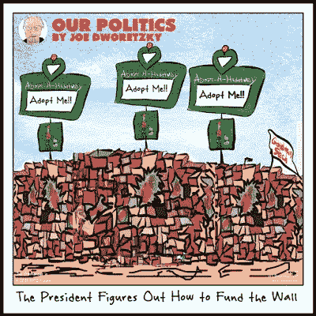

# 当冲突本身成为目标时。

> 原文：<https://medium.datadriveninvestor.com/when-conflict-itself-becomes-the-objective-8d285de32f7b?source=collection_archive---------15----------------------->

Photo by [Lucas Sankey](https://unsplash.com/@lucassankey?utm_source=medium&utm_medium=referral) on [Unsplash](https://unsplash.com?utm_source=medium&utm_medium=referral)

唐纳德·特朗普是分裂一个分裂国家的大师。毫无疑问，一些人认为他在国情咨文中呼吁“礼让”是真诚的，也许是对大多数总统视为工作一部分的团结姿态的认可。但礼让不是特朗普的天性；他也不会做那些人们对总统有所期待的事情。从他开始总统竞选的那一刻起，他的语言就具有分裂性和煽动性，所有这些都是为了让他成为政治基础不满的代言人。在他的就职演说中，他没有软化他的语气，也没有寻求与那些不支持他的人接触，而是加倍努力。现在，两年过去了，他的主要动机是让他的选民相信他没有动摇。

对这位总统来说，目标是冲突，而不是礼让。随着新问题一个月接一个月地出现，这个国家仍然分裂成不同的阵营。围绕着长城的斗争，消耗了这个国家一个多月的时间，实际上是一个很平常的事情。它一点也不像夏洛茨维尔。或者俄罗斯，就此而言。没有国家紧急状态。穿越相对无保护的南部边境的贩毒和移民处于历史低位。多年来，边境安全资金——包括围栏和围墙的资金——是一个很平常的问题，没有人谈论太多。现在，整个争议已经成为事态持续恶化的象征。在另一个时代可能没有特别分歧的问题现在变得高度政治化。通常政治性很强的问题现在在道德上变得不可谈判。

总统的支持者肯定会说，围绕唐纳德·特朗普的持续争议不是他造成的，而是那些从一开始就拒绝他的领导并且从未让步的人造成的。然而，历史记录表明并非如此；争议一直是，并且仍然是他的*工作方式*，他选择的道路。30 年前，在中央公园慢跑者案件中，他展示了这种煽动事情的倾向，以获得公众的注意并建立他的公众形象。在他呼吁判处中央公园五人死刑的抗议之后——这些人多年后被 DNA 证据证明无罪——他宣称，“*我不介意他们抗议。我喜欢纠察队。”*十年前，在社交媒体的早期，川普利用出生论作为一种手段，为他新生的总统野心赢得全国争议和支持——值得注意的是，这些努力是由迈克尔·科恩和*国家询问者推动的。争议是目标，而不是副产品。*

唐纳德·特朗普是剪刀大师。剪刀差——正如一篇颇有见地但却令人恐惧的帖子所描述的那样，*[*按争议性*](https://slatestarcodex.com/2018/10/30/sort-by-controversial/)*排序——是一种旨在最大化人群中争议的陈述或情形。*按争议排序*描述了一个由一家在线广告公司的两名数据科学家承担的项目，该项目旨在开发一种算法，该算法将产生最大限度地增加争议的短语——通过增加投票和减少投票的组合来衡量——在 Reddit 社区内。他们最初的目的是销售广告；争议可以销售，因此最大化争议的能力可以最大化对产品的关注。或者别的什么。**

**事实证明，剪刀也是政治操纵的理想工具，尤其是在这个世界上，人们倾向于看到政治观点截然不同的人最糟糕的一面。该项目的首席数据科学家在 Reddit 的 17 亿个讨论组评论档案上测试了她开发的算法，计算机产生了 100 个政治剪刀——将政治争议最大化的声明。在被该项目踢出的 100 个案例中，有 5 个反映了已经发生的实际争议，包括第 58 位*“共和党最高法院候选人被指控在青少年时期犯有性侵犯罪。”其他反映真实事件的事件包括一个类似于科林·卡佩尼克决定在国歌奏响时下跪以示抗议的事件，一个在归零地修建清真寺的提议，以及一个拒绝为同性恋婚礼做蛋糕的面包师。***

**需要明确的是:这些场景是由算法创建的，它们不是流程的输入。该算法的设计者很快意识到，他们为社交媒体时代制造了一个完美的网络武器。他们还想到，别人在他们之前已经得出了这个结论；根据罗伯特·穆勒的起诉书，弗拉基米尔·普京情报部门在圣彼得堡建立了互联网研究机构，其明确目的是使用剪刀策略在美国造成严重破坏。**

****

***“我们要建一堵墙”，*是剪刀。从双方的角度来看，都讲了一个简单的道理。从双方的角度来看，另一方对真相的无知是可鄙的。对于总统和他的追随者来说，还有什么比沿边境修建隔离墙的逻辑更简单的呢，特别是当这些追随者已经确信不受控制的移民给他们的家庭和国家带来的社会弊病时？对于隔离墙的反对者来说，显而易见的是，*隔离墙*只不过是一种政治策略，旨在迎合川普本土主义支持者最底层的本能，对于禁止毒品或减少非法越境没有什么价值。**

**由*“我们将建一堵墙”*造成的分裂象征着一种只会加深的政治分歧。一方面，总统正在享受宣布国家紧急状态的机会，而另一方面，民主党人已经将对隔离墙的反对升级为道德问题，搁置了一年前他们为特朗普的隔离墙提供更大金额的资金以换取 DACA 修复的意愿。民主政治必然是在有争议的问题上达成中间立场的观念正在被抛弃。**

**最有效的剪刀是把正常的政治对立提升到道德谴责的高度。在政治背景下，它削弱了谈判和达成交易的潜力。民主依赖于通过政治对话和谈判解决问题的承诺，并最终依赖于对观点大相径庭的人作为共享民主的参与者享有平等地位的某种基本承认。这从来就不是一个容易的平衡，因为有无数的问题合理地涉及到相互冲突的道德立场，但它仍然是一个重要的问题。**

**随着社交媒体放大了政治分歧的速度和强度，它破坏了观点大相径庭的人作为民主参与者享有平等地位的概念。也就是说，破坏了礼让。因此，我们越来越容易受到那些试图使用剪刀的人制造和操纵争议的伤害，无论是通过民主手段获得权力，还是试图摧毁民主本身。**

**至关重要的是，我们要在给自己造成不可挽回的伤害之前，集体学会理解和化解剪刀——它是威胁我们社会核心的大规模毁灭性武器。按有争议的 排序的 [*的作者担心，一把精心设计的剪刀所具有的压倒性情感力量使其几乎无法承受。他对该算法产生的排名第三的剪式声明感到绝望——他拒绝透露这是什么——这是未来危险的象征。“*你怎么知道，”*他总结道，*“如果你知道的话，你会同意最好是用核武器摧毁这个世界，让我们从下水道变种人那里重新开始，而不是让那些支持它的人继续用他们的存在污染这个世界？”**](https://slatestarcodex.com/2018/10/30/sort-by-controversial/)**

*在 Twitter @dpaul 上关注大卫·保罗。他正在写一本书，书名是《联邦退出！为了拯救我们的民主，是时候让阿拉巴马成为阿拉巴马，让加州自由了。”*

*Joe Dworetzky 的作品。在 www.jayduret.com[*看看乔的政治漫画吧。*](http://www.jayduret.com.) *在 Twitter @jayduret 或 insta gram @ Joe faces 关注他。**