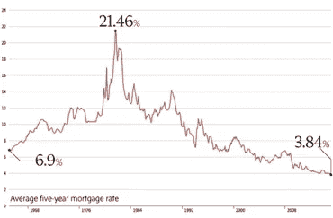
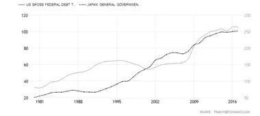

# 当鸽子哭泣时——全球央行如何变得过时

> 原文：<https://medium.datadriveninvestor.com/when-doves-cry-how-global-central-banks-could-become-obsolete-ee51276621b7?source=collection_archive---------3----------------------->

从小到大，我总是被告知不要负债。存钱，投资，努力工作，花你能负担得起的钱。你可能不记得了(或者你试图忘记)，然而，仅仅在 30-40 年前，我们的利率达到了 21%，这个建议是合理的。

除非你能锁定你的回报和借款利率，否则用资产组合持有任何有意义的债务都是一个有风险的提议。央行有能力通过调整借款利率来管理这些关键指标，从而平稳增长和控制通胀，而且在很大程度上，这种做法是有效的。

全球美国(&全球)政府债务占 GDP 的百分比回到了二战前后的水平，这已经不是什么新闻了。然而，中央银行集体的温和，加上创纪录的低利率，以及全球经济增长放缓，对世界来说都是第一次。

 [## 分散金融的出现|数据驱动的投资者

### 当前的全球金融体系为拥有资源、知识和财富的人创造了巨大的财富

www.datadriveninvestor.com](https://www.datadriveninvestor.com/2019/03/14/the-emergence-of-decentralized-finance/) 

除此之外，技术发展继续以指数级创新，通过流程改进、效率提高、自动化、人工智能等抑制通货膨胀(更重要的是工资增长)。

那么，央行行长们的下一步是什么？他们公开谈论要变得温和。衍生品市场已经在 2019 年剩余时间和 2020 年进一步大幅降息。考虑到外部宏观因素，这种情况正被全球经济严重放缓的前景所掩盖。当利率处于或接近于零时，我们有什么杠杆来继续平稳经济增长？显而易见的答案是量化宽松(QE)，货币政策的二阶衍生品。

然而，QE 的本质在于它有针对性地增加经济中的货币供应量(货币基础)。中央银行用以前不存在的电子现金(想想印钞)从公共市场购买证券，比如政府债券。这使得大量资金到达银行门口，银行将这些资金再投资于其他资产，从而推高资产价格，刺激经济。

人们希望稳定的增长(以及由此产生的通胀结果)能够通过 QE 产生，恶性通胀风险得到缓解，从而允许央行以稳定的方式加息。这将允许货币政策回归到更传统的功能，并允许各国央行离开 QE。然而，在 QE 实验的整个过程中，技术通缩威胁继续对这种学术界经济学方法构成压力，其结果是货币基础大幅增加，利率创下纪录低点，政府和私人债务创下纪录，全球经济放缓。那么从这里去哪里呢？

在可预见的未来，货币和 QE 都将受到束缚，政府可以利用的最后一个杠杆是财政政策。政府可以通过政府支出和税收来刺激增长。然而，这需要融资，要么有人需要弥补减税造成的赤字，要么财政支出需要与税收收入保持一致。政府可以通过资本市场筹集更多的债务，通过紧缩增加税收，或者印刷更多的现金。提高债务水平是最显而易见的解决方案，因为紧缩政策很少对民选政府奏效，而直接印钞会造成严重的恶性通货膨胀。然而，政府将如何偿还这笔债务？他们会印刷现金，从而相对于同行或硬资产/分散资产缓慢贬值。他们将继续沿着这条路走下去，直到资本市场不再支持这些债务水平，或者要求他们的债务获得更高的回报。不管怎样，我们都在同一个地方结束。中央银行货币贬值。

因此，如果我们处于央行温和、长期利率下降和货币供应增加的恶性循环中，那么普通民众何时会不再相信他们用于交易目的的货币不再是财富的储存手段？如果他们不再相信发行者能够管理驱动法定货币潜在价值的指标，再加上零到负的储蓄利率，他们会将储蓄配置到哪里？显而易见的答案是分散资产(如黄金)或其他硬资产；房地产、农业等可以提供收益的行业。人们认为黄金是最明显的财富储存手段，它是一种久经考验的解决方案，直到 1971 年，它仍是全球金融体系的支柱。最近突破 1375 美元盎司是该资产类别的一个重要里程碑，已经看到了 6 年的阻力水平。投资者已开始注意到这一点，尤其是对冲基金和养老金，由于多年的横向交易，它们在很大程度上被取消了配置。

人们总是很容易看到历史，并认为它会重演。作为波动性交易者，头号罪是用历史波动性作为未来波动性的基准。或者，正如一位前同事曾经评论的那样，“这就像开车，但只是用你的后视镜”。事件、技术、方法都在变化，历史不可能永远是向导。无数受过教育的记者、资产经理和央行行长仍然相信，我们能够“管理”好自己，走出下一个周期。然而，由于央行没有足够的杠杆，持有硬资产而非法定货币比持有现金风险更低的可能性越来越大。所有的债务都是坏账这句老话终于被打破了。在实物资产升值、货币贬值的环境中，持有实物资产和财富的杠杆债务，感觉比在银行账户中持有零利息的法定货币更为舒适。让鸽子哭泣吧。

如今，市场将黄金和比特币视为财富储存手段。有趣的是，最近几周两者都大幅上涨。